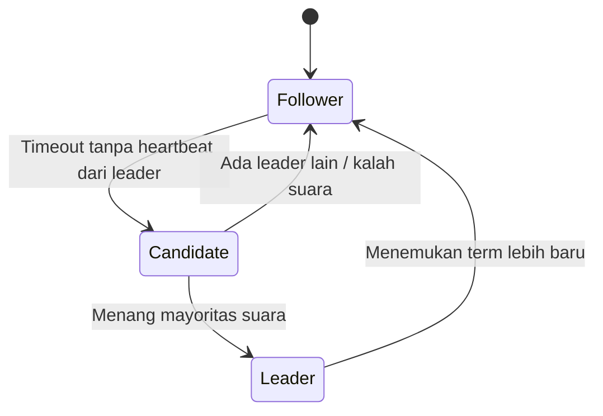

## TL;DR

Consensus adalah masalah membuat sekumpulan node yang tidak saling percaya sepenuhnya (bisa gagal, bisa lambat) **sepakat** pada satu nilai atau urutan kejadian, meski jaringan di antara mereka tidak selalu andal. Raft menyelesaikan ini dengan cara yang secara sengaja dirancang **mudah dipahami** (kontras eksplisit dengan Paxos yang terkenal sulit, lihat [[Consensus - Paxos in Overview]]): satu node dipilih sebagai **leader** lewat mekanisme election berbasis timeout dan quorum, leader itu satu-satunya yang menerima tulisan baru dan menyusunnya jadi log berurutan, lalu mereplikasi log itu ke node lain (**follower**) — begitu mayoritas follower mengonfirmasi menerima satu entri log, entri itu dianggap **committed** dan tidak akan pernah hilang lagi, apa pun yang terjadi setelahnya.

## The Problem

Sebuah tim ingin membangun sistem konfigurasi terdistribusi untuk 13 aplikasi — satu sumber kebenaran untuk pengaturan yang harus selalu sama persis di semua node yang membacanya, bahkan saat sebagian node mengalami gangguan jaringan sesaat. Pendekatan naif: setiap node menyimpan salinan konfigurasi sendiri, dan saat ada perubahan, perubahan itu dikirim ke semua node yang bisa dihubungi saat itu. Masalahnya segera terlihat: kalau satu node sedang terputus saat perubahan dikirim, node itu ketinggalan perubahan tanpa ada mekanisme yang menjamin ia akan mengejar ketertinggalan itu dengan benar begitu terhubung kembali — dan kalau dua perubahan berbeda dikirim hampir bersamaan oleh dua sumber berbeda, tidak ada aturan jelas urutan mana yang "menang", berpotensi menghasilkan node yang punya versi konfigurasi berbeda-beda tanpa cara rekonsiliasi yang pasti.

Consensus adalah nama formal untuk masalah ini: bagaimana memastikan **semua** node yang berpartisipasi, meski sebagian sempat terputus atau lambat, pada akhirnya sepakat pada urutan perubahan yang **sama persis** — bukan sekadar "mengejar ketertinggalan" secara informal, tapi dengan jaminan matematis bahwa tidak ada dua node yang punya urutan berbeda untuk data yang sama.

## Intuition

Cara paling mudah memahaminya: Raft seperti **rapat dengan satu pemimpin sidang yang jelas**, dibanding rapat tanpa pemimpin di mana semua orang mengusulkan dan menyepakati sesuatu secara bersamaan (lebih dekat ke Paxos). Dalam rapat dengan pemimpin: semua usulan **harus** lewat pemimpin lebih dulu, pemimpin menuliskannya di papan tulis dalam urutan yang jelas, dan sebuah usulan baru dianggap "resmi disepakati" begitu **mayoritas** peserta rapat mengangguk setuju. Kalau pemimpin sidang itu sendiri tiba-tiba tidak bisa melanjutkan (sakit mendadak), peserta lain mengadakan pemilihan cepat untuk pemimpin baru — dan begitu pemimpin baru terpilih, semua orang kembali mengacu ke satu papan tulis yang sama, bukan mencatat sendiri-sendiri secara paralel.

Analogi ini bocor pada soal keandalan komunikasi. Rapat fisik mengasumsikan semua orang mendengar pemimpin dengan jelas. Dalam sistem terdistribusi nyata, pesan bisa hilang atau tertunda — dan Raft harus secara eksplisit menangani skenario di mana sebagian follower tidak menerima pesan leader tepat waktu, sesuatu yang tidak jadi masalah utama dalam rapat manusia biasa yang berlangsung dalam satu ruangan yang sama.

## How It Works


Setiap node punya salah satu dari tiga peran ini. **Follower** pasif, hanya menerima entri log dari leader dan heartbeat berkala. Kalau follower tidak menerima heartbeat dalam jangka waktu tertentu (mencurigai leader mati, mirip [[Failure Detectors]]), ia berubah jadi **candidate** dan meminta suara dari node lain untuk jadi leader baru. Kalau ia mendapat suara dari mayoritas (quorum, lihat [[Quorums]]), ia jadi **leader** — satu-satunya node yang boleh menerima tulisan baru dan mengatur urutan log untuk seluruh cluster.

Proses replikasi log: klien mengirim perintah ke leader, leader menambahkannya ke log lokalnya, lalu mengirim entri itu ke semua follower. Begitu **mayoritas** follower mengonfirmasi menerima entri itu, leader menganggapnya **committed** dan menerapkannya (misalnya menulis ke state aplikasi), lalu memberi tahu follower bahwa entri itu sudah commit di replikasi berikutnya. Follower yang tertinggal (sempat terputus) akan mengejar ketertinggalan begitu terhubung kembali, karena leader terus mengirim entri yang belum mereka miliki sampai log mereka sinkron.

## Under The Hood

**Term** adalah konsep krusial yang mencegah kebingungan antar leader lama dan baru — setiap kali ada election baru, term (nomor urut "generasi kepemimpinan") bertambah, dan setiap pesan yang dikirim menyertakan term pengirimnya. Node yang menerima pesan dengan term **lebih lama** dari yang ia ketahui langsung menolaknya — mekanisme ini yang mencegah leader lama (yang mungkin sempat terputus dan tidak sadar sudah digantikan) terus mengklaim otoritas setelah cluster sudah memilih leader baru, mencegah split brain (lihat [[Leader Election and Split Brain]]).

Poin yang sering disalahpahami: Raft **tidak** menjamin setiap tulisan langsung diproses secepat mungkin — ada biaya nyata (leader harus menunggu konfirmasi mayoritas sebelum commit) demi jaminan bahwa entri yang sudah committed **tidak pernah** hilang, bahkan kalau leader yang menulisnya langsung mati sesaat setelahnya (karena mayoritas node lain sudah punya salinannya). Log yang belum committed (baru diterima sebagian kecil follower) **bisa** hilang atau ditimpa kalau leader berganti sebelum sempat commit — properti yang disengaja, bukan bug, karena entri yang belum diketahui mayoritas memang belum bisa dijamin bertahan.

## In Go

```go
package raft

import "fmt"

// Role menunjukkan gagasan inti: SETIAP saat, sebuah node punya
// TEPAT SATU peran, dan hanya Leader yang boleh menerima tulisan baru.
type Role int

const (
	Follower Role = iota
	Candidate
	Leader
)

type LogEntry struct {
	Term    int
	Command string
}

type Node struct {
	Role        Role
	CurrentTerm int
	Log         []LogEntry
}

// HandleAppendEntries menunjukkan aturan inti: pesan dengan term
// LEBIH LAMA ditolak — mekanisme yang mencegah leader lama yang
// tidak sadar sudah digantikan terus mengklaim otoritas.
func (n *Node) HandleAppendEntries(leaderTerm int, entries []LogEntry) (success bool, currentTerm int) {
	if leaderTerm < n.CurrentTerm {
		return false, n.CurrentTerm // TOLAK: pengirim punya term usang
	}

	if leaderTerm > n.CurrentTerm {
		n.CurrentTerm = leaderTerm
		n.Role = Follower // otoritas baru diakui, turun jadi follower
	}

	n.Log = append(n.Log, entries...)
	return true, n.CurrentTerm
}

// IsCommitted menunjukkan syarat inti: entri dianggap AMAN hanya
// setelah MAYORITAS node mengonfirmasi memilikinya — bukan cukup
// satu atau beberapa node saja.
func IsCommitted(confirmedCount, totalNodes int) bool {
	return confirmedCount > totalNodes/2
}

func (n *Node) StartElection(totalNodes int) {
	n.CurrentTerm++
	n.Role = Candidate
	fmt.Printf("node memulai election untuk term %d\n", n.CurrentTerm)
}
```

## In His Stack

Raft (atau turunannya) adalah mesin di balik banyak tool yang sudah atau mungkin dipakai di ekosistem 13 aplikasi — [[../92 Tools/Consul|Consul]] memakai Raft untuk menjaga konsistensi data registry-nya sendiri, dan sistem seperti etcd (yang mendasari state Kubernetes) juga memakai Raft. Memahami Raft membantu menjelaskan perilaku operasional yang sering membingungkan: kenapa cluster Consul atau etcd butuh **jumlah node ganjil** (memudahkan mayoritas yang jelas tanpa hasil seri), dan kenapa cluster dengan node yang terlalu sedikit hidup (di bawah mayoritas) berhenti menerima tulisan sama sekali — bukan bug, tapi properti keamanan yang disengaja untuk mencegah split brain.

## Trade-offs and When Not To Use It

Raft (dan consensus formal secara umum) menambah latency nyata untuk setiap tulisan — menunggu konfirmasi mayoritas lebih lambat dari sekadar menulis ke satu node dan berharap yang terbaik. Untuk data yang tidak butuh jaminan konsistensi kuat lintas node (cache yang boleh sedikit tidak sinkron, data yang bisa direkonstruksi dari sumber lain kalau hilang), overhead consensus penuh tidak sepadan — quorum sederhana atau bahkan eventual consistency (lihat [[Consistency Models]]) sudah cukup dan jauh lebih murah. Consensus formal bernilai jelas untuk data yang benar-benar kritis dan tidak boleh hilang atau tidak konsisten — metadata cluster, konfigurasi kritis, log yang jadi sumber kebenaran tunggal.

## Common Mistakes

> [!warning] Jebakan
> Menganggap entri log yang baru diterima leader (belum dikonfirmasi mayoritas follower) sudah aman dan tidak akan hilang — hanya entri yang sudah **committed** (dikonfirmasi mayoritas) yang dijamin bertahan; entri yang belum committed bisa hilang kalau leader mati sebelum sempat mereplikasinya.

> [!warning] Jebakan
> Menjalankan cluster Raft dengan jumlah node genap — tidak menambah keamanan dibanding jumlah ganjil terdekat (4 node butuh mayoritas 3, sama seperti 5 node), hanya menambah biaya infrastruktur tanpa manfaat tambahan, dan meningkatkan kemungkinan hasil seri saat partition membelah cluster jadi dua bagian yang sama besar.

> [!warning] Jebakan
> Mengabaikan konsep term dan menganggap leader lama otomatis "tahu" dirinya sudah digantikan — leader lama yang sempat terputus terus percaya dirinya leader sampai ia menerima pesan dengan term lebih baru; term-lah yang jadi mekanisme eksplisit membuatnya sadar dan mundur.

## Exercises

1. Jelaskan tiga peran node dalam Raft, dan kapan transisi antar peran terjadi.
2. Apa itu term, dan bagaimana ia mencegah leader lama terus mengklaim otoritas setelah cluster memilih leader baru?
3. Kenapa entri log dianggap "aman" hanya setelah dikonfirmasi mayoritas, bukan setelah diterima satu node (bahkan leader) saja?
4. Desain terbuka: kamu diminta merancang sistem penyimpanan konfigurasi terpusat untuk 13 aplikasi yang harus tetap konsisten meski beberapa node mengalami gangguan jaringan sesaat, dan tim mempertimbangkan apakah perlu membangun sistem berbasis Raft sendiri atau memakai tool yang sudah mengimplementasikannya (seperti Consul/etcd). Jelaskan pertimbangan yang menentukan pilihan ini.

> [!success]- Kunci jawaban
> **1.** Follower (pasif, menerima entri dari leader), Candidate (mencalonkan diri jadi leader setelah timeout tanpa heartbeat), Leader (satu-satunya yang menerima tulisan baru dan mengatur replikasi log). Follower jadi Candidate saat timeout; Candidate jadi Leader kalau menang mayoritas suara, atau kembali jadi Follower kalau kalah atau menemukan leader lain yang sah.
> **4.** Kecuali tim punya kebutuhan yang sangat spesifik dan tidak terpenuhi tool yang sudah ada (kasus yang jarang terjadi), memakai tool matang seperti Consul atau etcd yang sudah mengimplementasikan Raft dengan benar hampir selalu pilihan yang lebih baik — mengimplementasikan Raft dari nol dengan benar (menangani seluruh edge case: partition, leader yang mati di tengah replikasi, election yang bersamaan) adalah pekerjaan yang jauh lebih rumit dan berisiko dibanding yang terlihat dari deskripsi konseptualnya, dan kesalahan implementasi consensus bisa menghasilkan bug yang sangat sulit dideteksi (data yang diam-diam tidak konsisten, bukan crash yang jelas terlihat). Investasi tim lebih baik dialokasikan ke integrasi dan operasional tool yang sudah teruji, bukan membangun ulang algoritma consensus yang butuh keahlian sangat mendalam untuk diimplementasikan benar.

## Self-Check

- Sebutkan tiga peran node dalam Raft.
- Apa itu term, dan apa fungsinya?
- Kenapa entri log dianggap aman hanya setelah dikonfirmasi mayoritas?
- Kenapa cluster Raft sebaiknya punya jumlah node ganjil?

## Connected Notes

- [[Quorums]] — mayoritas yang jadi syarat commit di Raft adalah penerapan langsung konsep quorum yang dibahas di note sebelumnya.
- [[Failure Detectors]] — mekanisme timeout yang memicu election di Raft adalah bentuk konkret failure detector yang dibahas sebelumnya.
- [[Consensus - Paxos in Overview]] — kelanjutan langsung: pendahulu Raft yang menyelesaikan masalah sama dengan pendekatan berbeda dan reputasi lebih sulit dipahami.
- [[Leader Election and Split Brain]] — mekanisme term di Raft adalah salah satu cara konkret mencegah split brain yang dibahas mendalam di note berikutnya.
- [[../92 Tools/Consul|Consul]] — tool konkret yang mengimplementasikan Raft untuk menjaga konsistensi data registry-nya.

## Further Reading

- Diego Ongaro dan John Ousterhout, "In Search of an Understandable Consensus Algorithm" (2014) — paper asli Raft, ditulis secara eksplisit untuk lebih mudah dipahami dibanding Paxos, sangat layak dibaca langsung untuk ambisi studi master distributed systems.
- The Raft Consensus Algorithm (raft.github.io) — visualisasi interaktif yang membantu membangun intuisi mekanisme election dan replikasi log.

## Catatan Saya

*Tulis di sini tool berbasis Raft (Consul, etcd, atau lain) yang sudah dipakai di infrastruktur pekerjaanmu, dan apakah kamu pernah mengalami insiden yang berkaitan dengan leader election-nya.*
