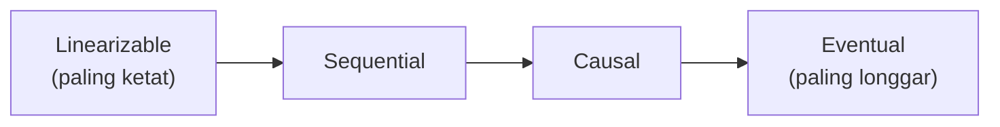

## TL;DR

CAP theorem menyederhanakan consistency jadi satu pilihan biner (konsisten atau tidak), tapi kenyataannya consistency adalah **spektrum** dengan banyak tingkat jaminan berbeda di antaranya. **Linearizable** adalah yang paling ketat — setiap operasi terlihat terjadi secara instan di satu titik waktu, seolah-olah hanya ada satu salinan data di seluruh sistem. **Sequential** menjamin semua node melihat operasi dalam urutan yang sama, meski urutan itu tidak harus persis sesuai waktu nyata terjadinya. **Causal** hanya menjamin operasi yang punya hubungan sebab-akibat terlihat dalam urutan yang benar; operasi yang tidak berkaitan boleh terlihat berbeda urutan di node berbeda. **Eventual** hanya menjanjikan bahwa **kalau** tidak ada tulisan baru, semua node **akhirnya** akan konvergen ke nilai yang sama — tanpa jaminan kapan itu terjadi. Memilih model yang tepat untuk kebutuhan spesifik, bukan selalu memilih yang paling ketat, adalah keterampilan inti desain sistem terdistribusi.

## The Problem

Sebuah tim membangun fitur komentar untuk sistem internal — pengguna A menulis komentar, lalu pengguna B membalas komentar itu. Sistem menyimpan data di beberapa node untuk skalabilitas. Suatu saat, pengguna C yang membaca thread ini melihat balasan pengguna B muncul **sebelum** komentar asli pengguna A yang dibalasnya — urutan yang tidak masuk akal secara logis, karena balasan seharusnya selalu muncul setelah yang dibalasnya. Ini terjadi karena sistem hanya menjamin eventual consistency tanpa mempertimbangkan **hubungan sebab-akibat** antar operasi — komentar dan balasannya disimpan di node berbeda yang mereplikasi dengan kecepatan berbeda, dan tidak ada jaminan urutan replikasi mengikuti urutan logis kejadian sebenarnya.

Masalah ini bukan bug di kode — sistem berfungsi persis sesuai jaminan yang diberikan model consistency yang dipilih. Masalahnya adalah tim memilih eventual consistency (jaminan paling longgar) untuk kasus penggunaan yang sebenarnya butuh jaminan **causal** (urutan sebab-akibat harus terjaga) — pilihan model consistency yang tidak sesuai kebutuhan nyata, bukan kegagalan implementasi.

## Intuition

Cara paling mudah memahaminya: bayangkan spektrum consistency seperti **tingkat kepercayaan terhadap gosip** dalam sebuah kantor besar dengan banyak cabang. **Linearizable** seperti pengumuman resmi lewat pengeras suara yang didengar semua orang di semua cabang **pada saat yang sama persis** — tidak ada yang mendengar sebelum atau sesudah orang lain. **Sequential** seperti memo yang disebarkan dan dibaca semua cabang dalam urutan yang sama, meski cabang yang jauh membacanya sedikit lebih lambat. **Causal** seperti gosip yang menyebar secara alami — kalau si A memberi tahu si B, lalu si B menceritakannya ke si C, si C pasti mendengar dari si B **setelah** si B tahu dari si A (urutan sebab-akibat terjaga), tapi gosip yang sama sekali tidak berkaitan bisa sampai ke orang berbeda dalam urutan acak. **Eventual** seperti gosip yang pada akhirnya menyebar ke semua orang, entah kapan, tanpa jaminan urutan apa pun sepanjang jalan.

Analogi ini bocor pada soal kesengajaan. Gosip menyebar secara organik tanpa kendali sengaja. Sistem terdistribusi **memilih** model consistency-nya secara sadar (atau seharusnya begitu) — dan pilihan itu adalah keputusan rekayasa, bukan sesuatu yang terjadi begitu saja seperti gosip kantor.

## How It Works


Semakin ke kiri, semakin kuat jaminannya, tapi semakin mahal biayanya (latency lebih tinggi, availability lebih rendah saat partition — persis trade-off PACELC dari [[CAP Theorem and PACELC]]). Semakin ke kanan, semakin murah dan cepat, tapi semakin sedikit yang bisa diasumsikan aplikasi tentang urutan yang dilihat pengguna berbeda.

**Linearizable** adalah model yang paling intuitif dipahami manusia — ia berperilaku seolah-olah hanya ada satu salinan data, dan setiap operasi baca langsung setelah tulisan pasti melihat hasil tulisan itu. Ini yang dibutuhkan untuk operasi seperti mengurangi saldo rekening: dua pembacaan saldo yang terjadi berurutan **harus** menunjukkan efek tulisan yang terjadi di antaranya, tidak boleh salah satunya "ketinggalan".

**Causal consistency** adalah titik tengah yang sering jadi pilihan praktis: ia tidak butuh koordinasi seketat linearizable (yang mahal), tapi tetap menjaga hubungan logis yang penting secara semantik (balasan selalu setelah yang dibalas, seperti kasus di "The Problem"). Operasi yang **tidak** berkaitan sebab-akibat (dua komentar dari pengguna berbeda yang tidak saling membalas) boleh terlihat dalam urutan berbeda di node berbeda tanpa merusak logika aplikasi.

## Under The Hood

Mengimplementasikan causal consistency butuh cara melacak hubungan sebab-akibat secara eksplisit — inilah peran **vector clock** (dibahas mendalam di [[Time and Ordering - Lamport and Vector Clocks]]), yang memberi setiap operasi "cap waktu logis" yang mencerminkan operasi mana saja yang sudah diketahui terjadi sebelumnya. Tanpa mekanisme pelacakan sebab-akibat ini, sistem tidak punya cara membedakan "operasi ini terjadi setelah operasi lain karena memang menyebabkan/dipengaruhi operasi itu" dari "operasi ini kebetulan disimpan belakangan karena replikasi yang tertunda" — dua situasi yang terlihat sama dari sudut pandang timestamp mentah, tapi sangat berbeda maknanya.

Session guarantees adalah bentuk consistency yang lebih halus, sering dipakai praktis: **read-your-writes** (pengguna yang baru saja menulis sesuatu selalu melihat tulisannya sendiri di baca berikutnya, meski pengguna lain mungkin belum), **monotonic reads** (sekali seorang pengguna melihat suatu nilai, ia tidak akan pernah melihat nilai yang lebih lama lagi di baca berikutnya). Keduanya lebih murah diimplementasikan dibanding linearizable penuh, tapi cukup untuk mayoritas pengalaman pengguna terasa "masuk akal" — pengguna yang baru submit form dan langsung refresh halaman mengharapkan read-your-writes, bukan linearizability sistem secara keseluruhan.

## In Go

```go
package causal

// VectorClock menyederhanakan gagasan inti causal consistency —
// setiap node melacak "versi" operasi yang sudah diketahui dari
// SETIAP node lain, bukan hanya timestamp tunggal.
type VectorClock map[string]int

// HappensBefore menentukan apakah clock A terjadi SEBELUM clock B
// dalam hubungan sebab-akibat — bukan berdasarkan waktu jam dinding,
// tapi berdasarkan apakah setiap komponen A <= komponen B, dan
// minimal satu komponen A < B.
func HappensBefore(a, b VectorClock) bool {
	atLeastOneLess := false
	for node, aVal := range a {
		bVal := b[node]
		if aVal > bVal {
			return false // A tahu sesuatu yang B belum tahu — TIDAK bisa "sebelum" B
		}
		if aVal < bVal {
			atLeastOneLess = true
		}
	}
	return atLeastOneLess
}

// Concurrent berarti KEDUA operasi tidak punya hubungan sebab-akibat
// satu sama lain — keduanya BOLEH terlihat dalam urutan berbeda di
// node berbeda tanpa melanggar causal consistency.
func Concurrent(a, b VectorClock) bool {
	return !HappensBefore(a, b) && !HappensBefore(b, a)
}
```

## In His Stack

Fitur komentar, log aktivitas, atau riwayat perubahan kasus di sistem legal-services — di mana urutan "apa yang terjadi setelah apa" punya makna logis penting — adalah kandidat yang butuh causal consistency minimal, bukan sekadar eventual consistency yang lebih murah tapi berisiko menampilkan urutan yang membingungkan seperti "The Problem". Untuk data yang benar-benar hanya butuh "akhirnya sinkron" tanpa urutan yang penting secara semantik (cache hasil pencarian, statistik agregat), eventual consistency tetap pilihan yang tepat dan lebih murah.

## Trade-offs and When Not To Use It

Linearizability memberi jaminan paling kuat dan paling mudah dipahami, tapi butuh koordinasi antar node untuk setiap operasi — biaya latency dan availability yang signifikan, terutama pada sistem dengan node tersebar lintas region geografis jauh. Eventual consistency paling murah dan paling skalabel, tapi menuntut aplikasi (dan penggunanya) menerima kemungkinan melihat data yang sementara tidak sinkron. Memilih model yang lebih ketat dari yang benar-benar dibutuhkan adalah biaya performa yang tidak perlu; memilih yang lebih longgar dari yang dibutuhkan menghasilkan bug logis seperti di "The Problem" — keduanya sama-sama kesalahan, hanya arahnya berbeda.

## Common Mistakes

> [!warning] Jebakan
> Menganggap "consistency" hanya biner (konsisten atau tidak) seperti yang disederhanakan CAP theorem — kehilangan pilihan model di antaranya (causal, sequential) yang sering jadi titik tengah paling praktis untuk kebutuhan nyata.

> [!warning] Jebakan
> Memilih eventual consistency untuk data yang punya hubungan sebab-akibat penting secara semantik (balasan komentar, urutan langkah proses) — menghasilkan bug logis yang membingungkan pengguna meski sistem berfungsi sesuai jaminan yang dipilih.

> [!warning] Jebakan
> Memaksakan linearizability untuk semua data tanpa mempertimbangkan biayanya — menambah latency dan mengurangi availability untuk data yang sebenarnya tidak butuh jaminan seketat itu, seperti statistik agregat atau cache yang boleh sedikit tertinggal.

## Exercises

1. Jelaskan empat model consistency yang dibahas di note ini, dari paling ketat ke paling longgar.
2. Kenapa causal consistency sering jadi titik tengah praktis dibanding memilih antara linearizable dan eventual saja?
3. Apa itu read-your-writes dan monotonic reads, dan kenapa keduanya lebih murah dari linearizability penuh tapi tetap terasa "masuk akal" bagi pengguna?
4. Desain terbuka: kamu merancang sistem notifikasi untuk salah satu dari 13 aplikasi, di mana notifikasi "permohonan disetujui" harus selalu muncul setelah notifikasi "permohonan sedang diproses" untuk kasus yang sama, tapi notifikasi dari kasus berbeda tidak perlu urutan tertentu satu sama lain. Model consistency mana yang paling tepat, dan kenapa model yang lebih ketat atau lebih longgar sama-sama kurang tepat?

> [!success]- Kunci jawaban
> **1.** Linearizable: setiap operasi terlihat terjadi instan di satu titik waktu, seolah hanya ada satu salinan data. Sequential: semua node melihat urutan operasi yang sama, tidak harus sesuai waktu nyata. Causal: hanya operasi yang berhubungan sebab-akibat dijamin urutannya; operasi tak berkaitan boleh terlihat beda urutan. Eventual: hanya menjamin konvergensi akhirnya, tanpa jaminan urutan atau waktu.
> **4.** Causal consistency adalah pilihan yang tepat — notifikasi dalam satu kasus yang sama punya hubungan sebab-akibat jelas (disetujui terjadi setelah dan karena sedang diproses), yang harus dijaga urutannya. Linearizability akan berlebihan (dan mahal) karena tidak perlu menjamin urutan global lintas SEMUA kasus, hanya lintas notifikasi yang benar-benar berkaitan. Eventual consistency akan kurang, karena tidak menjamin urutan sebab-akibat sama sekali — notifikasi "disetujui" bisa saja terlihat sebelum "sedang diproses" untuk kasus yang sama, membingungkan pengguna persis seperti masalah balasan komentar di "The Problem".

## Self-Check

- Sebutkan empat model consistency dari paling ketat ke paling longgar.
- Kenapa causal consistency sering jadi titik tengah paling praktis?
- Apa itu read-your-writes, dan kenapa ia cukup untuk banyak kasus tanpa perlu linearizability penuh?
- Apa risiko memilih model consistency yang terlalu longgar untuk data yang punya hubungan sebab-akibat?

## Connected Notes

- [[CAP Theorem and PACELC]] — note ini memperdalam sisi "C" dari CAP, yang sebenarnya adalah spektrum, bukan pilihan biner.
- [[Time and Ordering - Lamport and Vector Clocks]] — kelanjutan langsung: mekanisme konkret (vector clock) yang membuat causal consistency bisa diimplementasikan.
- [[../40 Databases/Basic Isolation Levels|Basic Isolation Levels]] — isolation level pada database tunggal adalah analog lokal dari spektrum consistency yang dibahas di skala terdistribusi di note ini.
- [[Quorums]] — mekanisme praktis yang sering dipakai mengimplementasikan tingkat consistency tertentu (termasuk linearizability) dalam sistem terdistribusi nyata.
- [[Defensible Eventual Consistency]] — kelanjutan tema di klaster event-driven architecture: kapan eventual consistency benar-benar bisa dipertanggungjawabkan sebagai pilihan sadar.

## Further Reading

- Werner Vogels, "Eventual Consistency" (2008) — tulisan yang mempopulerkan spektrum model consistency di luar komunitas akademik murni.
- Materi akademik distributed systems mengenai formalisasi model consistency (linearizability pertama kali diformalkan oleh Herlihy dan Wing, 1990) — relevan untuk ambisi studi master distributed systems.

## Catatan Saya

*Tulis di sini fitur di salah satu dari 13 aplikasimu yang mungkin memakai model consistency yang tidak sesuai kebutuhan sebenarnya (terlalu ketat atau terlalu longgar).*
