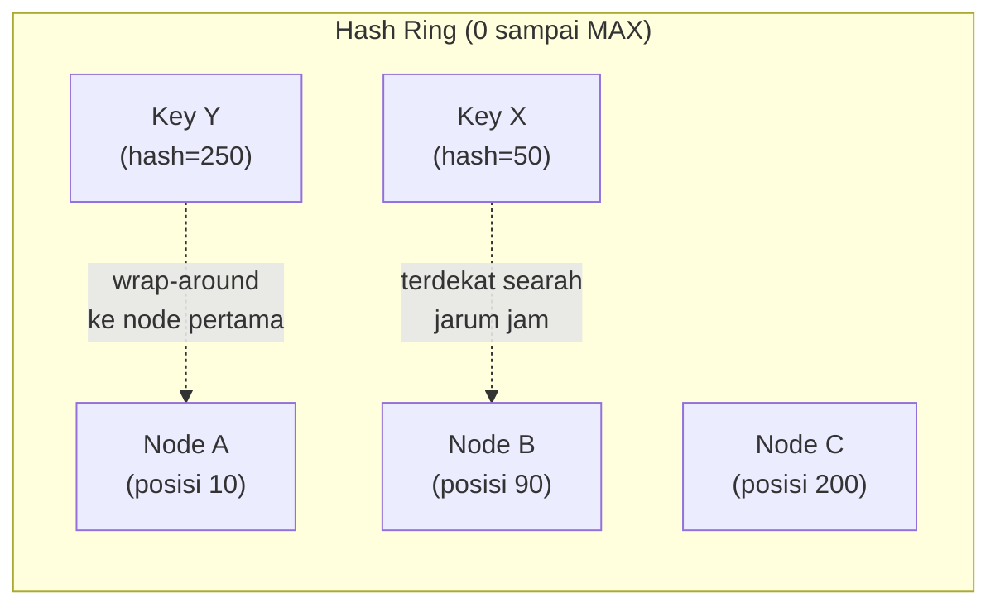

## TL;DR

Hash-based sharding sederhana (`hash(key) % jumlah_shard`) punya masalah tersembunyi yang baru terasa saat jumlah shard **berubah**: menambah atau mengurangi satu shard saja mengubah hasil modulo untuk **hampir semua** key yang ada, karena `jumlah_shard` di penyebut berubah — hasilnya, hampir seluruh data harus dipindahkan ke shard yang berbeda sekaligus, meski yang berubah hanya satu shard dari puluhan. Consistent hashing menyelesaikan masalah ini dengan memetakan baik shard maupun key ke posisi di sebuah **ring** (lingkaran) hash — begitu satu shard ditambah atau dihapus, hanya key yang **berdekatan** dengan shard itu di ring yang perlu dipindahkan, sisanya tetap di tempatnya.

## The Problem

Sebuah sistem memakai hash-based sharding sederhana dengan lima shard: `shard = hash(key) % 5`. Sistem tumbuh dan tim menambah shard keenam untuk menambah kapasitas: `shard = hash(key) % 6`. Perubahan angka pembagi dari 5 ke 6 ini terlihat kecil, tapi konsekuensinya besar — untuk hampir **semua** key yang ada, hasil `hash(key) % 5` dan `hash(key) % 6` menghasilkan angka yang berbeda, karena operasi modulo sangat sensitif terhadap perubahan pembaginya. Praktis seluruh data yang sudah tersimpan sekarang "seharusnya" berada di shard yang berbeda dari tempatnya sekarang.

Migrasi data sebesar ini — memindahkan hampir seluruh dataset lintas shard sekaligus — sangat mahal dan berisiko, terutama kalau harus dilakukan sambil sistem tetap melayani traffic production. Tim yang menyadari ini di tengah jalan sering terjebak dilema: menunda menambah kapasitas (karena migrasi terlalu berisiko) sampai sistem benar-benar kewalahan, atau menjalankan migrasi besar-besaran yang berisiko downtime signifikan — keduanya konsekuensi dari pilihan skema hashing yang tidak dirancang untuk mengakomodasi perubahan jumlah node.

## Intuition

Cara paling mudah memahaminya: bayangkan meja panjang dengan beberapa loket pelayanan, dan setiap pengunjung diarahkan ke loket berdasarkan **sisa hasil bagi** nomor antrean mereka dengan jumlah loket yang buka — pengunjung nomor 47 dengan 5 loket buka diarahkan ke loket 2 (47 mod 5 = 2). Begitu loket keenam dibuka, **hampir semua** pengunjung yang sudah mengantre di loket tertentu harus dipindah ke loket lain, karena `47 mod 6 = 5`, bukan lagi `2` — kekacauan besar hanya karena menambah satu loket. Consistent hashing seperti mengganti sistem ini dengan **posisi melingkar**: setiap loket dan setiap pengunjung diberi posisi di sebuah lingkaran besar (berdasarkan hash), dan setiap pengunjung pergi ke loket **terdekat** searah jarum jam dari posisinya. Begitu loket baru dibuka di satu titik lingkaran, hanya pengunjung yang posisinya **paling dekat** dengan loket baru itu yang perlu pindah — semua pengunjung lain, yang posisinya jauh dari loket baru, tetap di loket lama mereka tanpa terganggu sama sekali.

Analogi ini nyaris sepenuhnya menangkap esensi consistent hashing. Detail teknis yang tidak sepenuhnya tertangkap: lingkaran ini secara matematis diimplementasikan sebagai ruang hash melingkar (biasanya 0 sampai `2^32 - 1`, lalu kembali ke 0), bukan lingkaran fisik sungguhan — "posisi terdekat searah jarum jam" berarti node dengan nilai hash pertama yang **lebih besar atau sama** dengan hash key, dengan wrap-around kalau tidak ada node yang lebih besar (kembali ke node pertama dari awal lingkaran).

## How It Works


Setiap node (shard) dan setiap key diposisikan di titik yang sama di ring hash, dihitung dari fungsi hash yang sama. Sebuah key "milik" node pertama yang ditemui bergerak searah jarum jam dari posisi key itu. Begitu Node D ditambahkan di posisi 150 (antara Node B dan Node C), hanya key yang sebelumnya "milik" Node C tapi posisinya di antara 90 dan 150 yang perlu dipindah ke Node D — key lain (yang posisinya di luar rentang itu) sama sekali tidak terpengaruh, kontras tajam dengan hash-based sederhana yang memindahkan hampir semua key sekaligus.

## Under The Hood

Consistent hashing murni (satu posisi per node di ring) punya kelemahan praktis: distribusi bisa jadi tidak merata kalau posisi node kebetulan berdekatan semua di satu sisi ring, meninggalkan sisi lain kosong — beberapa node menanggung rentang key yang jauh lebih besar dari yang lain, mirip masalah hot partition yang dibahas di [[Sharding Strategies and Hot Partitions]] tapi disebabkan distribusi posisi node, bukan pola akses data. Solusi praktis yang dipakai luas: **virtual node** — setiap node fisik diberi **banyak** posisi (ratusan) di ring, bukan hanya satu, membuat distribusi jauh lebih merata secara statistik (rata-rata dari banyak posisi acak lebih mendekati merata dibanding satu posisi acak tunggal), dan juga membuat rebalancing saat node ditambah/dihapus terdistribusi ke banyak node lain sekaligus, bukan hanya ke satu-dua node tetangga terdekat.

Poin yang membedakan consistent hashing dari sekadar "cara pintar membagi data": nilainya justru paling terasa saat sistem **berubah** (node ditambah, node gagal dan dikeluarkan) — untuk sistem dengan jumlah node yang benar-benar tetap selamanya, hash-based sederhana (`% jumlah_shard`) sudah cukup dan lebih sederhana diimplementasikan; consistent hashing menjawab masalah spesifik "bagaimana meminimalkan pergerakan data saat topologi berubah", bukan masalah distribusi awal itu sendiri.

## In Go

```go
package consistenthashing

import (
	"crypto/sha256"
	"encoding/binary"
	"sort"
)

type Ring struct {
	nodes       map[uint64]string // posisi di ring -> nama node
	sortedKeys  []uint64
	virtualNodesPerNode int
}

func NewRing(virtualNodesPerNode int) *Ring {
	return &Ring{
		nodes:               make(map[uint64]string),
		virtualNodesPerNode: virtualNodesPerNode,
	}
}

func hashPosition(s string) uint64 {
	h := sha256.Sum256([]byte(s))
	return binary.BigEndian.Uint64(h[:8])
}

// AddNode menambahkan BANYAK virtual node untuk satu node fisik —
// distribusi jauh lebih merata dibanding satu posisi tunggal per node.
func (r *Ring) AddNode(name string) {
	for i := 0; i < r.virtualNodesPerNode; i++ {
		pos := hashPosition(name + "#" + string(rune(i)))
		r.nodes[pos] = name
		r.sortedKeys = append(r.sortedKeys, pos)
	}
	sort.Slice(r.sortedKeys, func(i, j int) bool { return r.sortedKeys[i] < r.sortedKeys[j] })
}

// GetNode mencari node PERTAMA searah jarum jam dari posisi key —
// inilah mekanisme inti yang membuat hanya key BERDEKATAN yang
// terpengaruh saat topologi ring berubah.
func (r *Ring) GetNode(key string) string {
	if len(r.sortedKeys) == 0 {
		return ""
	}
	pos := hashPosition(key)

	idx := sort.Search(len(r.sortedKeys), func(i int) bool {
		return r.sortedKeys[i] >= pos
	})
	if idx == len(r.sortedKeys) {
		idx = 0 // wrap-around ke awal ring
	}
	return r.nodes[r.sortedKeys[idx]]
}
```

## In His Stack

Consistent hashing paling relevan untuk sistem 13 aplikasi begitu benar-benar memakai infrastruktur terdistribusi yang perlu menambah/mengurangi kapasitas secara dinamis — cache terdistribusi (Redis Cluster memakai varian consistent hashing di baliknya), atau sistem penyimpanan yang di-sharding sendiri. Untuk kebanyakan kebutuhan sehari-hari yang cukup dilayani database tunggal dengan read replica, konsep ini lebih relevan sebagai pengetahuan fondasi untuk memahami cara kerja tool yang sudah dipakai (seperti [[../92 Tools/Redis|Redis]] dalam mode cluster), dibanding sesuatu yang perlu diimplementasikan sendiri dari nol.

## Trade-offs and When Not To Use It

Consistent hashing menambah kompleksitas implementasi dibanding hash-based sederhana — untuk sistem dengan jumlah node yang jarang atau tidak pernah berubah, kompleksitas tambahan ini tidak memberi manfaat proporsional, karena masalah yang diselesaikannya (minimalkan pergerakan data saat topologi berubah) tidak pernah muncul. Consistent hashing bernilai jelas untuk sistem yang topologinya benar-benar dinamis — node yang sering ditambah untuk skalabilitas, atau node yang bisa gagal dan perlu digantikan tanpa migrasi data besar-besaran setiap kali.

## Common Mistakes

> [!warning] Jebakan
> Memakai hash-based sharding sederhana (`hash(key) % N`) untuk sistem yang jumlah node-nya diharapkan sering berubah — setiap perubahan jumlah node memicu migrasi data besar-besaran yang seharusnya bisa dihindari dengan consistent hashing.

> [!warning] Jebakan
> Mengimplementasikan consistent hashing tanpa virtual node (satu posisi per node fisik) — rentan distribusi tidak merata kalau posisi node kebetulan tidak tersebar rata di ring, menciptakan hot partition yang seharusnya bisa dihindari.

> [!warning] Jebakan
> Menerapkan consistent hashing untuk sistem yang jumlah node-nya benar-benar tetap dan tidak pernah berubah — menambah kompleksitas implementasi tanpa manfaat proporsional, karena masalah yang diselesaikannya tidak pernah terjadi.

## Exercises

1. Jelaskan masalah mendasar hash-based sharding sederhana saat jumlah node berubah.
2. Jelaskan bagaimana consistent hashing meminimalkan pergerakan data saat node ditambah atau dihapus.
3. Apa itu virtual node, dan kenapa ia dibutuhkan dalam implementasi consistent hashing praktis?
4. Desain terbuka: sistem cache terdistribusi untuk salah satu dari 13 aplikasimu saat ini memakai `hash(key) % jumlah_node`, dan setiap kali kapasitas ditambah, tim harus menjadwalkan downtime untuk migrasi cache besar-besaran (yang sebenarnya bisa dihindari karena ini hanya cache, bukan sumber data utama). Jelaskan kenapa migrasi cache sebesar ini sebenarnya tidak perlu terjadi, dan bagaimana consistent hashing mengubah situasi ini.

> [!success]- Kunci jawaban
> **1.** Operasi modulo (`hash(key) % N`) sangat sensitif terhadap perubahan `N` — begitu jumlah node berubah, hasil modulo untuk hampir semua key ikut berubah, meski secara logis hanya satu node yang benar-benar ditambah atau dihapus dari sistem.
> **4.** Migrasi besar-besaran yang dialami tim sebenarnya adalah konsekuensi langsung dari skema hash-based sederhana, bukan sesuatu yang inheren dari kebutuhan menambah kapasitas cache itu sendiri. Dengan consistent hashing, node baru ditambahkan sebagai titik baru di ring hash — hanya key yang posisinya berdekatan dengan node baru itu (secara statistik, sekitar `1/jumlah_node_baru` dari total key) yang perlu dipindah, sisanya tetap di cache node lama tanpa terganggu. Migrasi yang sebelumnya butuh downtime terjadwal untuk memindahkan hampir seluruh cache berubah jadi operasi yang jauh lebih kecil dan bisa dilakukan tanpa downtime sama sekali — cache yang "hilang" untuk sebagian kecil key yang dipindah hanya berarti cache miss sesaat untuk key itu (data akan di-fetch ulang dari sumber dan disimpan lagi), bukan insiden yang butuh perencanaan downtime.

## Self-Check

- Kenapa hash-based sharding sederhana bermasalah saat jumlah node berubah?
- Bagaimana consistent hashing meminimalkan pergerakan data?
- Apa itu virtual node, dan kenapa dibutuhkan?
- Kapan consistent hashing tidak memberi manfaat proporsional?

## Connected Notes

- [[Sharding Strategies and Hot Partitions]] — consistent hashing adalah kelanjutan langsung yang menjawab bagaimana rebalancing shard bisa dilakukan tanpa migrasi data besar-besaran.
- [[../92 Tools/Redis|Redis]] — Redis Cluster mengimplementasikan varian consistent hashing (hash slot) untuk mendistribusikan data lintas node.
- [[../50 Concurrency and Performance/Cache-Aside, Write-Through, and Write-Behind|Cache-Aside, Write-Through, and Write-Behind]] — cache terdistribusi adalah salah satu kasus penggunaan paling umum consistent hashing dalam praktik.
- [[Multi-Region Architecture and Geo-Replication]] — kelanjutan langsung: prinsip mendistribusikan data secara sadar terhadap topologi juga relevan saat topologi itu melintasi region geografis, bukan hanya node dalam satu cluster.
- [[../40 Databases/Introduction to Sharding|Introduction to Sharding]] — consistent hashing adalah salah satu teknik implementasi konkret untuk skema hash-based sharding yang diperkenalkan di note itu.

## Further Reading

- David Karger dkk., "Consistent Hashing and Random Trees" (1997) — paper akademik asli yang memperkenalkan consistent hashing, awalnya untuk konteks web caching terdistribusi.

## Catatan Saya

*Tulis di sini apakah sistem cache atau penyimpanan terdistribusi di salah satu dari 13 aplikasimu pernah butuh migrasi besar-besaran hanya karena menambah kapasitas, dan apakah consistent hashing bisa mencegahnya.*
