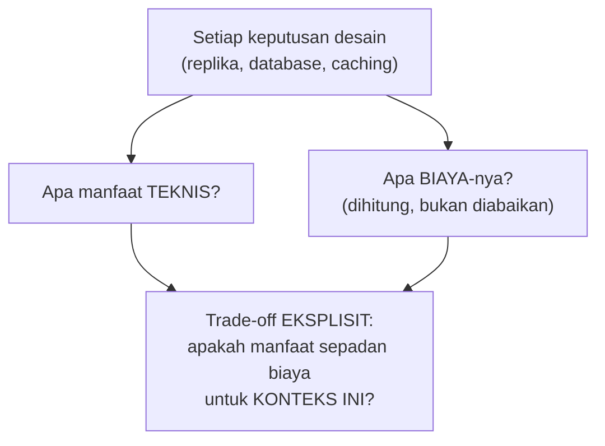

## TL;DR

Cost engineering menjadikan biaya infrastruktur sebagai **bagian sadar** dari setiap keputusan desain — bukan detail administratif yang diserahkan sepenuhnya ke tim keuangan setelah sistem sudah dibangun dan tagihan sudah datang. Setiap keputusan arsitektural (jumlah replika, jenis database, strategi caching, tingkat redundansi) punya konsekuensi biaya nyata, dan insinyur senior mempertimbangkan biaya ini **bersamaan** dengan pertimbangan teknis lain (performa, keandalan) sejak awal desain, bukan sebagai renungan setelah sistem selesai dibangun dan ternyata mahal dioperasikan.

## The Problem

Sebuah tim merancang sistem baru dengan redundansi maksimal — setiap komponen dijalankan dengan tiga replika di tiga availability zone berbeda, database dengan hot standby penuh, dan cache terdistribusi berlapis-lapis — semuanya keputusan yang secara teknis masuk akal untuk meningkatkan keandalan. Sistem ini dibangun dan berjalan baik secara teknis. Tiga bulan kemudian, tagihan infrastruktur bulanan datang dan jauh melebihi anggaran yang disetujui — dan baru di titik ini, setelah sistem sudah production dan sulit diubah tanpa risiko, tim menyadari bahwa tingkat redundansi ini jauh melebihi yang benar-benar dibutuhkan untuk skala traffic sistem ini yang sebenarnya cukup rendah.

Masalahnya bukan keputusan teknis yang salah — redundansi maksimal memang secara teknis meningkatkan keandalan. Masalahnya adalah biaya tidak pernah jadi bagian dari diskusi trade-off saat desain dibuat — keputusan diambil murni berdasarkan "apa yang secara teknis terbaik" tanpa pernah bertanya "apakah tingkat keandalan ini sepadan dengan biaya yang harus dibayar untuk mencapainya, mengingat skala dan konsekuensi kegagalan sistem ini yang sebenarnya?"

## Intuition

Cara paling mudah memahaminya: cost engineering seperti **merencanakan renovasi rumah dengan anggaran yang dipikirkan dari awal**, bukan memilih material dan desain terbaik tanpa batas lalu kaget melihat total tagihan di akhir. Seorang perencana renovasi yang baik mempertimbangkan biaya **bersamaan** dengan kualitas dan desain sejak awal — mungkin memilih material yang "cukup baik" untuk ruang yang jarang dipakai, sambil menginvestasikan lebih di ruang yang benar-benar penting, bukan memakai material termahal di semua tempat tanpa pertimbangan prioritas.

Analogi ini bocor pada soal siapa yang menanggung konsekuensi. Pemilik rumah yang salah anggaran menanggung akibatnya sendiri secara langsung dan segera. Insinyur yang merancang sistem tanpa mempertimbangkan biaya sering tidak langsung merasakan konsekuensinya — tagihan datang ke tim lain (keuangan, manajemen), dengan jeda waktu yang membuat hubungan sebab-akibat antara keputusan desain dan biaya nyata jadi kurang terasa, persis yang terjadi di "The Problem" di mana kesadaran baru muncul tiga bulan kemudian.

## How It Works


Cost engineering memaksa pertanyaan biaya diajukan **di titik yang sama** dengan pertanyaan teknis, bukan terpisah dan belakangan. Setiap opsi arsitektural (bukan hanya opsi tunggal yang "terbaik secara teknis") dievaluasi termasuk estimasi biayanya, dan keputusan akhir mempertimbangkan keduanya sebagai trade-off tunggal — persis prinsip yang sama dengan [[Forming and Defending Trade-offs]], hanya dengan biaya sebagai salah satu dimensi eksplisit yang dipertimbangkan, bukan diabaikan sampai tagihan datang.

Praktik konkret: estimasi biaya kasar (back-of-the-envelope, mirip [[Reading Requirements and Capacity Estimation]]) dibuat **sebelum** implementasi dimulai, berdasarkan estimasi kapasitas yang sudah dihitung — jumlah instance yang dibutuhkan dikalikan biaya per instance, ukuran storage dikalikan biaya per GB, dan seterusnya. Estimasi ini tidak perlu presisi sempurna, hanya cukup akurat untuk membuat keputusan desain sadar sebelum komitmen besar diambil.

## Under The Hood

Redundansi dan keandalan **selalu** punya biaya yang bisa dihitung, dan trade-off-nya sering langsung berkaitan dengan konsep yang sudah dibahas di [[Error Budgets]] — tingkat keandalan yang benar-benar dibutuhkan (SLO yang disepakati) menentukan seberapa besar investasi redundansi yang **sepadan**, bukan investasi maksimal tanpa batas. Sistem dengan SLO 99.9% butuh investasi keandalan yang jauh lebih kecil (dan lebih murah) dibanding sistem dengan SLO 99.999% — perbedaan yang terlihat kecil di angka tapi sangat besar dalam biaya infrastruktur yang dibutuhkan untuk mencapainya, karena setiap "sembilan" tambahan di belakang koma biasanya butuh investasi eksponensial, bukan linear.

Poin yang sering luput: cost engineering bukan berarti selalu memilih opsi termurah — ia berarti memilih opsi yang **biayanya sepadan dengan manfaat nyata** untuk konteks spesifik. Kadang jawabannya adalah menginvestasikan lebih (untuk sistem yang konsekuensi kegagalannya benar-benar mahal), kadang jawabannya mengurangi investasi (untuk sistem yang redundansi berlebihnya tidak sepadan dengan risiko nyata yang dihadapi) — keduanya sama-sama hasil dari analisis biaya-manfaat yang sadar, bukan default ke salah satu arah tanpa pertimbangan.

## In Go

```go
package costengineering

// DesignOption menunjukkan STRUKTUR yang memaksa biaya dan manfaat
// dipertimbangkan BERSAMAAN, bukan terpisah dan belakangan.
type DesignOption struct {
	Name              string
	MonthlyEstimatedCost float64
	ReliabilityBenefit string
	SuitableFor       string
}

// EvaluateOptions menunjukkan gagasan inti: SETIAP opsi dievaluasi
// dengan biaya EKSPLISIT, bukan hanya opsi "terbaik secara teknis"
// yang dipertimbangkan sendirian.
func EvaluateOptions() []DesignOption {
	return []DesignOption{
		{
			Name:                "Single instance, tanpa redundansi",
			MonthlyEstimatedCost: 500_000, // Rupiah, contoh
			ReliabilityBenefit:  "Tidak ada — downtime penuh kalau instance gagal",
			SuitableFor:         "Sistem internal risiko rendah, konsekuensi downtime minimal",
		},
		{
			Name:                "Dua instance, active-passive",
			MonthlyEstimatedCost: 1_200_000,
			ReliabilityBenefit:  "Failover dalam hitungan menit, downtime terbatas",
			SuitableFor:         "Sistem dengan SLO menengah, konsekuensi downtime moderat",
		},
		{
			Name:                "Tiga instance lintas availability zone, hot standby penuh",
			MonthlyEstimatedCost: 4_000_000,
			ReliabilityBenefit:  "Failover mendekati instan, downtime minimal",
			SuitableFor:         "Sistem kritis dengan SLO sangat ketat, konsekuensi downtime sangat mahal",
		},
	}
}

// RecommendBasedOnSLO memilih opsi berdasarkan KEBUTUHAN NYATA
// (SLO yang disepakati), BUKAN otomatis memilih opsi paling mahal
// dan paling andal tanpa pertimbangan kebutuhan sebenarnya.
func RecommendBasedOnSLO(sloTarget float64) DesignOption {
	options := EvaluateOptions()
	switch {
	case sloTarget >= 0.9999:
		return options[2]
	case sloTarget >= 0.99:
		return options[1]
	default:
		return options[0]
	}
}
```

## In His Stack

Untuk instansi pemerintah dengan anggaran infrastruktur yang terikat proses persetujuan formal dan seringkali terbatas, cost engineering bukan sekadar praktik teknis yang baik — ia adalah kebutuhan praktis yang berkaitan langsung dengan realita anggaran sektor publik. Mengajukan estimasi biaya yang jelas dan dikaitkan langsung dengan kebutuhan keandalan yang disepakati (bukan angka besar tanpa penjelasan) jauh lebih mudah disetujui pemangku kepentingan anggaran dibanding permintaan infrastruktur mewah tanpa alasan konkret — koordinator teknis yang bisa menjelaskan "kami butuh tingkat redundansi ini karena SLO yang disepakati X, dan biayanya Y" punya posisi yang jauh lebih kuat dibanding yang hanya bisa bilang "kami butuh infrastruktur lebih besar" tanpa dasar yang jelas.

## Trade-offs and When Not To Use It

Melakukan analisis biaya formal untuk setiap keputusan kecil menambah overhead yang tidak sepadan — untuk keputusan dengan dampak biaya kecil dan reversibel dengan mudah, pertimbangan biaya cukup jadi intuisi cepat, bukan analisis formal penuh. Cost engineering formal bernilai jelas untuk keputusan arsitektural besar yang berdampak signifikan ke biaya operasional jangka panjang (pilihan database, strategi redundansi, arsitektur multi-region) — situasi persis di mana [[Running Design Reviews]] dan [[Writing Architecture Decision Records]] juga jadi relevan, karena ketiganya berbagi kriteria "keputusan signifikan yang layak dipertimbangkan matang" yang sama.

## Common Mistakes

> [!warning] Jebakan
> Memilih opsi "terbaik secara teknis" tanpa mempertimbangkan biayanya sebagai bagian dari keputusan yang sama — persis kesalahan di "The Problem", redundansi maksimal yang secara teknis benar tapi tidak sepadan dengan kebutuhan nyata.

> [!warning] Jebakan
> Menganggap biaya infrastruktur sebagai urusan tim lain (keuangan, manajemen) yang tidak perlu dipertimbangkan saat desain — memisahkan keputusan teknis dari konsekuensi biayanya membuat keduanya tidak pernah benar-benar dievaluasi bersamaan sampai terlambat.

> [!warning] Jebakan
> Selalu memilih opsi termurah tanpa mempertimbangkan konsekuensi nyata dari keandalan yang lebih rendah — cost engineering bukan berarti selalu hemat maksimal, tapi memastikan biaya sepadan dengan kebutuhan, yang kadang berarti berinvestasi lebih untuk sistem yang benar-benar kritis.

## Exercises

1. Jelaskan kenapa biaya infrastruktur sebaiknya dipertimbangkan bersamaan dengan pertimbangan teknis, bukan setelah sistem selesai dibangun.
2. Bagaimana SLO yang disepakati (lihat [[Error Budgets]]) membantu menentukan tingkat investasi redundansi yang sepadan?
3. Kenapa cost engineering tidak selalu berarti memilih opsi termurah?
4. Desain terbuka: kamu diminta mengevaluasi ulang tingkat redundansi sistem di "The Problem" (tiga replika lintas availability zone, hot standby penuh) yang ternyata jauh melebihi anggaran, untuk salah satu dari 13 aplikasimu dengan traffic rendah dan konsekuensi downtime yang bisa diterima beberapa jam. Rancang analisis cost engineering untuk merekomendasikan tingkat redundansi yang lebih sepadan, termasuk bagaimana kamu mengomunikasikan perubahan ini ke pemangku kepentingan yang sudah menyetujui desain awal.

> [!success]- Kunci jawaban
> **1.** Keputusan teknis dan biaya adalah dua sisi dari trade-off yang sama — memisahkan keduanya (memilih opsi teknis terbaik dulu, memikirkan biaya belakangan) berisiko menghasilkan sistem yang secara teknis unggul tapi biayanya tidak sepadan dengan kebutuhan nyata, sesuatu yang baru disadari setelah komitmen finansial sudah terjadi dan lebih sulit diubah.
> **4.** (1) Kembali ke requirements dan capacity estimation (lihat [[Reading Requirements and Capacity Estimation]]) — konfirmasi ulang traffic dan konsekuensi downtime nyata sistem ini, yang ternyata rendah; (2) sepakati SLO yang realistis berdasarkan konsekuensi nyata ini (misalnya 99.5% cukup, bukan 99.999% yang butuh hot standby penuh); (3) evaluasi opsi redundansi yang lebih sepadan dengan SLO ini — mungkin dua instance active-passive sudah cukup, mengurangi biaya signifikan dibanding tiga instance hot standby penuh; (4) hitung penghematan biaya konkret dari perubahan ini, dan siapkan analisis yang menunjukkan SLO yang tetap terpenuhi dengan konfigurasi baru yang lebih murah; (5) komunikasikan ke pemangku kepentingan dengan kerangka yang sama seperti [[Forming and Defending Trade-offs]] — jelaskan konteks awal yang mendasari keputusan lama (mungkin dibuat tanpa data konkret tentang traffic sebenarnya), dan tunjukkan bagaimana data yang sekarang tersedia mengubah kalkulasi trade-off, bukan menyalahkan keputusan awal tapi menunjukkan evolusi pemahaman berdasarkan bukti baru — dan dokumentasikan keputusan baru ini sebagai ADR yang menggantikan keputusan lama, menjaga riwayat evolusi pemikiran tetap terlihat.

## Self-Check

- Kenapa biaya sebaiknya dipertimbangkan bersamaan dengan keputusan teknis, bukan belakangan?
- Bagaimana SLO membantu menentukan tingkat investasi redundansi yang sepadan?
- Kenapa cost engineering tidak selalu berarti memilih opsi termurah?
- Kapan analisis biaya formal sepadan dilakukan, dan kapan tidak?

## Connected Notes

- [[Reading Requirements and Capacity Estimation]] — estimasi kapasitas adalah masukan langsung untuk menghitung estimasi biaya infrastruktur yang dibahas di note ini.
- [[Error Budgets]] — SLO yang disepakati menentukan tingkat investasi keandalan (dan karenanya biaya) yang sepadan, menghubungkan langsung kedua konsep.
- [[Forming and Defending Trade-offs]] — cost engineering adalah penerapan langsung prinsip trade-off dengan biaya sebagai salah satu dimensi eksplisit yang dipertimbangkan.
- [[Running Design Reviews]] — pertimbangan biaya idealnya jadi bagian eksplisit dari diskusi design review, bukan dipikirkan terpisah setelah keputusan teknis sudah bulat.
- [[Writing Architecture Decision Records]] — ADR yang baik mencatat pertimbangan biaya sebagai bagian dari konsekuensi keputusan, bukan hanya konsekuensi teknis.

## Further Reading

- Materi umum industri mengenai FinOps (financial operations untuk cloud), dipopulerkan luas seiring pertumbuhan biaya infrastruktur cloud sebagai isu manajemen yang signifikan.

## Catatan Saya

*Tulis di sini keputusan arsitektural di salah satu dari 13 aplikasimu yang biayanya baru disadari setelah sistem berjalan, dan apakah cost engineering di awal bisa mencegah kejutan itu.*
