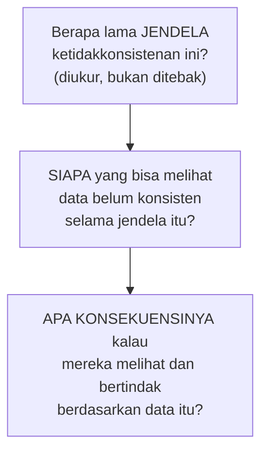

## TL;DR

"Eventual consistency" sering dipakai sebagai jawaban gampang untuk masalah yang sebenarnya belum benar-benar dipikirkan — "nanti juga konsisten sendiri" adalah kalimat yang terdengar seperti solusi tapi tidak menjawab pertanyaan yang sebenarnya penting: **seberapa lama** jendela ketidakkonsistenan itu, **siapa** yang bisa melihat data yang belum konsisten selama jendela itu, dan **apa konsekuensinya** kalau mereka melihatnya. Eventual consistency yang **defensible** (bisa dipertanggungjawabkan) adalah pilihan yang diambil sadar dengan jawaban eksplisit untuk ketiga pertanyaan itu — bukan sekadar jalan pintas untuk menghindari kerja keras mendesain konsistensi yang benar.

## The Problem

Sebuah tim menerapkan CQRS (lihat [[CQRS]]) untuk dashboard laporan kasus — write model menyimpan perubahan status kasus, read model (yang ditampilkan dashboard) diperbarui asinkron lewat event. Tim menjelaskan ke pemangku kepentingan bisnis: "read model-nya eventual consistent, jadi datanya akan konsisten... pada akhirnya." Pertanyaan yang tidak pernah dijawab eksplisit: berapa lama "pada akhirnya" itu — detik, menit, jam? Apa yang terjadi kalau seorang petugas mengubah status kasus, lalu langsung membuka dashboard dan masih melihat status lama karena read model belum sempat diperbarui? Apakah petugas itu bisa salah mengambil keputusan berdasarkan data yang belum ter-update?

Beberapa bulan kemudian, insiden nyata terjadi: proses sinkronisasi read model sempat tertunda selama 20 menit (karena antrean pesan yang membengkak akibat lonjakan traffic), dan selama periode itu, supervisor yang memantau dashboard mengira sejumlah kasus masih "diproses" padahal sebenarnya sudah "disetujui" — mengambil tindakan (mengingatkan petugas untuk mempercepat proses) berdasarkan data yang ternyata sudah usang. "Eventual consistency" yang tidak pernah diberi batas waktu eksplisit dan tidak pernah dipikirkan konsekuensinya berubah dari solusi teknis yang masuk akal menjadi sumber keputusan yang salah arah.

## Intuition

Cara paling mudah memahaminya: bedanya antara "kami akan menghubungi Anda kembali" yang diucapkan tanpa komitmen apa pun (bisa berarti besok, bisa berarti tidak pernah) dengan "kami akan menghubungi Anda kembali dalam 24 jam, dan kalau tidak, Anda berhak menghubungi supervisor kami" — keduanya secara teknis "akan menghubungi kembali", tapi yang kedua memberi **jaminan yang bisa dipegang** dan **jalan keluar yang jelas** kalau jaminan itu tidak terpenuhi. Eventual consistency yang defensible adalah versi kedua: bukan sekadar "akan konsisten", tapi "akan konsisten dalam X, dan berikut yang terjadi kalau seseorang melihat data sebelum X berlalu".

Analogi ini nyaris sepenuhnya menangkap esensinya. Yang tidak sepenuhnya tertangkap: janji "24 jam" pada layanan pelanggan biasanya angka yang ditentukan sepihak oleh penyedia layanan. Batas waktu eventual consistency yang defensible idealnya ditentukan berdasarkan **kebutuhan nyata pengguna** dan **karakteristik teknis sistem yang sebenarnya** (bukan angka yang terasa masuk akal tapi tidak pernah diukur) — mirip disiplin menetapkan SLO yang dibahas di [[../70 Infrastructure and Delivery/SLIs and SLOs|SLIs and SLOs]], hanya diterapkan khusus pada jeda konsistensi data, bukan ketersediaan layanan.

## How It Works

Tiga pertanyaan yang wajib dijawab eksplisit sebelum eventual consistency dianggap sebagai desain yang matang, bukan jalan pintas:



1. **Berapa lama jendela ketidakkonsistenan** — diukur dari karakteristik sistem nyata (latency antrean pesan, waktu pemrosesan projector di CQRS), bukan angka tebakan optimis. Sistem yang punya monitoring untuk mengukur jeda ini (dan alert kalau jeda melebihi ambang normal) jauh lebih defensible dibanding sistem yang tidak pernah tahu seberapa besar jeda sesungguhnya.
2. **Siapa yang melihat data selama jendela itu** — pengguna internal yang paham keterbatasan sistem (bisa menerima "data mungkin tertinggal beberapa detik") berbeda dari pengguna eksternal atau pihak yang mengambil keputusan penting berdasarkan data itu (tidak boleh menerima ketidakkonsistenan tanpa peringatan eksplisit).
3. **Apa konsekuensinya** — untuk data yang konsekuensi ketidakkonsistenannya rendah (statistik dashboard internal), eventual consistency longgar bisa diterima. Untuk data yang konsekuensinya tinggi (status kasus yang jadi dasar keputusan supervisor, seperti "The Problem"), eventual consistency yang tidak diberi jaminan dan indikator jelas adalah desain yang cacat, bukan trade-off yang sah.

## Under The Hood

Membuat eventual consistency defensible secara praktis butuh dua hal konkret: **indikator kesegaran data** yang terlihat pengguna (misalnya "data terakhir diperbarui 3 detik lalu" ditampilkan langsung di UI, bukan disembunyikan), dan **monitoring jeda sinkronisasi** yang memberi alert kalau jeda melebihi batas normal (mirip alert SLO di [[../70 Infrastructure and Delivery/Alerts That Do Not Cause Fatigue|Alerts That Do Not Cause Fatigue]]) — kedua elemen ini mengubah eventual consistency dari janji abstrak ("nanti konsisten") jadi kontrak yang bisa diverifikasi dan dipantau, dengan jalur eskalasi jelas kalau jaminannya dilanggar.

Untuk data yang benar-benar tidak bisa menerima ketidakkonsistenan sama sekali (meski hanya sesaat), jawabannya bukan memaksakan eventual consistency dengan jaminan yang lebih ketat — jawabannya adalah **tidak memakai** eventual consistency untuk data itu, kembali ke consistency model yang lebih kuat (linearizable, lihat [[Consistency Models]]) untuk kasus spesifik itu saja, sambil tetap memakai eventual consistency untuk bagian lain sistem yang memang bisa menerimanya.

## In Go

```go
package readmodel

import "time"

// CaseSummary MENYERTAKAN indikator kesegaran EKSPLISIT — bukan
// menyembunyikan fakta bahwa data ini bisa tertinggal dari write model.
type CaseSummary struct {
	Status      string
	LastUpdated time.Time
}

// FreshnessInfo dikembalikan BERSAMA data, membuat ketidakkonsistenan
// yang mungkin ada TERLIHAT pengguna, bukan tersembunyi.
type FreshnessInfo struct {
	Lag      time.Duration
	IsStale  bool // true kalau lag melebihi ambang yang DISEPAKATI eksplisit
}

const acceptableLag = 10 * time.Second

func ComputeFreshness(lastUpdated time.Time) FreshnessInfo {
	lag := time.Since(lastUpdated)
	return FreshnessInfo{
		Lag:     lag,
		IsStale: lag > acceptableLag,
	}
}

// MonitorSyncLag adalah bagian dari kontrak DEFENSIBLE — jeda
// sinkronisasi DIUKUR dan DIPANTAU, bukan diasumsikan selalu kecil.
func MonitorSyncLag(currentLag time.Duration, alertThreshold time.Duration) (shouldAlert bool) {
	return currentLag > alertThreshold
}
```

## In His Stack

Untuk dashboard laporan kasus seperti di "The Problem", jawaban defensible yang konkret: tampilkan timestamp "data terakhir diperbarui X detik/menit lalu" langsung di UI dashboard, pasang monitoring untuk jeda sinkronisasi read model dengan alert kalau melebihi ambang yang disepakati (misalnya 30 detik untuk kasus ini), dan komunikasikan eksplisit ke supervisor bahwa keputusan yang sangat mendesak (butuh data real-time detik-ke-detik) sebaiknya diverifikasi lewat sumber data langsung (write model), bukan mengandalkan dashboard read model semata. Ini mengubah "eventual consistency" dari janji kosong jadi kontrak yang jelas batasannya dan bisa diandalkan sesuai batasan itu.

## Trade-offs and When Not To Use It

Membuat eventual consistency defensible (indikator kesegaran, monitoring jeda, ambang yang disepakati eksplisit) butuh usaha tambahan dibanding sekadar menerapkan eventual consistency dan berharap yang terbaik — untuk sistem internal berisiko sangat rendah dengan pengguna yang sudah paham keterbatasannya, usaha ekstra ini mungkin berlebihan. Tapi untuk sistem apa pun yang keputusan penting diambil berdasarkan data yang eventual consistent, usaha ini adalah investasi yang jauh lebih murah dibanding biaya insiden keputusan salah yang diambil karena data usang tanpa peringatan, seperti di "The Problem".

## Common Mistakes

> [!warning] Jebakan
> Menjawab pertanyaan "kenapa data ini tidak selalu akurat?" dengan "oh, itu eventual consistent" tanpa memberi angka konkret jendela waktu atau konsekuensi yang jelas — jawaban yang secara teknis benar tapi tidak defensible, karena tidak memberi jaminan apa pun yang bisa dipegang.

> [!warning] Jebakan
> Tidak menampilkan indikator kesegaran data ke pengguna yang melihat read model eventual consistent — pengguna mengasumsikan data yang mereka lihat selalu real-time, membuat mereka rentan mengambil keputusan berdasarkan data usang tanpa menyadarinya.

> [!warning] Jebakan
> Memaksakan eventual consistency untuk data yang sebenarnya butuh consistency lebih ketat (demi konsistensi arsitektur atau kemudahan implementasi), tanpa mempertimbangkan konsekuensi nyata kalau data itu dilihat dalam keadaan belum sinkron oleh pihak yang mengambil keputusan penting berdasarkannya.

## Exercises

1. Jelaskan tiga pertanyaan yang wajib dijawab eksplisit sebelum eventual consistency dianggap desain yang matang.
2. Kenapa "nanti juga konsisten sendiri" bukan jawaban yang defensible tanpa jaminan waktu dan konsekuensi yang jelas?
3. Sebutkan dua elemen konkret yang membuat eventual consistency defensible dalam praktik.
4. Desain terbuka: sistem di "The Problem" (dashboard laporan kasus dengan read model CQRS) mengalami insiden karena jeda sinkronisasi 20 menit yang tidak terdeteksi menyebabkan supervisor mengambil keputusan berdasarkan data usang. Rancang perbaikan lengkap untuk membuat eventual consistency sistem ini defensible, mencegah insiden serupa terulang.

> [!success]- Kunci jawaban
> **1.** Berapa lama jendela ketidakkonsistenan (diukur, bukan ditebak); siapa yang bisa melihat data belum konsisten selama jendela itu; apa konsekuensinya kalau mereka bertindak berdasarkan data itu.
> **4.** (1) Tambahkan monitoring jeda sinkronisasi read model secara eksplisit (waktu antara event ditulis di write model dan read model selesai diperbarui), dengan alert kalau jeda melebihi ambang normal (misalnya 30 detik) yang disepakati bersama tim dan pemangku kepentingan bisnis — insiden 20 menit seharusnya memicu alert jauh sebelum menyebabkan keputusan salah; (2) tampilkan indikator "data terakhir diperbarui X detik/menit lalu" langsung di UI dashboard, membuat supervisor secara visual sadar kalau data yang mereka lihat mungkin tertinggal, bukan mengasumsikan selalu real-time; (3) untuk keputusan yang benar-benar mendesak dan penting (bukan pemantauan rutin), sediakan opsi eksplisit "verifikasi data terkini" yang membaca langsung dari write model (lebih lambat tapi selalu akurat), memberi jalur keluar untuk kasus yang butuh kepastian penuh; (4) dokumentasikan dan komunikasikan kontrak ini secara eksplisit ke seluruh pengguna dashboard — bukan asumsi implisit yang baru diketahui setelah insiden terjadi.

## Self-Check

- Sebutkan tiga pertanyaan wajib sebelum eventual consistency dianggap desain matang.
- Kenapa "nanti konsisten sendiri" bukan jawaban yang defensible?
- Sebutkan dua elemen konkret yang membuat eventual consistency defensible.
- Kapan sebaiknya tidak memakai eventual consistency sama sekali?

## Connected Notes

- [[Consistency Models]] — eventual consistency adalah salah satu titik di spektrum consistency yang dibahas mendalam di note itu; note ini membahas bagaimana memakainya secara bertanggung jawab.
- [[CQRS]] — jeda antara command dan read model yang ter-update adalah contoh paling langsung eventual consistency yang butuh dipertanggungjawabkan.
- [[../70 Infrastructure and Delivery/SLIs and SLOs|SLIs and SLOs]] — disiplin menetapkan batas waktu jendela ketidakkonsistenan berbagi filosofi yang sama dengan menetapkan SLO yang terukur dan disepakati.
- [[../70 Infrastructure and Delivery/Alerts That Do Not Cause Fatigue|Alerts That Do Not Cause Fatigue]] — monitoring jeda sinkronisasi dengan alert yang jelas adalah penerapan langsung prinsip alert yang actionable dari note itu.
- [[Change Data Capture]] — jeda CDC antara perubahan database dan event yang dihasilkan adalah salah satu sumber eventual consistency yang perlu dipertanggungjawabkan dengan cara yang sama.

## Further Reading

- Werner Vogels, "Eventual Consistency" (2008) — tulisan yang sama dirujuk di [[Consistency Models]], juga relevan untuk membahas tanggung jawab praktis memakai eventual consistency di sistem production nyata.

## Catatan Saya

*Tulis di sini bagian dari 13 aplikasimu yang memakai eventual consistency, dan apakah jendela waktu serta konsekuensinya pernah dikomunikasikan eksplisit ke pengguna atau pemangku kepentingan bisnis.*
