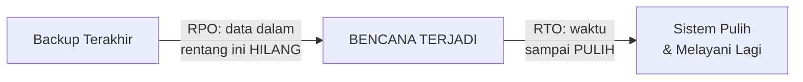

## TL;DR

Disaster recovery menjawab pertanyaan "apa yang terjadi kalau seluruh sistem — bukan cuma satu komponen — hilang total" (kebakaran data center, bencana alam, kesalahan konfigurasi katastrofik yang menghapus data). Dua angka mengukur seberapa siap sebuah organisasi menghadapi skenario ini. **RTO (Recovery Time Objective)** adalah **berapa lama** sistem boleh mati sebelum benar-benar pulih dan melayani lagi — target waktu pemulihan. **RPO (Recovery Point Objective)** adalah **berapa banyak data** boleh hilang, diukur dalam waktu — kalau backup terakhir dilakukan satu jam sebelum bencana, RPO satu jam berarti data dari jam terakhir itu hilang permanen. Keduanya adalah angka yang harus **disepakati secara sadar sebelum bencana**, bukan ditemukan secara tidak sengaja saat bencana sungguhan terjadi dan semua orang kaget dengan kenyataan yang tidak pernah dipikirkan sebelumnya.

## The Problem

Sebuah instansi mengasumsikan sistem legal-services mereka "aman" karena database di-backup setiap malam. Suatu hari, kesalahan konfigurasi (bukan bencana alam, cukup kesalahan manusia biasa) menghapus data production secara tidak sengaja di siang hari. Tim memulihkan dari backup terakhir — tapi backup itu diambil jam 2 pagi, sekitar 14 jam sebelum insiden. Semua perubahan data yang terjadi dalam 14 jam itu — pengajuan permohonan baru, verifikasi dokumen, perubahan status kasus — hilang permanen, tidak bisa dipulihkan dengan cara apa pun.

Masalahnya bukan backup yang tidak ada — backup memang ada dan berfungsi seperti dirancang. Masalahnya adalah tidak ada satu pun yang secara sadar memutuskan "14 jam data yang hilang adalah risiko yang bisa kami terima" — angka RPO ini (secara implisit ditentukan oleh frekuensi backup) tidak pernah dievaluasi terhadap konsekuensi nyata kehilangan data sebanyak itu untuk sistem yang menangani kasus hukum aktif. Keputusan "backup setiap malam" diambil karena terasa "cukup baik" secara intuitif, bukan karena hasil analisis eksplisit tentang berapa lama data boleh hilang untuk sistem ini.

## Intuition

Cara paling mudah memahaminya: RTO adalah **seberapa cepat toko buka lagi** setelah kebakaran, dan RPO adalah **seberapa jauh mundur catatan pembukuan yang masih bisa dipulihkan** dari brankas tahan api. Kedua angka ini menjawab pertanyaan berbeda: RTO tentang **downtime yang bisa diterima**, RPO tentang **kehilangan data yang bisa diterima** — sebuah bisnis bisa punya RTO pendek (toko buka lagi besok pagi) tapi RPO panjang (catatan minggu terakhir hilang karena brankas terakhir diperbarui seminggu sebelum kebakaran), atau sebaliknya, tergantung investasi dan prioritas yang diambil.

Analogi ini bocor pada soal sifat kedua angka. Toko fisik bisa memutuskan RTO dan RPO-nya relatif independen (buka cepat tidak berarti butuh catatan super baru, dan sebaliknya). Untuk sistem software, kedua angka ini sering **saling berkaitan erat lewat biaya**: mencapai RPO yang sangat kecil (nyaris nol data hilang) biasanya butuh infrastruktur replikasi yang juga mempercepat RTO (karena sistem cadangan sudah "hangat" dan siap mengambil alih), sementara mencapai RPO longgar dengan RTO cepat sekalipun butuh trade-off desain yang berbeda — keduanya tidak sepenuhnya independen dalam praktik.

## How It Works


RPO diukur **mundur** dari titik bencana ke titik backup terakhir yang valid — semakin sering backup dilakukan (atau semakin canggih mekanisme replikasi kontinu yang dipakai), semakin kecil RPO. RTO diukur **maju** dari titik bencana sampai sistem benar-benar pulih — dipengaruhi seberapa cepat infrastruktur cadangan bisa diaktifkan, seberapa besar data yang harus dipulihkan, dan seberapa matang prosedur pemulihan yang sudah dilatih.

Strategi disaster recovery, dari paling murah dan paling lambat sampai paling mahal dan paling cepat: **backup dingin** (data disimpan terpisah, dipulihkan manual — RTO dan RPO besar, biaya rendah), **backup hangat** (infrastruktur cadangan siap tapi tidak aktif penuh, butuh diaktifkan — RTO dan RPO menengah), **hot standby/active-passive** (infrastruktur cadangan berjalan terus dan sinkron mendekati real-time, siap ambil alih cepat — RTO dan RPO kecil, biaya tinggi karena menjalankan infrastruktur ganda terus-menerus).

## Under The Hood

RTO dan RPO **harus** ditentukan berdasarkan analisis biaya-manfaat eksplisit, bukan default yang terasa aman. Mencapai RPO mendekati nol dan RTO dalam hitungan detik (hot standby penuh, replikasi sinkron lintas data center) adalah mahal — bukan hanya biaya infrastruktur ganda, tapi juga kompleksitas operasional signifikan. Untuk sebagian besar sistem, biaya ini tidak sepadan dibanding risiko yang benar-benar dihadapi; tapi untuk sistem yang menangani data sangat kritis (transaksi finansial besar, sistem yang nyawa manusia bergantung padanya), biaya itu jelas sepadan. Keputusan berada di titik mana pada spektrum ini adalah keputusan bisnis yang harus melibatkan pemangku kepentingan yang memahami konsekuensi nyata, persis seperti klasifikasi tier di [[Planned Degradation]].

Poin yang sering luput: RTO dan RPO yang **ditetapkan** di dokumen tidak sama dengan RTO dan RPO **sesungguhnya** yang bisa dicapai sistem — satu-satunya cara tahu pasti adalah **menguji** prosedur pemulihan secara berkala (mirip filosofi [[Chaos Engineering]]), bukan mengasumsikan dokumen kebijakan otomatis tercermin di kenyataan operasional. Organisasi yang tidak pernah benar-benar mempraktikkan pemulihan dari backup sering menemukan, tepat saat bencana sungguhan terjadi, bahwa backup mereka rusak, tidak lengkap, atau prosedur pemulihannya jauh lebih lama dari yang didokumentasikan — celah yang seharusnya ditemukan lewat latihan terjadwal, bukan lewat bencana sungguhan.

## In Go

```go
package disasterrecovery

import "time"

// RecoveryObjectives DITENTUKAN SECARA SADAR berdasarkan analisis
// konsekuensi bisnis — BUKAN angka default yang "terasa aman".
type RecoveryObjectives struct {
	RTO time.Duration // berapa lama sistem boleh mati
	RPO time.Duration // berapa banyak data (dalam waktu) boleh hilang
}

// BackupSchedule menunjukkan hubungan LANGSUNG antara frekuensi
// backup dan RPO yang bisa dicapai — backup jarang berarti RPO besar,
// TIDAK PEDULI seberapa cepat pemulihannya nanti.
type BackupSchedule struct {
	Interval time.Duration
}

func (b BackupSchedule) AchievableRPO() time.Duration {
	// RPO TIDAK BISA lebih kecil dari interval backup — ini
	// keterbatasan MATEMATIS, bukan bisa dioptimalkan lewat
	// kecepatan pemulihan.
	return b.Interval
}

// ValidateObjectives memaksa PENGECEKAN EKSPLISIT — target yang
// ditetapkan tapi TIDAK MUNGKIN dicapai infrastruktur sekarang
// harus terlihat SEBELUM bencana, bukan sesudahnya.
func ValidateObjectives(target RecoveryObjectives, schedule BackupSchedule) []string {
	var issues []string
	if target.RPO < schedule.AchievableRPO() {
		issues = append(issues, "RPO target lebih ketat dari yang bisa dicapai jadwal backup sekarang — perlu backup lebih sering atau replikasi kontinu")
	}
	return issues
}
```

## In His Stack

Untuk sistem legal-services yang menangani kasus hukum aktif dengan tenggat waktu, RPO 14 jam seperti di "The Problem" kemungkinan besar terlalu longgar begitu dievaluasi eksplisit terhadap konsekuensinya — kehilangan setengah hari kerja data pengajuan bisa berarti kasus yang terlewat tenggat hukum, konsekuensi yang jauh lebih serius dibanding sekadar "ketidaknyamanan operasional". Menetapkan RTO dan RPO yang tepat untuk 13 aplikasi butuh diskusi eksplisit dengan masing-masing tim pemilik aplikasi — instansi yang menangani kasus paling sensitif waktu mungkin butuh RPO jauh lebih ketat dibanding instansi dengan proses yang lebih longgar tenggatnya, keputusan yang tidak bisa diseragamkan begitu saja untuk semua 13 aplikasi tanpa mempertimbangkan konteks masing-masing.

## Trade-offs and When Not To Use It

Mencapai RTO dan RPO yang sangat ketat (hot standby, replikasi sinkron) adalah investasi infrastruktur dan operasional yang signifikan — untuk sistem dengan konsekuensi kehilangan data atau downtime yang relatif rendah, investasi ini tidak sepadan, dan backup dingin sederhana dengan RTO/RPO yang lebih longgar sudah cukup. Investasi RTO/RPO ketat jelas sepadan untuk sistem yang menangani data sangat kritis dengan konsekuensi nyata dan serius kalau hilang atau tidak tersedia — sistem legal-services dengan tenggat hukum termasuk kandidat kuat, meski tingkat ketatnya tetap perlu ditentukan lewat analisis eksplisit, bukan diasumsikan harus paling ketat mungkin tanpa mempertimbangkan biayanya.

## Common Mistakes

> [!warning] Jebakan
> Menentukan frekuensi backup berdasarkan apa yang "terasa cukup" tanpa analisis eksplisit terhadap konsekuensi kehilangan data sebanyak itu — persis kesalahan di "The Problem", RPO 14 jam yang tidak pernah dievaluasi terhadap dampak nyatanya.

> [!warning] Jebakan
> Menetapkan RTO dan RPO di dokumen kebijakan tanpa pernah menguji apakah target itu benar-benar bisa dicapai lewat latihan pemulihan sungguhan — celah antara target di atas kertas dan kenyataan operasional baru ditemukan saat bencana sungguhan terjadi.

> [!warning] Jebakan
> Menetapkan RTO dan RPO seragam untuk semua sistem tanpa mempertimbangkan perbedaan konsekuensi kekritisan masing-masing — sistem yang menangani data paling sensitif waktu butuh target yang jauh lebih ketat dibanding sistem pendukung yang konsekuensinya lebih ringan.

## Exercises

1. Jelaskan perbedaan RTO dan RPO, dan pertanyaan berbeda yang dijawab masing-masing.
2. Kenapa RPO tidak bisa lebih kecil dari interval backup yang dijalankan, terlepas seberapa cepat proses pemulihannya?
3. Kenapa RTO dan RPO harus diuji lewat latihan pemulihan sungguhan, bukan cukup didokumentasikan sebagai kebijakan?
4. Desain terbuka: kamu diminta menetapkan RTO dan RPO untuk sistem pengajuan permohonan di salah satu dari 13 aplikasimu, yang menangani kasus dengan tenggat hukum ketat. Rancang proses menentukan angka RTO dan RPO yang tepat, termasuk siapa yang perlu dilibatkan dan bagaimana kamu memverifikasi angka itu benar-benar bisa dicapai infrastruktur yang ada.

> [!success]- Kunci jawaban
> **1.** RTO (Recovery Time Objective) menjawab "berapa lama sistem boleh mati sebelum pulih" — mengukur downtime yang bisa diterima. RPO (Recovery Point Objective) menjawab "berapa banyak data boleh hilang" — mengukur seberapa jauh mundur data yang masih bisa dipulihkan dari titik bencana.
> **4.** (1) Libatkan tim hukum/operasional yang memahami konsekuensi nyata kehilangan data pengajuan (bukan hanya tim teknis) untuk menjawab pertanyaan "berapa lama sistem boleh mati, dan berapa banyak data boleh hilang, sebelum ini menjadi masalah hukum atau operasional serius" — jawaban ini yang menentukan target RTO/RPO, bukan sebaliknya (menentukan target berdasarkan kemudahan teknis lalu berharap konsekuensinya bisa diterima); (2) berdasarkan target itu, evaluasi infrastruktur backup/replikasi yang ada sekarang — apakah frekuensi backup saat ini bisa mencapai RPO target, apakah prosedur pemulihan yang ada bisa mencapai RTO target; (3) kalau ada celah (seperti target RPO lebih ketat dari yang dicapai jadwal backup sekarang), evaluasi biaya meningkatkan infrastruktur (backup lebih sering, replikasi kontinu) versus biaya menerima RPO/RTO yang lebih longgar, dan diskusikan trade-off ini eksplisit dengan pemangku kepentingan; (4) setelah target dan infrastruktur disepakati, jadwalkan latihan pemulihan sungguhan secara berkala (misalnya triwulanan) — benar-benar memulihkan sistem dari backup di lingkungan terpisah dan mengukur berapa lama prosesnya sungguhan memakan waktu, memverifikasi RTO yang didokumentasikan memang tercermin di kenyataan operasional, bukan sekadar angka di atas kertas.

## Self-Check

- Apa perbedaan RTO dan RPO?
- Kenapa RPO tidak bisa lebih kecil dari interval backup?
- Kenapa RTO/RPO harus diuji lewat latihan pemulihan sungguhan?
- Kenapa RTO/RPO sebaiknya tidak seragam untuk semua sistem?

## Connected Notes

- [[Planned Degradation]] — keputusan RTO/RPO yang tepat, seperti klasifikasi tier fitur, butuh input pemangku kepentingan bisnis yang paham konsekuensi nyata, bukan hanya pertimbangan teknis.
- [[Chaos Engineering]] — latihan pemulihan disaster recovery berbagi filosofi yang sama dengan chaos engineering: menguji ketahanan sistem secara sengaja di waktu yang direncanakan, bukan menunggu bencana sungguhan.
- [[../40 Databases/Read Replicas and Replication Lag|Read Replicas and Replication Lag]] — replikasi database yang sudah ada untuk kebutuhan baca bisa jadi fondasi untuk strategi disaster recovery hot standby.
- [[Multi-Region Architecture and Geo-Replication]] — multi-region adalah salah satu strategi paling matang mencapai RTO dan RPO yang sangat ketat, dengan biaya operasional yang sepadan untuk kebutuhan itu.
- [[../80 Security/Compliance Trails for Government Systems|Compliance Trails for Government Systems]] — kebutuhan RTO/RPO untuk sistem pemerintah sering bersinggungan langsung dengan kewajiban regulasi soal kontinuitas layanan publik.

## Further Reading

- Materi umum industri mengenai disaster recovery planning, dipopulerkan luas lewat standar dan praktik business continuity management — bukan rujukan satu sumber tunggal.

## Catatan Saya

*Tulis di sini apakah salah satu dari 13 aplikasimu punya RTO dan RPO yang ditetapkan eksplisit dan pernah diuji lewat latihan pemulihan sungguhan, atau backup-nya hanya "ada" tanpa pernah benar-benar diverifikasi bisa dipulihkan.*
