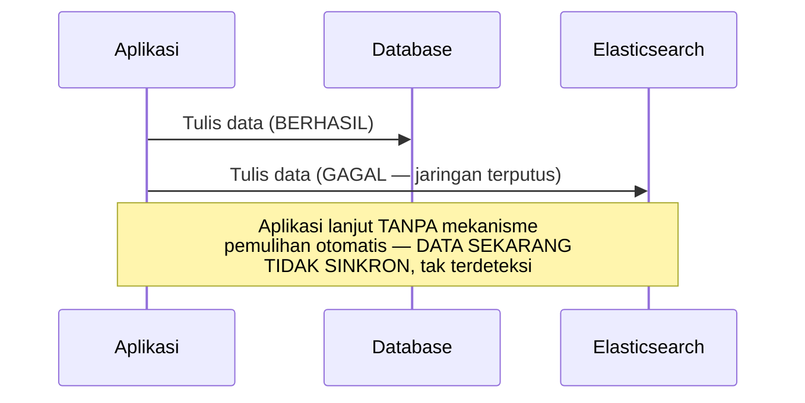

## TL;DR

Dual write berarti aplikasi menulis ke **dua tempat penyimpanan berbeda** dalam satu operasi logis — dua database saat migrasi (lihat [[Zero-Downtime Database Migration Using CDC]]), database dan cache, atau database dan search index. Terlihat sederhana: "tulis ke A, lalu tulis ke B". Masalahnya sama persis dengan masalah transaksi lintas service yang sudah dibahas di [[Two-Phase Commit and Why It Is Avoided]] — tidak ada jaminan atomik bahwa **kedua** tulisan berhasil atau **kedua** gagal bersamaan. Kalau tulisan pertama berhasil dan yang kedua gagal (jaringan terputus, sistem kedua sedang down, atau aplikasi crash tepat di antara keduanya), kedua tempat penyimpanan itu sekarang **tidak sinkron** — dan tidak ada mekanisme otomatis yang memberi tahu ini terjadi, sampai seseorang menyadari data yang berbeda di kedua tempat itu.

## The Problem

Sebuah aplikasi menulis data kasus ke database utama, lalu langsung menulis ke Elasticsearch untuk keperluan pencarian — dua panggilan berurutan dalam kode yang sama, terlihat seperti satu operasi. Suatu hari, panggilan pertama (ke database) berhasil, tapi panggilan kedua (ke Elasticsearch) gagal karena Elasticsearch sedang mengalami gangguan sesaat. Kode aplikasi menangkap error ini, mencatatnya di log, tapi tidak melakukan apa pun lebih lanjut — data kasus baru itu sekarang **ada** di database tapi **tidak ada** di index pencarian.

Kegagalan ini tidak terlihat langsung — aplikasi terus berjalan normal, pengguna yang menambahkan kasus baru tidak melihat error apa pun (operasi database-nya berhasil). Masalah baru terungkap beberapa hari kemudian ketika seorang petugas mencari kasus itu lewat fitur pencarian dan tidak menemukannya, meski kasus itu jelas ada di sistem (bisa diakses langsung lewat ID-nya) — index pencarian diam-diam menyimpang dari sumber kebenaran, dan tidak ada satu pun log error yang secara jelas menjelaskan kenapa, karena kegagalan asli terjadi jauh sebelumnya dan sudah "hilang" di tengah volume log normal.

## Intuition

Cara paling mudah memahaminya: dual write seperti **mengirim dua salinan surat penting ke dua alamat berbeda lewat dua kurir terpisah**, berharap keduanya sampai. Kalau kurir pertama berhasil mengantar tapi kurir kedua mengalami masalah di jalan (ban bocor, salah alamat), kamu tidak akan tahu kegagalan ini terjadi kecuali ada mekanisme eksplisit yang memberi tahu "kurir kedua gagal mengantar". Kedua penerima sekarang punya informasi yang berbeda — satu tahu, satu tidak — dan tidak ada yang menyadari perbedaan ini sampai suatu saat kedua pihak dibandingkan secara langsung.

Analogi ini bocor pada soal skala kesadaran. Pengirim surat biasanya cukup sadar untuk menindaklanjuti kalau salah satu kurir melapor gagal. Dual write di software yang tidak dirancang dengan baik sering **menelan** kegagalan itu diam-diam (dicatat di log yang jarang diperiksa, atau bahkan tidak dicatat sama sekali) — kegagalan yang terjadi tanpa disadari siapa pun sampai konsekuensinya terlihat jauh kemudian, seperti di "The Problem".

## How It Works


Titik kegagalan paling berbahaya ada tepat di antara dua tulisan — begitu tulisan pertama berhasil, tidak ada jalan mundur atomik yang bisa membatalkannya kalau tulisan kedua gagal (mirip masalah 2PC di [[Two-Phase Commit and Why It Is Avoided]], hanya di sini tanpa protokol coordinator formal sama sekali, membuatnya bahkan lebih rentan). Aplikasi yang naif hanya mencatat kegagalan tanpa mekanisme pemulihan meninggalkan kedua tempat penyimpanan dalam keadaan menyimpang, tanpa sinyal yang jelas ke siapa pun bahwa ini terjadi.

## Under The Hood

Solusi yang lebih andal daripada dual write langsung: hindari menulis ke dua tempat secara langsung dari kode aplikasi sama sekali. Pola [[../30 APIs and Web/The Transactional Outbox Pattern|The Transactional Outbox Pattern]] menulis perubahan **hanya** ke database utama (dalam satu transaksi ACID yang sama dengan data itu sendiri, mencatat "perlu disinkronkan ke Elasticsearch" sebagai baris outbox), lalu proses terpisah membaca outbox itu dan menyalurkan perubahan ke Elasticsearch secara asinkron dengan retry sampai berhasil — mengubah dua tulisan yang rawan gagal parsial jadi satu tulisan atomik (ke database saja) plus proses sinkronisasi terpisah yang bisa gagal dan **dicoba ulang** tanpa risiko kehilangan informasi bahwa sinkronisasi itu masih perlu dilakukan.

Solusi lain yang lebih andal: [[Change Data Capture]] — alih-alih aplikasi secara eksplisit menulis ke kedua tempat, aplikasi hanya menulis ke database utama seperti biasa, dan CDC yang membaca transaction log secara otomatis menyalurkan perubahan ke Elasticsearch. Ini menghilangkan masalah dual write sepenuhnya karena aplikasi tidak pernah benar-benar "menulis dua kali" — hanya satu tulisan yang benar-benar terjadi dari sudut pandang aplikasi, dan mekanisme di luar kendali langsung aplikasi (CDC) yang menjamin sinkronisasi ke tempat lain, dengan jaminan yang jauh lebih kuat karena membaca dari sumber yang mencatat semua perubahan yang benar-benar commit.

## In Go

```go
package dualwrite

import (
	"context"
	"database/sql"
	"fmt"
)

// NAIF: dual write LANGSUNG, rawan gagal parsial seperti "The Problem"
func NaiveDualWrite(ctx context.Context, db *sql.DB, es SearchIndex, kasus Kasus) error {
	if err := saveToDatabase(ctx, db, kasus); err != nil {
		return err
	}
	// KALAU baris di bawah ini gagal, database dan Elasticsearch
	// SUDAH TIDAK SINKRON, tanpa mekanisme pemulihan otomatis.
	return es.Index(ctx, kasus)
}

// LEBIH AMAN: outbox pattern — HANYA SATU tulisan atomik ke database,
// sinkronisasi ke Elasticsearch jadi proses TERPISAH yang bisa
// di-retry tanpa risiko kehilangan informasi bahwa sinkronisasi
// masih perlu dilakukan.
func SafeWriteWithOutbox(ctx context.Context, db *sql.DB, kasus Kasus) error {
	tx, err := db.BeginTx(ctx, nil)
	if err != nil {
		return err
	}
	defer tx.Rollback()

	if err := saveToDatabaseTx(ctx, tx, kasus); err != nil {
		return fmt.Errorf("dualwrite: simpan kasus: %w", err)
	}

	// Ditulis dalam TRANSAKSI YANG SAMA — atomik dengan data utama,
	// bukan panggilan terpisah yang bisa gagal independen.
	if err := writeOutboxEntry(ctx, tx, "kasus_created", kasus.ID); err != nil {
		return fmt.Errorf("dualwrite: tulis outbox: %w", err)
	}

	return tx.Commit()
	// Proses TERPISAH (outbox relay) membaca entri ini dan
	// menyalurkannya ke Elasticsearch, dengan RETRY sampai berhasil.
}

type Kasus struct{ ID string }
type SearchIndex interface{ Index(ctx context.Context, k Kasus) error }

func saveToDatabase(ctx context.Context, db *sql.DB, k Kasus) error       { return nil }
func saveToDatabaseTx(ctx context.Context, tx *sql.Tx, k Kasus) error     { return nil }
func writeOutboxEntry(ctx context.Context, tx *sql.Tx, event, id string) error { return nil }
```

## In His Stack

Dual write juga muncul secara implisit di skenario yang jarang disadari sebagai dual write: kode yang menulis ke database **dan** memanggil API partner eksternal dalam satu alur (misalnya mencatat pengajuan di database, lalu memanggil API instansi lain untuk memberi notifikasi) menghadapi risiko yang sama persis — kalau panggilan API partner gagal setelah database berhasil di-commit, kedua sistem tidak sinkron, dan partner mungkin tidak pernah tahu ada pengajuan baru yang seharusnya mereka proses. Pola outbox (lihat [[../30 APIs and Web/The Transactional Outbox Pattern|The Transactional Outbox Pattern]]) berlaku sama untuk skenario ini seperti untuk sinkronisasi search index.

## Trade-offs and When Not To Use It

Menghindari dual write lewat outbox atau CDC menambah kompleksitas — infrastruktur tambahan (proses relay outbox, atau CDC connector) yang harus dioperasikan, dan jeda asinkron antara tulisan awal dan sinkronisasi ke tempat kedua (bentuk eventual consistency yang perlu dipertanggungjawabkan, lihat [[Defensible Eventual Consistency]]). Untuk kebutuhan yang benar-benar sekali pakai dan konsekuensi ketidaksinkronan yang bisa diterima (data yang mudah direkonstruksi ulang, atau sinkronisasi yang tidak kritis), dual write langsung dengan penanganan kegagalan sederhana (retry manual, alert saat gagal) mungkin cukup. Untuk data yang konsekuensi ketidaksinkronannya serius (seperti kasus di "The Problem" yang membuat kasus "hilang" dari pencarian), investasi outbox atau CDC jelas sepadan.

## Common Mistakes

> [!warning] Jebakan
> Menulis ke dua tempat secara langsung berurutan tanpa mekanisme pemulihan untuk kegagalan parsial — persis pola di "The Problem", data yang diam-diam tidak sinkron tanpa sinyal jelas ke siapa pun.

> [!warning] Jebakan
> Mencatat kegagalan tulisan kedua di log tanpa mekanisme retry otomatis atau alert yang jelas — log yang jarang diperiksa secara efektif "menelan" informasi kritis bahwa sinkronisasi gagal, sampai konsekuensinya terlihat jauh kemudian.

> [!warning] Jebakan
> Tidak menyadari bahwa panggilan API eksternal setelah tulisan database yang berhasil adalah bentuk dual write yang sama berbahayanya — masalah yang sama tidak hanya berlaku untuk dua database, tapi untuk kombinasi apa pun database dan sistem eksternal lain.

## Exercises

1. Jelaskan kenapa dual write langsung rawan gagal parsial, dan kenapa masalah ini mirip dengan masalah 2PC.
2. Bagaimana pola outbox menghindari masalah dual write?
3. Bagaimana CDC menghindari masalah dual write dengan pendekatan yang berbeda dari outbox?
4. Desain terbuka: kode di salah satu dari 13 aplikasimu saat ini menulis ke database lalu langsung memanggil API partner eksternal untuk notifikasi dalam satu alur, dan pernah ditemukan kasus di mana partner tidak menerima notifikasi meski data sudah tersimpan di database. Rancang perbaikan memakai pola outbox untuk menghilangkan risiko ini, dan jelaskan bagaimana proses relay menangani kegagalan panggilan ke partner yang berulang.

> [!success]- Kunci jawaban
> **1.** Dual write terdiri dari dua operasi terpisah yang tidak punya jaminan atomik — kalau operasi pertama berhasil dan operasi kedua gagal, tidak ada mekanisme otomatis yang membatalkan operasi pertama atau memberi tahu bahwa keduanya sekarang tidak sinkron, mirip masalah inti 2PC (coordinator yang gagal di tengah proses meninggalkan keadaan yang tidak lengkap), hanya tanpa protokol formal apa pun yang mencoba menanganinya.
> **4.** (1) Ubah kode aplikasi untuk hanya menulis ke database dalam satu transaksi, menyertakan baris outbox baru ("perlu kirim notifikasi ke partner untuk pengajuan X") dalam transaksi yang sama — ini menjamin baik data pengajuan maupun catatan "perlu notifikasi" tersimpan atomik bersamaan, tidak mungkin satu berhasil tanpa yang lain; (2) bangun proses relay terpisah yang membaca baris outbox yang belum diproses, memanggil API partner, dan menandai baris itu selesai hanya setelah panggilan **berhasil** dikonfirmasi; (3) untuk kegagalan panggilan API partner (partner sedang down, timeout), relay menerapkan retry dengan exponential backoff (lihat [[../30 APIs and Web/Retries with Exponential Backoff and Jitter|Retries with Exponential Backoff and Jitter]]), mencoba lagi secara berkala sampai berhasil, tanpa risiko kehilangan informasi bahwa notifikasi ini masih perlu dikirim — baris outbox tetap ada dan belum ditandai selesai sampai benar-benar berhasil; (4) tambahkan alert kalau sebuah baris outbox gagal diproses melampaui ambang waktu tertentu (misalnya lebih dari satu jam), memberi sinyal eksplisit ke tim bahwa ada masalah yang butuh perhatian manual, alih-alih diam-diam tertahan tanpa diketahui siapa pun.

## Self-Check

- Kenapa dual write langsung rawan gagal parsial?
- Bagaimana pola outbox menghindari masalah ini?
- Bagaimana CDC menghindari masalah dual write dengan cara berbeda?
- Kenapa panggilan API eksternal setelah tulisan database juga termasuk bentuk dual write?

## Connected Notes

- [[Zero-Downtime Database Migration Using CDC]] — periode dual-write yang dibahas sebagai jaring pengaman migrasi di note sebelumnya adalah salah satu konteks di mana risiko yang dibahas di note ini paling relevan.
- [[../30 APIs and Web/The Transactional Outbox Pattern|The Transactional Outbox Pattern]] — solusi konkret paling umum untuk menghindari dual write langsung, dibahas dasarnya di domain APIs.
- [[Change Data Capture]] — solusi alternatif yang menghilangkan masalah dual write dengan pendekatan berbeda, membaca transaction log alih-alih menulis eksplisit ke dua tempat.
- [[Two-Phase Commit and Why It Is Avoided]] — dual write tanpa mitigasi punya masalah fundamental yang sama dengan 2PC, hanya tanpa protokol formal yang mencoba menanganinya sama sekali.
- [[Defensible Eventual Consistency]] — jeda antara tulisan awal dan sinkronisasi lewat outbox/CDC adalah bentuk eventual consistency yang perlu dipertanggungjawabkan seperti dibahas di note itu.

## Further Reading

- Martin Kleppmann, "Using logs to build a solid data infrastructure" — tulisan yang membahas mendalam kenapa dual write bermasalah dan bagaimana log-based approach (CDC) menyelesaikannya secara lebih andal.

## Catatan Saya

*Tulis di sini apakah ada kode di salah satu dari 13 aplikasimu yang menulis ke dua tempat berurutan tanpa mekanisme pemulihan kegagalan parsial, dan risiko konkret yang mungkin sudah (atau belum) terjadi karenanya.*
