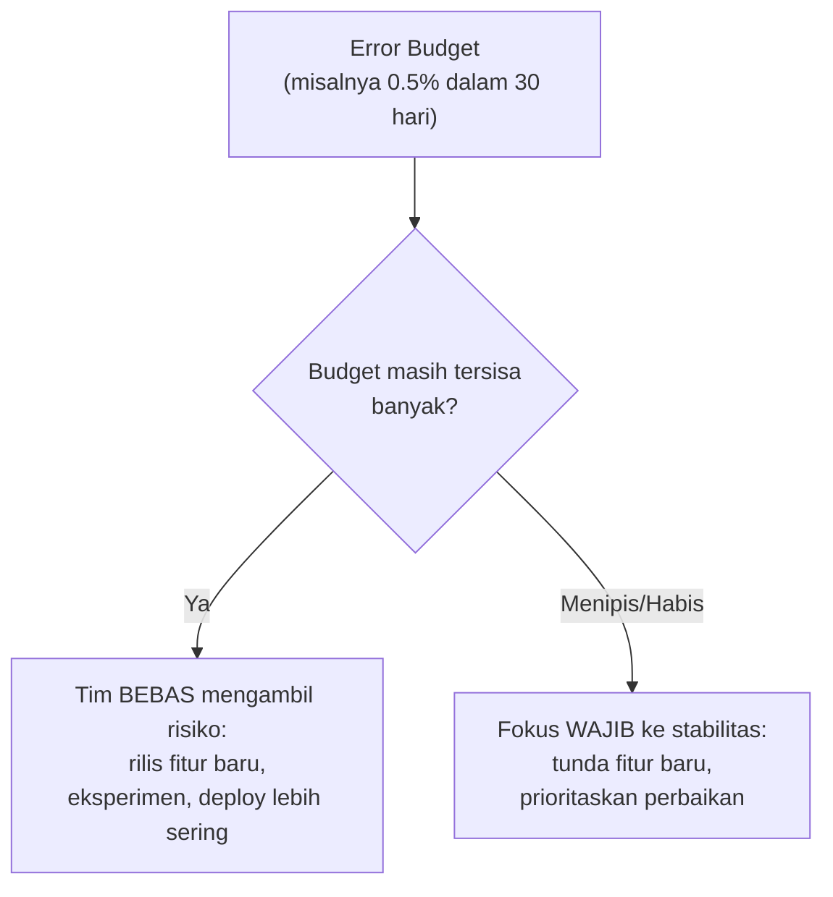

## TL;DR

[[../70 Infrastructure and Delivery/SLIs and SLOs|SLIs and SLOs]] menjelaskan bagaimana SLO (target keandalan) secara implisit mendefinisikan error budget — porsi kegagalan yang secara sadar diterima sebagai wajar. Note ini memperdalam **bagaimana error budget benar-benar dipakai** sebagai alat pengambilan keputusan organisasi, bukan sekadar angka statistik. Error budget mengubah perdebatan abstrak dan emosional ("apakah kita boleh merilis fitur berisiko ini?") menjadi keputusan berbasis data ("apakah budget masih tersisa?") — memberi tim kebebasan mengambil risiko selama budget masih ada, dan memberi alasan objektif untuk memperlambat dan fokus stabilitas begitu budget menipis, tanpa harus jadi pertengkaran politik setiap kali.

## The Problem

Sebuah tim teknik dan tim produk di salah satu dari 13 aplikasi terus-menerus berselisih pendapat: tim produk ingin merilis fitur baru secepat mungkin untuk memenuhi permintaan pengguna, tim teknik ingin memperlambat rilis dan fokus memperbaiki stabilitas setelah beberapa insiden kecil terjadi belakangan ini. Perdebatan ini berulang setiap sprint, tanpa ada dasar objektif untuk memutuskan siapa yang "benar" — tim produk merasa tim teknik terlalu konservatif dan menghambat inovasi, tim teknik merasa tim produk mengabaikan risiko yang mereka lihat sehari-hari dari dekat.

Masalahnya bukan salah satu pihak yang keliru — keduanya punya kekhawatiran yang sah, tapi tidak ada bahasa bersama untuk mengukur "seberapa banyak risiko yang sudah diambil" dan "seberapa banyak yang masih tersisa" sebelum keduanya perlu berkompromi. Tanpa angka objektif, setiap keputusan rilis-atau-tunda jadi negosiasi politik berdasarkan siapa yang lebih meyakinkan dalam rapat, bukan berdasarkan data konkret tentang keadaan sistem yang sebenarnya.

## Intuition

Cara paling mudah memahaminya: error budget seperti **anggaran belanja bulanan** yang disepakati bersama pasangan. Alih-alih bertengkar setiap kali salah satu ingin membeli sesuatu ("apakah ini pengeluaran yang boleh?"), keduanya sepakat pada angka anggaran total di awal bulan — selama masih ada sisa anggaran, pembelian bisa diputuskan cepat tanpa perlu diskusi panjang setiap kali. Begitu anggaran menipis mendekati akhir bulan, keduanya secara otomatis lebih berhati-hati, bukan karena bertengkar lagi, tapi karena angka itu sendiri sudah memberi sinyal jelas "kita perlu lebih hemat sekarang".

Analogi ini nyaris sepenuhnya menangkap esensinya. Perbedaan penting: anggaran belanja biasanya direset penuh setiap bulan tanpa peduli sisa bulan sebelumnya. Error budget pada sistem dengan jendela pengukuran bergulir (misalnya 30 hari terus bergerak) memberi insentif yang sedikit berbeda — insiden yang terjadi hari ini terus "menghantui" perhitungan budget selama 30 hari ke depan sampai jendela itu bergeser melewatinya, bukan langsung hilang begitu bulan kalender berganti.

## How It Works


Keputusan di kedua cabang ini tidak butuh rapat panjang atau negosiasi — angka budget yang tersisa **langsung** menjawab pertanyaan "apakah kita boleh mengambil risiko sekarang". Ini yang mengubah perdebatan di "The Problem" dari argumen subjektif jadi keputusan yang bisa dilihat semua pihak dari dashboard yang sama.

Kebijakan konkret yang sering dipasangkan dengan error budget: begitu budget habis dalam jendela berjalan, tim **secara otomatis** (bukan opsional) menghentikan rilis fitur baru berisiko dan mengalihkan seluruh fokus ke stabilitas, sampai budget pulih (baik karena jendela bergulir melewati insiden lama, atau karena masalah yang menghabiskan budget sudah diperbaiki). Aturan ini disepakati **sebelum** insiden terjadi, bukan diputuskan di tengah kepanikan — inilah yang membuatnya jadi alat yang benar-benar objektif, bukan sekadar pembenaran setelah fakta.

## Under The Hood

Error budget paling bernilai ketika kebijakan konsekuensinya **konkret dan disepakati di muka** — bukan sekadar angka yang dipajang di dashboard tanpa implikasi nyata. Organisasi yang matang menetapkan aturan eksplisit: "kalau budget tersisa di bawah 20%, hanya perbaikan bug dan stabilitas yang boleh di-deploy, fitur baru ditunda sampai budget pulih" — aturan yang sudah disepakati bersama tim produk dan teknik sebelum insiden terjadi, sehingga saat momen itu tiba, tidak ada lagi ruang perdebatan, hanya eksekusi kebijakan yang sudah disetujui bersama.

Poin yang sering luput: error budget bekerja **dua arah**. Ia tidak hanya jadi alasan memperlambat saat budget menipis — ia juga jadi alasan **valid** untuk mempercepat dan mengambil risiko lebih besar saat budget masih banyak tersisa. Tim yang selalu konservatif meski budget masih penuh sebenarnya kehilangan kesempatan berinovasi yang sudah "dibayar" lewat SLO yang disepakati — reliability yang lebih tinggi dari yang dibutuhkan bukan prestasi, ia adalah sinyal bahwa tim bisa mengambil lebih banyak risiko produktif tanpa melanggar janji ke pengguna.

## In Go

```go
package errorbudget

import "time"

// BudgetPolicy menunjukkan gagasan inti: kebijakan KONKRET yang
// disepakati SEBELUM insiden terjadi, bukan diputuskan di tengah
// kepanikan.
type BudgetPolicy struct {
	SLOTarget          float64 // misalnya 0.995
	WindowDuration      time.Duration
	FreezeThresholdPct float64 // di bawah ini, deploy fitur baru DIBEKUKAN otomatis
}

type BudgetStatus struct {
	RemainingPercent float64
	ShouldFreezeReleases bool
}

func (p BudgetPolicy) Evaluate(actualSuccessRate float64) BudgetStatus {
	allowedFailure := 1 - p.SLOTarget
	actualFailure := 1 - actualSuccessRate

	remaining := 0.0
	if actualFailure < allowedFailure {
		remaining = (allowedFailure - actualFailure) / allowedFailure * 100
	}

	return BudgetStatus{
		RemainingPercent:    remaining,
		ShouldFreezeReleases: remaining < p.FreezeThresholdPct,
	}
}

// DeploymentGate menunjukkan penegakan OTOMATIS — bukan bergantung
// pada seseorang mengingat untuk memeriksa dashboard sebelum deploy.
func DeploymentGate(status BudgetStatus, isFeatureRelease bool) (allowed bool, reason string) {
	if isFeatureRelease && status.ShouldFreezeReleases {
		return false, "error budget di bawah ambang — hanya perbaikan bug/stabilitas yang diizinkan"
	}
	return true, ""
}
```

## In His Stack

Untuk 13 aplikasi, error budget paling bernilai justru sebagai alat komunikasi bagi koordinator teknis lintas tim — alih-alih memutuskan sendiri secara subjektif kapan sebuah aplikasi "terlalu berisiko" untuk menerima rilis fitur baru, angka budget yang disepakati bersama tim produk masing-masing aplikasi memberi bahasa objektif yang bisa dijelaskan ke 10+ developer tanpa terasa seperti keputusan sepihak. Ini juga relevan langsung untuk konteks multi-tenant (lihat [[Multi-Tenancy]]) — instansi yang berbeda mungkin punya SLO dan error budget yang berbeda sesuai kekritisan layanan mereka, bukan satu angka seragam untuk seluruh sistem.

## Trade-offs and When Not To Use It

Error budget butuh SLI yang benar-benar terukur akurat dan SLO yang disepakati secara bermakna (lihat prasyaratnya di [[../70 Infrastructure and Delivery/SLIs and SLOs|SLIs and SLOs]]) — tanpa fondasi itu, error budget hanya jadi angka kosong tanpa makna nyata. Untuk sistem yang belum punya instrumentasi matang untuk mengukur SLI dengan andal, membangun kebijakan error budget di atasnya berisiko memberi rasa aman palsu (angka yang terlihat presisi tapi sebenarnya tidak akurat). Error budget bernilai jelas untuk organisasi yang sudah punya SLO yang matang dan butuh mekanisme objektif menyeimbangkan kecepatan inovasi dengan stabilitas, terutama saat perdebatan seperti "The Problem" sudah jadi pola berulang yang menghabiskan energi tim.

## Common Mistakes

> [!warning] Jebakan
> Menetapkan error budget tanpa kebijakan konkret yang disepakati sebelumnya soal apa yang terjadi begitu budget menipis — angka yang dipajang tanpa konsekuensi nyata kembali jadi bahan perdebatan subjektif setiap kali, meniadakan manfaat utamanya sebagai alat keputusan objektif.

> [!warning] Jebakan
> Selalu bersikap konservatif meski error budget masih banyak tersisa — kehilangan kesempatan mengambil risiko produktif (fitur baru, eksperimen) yang sebenarnya sudah "dibayar" lewat SLO yang disepakati, salah memahami error budget hanya sebagai rem, bukan juga sebagai izin melaju.

> [!warning] Jebakan
> Membangun kebijakan error budget di atas SLI yang tidak akurat atau belum matang instrumentasinya — menghasilkan keputusan yang terlihat objektif tapi sebenarnya didasarkan data yang tidak bisa dipercaya, lebih berbahaya dari tidak punya error budget sama sekali karena memberi ilusi kepastian.

## Exercises

1. Jelaskan bagaimana error budget mengubah perdebatan subjektif jadi keputusan berbasis data.
2. Kenapa error budget bekerja dua arah — sebagai alasan memperlambat DAN sebagai alasan mempercepat?
3. Kenapa kebijakan konsekuensi error budget harus disepakati sebelum insiden terjadi, bukan diputuskan di tengah kepanikan?
4. Desain terbuka: tim produk dan tim teknik di salah satu dari 13 aplikasimu terus berselisih seperti di "The Problem". Rancang kebijakan error budget lengkap untuk aplikasi ini, termasuk SLO yang diusulkan, ambang freeze, dan proses menyepakati kebijakan ini dengan kedua tim.

> [!success]- Kunci jawaban
> **1.** Error budget memberi angka konkret ("berapa persen kegagalan yang masih boleh terjadi dalam jendela waktu ini") yang bisa dilihat semua pihak dari sumber data yang sama, alih-alih setiap pihak berargumen dari perasaan atau pengalaman subjektif masing-masing tentang seberapa "berisiko" atau "aman" keadaan sistem sekarang.
> **4.** (1) Fasilitasi diskusi bersama tim produk dan teknik untuk menyepakati SLI yang benar-benar mencerminkan pengalaman pengguna aplikasi ini (misalnya proporsi request berhasil dalam waktu wajar), berdasarkan data historis performa yang sudah ada; (2) sepakati SLO yang realistis (misalnya 99.5% dalam jendela 30 hari) berdasarkan diskusi trade-off — SLO terlalu tinggi membatasi kecepatan inovasi tanpa manfaat proporsional bagi pengguna, SLO terlalu rendah membuat pengguna kecewa; (3) tetapkan ambang freeze eksplisit (misalnya di bawah 20% budget tersisa, rilis fitur baru otomatis ditunda, hanya perbaikan stabilitas yang diizinkan) — angka ini disepakati bersama, bukan ditentukan sepihak; (4) pasang dashboard yang menampilkan status budget secara real-time, terlihat kedua tim, menjadi rujukan tunggal untuk keputusan rilis ke depan; (5) jadwalkan tinjauan berkala (misalnya bulanan) untuk mengevaluasi apakah SLO dan ambang ini masih sesuai kebutuhan, bukan ditetapkan sekali dan dilupakan selamanya.

## Self-Check

- Bagaimana error budget mengubah perdebatan subjektif jadi keputusan objektif?
- Kenapa error budget bekerja dua arah?
- Kenapa kebijakan konsekuensi harus disepakati sebelum insiden terjadi?
- Kapan error budget tidak bisa diandalkan?

## Connected Notes

- [[../70 Infrastructure and Delivery/SLIs and SLOs|SLIs and SLOs]] — error budget adalah kelanjutan langsung dan penerapan praktis dari SLO yang dibahas di note itu.
- [[Multi-Tenancy]] — sistem multi-tenant mungkin butuh error budget berbeda per tenant sesuai kekritisan layanan masing-masing.
- [[Incident Command and Blameless Postmortems]] — kelanjutan langsung: setelah insiden yang menghabiskan error budget terjadi, proses penanganan dan pembelajaran darinya dibahas di note berikutnya.
- [[Chaos Engineering]] — pengujian ketahanan sistem secara sengaja idealnya dilakukan saat error budget masih banyak tersisa, memberi ruang bereksperimen tanpa melanggar SLO.
- [[../90 Architecture and Design/Managing Technical Debt Explicitly|Managing Technical Debt Explicitly]] — error budget adalah salah satu alat paling konkret untuk menyeimbangkan kecepatan fitur baru dengan investasi stabilitas, tema yang sama dengan pengelolaan utang teknis.

## Further Reading

- Google, "Site Reliability Engineering" (buku, tersedia daring gratis) — bab tentang error budget adalah rujukan paling luas dikutip untuk konsep ini, ditulis oleh tim yang mempopulerkannya di industri.

## Catatan Saya

*Tulis di sini apakah tim produk dan teknik di salah satu dari 13 aplikasimu pernah berselisih soal kecepatan rilis vs stabilitas, dan apakah error budget bisa membantu menyelesaikan perselisihan itu ke depan.*
