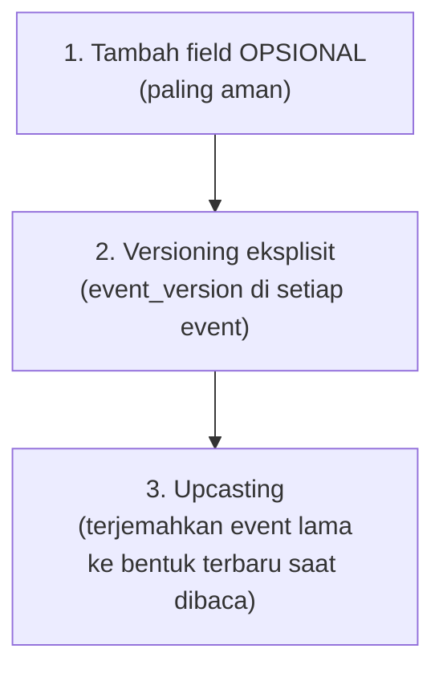

## TL;DR

Event yang tersimpan di [[Event Sourcing]] **tidak pernah diubah** setelah ditulis — ini fondasi utamanya. Tapi kebutuhan bisnis berubah, dan struktur event yang masuk akal hari ini (`KasusDiajukan` dengan field `pemohon_nama`) mungkin perlu berubah bertahun-tahun kemudian (menambah field `pemohon_nik`, atau memecah `pemohon_nama` jadi `nama_depan`/`nama_belakang`). Event schema evolution adalah disiplin menangani perubahan struktur event dari waktu ke waktu **tanpa** mengubah event lama yang sudah tersimpan — consumer yang membaca event lama dan baru harus tetap bisa memahami keduanya, meski strukturnya sedikit berbeda antar waktu penulisan.

## The Problem

Sebuah sistem event-sourced menyimpan event `DokumenDiverifikasi` dengan struktur `{dokumen_id, status}` selama dua tahun. Kebutuhan baru muncul: tim ingin menambahkan field `catatan_verifikator` untuk mencatat alasan penolakan verifikasi. Seorang developer, tanpa berpikir panjang, langsung mengubah struct event ini di kode — menambahkan field `catatan_verifikator` sebagai field wajib (`required`, tanpa default). Begitu di-deploy, kode yang mencoba memutar ulang (replay) event lama untuk merekonstruksi state langsung gagal — event lama yang tersimpan **tidak punya** field `catatan_verifikator` sama sekali, dan parser event yang mengharapkan field itu selalu ada menolak memprosesnya.

Masalah ini adalah pengingat keras bahwa event lama, karena prinsip fundamental event sourcing (tidak pernah diubah), **tetap ada selamanya** dalam bentuk aslinya — perubahan skema event tidak bisa dilakukan dengan asumsi "semua event yang ada sekarang punya struktur baru", karena kenyataannya event lama tetap dalam struktur lama untuk selamanya, dan sistem harus tetap bisa membaca keduanya.

## Intuition

Cara paling mudah memahaminya: bayangkan arsip surat resmi kantor yang disimpan selama puluhan tahun — surat lama ditulis dengan format kop surat dan struktur tertentu, surat yang lebih baru mungkin memakai format berbeda (kop surat baru, field tambahan seperti nomor referensi digital). Petugas arsip yang harus membaca **seluruh** surat, lama dan baru, tidak bisa berasumsi semua surat memakai format terbaru — ia harus tahu cara membaca **kedua** format, mengenali dari ciri-cirinya format mana yang sedang dihadapi, dan menerjemahkan keduanya jadi pemahaman yang konsisten meski bentuk fisiknya berbeda.

Analogi ini bocor pada soal fleksibilitas manusia. Petugas arsip manusia bisa menyesuaikan diri secara intuitif melihat surat format baru yang belum pernah ia lihat sebelumnya. Kode program tidak punya fleksibilitas semacam itu — setiap kemungkinan variasi struktur event **harus** ditangani secara eksplisit dalam kode, biasanya lewat versi skema yang jelas dan logika "upcasting" yang secara sengaja menerjemahkan event versi lama jadi bentuk yang bisa dipahami logika terbaru.

## How It Works

Tiga strategi utama menangani evolusi skema event, dari paling sederhana ke paling kompleks:



1. **Tambah field opsional dengan nilai default** — cara paling aman dan paling sering cukup: field baru (`catatan_verifikator`) ditambahkan sebagai opsional, dengan nilai default yang masuk akal (string kosong, atau `null` yang ditangani eksplisit) kalau tidak ada di event lama. Consumer yang membaca event lama tidak error, hanya mendapat nilai default untuk field yang memang belum ada saat event itu ditulis.
2. **Versioning eksplisit** — setiap event menyertakan nomor versi skemanya sendiri (`event_version: 1` atau `2`), dan kode pembaca memeriksa versi ini untuk tahu struktur apa yang diharapkan sebelum memparsing field-nya. Ini dibutuhkan begitu perubahan lebih signifikan dari sekadar menambah field opsional (mengganti tipe data, mengganti nama field).
3. **Upcasting** — lapisan terjemahan eksplisit yang mengubah event versi lama jadi bentuk versi terbaru **saat dibaca**, sebelum diproses logika bisnis yang sama sekali tidak perlu tahu tentang versi lama itu ada. Ini yang membuat logika bisnis utama tetap bersih (hanya berurusan dengan satu bentuk terbaru), sementara kerumitan menangani versi lama terisolasi di lapisan upcasting saja.

## Under The Hood

Prinsip yang selaras dengan [[../30 APIs and Web/Schema Evolution in Protobuf|Schema Evolution in Protobuf]] (meski konteksnya berbeda — di sana untuk pesan API/RPC, di sini untuk event yang tersimpan permanen): perubahan **yang aman** (backward compatible) adalah menambah field baru yang opsional, sementara perubahan **yang berbahaya** adalah mengubah arti field yang sudah ada, mengubah tipe datanya, atau menghapus field yang mungkin masih dibaca kode lama. Perbedaan penting untuk event sourcing dibanding API biasa: pesan API yang dikirim lewat gRPC hanya "hidup" sesaat (dikirim, diterima, selesai) — event yang tersimpan di event store **hidup selamanya**, dibaca ulang bertahun-tahun kemudian saat replay, membuat disiplin backward compatibility jauh lebih kritis di sini dibanding di komunikasi API sesaat.

Upcasting yang matang sering diimplementasikan sebagai rantai transformasi berurutan — event versi 1 diupcast ke versi 2, lalu versi 2 diupcast ke versi 3, dan seterusnya, bukan setiap versi lama harus punya jalur transformasi langsung ke versi terbaru. Ini membuat penambahan versi baru di masa depan tidak perlu mengubah logika upcasting versi-versi lama yang sudah ada, hanya menambah satu langkah baru di ujung rantai.

## In Go

```go
package eventschema

import "encoding/json"

// RawEvent menyimpan versi EKSPLISIT — kode pembaca TIDAK PERNAH
// berasumsi semua event punya struktur yang sama.
type RawEvent struct {
	Type    string          `json:"type"`
	Version int             `json:"version"`
	Payload json.RawMessage `json:"payload"`
}

// DocumentVerifiedV1 dan V2 merepresentasikan DUA bentuk yang
// PERNAH ada dalam riwayat event store — V1 TIDAK PERNAH dihapus
// dari kode, karena event V1 lama tetap perlu bisa dibaca.
type DocumentVerifiedV1 struct {
	DocumentID string `json:"dokumen_id"`
	Status     string `json:"status"`
}

type DocumentVerifiedV2 struct {
	DocumentID string `json:"dokumen_id"`
	Status     string `json:"status"`
	Note       string `json:"catatan_verifikator"` // field BARU
}

// Upcast menerjemahkan event versi LAMA ke bentuk TERBARU — logika
// bisnis di luar fungsi ini TIDAK PERNAH perlu tahu V1 pernah ada.
func Upcast(raw RawEvent) (DocumentVerifiedV2, error) {
	switch raw.Version {
	case 1:
		var v1 DocumentVerifiedV1
		if err := json.Unmarshal(raw.Payload, &v1); err != nil {
			return DocumentVerifiedV2{}, err
		}
		return DocumentVerifiedV2{
			DocumentID: v1.DocumentID,
			Status:     v1.Status,
			Note:       "", // default untuk field yang TIDAK ADA di V1
		}, nil
	case 2:
		var v2 DocumentVerifiedV2
		err := json.Unmarshal(raw.Payload, &v2)
		return v2, err
	default:
		return DocumentVerifiedV2{}, nil
	}
}
```

## In His Stack

Untuk sistem event-sourced yang mungkin dibangun untuk modul kasus hukum (lihat [[Event Sourcing]]), disiplin menyertakan `event_version` di setiap event **sejak event pertama ditulis** — bukan ditambahkan belakangan setelah perubahan skema pertama dibutuhkan — jauh lebih murah dibanding menambahkannya reaktif setelah insiden seperti "The Problem" terjadi. Tim juga perlu menyepakati proses review eksplisit untuk setiap perubahan skema event (mirip proses review skema pesan di integrasi partner, lihat [[../30 APIs and Web/Contract Negotiation and Versioning|Contract Negotiation and Versioning]]) — perubahan skema event bukan keputusan yang boleh diambil sepihak satu developer tanpa mempertimbangkan dampaknya ke seluruh riwayat event yang sudah tersimpan.

## Trade-offs and When Not To Use It

Disiplin versioning dan upcasting menambah kompleksitas kode dan proses review — untuk sistem event-sourced yang skemanya benar-benar stabil dan jarang berubah, overhead ini mungkin terasa berlebihan di awal. Tapi risiko tidak menerapkannya sejak awal jauh lebih mahal: begitu perubahan skema benar-benar dibutuhkan (dan cepat atau lambat, hampir selalu dibutuhkan), sistem yang tidak punya mekanisme evolusi skema harus memilih antara memecahkan kemampuan membaca event lama (seperti "The Problem"), atau melakukan migrasi data besar-besaran yang mahal dan berisiko pada event store yang seharusnya tidak pernah diubah.

## Common Mistakes

> [!warning] Jebakan
> Menambahkan field baru sebagai wajib (required) tanpa nilai default — event lama yang tidak punya field itu langsung membuat parsing gagal, persis masalah di "The Problem".

> [!warning] Jebakan
> Tidak menyertakan `event_version` sejak event pertama ditulis, baru menambahkannya setelah perubahan skema pertama dibutuhkan — event-event awal yang tidak punya penanda versi jadi kasus khusus yang harus ditangani terpisah selamanya.

> [!warning] Jebakan
> Mengubah arti field yang sudah ada (misalnya field `status` yang dulu berarti "status dokumen" diubah maknanya jadi "status keseluruhan proses") tanpa mengganti nama field atau menaikkan versi — event lama dan baru dengan nama field sama tapi arti berbeda menghasilkan bug logis yang sangat sulit dilacak.

## Exercises

1. Jelaskan kenapa event yang sudah tersimpan tidak pernah bisa diubah, dan implikasinya untuk perubahan skema.
2. Sebutkan tiga strategi menangani evolusi skema event, dari paling sederhana ke paling kompleks.
3. Apa itu upcasting, dan kenapa ia membuat logika bisnis utama tidak perlu tahu tentang versi skema lama?
4. Desain terbuka: sistem event-sourced di salah satu dari 13 aplikasimu perlu mengubah field `pemohon_nama` (satu string) menjadi dua field terpisah `nama_depan` dan `nama_belakang`, dan sistem ini sudah punya jutaan event lama dengan field `pemohon_nama`. Rancang strategi evolusi skema untuk perubahan ini, termasuk bagaimana upcasting menangani pemisahan satu field jadi dua.

> [!success]- Kunci jawaban
> **1.** Prinsip fundamental event sourcing adalah event bersifat append-only dan tidak pernah ditimpa — ini yang menjamin riwayat lengkap selalu tersedia. Implikasinya: event lama akan **selamanya** ada dalam struktur aslinya, dan setiap perubahan skema harus dirancang supaya kode masih bisa membaca dan memahami event dalam struktur lama itu, bukan berasumsi semua event akan otomatis "ikut berubah" ke struktur baru.
> **4.** (1) Naikkan `event_version` untuk event `KasusDiajukan` (atau event mana pun yang memuat `pemohon_nama`) dari versi lama ke versi baru yang memakai `nama_depan`/`nama_belakang`; (2) event baru yang ditulis ke depan memakai struktur baru langsung; (3) implementasikan upcasting untuk event versi lama — logika ini membaca `pemohon_nama` dari event lama dan memisahkannya jadi `nama_depan`/`nama_belakang` memakai heuristik yang wajar (misalnya kata pertama jadi nama depan, sisanya jadi nama belakang) SAAT dibaca, bukan mengubah event yang tersimpan; (4) beri catatan eksplisit (baik di kode maupun dokumentasi tim) bahwa hasil upcasting untuk data lama adalah **perkiraan** berdasarkan heuristik, bukan pemisahan yang seakurat data yang memang ditulis dengan struktur baru sejak awal — transparansi ini penting kalau ada kebutuhan verifikasi manual untuk kasus lama yang sensitif terhadap keakuratan nama.

## Self-Check

- Kenapa event yang sudah tersimpan tidak pernah bisa diubah?
- Sebutkan tiga strategi menangani evolusi skema event.
- Apa itu upcasting?
- Kenapa menambah field wajib tanpa default berbahaya untuk event lama?

## Connected Notes

- [[Event Sourcing]] — event schema evolution adalah kelanjutan langsung dari kebutuhan menjaga event store yang tidak pernah diubah tetap bisa dibaca seiring skemanya berevolusi.
- [[../30 APIs and Web/Schema Evolution in Protobuf|Schema Evolution in Protobuf]] — prinsip backward compatibility yang sama berlaku, meski konteksnya berbeda (pesan API sesaat vs event yang tersimpan permanen).
- [[CQRS]] — projector yang membangun read model dari event harus menangani seluruh versi skema event yang mungkin ada di event store.
- [[../30 APIs and Web/Contract Negotiation and Versioning|Contract Negotiation and Versioning]] — proses review perubahan skema event idealnya mengikuti disiplin yang sama dengan negosiasi kontrak API yang dibahas di note itu.
- [[Change Data Capture]] — kelanjutan langsung: mekanisme lain yang juga harus mempertimbangkan evolusi skema, kali ini untuk perubahan struktur tabel database yang di-capture jadi event.

## Further Reading

- Greg Young, tulisan tentang versioning dalam event sourcing — pembahasan mendalam tentang strategi upcasting dari salah satu tokoh yang mempopulerkan pola ini.

## Catatan Saya

*Tulis di sini apakah ada skema data (event, pesan, atau kontrak API) di salah satu dari 13 aplikasimu yang pernah berubah secara tidak backward-compatible, dan dampaknya saat itu.*
