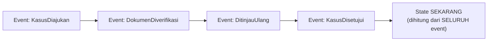

## TL;DR

Cara konvensional menyimpan data hanya menyimpan **state akhir** — baris di tabel `kasus` menunjukkan status "disetujui" sekarang, tapi tidak menyimpan **bagaimana** status itu berubah dari "diajukan" ke "diverifikasi" ke "disetujui", kecuali secara terpisah dicatat di audit log yang bisa saja tidak lengkap. Event sourcing membalik model ini sepenuhnya: alih-alih menyimpan state akhir, sistem menyimpan **rangkaian kejadian** (event) yang menyebabkan perubahan itu — "KasusDiajukan", "DokumenDiverifikasi", "KasusDisetujui" — dan state akhir yang biasa dilihat pengguna **dihitung** dengan memutar ulang seluruh kejadian itu dari awal, bukan disimpan langsung sebagai satu baris yang ditimpa setiap kali berubah.

## The Problem

Sebuah tim mengelola sistem kasus hukum yang menyimpan state konvensional — tabel `kasus` dengan kolom `status` yang di-`UPDATE` setiap kali statusnya berubah. Suatu hari, seorang auditor bertanya: "kasus ini sempat berubah status dari disetujui kembali ke ditinjau ulang, lalu disetujui lagi — siapa yang mengubahnya kembali ke ditinjau ulang, kapan, dan kenapa?" Tim membuka database dan hanya menemukan status **saat ini**: "disetujui". Riwayat perubahan sebelumnya sudah tertimpa oleh `UPDATE` yang berulang, dan satu-satunya sumber informasi soal riwayat itu adalah log aplikasi yang (seperti dibahas di [[../80 Security/Audit Logging|Audit Logging]]) retensinya lebih pendek dari periode yang ditanyakan auditor, dan bahkan kalaupun ada, formatnya tidak dirancang untuk direkonstruksi jadi cerita lengkap dengan mudah.

Masalah ini bukan sekadar kelalaian menambahkan audit logging — ini adalah keterbatasan mendasar dari model penyimpanan yang hanya menyimpan state akhir: begitu sebuah baris di-`UPDATE`, nilai sebelumnya hilang secara struktural, kecuali secara eksplisit disalin ke tempat lain sebelum di-timpa. Event sourcing menjawab masalah ini di level fondasi: kalau **setiap perubahan** disimpan sebagai kejadian terpisah yang tidak pernah dihapus atau ditimpa, pertanyaan "apa yang terjadi dan kapan" selalu bisa dijawab langsung dari sumber data utama, bukan dari sistem tambahan yang terpisah dan berpotensi tidak lengkap.

## Intuition

Cara paling mudah memahaminya: model penyimpanan konvensional seperti **papan skor pertandingan** — hanya menunjukkan skor akhir sekarang, tanpa riwayat bagaimana skor itu terbentuk (gol menit ke berapa, oleh siapa). Event sourcing seperti **rekaman lengkap komentator pertandingan dari menit ke menit** — setiap gol, setiap kartu, setiap kejadian penting dicatat sebagai entri terpisah dalam urutan waktu, dan "skor sekarang" **dihitung** dengan menjumlahkan seluruh gol dari rekaman itu, bukan disimpan sebagai satu angka yang ditimpa setiap kali berubah. Kamu selalu bisa memutar ulang rekaman itu untuk tahu persis apa yang terjadi di menit ke-30, sesuatu yang mustahil kalau yang tersimpan hanya skor akhir.

Analogi ini bocor pada soal biaya menghitung ulang. Menghitung skor akhir dari rekaman pertandingan (menjumlahkan gol) adalah operasi murah dan cepat. Menghitung ulang state kompleks dari ribuan atau jutaan kejadian pada sistem software bisa jadi mahal secara komputasi kalau dilakukan naif setiap kali dibutuhkan — inilah yang membuat pola **snapshot** (dibahas di bawah) dan CQRS ([[CQRS]]) jadi pelengkap yang hampir selalu dibutuhkan dalam praktik, bukan pilihan tambahan opsional.

## How It Works


Event store menyimpan setiap event ini sebagai catatan yang **tidak pernah diubah** setelah ditulis (append-only, mirip prinsip audit log tamper-evident di [[../80 Security/Audit Logging|Audit Logging]]) — event lama tidak pernah di-`UPDATE` atau dihapus, hanya event baru yang ditambahkan. State "sekarang" yang dilihat pengguna dihasilkan dengan memutar ulang (replay) seluruh event dari awal, menerapkan efek masing-masing secara berurutan.

Pertanyaan audit seperti di "The Problem" — "siapa yang mengubah status ke ditinjau ulang, kapan" — langsung terjawab dengan membaca event `DitinjauUlang` itu sendiri, yang secara struktural **memang menyimpan** siapa, kapan, dan (kalau didesain dengan baik) kenapa perubahan itu terjadi, karena itulah persis apa yang disimpan event sourcing sejak awal — bukan informasi tambahan yang harus dicatat terpisah dan berisiko tidak lengkap.

## Under The Hood

Menghitung ulang state dari **seluruh** riwayat event setiap kali dibutuhkan menjadi mahal begitu jumlah event bertambah banyak (ribuan event untuk satu entitas yang sudah berumur bertahun-tahun) — solusi praktisnya adalah **snapshot**: secara berkala (misalnya setiap 100 event, atau setiap malam), sistem menyimpan state yang sudah dihitung sampai titik tertentu, sehingga menghitung state terkini hanya perlu memutar ulang event **sejak snapshot terakhir**, bukan dari awal mutlak. Snapshot adalah optimasi murni — ia tidak pernah jadi sumber kebenaran; kalau snapshot rusak atau hilang, state tetap bisa dihitung ulang penuh dari event asli, hanya lebih lambat.

Event sourcing juga mengubah cara berpikir tentang "menghapus" data — dalam model event sourcing murni, menghapus sesuatu berarti menambahkan event baru (`KasusDihapus`) yang, saat replay, membuat state akhirnya terlihat seperti terhapus — bukan benar-benar menghapus event lama. Ini selaras dengan filosofi yang sama seperti [[Compensating Transactions]]: mengoreksi lewat aksi baru, bukan memalsukan sejarah dengan menghapus jejak lama. Konsekuensinya: sistem yang menyimpan data sangat sensitif (yang mungkin harus benar-benar dihapus permanen karena regulasi perlindungan data) butuh strategi tambahan untuk kasus penghapusan permanen yang sungguhan, bukan mengandalkan event sourcing murni saja.

## In Go

```go
package eventsourcing

import (
	"fmt"
	"time"
)

// Event merepresentasikan SATU kejadian yang TIDAK PERNAH diubah
// setelah ditulis — berbeda dari row database konvensional yang
// biasa di-UPDATE.
type Event struct {
	Type      string
	Timestamp time.Time
	Actor     string
	Data      map[string]string
}

// CaseState adalah state yang DIHITUNG dari event, bukan disimpan
// langsung sebagai satu baris yang ditimpa setiap kali berubah.
type CaseState struct {
	Status  string
	History []Event // untuk kebutuhan audit, riwayat tetap terlihat
}

// Rebuild menunjukkan gagasan inti event sourcing: state SEKARANG
// dihasilkan dengan memutar ulang SELURUH event secara berurutan,
// bukan dibaca langsung dari satu nilai yang tersimpan.
func Rebuild(events []Event) CaseState {
	state := CaseState{Status: "belum_diajukan"}

	for _, e := range events {
		switch e.Type {
		case "KasusDiajukan":
			state.Status = "diajukan"
		case "DokumenDiverifikasi":
			state.Status = "diverifikasi"
		case "DitinjauUlang":
			state.Status = "ditinjau_ulang"
		case "KasusDisetujui":
			state.Status = "disetujui"
		}
		state.History = append(state.History, e)
	}
	return state
}

// RebuildFromSnapshot menunjukkan optimasi PRAKTIS — snapshot
// BUKAN sumber kebenaran, hanya percepatan; state tetap bisa
// dihitung ulang penuh dari event asli kalau snapshot hilang.
func RebuildFromSnapshot(snapshot CaseState, eventsSinceSnapshot []Event) CaseState {
	state := snapshot
	for _, e := range eventsSinceSnapshot {
		fmt.Printf("menerapkan event pasca-snapshot: %s\n", e.Type)
		// logika penerapan event sama seperti Rebuild
	}
	return state
}
```

## In His Stack

Untuk sistem legal-services yang butuh riwayat lengkap perubahan kasus (siapa mengubah apa, kapan, kenapa) demi kebutuhan [[../80 Security/Compliance Trails for Government Systems|Compliance Trails for Government Systems]], event sourcing adalah pola yang secara alami sudah menjawab kebutuhan itu di level desain data, bukan ditambahkan sebagai lapisan audit terpisah yang bisa saja tidak lengkap. Trade-offnya: migrasi sistem yang sudah lama berjalan dengan model state konvensional ke event sourcing penuh adalah proyek besar, bukan perubahan kecil — lebih realistis diterapkan pada fitur atau modul **baru** yang memang butuh riwayat perubahan mendalam, dibanding memaksakan migrasi total sistem lama yang sudah stabil.

## Trade-offs and When Not To Use It

Event sourcing menambah kompleksitas signifikan — query "apa status kasus ini sekarang" yang di model konvensional cukup `SELECT status FROM kasus WHERE id=?` butuh logika replay (atau CQRS dengan read model terpisah, dibahas di [[CQRS]]) di model event sourcing. Untuk data yang tidak butuh riwayat perubahan mendalam (data referensi statis, cache yang boleh ditimpa bebas), event sourcing adalah overhead yang tidak sepadan. Event sourcing bernilai jelas untuk domain yang riwayat perubahannya sendiri punya nilai bisnis atau kepatuhan yang tinggi — transaksi finansial, kasus hukum, apa pun yang butuh jawaban pasti atas pertanyaan "apa yang sebenarnya terjadi" bertahun-tahun kemudian.

## Common Mistakes

> [!warning] Jebakan
> Menerapkan event sourcing ke seluruh sistem sekaligus, termasuk data yang tidak butuh riwayat mendalam — menambah kompleksitas signifikan tanpa manfaat proporsional untuk data yang sebenarnya cukup dengan model state konvensional.

> [!warning] Jebakan
> Menghitung ulang state dari seluruh riwayat event setiap kali dibutuhkan tanpa snapshot — performa yang memburuk drastis begitu jumlah event bertambah banyak untuk entitas yang sudah berumur lama.

> [!warning] Jebakan
> Mengubah struktur event yang sudah ada (mengedit skema event lama) alih-alih menambahkan event baru atau menangani evolusi skema secara eksplisit — event lama yang sudah tersimpan tidak bisa "diedit" tanpa merusak kemampuan replay yang benar dari riwayat awal, dibahas lebih dalam di [[Event Schema Evolution]].

## Exercises

1. Jelaskan perbedaan mendasar antara model penyimpanan state konvensional dan event sourcing.
2. Kenapa snapshot dibutuhkan dalam praktik, dan kenapa snapshot bukan sumber kebenaran?
3. Kenapa event sourcing secara alami menjawab kebutuhan audit trail yang lengkap, dibanding menambahkan logging terpisah?
4. Desain terbuka: sistem kasus hukum di salah satu dari 13 aplikasimu saat ini memakai model state konvensional, dan auditor baru saja meminta riwayat lengkap perubahan status untuk kasus-kasus tertentu yang tidak bisa dijawab sistem sekarang. Rancang strategi migrasi bertahap menuju event sourcing untuk modul kasus ini, tanpa memaksa migrasi total sistem sekaligus.

> [!success]- Kunci jawaban
> **1.** Model konvensional menyimpan hanya state akhir, ditimpa (`UPDATE`) setiap kali berubah — riwayat perubahan sebelumnya hilang secara struktural kecuali dicatat terpisah. Event sourcing menyimpan setiap perubahan sebagai event terpisah yang tidak pernah diubah, dan state akhir dihitung dengan memutar ulang seluruh event — riwayat lengkap selalu tersedia langsung dari sumber data utama.
> **4.** (1) Mulai dari modul kasus **baru** yang belum punya data lama (tidak perlu migrasi data historis yang rumit) — desain ulang skema event untuk kasus baru: `KasusDiajukan`, `DokumenDiverifikasi`, `StatusDiubah` (dengan actor dan alasan), dst.; (2) bangun event store terpisah (tabel append-only) untuk menyimpan event ini, dan proses yang menghitung state "sekarang" dari event untuk ditampilkan di UI seperti biasa; (3) untuk data kasus **lama** yang sudah ada di model konvensional, jangan paksa migrasi penuh — cukup mulai mencatat perubahan **ke depan** sebagai event baru (event `MigrasiAwal` yang merekonstruksi state terakhir yang diketahui sebagai titik mula, lalu event-event berikutnya tercatat lengkap sejak titik itu), menerima bahwa riwayat sebelum migrasi ini tidak akan selengkap kasus yang dimulai dari awal dengan event sourcing; (4) setelah modul baru terbukti berjalan baik dan tim terbiasa dengan pola ini, evaluasi apakah migrasi ke modul lain sepadan berdasarkan kebutuhan audit masing-masing modul — tidak semua modul butuh tingkat riwayat sedalam ini.

## Self-Check

- Apa perbedaan mendasar model state konvensional dan event sourcing?
- Kenapa snapshot dibutuhkan, dan kenapa ia bukan sumber kebenaran?
- Kenapa event sourcing menjawab kebutuhan audit trail secara struktural?
- Kapan event sourcing adalah overhead yang tidak sepadan?

## Connected Notes

- [[Compensating Transactions]] — filosofi "koreksi lewat aksi baru, bukan menghapus sejarah" yang mendasari compensating transaction juga jadi prinsip inti event sourcing.
- [[../80 Security/Audit Logging|Audit Logging]] — event sourcing secara struktural menjawab kebutuhan audit trail yang di sistem konvensional harus ditambahkan sebagai lapisan terpisah.
- [[CQRS]] — kelanjutan langsung: pola yang hampir selalu dipasangkan dengan event sourcing untuk mengatasi biaya menghitung ulang state dari event setiap kali dibutuhkan.
- [[Event Schema Evolution]] — kelanjutan langsung: bagaimana menangani perubahan struktur event dari waktu ke waktu tanpa merusak kemampuan replay dari riwayat lama.
- [[../40 Databases/Deliberate Denormalisation|Deliberate Denormalisation]] — event sourcing adalah bentuk ekstrem "menyimpan fakta mentah" yang berkaitan dengan trade-off normalisasi vs denormalisasi yang dibahas di domain databases.

## Further Reading

- Martin Fowler, "Event Sourcing" (martinfowler.com) — tulisan pengantar yang banyak dirujuk sebagai penjelasan awal pola ini di luar konteks akademik murni.
- Greg Young, berbagai presentasi dan tulisan tentang CQRS/Event Sourcing — salah satu tokoh yang paling berpengaruh mempopulerkan kedua pola ini bersama-sama di industri.

## Catatan Saya

*Tulis di sini modul di salah satu dari 13 aplikasimu yang paling butuh riwayat perubahan lengkap, dan apakah kebutuhan itu sekarang dijawab lewat audit log terpisah atau tidak dijawab sama sekali.*
