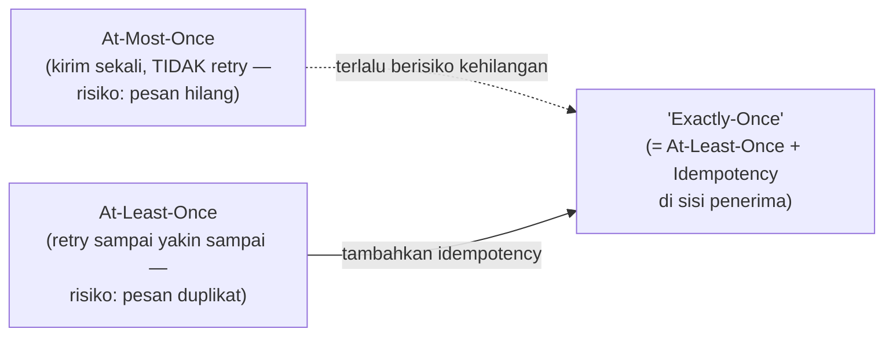

## TL;DR

"Exactly-once delivery" — jaminan bahwa sebuah pesan atau operasi terjadi **tepat satu kali**, tidak kurang tidak lebih, meski jaringan tidak andal — adalah sesuatu yang secara matematis **tidak mungkin dijamin murni di lapisan pengiriman**, karena pengirim tidak pernah bisa 100% yakin apakah pesannya diterima (jaringan bisa memutus konfirmasi meski pesan sudah sampai). Yang benar-benar bisa dicapai, dan yang dipakai praktis di seluruh industri, adalah **at-least-once delivery** (pesan mungkin terkirim lebih dari sekali, tapi dijamin sampai) **dikombinasikan dengan idempotency** di sisi penerima (lihat [[Idempotency Keys]]) — hasilnya **terasa** seperti exactly-once dari sudut pandang efek yang dihasilkan, meski secara teknis pesannya sendiri bisa saja terkirim berkali-kali di baliknya.

## The Problem

Sebuah tim mempromosikan sistem messaging baru dengan klaim "exactly-once delivery" dan berasumsi ini berarti mereka tidak perlu lagi memikirkan duplikasi pesan sama sekali di kode consumer — toh sistemnya sudah menjamin exactly-once. Beberapa bulan kemudian, ditemukan kasus di mana sebuah pesan diproses dua kali: bukan karena sistem messaging-nya "berbohong" soal klaimnya, tapi karena jaminan exactly-once yang diberikan hanya berlaku dalam batasan tertentu (misalnya dalam satu topic Kafka yang sama, dengan konfigurasi transactional producer tertentu) — begitu proses bisnis melibatkan efek samping **di luar** batasan itu (memanggil API eksternal, menulis ke database yang berbeda), jaminan exactly-once dari sistem messaging tidak lagi mencakup efek samping itu.

Akar masalahnya adalah kesalahpahaman tentang apa yang sebenarnya dijamin "exactly-once": jaminan itu, kalaupun ada, biasanya berlaku sempit untuk operasi yang benar-benar berada dalam kendali penuh sistem yang mengklaimnya (transaksi internal Kafka, misalnya) — begitu efek keluar dari batasan itu ke sistem eksternal yang tidak ikut dalam mekanisme transaksi yang sama, jaminan itu berhenti berlaku, dan tim yang percaya "exactly-once berarti saya tidak perlu memikirkan duplikasi lagi" jadi lengah tepat di titik yang paling rawan.

## Intuition

Cara paling mudah memahaminya: coba bayangkan kamu mengirim surat penting lewat kurir, dan kamu ingin tahu apakah surat itu sampai. Satu-satunya cara mengetahuinya adalah menerima **konfirmasi** dari penerima. Tapi bagaimana kalau konfirmasi itu sendiri hilang di jalan (kurir yang membawa konfirmasi kembali mengalami kecelakaan)? Dari sudut pandangmu, kamu tidak bisa membedakan dua kemungkinan: surat itu **tidak pernah sampai** (dan kamu harus kirim ulang), atau surat itu **sampai, tapi konfirmasinya yang hilang** (dan kirim ulang berarti penerima menerima dua surat identik). Tidak ada cara bagi pengirim untuk tahu pasti mana yang terjadi tanpa mekanisme tambahan — satu-satunya pilihan aman adalah **selalu asumsikan mungkin belum sampai** dan kirim ulang (menerima risiko duplikasi), lalu meminta penerima yang menangani kemungkinan duplikat itu (dengan mengenali "saya sudah pernah menerima surat dengan nomor ini sebelumnya").

Analogi ini nyaris sepenuhnya menangkap esensi masalahnya — inilah persis kenapa industri, setelah bertahun-tahun mencoba berbagai pendekatan, berkumpul pada solusi yang sama: terima bahwa pengiriman itu sendiri tidak bisa dijamin persis satu kali, dan pindahkan tanggung jawab "hanya berefek satu kali" ke penerima lewat idempotency, bukan mencoba memaksakan jaminan yang mustahil di lapisan pengiriman.

## How It Works


Tiga semantik dasar pengiriman pesan: **at-most-once** (kirim sekali, tidak pernah retry — kalau gagal, ya sudah hilang; jarang dipakai karena risiko kehilangan data tidak bisa diterima kebanyakan sistem), **at-least-once** (retry sampai yakin diterima — pesan mungkin terkirim berkali-kali, tapi dijamin tidak hilang), dan yang disebut "exactly-once" yang **sebenarnya** adalah at-least-once ditambah lapisan idempotency di penerima — bukan mekanisme pengiriman baru yang secara ajaib menjamin satu kali pasti, melainkan kombinasi dua hal yang sudah ada.

Pemahaman ini penting karena mengubah cara memandang tanggung jawab: alih-alih berharap sistem messaging "menyelesaikan masalah duplikasi untukmu", desain yang benar **selalu** mengasumsikan pesan bisa datang lebih dari sekali, dan menaruh pertahanan (idempotency) di titik pemrosesan — pertahanan yang tetap benar terlepas dari klaim jaminan pengiriman apa pun yang dipakai di baliknya.

## Under The Hood

Beberapa sistem messaging modern (Kafka dengan transactional producer, misalnya) memang menyediakan jaminan yang mendekati exactly-once **dalam batasan spesifik** — biasanya berarti "tidak akan ada duplikasi di dalam topic yang sama, selama seluruh proses hanya melibatkan operasi baca-proses-tulis yang tetap berada dalam ekosistem transaksi sistem itu sendiri". Begitu proses bisnis melangkah keluar dari batasan itu — memanggil API pihak ketiga, menulis ke database eksternal, mengirim email — jaminan itu tidak lagi berlaku, karena sistem messaging tidak punya kendali atau visibilitas atas efek samping eksternal itu. Inilah celah yang menjebak tim di "The Problem": mereka menganggap jaminan yang berlaku sempit sebagai jaminan yang berlaku universal untuk seluruh alur bisnis mereka.

Prinsip yang lebih jujur dan lebih aman dipakai sebagai default desain: **efek samping yang benar-benar penting** (pembayaran, perubahan status resmi) harus selalu dilindungi idempotency di titik prosesnya sendiri, terlepas dari jaminan pengiriman apa pun yang mendasarinya — bukan karena tidak percaya pada sistem messaging yang dipakai, tapi karena batasan jaminan itu jarang benar-benar mencakup keseluruhan alur bisnis nyata yang biasanya melibatkan banyak sistem heterogen.

## In Go

```go
package delivery

import "context"

// AtLeastOnceHandler menunjukkan sikap desain yang BENAR:
// mengasumsikan pesan BISA datang lebih dari sekali, TERLEPAS dari
// klaim jaminan sistem messaging yang dipakai di baliknya.
type AtLeastOnceHandler struct {
	Seen ProcessedStore
}

type ProcessedStore interface {
	AlreadyProcessed(ctx context.Context, messageID string) (bool, error)
	MarkProcessed(ctx context.Context, messageID string) error
}

// Handle TIDAK PERNAH berasumsi "sistem messaging saya menjamin
// exactly-once, jadi saya tidak perlu memeriksa duplikasi" — asumsi
// itu adalah akar masalah di "The Problem".
func (h *AtLeastOnceHandler) Handle(ctx context.Context, messageID string, process func(ctx context.Context) error) error {
	seen, err := h.Seen.AlreadyProcessed(ctx, messageID)
	if err != nil {
		return err
	}
	if seen {
		return nil // SUDAH diproses — lewati, JANGAN ulangi efek samping
	}

	if err := process(ctx); err != nil {
		return err
	}

	return h.Seen.MarkProcessed(ctx, messageID)
}
```

## In His Stack

Untuk integrasi lintas 13 aplikasi lewat Kafka atau messaging sistem lain, klaim "exactly-once" dari dokumentasi tool yang dipakai (lihat [[../92 Tools/Kafka|Kafka]]) sebaiknya selalu dibaca dengan cermat batasannya — apakah jaminan itu berlaku untuk keseluruhan alur bisnis lintas beberapa dari 13 aplikasi (kemungkinan besar tidak), atau hanya untuk operasi internal dalam satu topic (kemungkinan besar iya). Desain yang aman selalu menambahkan idempotency eksplisit (idempotency key atau idempotent consumer, lihat [[../30 APIs and Web/Idempotent Consumers|Idempotent Consumers]]) di setiap titik efek samping penting, tidak peduli klaim jaminan apa yang dipasarkan tool messaging yang dipakai.

## Trade-offs and When Not To Use It

Menambahkan idempotency di setiap titik pemrosesan pesan menambah kompleksitas dan sedikit overhead (penyimpanan tambahan untuk melacak pesan yang sudah diproses) — untuk operasi yang benar-benar tidak berdampak apa pun kalau diproses berkali-kali (log murni untuk keperluan observability, tanpa efek samping nyata), investasi idempotency eksplisit mungkin tidak sepadan. Tapi untuk **apa pun** yang mengubah state penting (transaksi, status resmi, notifikasi yang dilihat manusia), idempotency selalu sepadan diterapkan — biaya menambahkannya jauh lebih kecil dibanding biaya insiden duplikasi yang baru ditemukan setelah terjadi di production.

## Common Mistakes

> [!warning] Jebakan
> Percaya klaim "exactly-once delivery" dari dokumentasi tool tanpa membaca batasan spesifiknya — jaminan itu hampir selalu berlaku sempit (dalam ekosistem tool itu sendiri), tidak mencakup efek samping yang keluar ke sistem eksternal.

> [!warning] Jebakan
> Menghilangkan pemeriksaan idempotency di kode consumer karena "sistem messaging saya sudah menjamin exactly-once" — meninggalkan celah tepat di titik yang paling rawan, karena jaminan itu jarang benar-benar mencakup keseluruhan alur bisnis nyata.

> [!warning] Jebakan
> Menganggap at-most-once (kirim sekali, tidak pernah retry) sebagai jalan pintas menghindari duplikasi — mengorbankan jaminan yang jauh lebih penting (pesan tidak hilang) demi menghindari masalah yang sebenarnya lebih mudah diselesaikan lewat idempotency.

## Exercises

1. Jelaskan kenapa exactly-once delivery secara matematis tidak bisa dijamin murni di lapisan pengiriman.
2. Apa yang sebenarnya dimaksud dengan "exactly-once" yang dipasarkan banyak sistem messaging modern?
3. Kenapa klaim exactly-once dari sebuah tool sering tidak mencakup keseluruhan alur bisnis yang melibatkan banyak sistem?
4. Desain terbuka: kamu memakai Kafka dengan transactional producer yang diklaim "exactly-once" untuk alur di mana pesan dari Aplikasi A memicu Aplikasi B mengirim email notifikasi resmi ke pengguna. Jelaskan di mana tepatnya jaminan exactly-once dari Kafka berhenti berlaku dalam alur ini, dan bagaimana kamu memastikan email tidak terkirim dua kali.

> [!success]- Kunci jawaban
> **1.** Pengirim tidak pernah bisa membedakan dua kemungkinan dari ketiadaan konfirmasi: pesan gagal terkirim sama sekali, atau pesan terkirim tapi konfirmasinya yang hilang di jalan. Tanpa cara membedakan keduanya, satu-satunya pilihan aman adalah retry (menerima risiko duplikasi) — menjamin "pasti tepat satu kali" secara matematis butuh kepastian yang tidak bisa didapat dari jaringan yang tidak andal.
> **4.** Jaminan exactly-once dari Kafka (transactional producer) berlaku untuk operasi internal Kafka itu sendiri — memastikan sebuah pesan tidak terduplikasi **di dalam topic Kafka** dan proses baca-tulis yang murni terjadi dalam ekosistem transaksi Kafka. Begitu Aplikasi B menerima pesan itu dan memicu efek samping **eksternal** (mengirim email lewat service pihak ketiga), efek itu berada **di luar** cakupan jaminan Kafka — Kafka tidak tahu dan tidak peduli apakah email itu berhasil terkirim atau tidak, dan kalau Aplikasi B sendiri crash setelah mengirim email tapi sebelum sempat men-commit offset pesan yang diproses, pesan yang sama akan diproses ulang saat Aplikasi B pulih (perilaku at-least-once yang normal), berpotensi mengirim email dua kali. Solusinya: Aplikasi B menyimpan penanda "email untuk notifikasi X sudah terkirim" sebelum atau sesudah pengiriman (dengan mekanisme atomik yang mencegah race condition), dan memeriksa penanda itu sebelum mengirim ulang — persis pola idempotent consumer, diterapkan khusus di titik efek samping eksternal yang tidak tercakup jaminan Kafka.

## Self-Check

- Kenapa exactly-once delivery secara matematis tidak bisa dijamin murni?
- Apa yang sebenarnya dimaksud "exactly-once" yang dipasarkan banyak tool messaging?
- Kenapa jaminan itu sering tidak mencakup efek samping eksternal?
- Apa yang seharusnya selalu ditambahkan di titik efek samping penting, terlepas dari klaim jaminan pengiriman?

## Connected Notes

- [[Idempotency Keys]] — mekanisme praktis yang membuat "exactly-once" terasa tercapai dari sudut pandang efek, dibahas mendalam di note sebelumnya.
- [[../30 APIs and Web/Delivery Semantics|Delivery Semantics]] — note ini memperdalam ketiga semantik dasar (at-most-once, at-least-once, exactly-once) yang diperkenalkan lebih awal di domain APIs.
- [[../30 APIs and Web/Idempotent Consumers|Idempotent Consumers]] — penerapan konkret prinsip di note ini pada konteks konsumsi pesan asinkron.
- [[Two-Phase Commit and Why It Is Avoided]] — 2PC adalah salah satu usaha historis mencapai jaminan ketat serupa exactly-once lintas sistem, dan menghadapi masalah fundamental yang serupa.
- [[../92 Tools/Kafka|Kafka]] — tool konkret yang menyediakan jaminan mendekati exactly-once dalam batasan tertentu, dibahas lebih dalam sebagai tool note.

## Further Reading

- Dokumentasi resmi Apache Kafka bagian "Exactly Once Semantics" — menjelaskan secara eksplisit batasan jaminan yang diberikan, sumber kebenaran yang lebih baik dibanding klaim marketing umum.

## Catatan Saya

*Tulis di sini apakah ada bagian dari 13 aplikasimu yang mengandalkan klaim "exactly-once" dari sebuah tool tanpa memverifikasi batasannya, dan efek samping apa yang berisiko terduplikasi kalau asumsi itu ternyata tidak berlaku sepenuhnya.*
