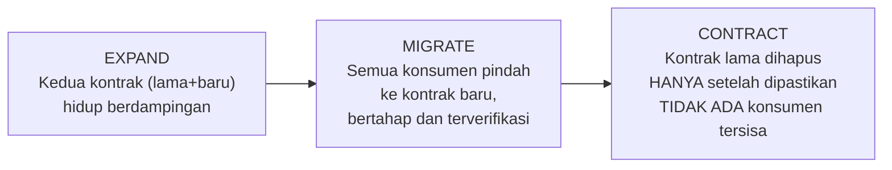

## TL;DR

[[../70 Infrastructure and Delivery/Zero-Downtime Database Migrations|Zero-Downtime Database Migrations]] menerapkan pola expand-contract secara spesifik pada **skema kolom database**. Note ini mengangkat pola yang sama satu level lebih abstrak: expand-contract adalah **strategi umum** mengubah kontrak apa pun — skema database, API, format pesan antar service — lewat tahapan yang **masing-masing aman untuk di-rollback secara independen**, bukan lewat satu perubahan besar yang hanya punya dua keadaan (lama sepenuhnya, atau baru sepenuhnya). Prinsip yang sama ini muncul berulang di banyak konteks berbeda dalam sistem terdistribusi — begitu kamu mengenali polanya di satu tempat, kamu mulai melihatnya di mana-mana.

## The Problem

Sebuah tim ingin mengubah kontrak API antara dua dari 13 aplikasi — field `nama` yang dulunya satu string ingin dipecah jadi `nama_depan` dan `nama_belakang`, konsisten dengan perubahan skema database yang direncanakan. Pendekatan naif: ubah API dan database bersamaan, deploy kedua aplikasi (pengirim dan penerima) di waktu yang sama persis. Masalahnya, "waktu yang sama persis" tidak pernah benar-benar ada di sistem terdistribusi — rolling deployment, perbedaan waktu deploy antar tim, atau sekadar keterlambatan beberapa detik menciptakan jendela waktu di mana satu sisi sudah memakai kontrak baru sementara sisi lain masih memakai kontrak lama, persis masalah kompatibilitas mundur yang sudah dibahas untuk kasus database di [[../70 Infrastructure and Delivery/Zero-Downtime Database Migrations|Zero-Downtime Database Migrations]] — tapi sekarang terjadi **lintas dua aplikasi berbeda**, bukan hanya lintas beberapa Pod dalam satu rolling update.

Kegagalan di titik ini lebih sulit dipulihkan dibanding kegagalan migrasi database dalam satu aplikasi — begitu Aplikasi A sudah mengirim payload format baru dan Aplikasi B belum siap menerimanya, rollback tidak sesederhana mengembalikan satu deployment; kedua tim harus berkoordinasi ulang, dan selama itu terjadi, request nyata dari pengguna bisa gagal atau (lebih buruk) diproses salah.

## Intuition

Cara paling mudah memahaminya: expand-contract sebagai pola umum seperti **membangun jembatan pengganti tanpa pernah menutup jalan lama sampai jembatan baru benar-benar siap dan teruji**. Ini persis analogi yang sama dipakai untuk migrasi database — tapi sekarang bayangkan jembatan itu menghubungkan **dua kota** (dua service) yang masing-masing punya otoritas sendiri, bukan satu proyek konstruksi yang dikendalikan satu tim. Kedua kota harus **sepakat** kapan jembatan lama boleh ditutup, karena kalau salah satu kota menutup jalannya lebih dulu tanpa memberi tahu kota lain, orang-orang yang masih memakai jalan lama itu (permintaan yang masih memakai kontrak lama) terjebak di tengah jalan.

Analogi ini bocor pada soal siapa yang mengontrol kapan fase berpindah. Dalam satu proyek konstruksi tunggal, satu otoritas memutuskan kapan aman berpindah dari expand ke contract. Lintas service yang dikelola tim berbeda, keputusan "sekarang aman untuk contract" butuh **koordinasi eksplisit** antar tim — tidak bisa diasumsikan satu pihak tahu kapan pihak lain sudah siap, harus dikomunikasikan dan diverifikasi bersama.

## How It Works


Pola tiga tahap ini berlaku identik apa pun jenis kontraknya: **Expand** — tambahkan struktur baru tanpa menghapus yang lama (kolom baru di database, field opsional baru di payload API, versi baru pesan di message queue). **Migrate** — konsumen (aplikasi, service, klien) berpindah ke struktur baru satu per satu, dengan verifikasi di setiap langkah bahwa kontrak lama masih tersedia sebagai jaring pengaman kalau terjadi masalah. **Contract** — hapus struktur lama, tapi **hanya setelah** dipastikan (lewat monitoring atau bukti eksplisit) tidak ada lagi konsumen yang bergantung padanya.

Untuk kasus API lintas aplikasi di "The Problem", polanya menjadi: (1) Aplikasi B (penerima) di-deploy lebih dulu, siap menerima **kedua** format (`nama` lama dan `nama_depan`/`nama_belakang` baru); (2) Aplikasi A (pengirim) di-deploy mengirim **kedua** field sekaligus untuk sementara (transisi, mirip dual-write); (3) setelah dipastikan Aplikasi B benar-benar memproses field baru dengan benar, Aplikasi A berhenti mengirim field lama; (4) setelah periode observasi tanpa masalah, Aplikasi B berhenti menerima/memproses field lama sama sekali.

## Under The Hood

Urutan deploy yang **penerima duluan, pengirim belakangan** bukan kebetulan — ini prinsip yang berlaku universal untuk expand-contract lintas service: sisi yang **menerima** data harus selalu siap menangani format baru **sebelum** sisi yang **mengirim** mulai mengirimkannya, karena kalau urutannya terbalik (pengirim mulai mengirim format baru sebelum penerima siap), ada jendela waktu di mana penerima menerima data yang tidak ia pahami. Prinsip yang sama, dengan arah terbalik, berlaku untuk fase contract: sisi **pengirim** harus berhenti mengirim format lama **sebelum** sisi **penerima** berhenti mendukungnya — kalau urutannya terbalik, penerima yang sudah berhenti mendukung format lama akan gagal memproses pengirim yang masih mengirimkannya.

Verifikasi eksplisit bahwa tidak ada konsumen tersisa sebelum fase contract adalah langkah yang paling sering dilewatkan dalam praktik — untuk sistem dengan konsumen yang diketahui dan sedikit (dua aplikasi internal), verifikasi ini relatif mudah lewat koordinasi langsung antar tim. Untuk sistem dengan banyak konsumen yang tidak semuanya diketahui pasti (API publik, event yang mungkin dikonsumsi service yang belum terdaftar), verifikasi ini butuh mekanisme lebih formal — memantau penggunaan field lama lewat metrik, mengumumkan periode deprecation dengan tenggat jelas (lihat [[../90 Architecture and Design/API Governance|API Governance]]), bukan mengasumsikan "sudah cukup lama, pasti aman dihapus".

## In Go

```go
package expandcontract

import "encoding/json"

// PayloadV2 mendukung KEDUA field selama masa transisi — inilah
// yang membuat sisi PENERIMA aman menerima pengirim lama MAUPUN baru.
type PayloadV2 struct {
	// Field LAMA, dipertahankan selama masa transisi
	Nama string `json:"nama,omitempty"`

	// Field BARU
	NamaDepan   string `json:"nama_depan,omitempty"`
	NamaBelakang string `json:"nama_belakang,omitempty"`
}

// Normalize menunjukkan sisi PENERIMA yang menangani KEDUA bentuk
// secara eksplisit — tidak berasumsi hanya satu bentuk yang mungkin
// datang selama masa transisi masih berlangsung.
func (p PayloadV2) Normalize() (namaDepan, namaBelakang string) {
	if p.NamaDepan != "" || p.NamaBelakang != "" {
		return p.NamaDepan, p.NamaBelakang // sudah format BARU
	}
	// FALLBACK ke format LAMA — jaring pengaman selama transisi
	return splitLegacyNama(p.Nama)
}

func splitLegacyNama(nama string) (depan, belakang string) {
	// heuristik sederhana untuk memisah string lama
	return nama, ""
}

// SenderDualWrite menunjukkan sisi PENGIRIM yang mengirim KEDUA
// field selama masa transisi — memberi penerima yang belum ter-deploy
// versi terbarunya kesempatan tetap berfungsi dengan field lama.
func BuildTransitionPayload(namaDepan, namaBelakang string) json.RawMessage {
	payload := PayloadV2{
		Nama:         namaDepan + " " + namaBelakang, // field LAMA tetap terisi
		NamaDepan:    namaDepan,
		NamaBelakang: namaBelakang,
	}
	b, _ := json.Marshal(payload)
	return b
}
```

## In His Stack

Untuk 13 aplikasi yang saling memanggil, setiap perubahan kontrak lintas aplikasi — bukan hanya perubahan skema database dalam satu aplikasi — sebaiknya mengikuti disiplin expand-contract yang sama, dengan koordinasi eksplisit antar tim tentang urutan deploy (penerima duluan) dan kapan aman melangkah ke fase contract. Ini terhubung langsung ke kebutuhan [[../90 Architecture and Design/API Governance|API Governance]]: proses formal mengumumkan perubahan kontrak dan periode deprecation adalah cara memastikan seluruh konsumen (yang mungkin tidak semuanya diketahui koordinator teknis secara personal) punya waktu bermigrasi sebelum fase contract benar-benar dijalankan.

## Trade-offs and When Not To Use It

Expand-contract lintas service butuh koordinasi antar tim yang menambah waktu dan overhead komunikasi dibanding perubahan yang seluruhnya dikendalikan satu tim — untuk perubahan kontrak yang benar-benar internal dan tidak pernah keluar dari satu service (struktur data yang murni implementasi internal), pola sesederhana migrasi database biasa (tanpa perlu koordinasi lintas tim) sudah cukup. Expand-contract lintas service jelas dibutuhkan begitu perubahan kontrak melibatkan lebih dari satu pihak yang tidak bisa di-deploy dalam satu operasi atomik yang sama — situasi yang jadi kenyataan sehari-hari begitu sistem terdiri dari banyak service independen seperti 13 aplikasi.

## Common Mistakes

> [!warning] Jebakan
> Mengubah kontrak dan men-deploy kedua sisi (pengirim dan penerima) secara "bersamaan", berasumsi keduanya benar-benar tersinkron sempurna — di sistem terdistribusi, "bersamaan" nyaris tidak pernah benar-benar terjadi, selalu ada jendela waktu ketidaksesuaian yang harus ditangani eksplisit.

> [!warning] Jebakan
> Men-deploy sisi pengirim (mulai mengirim format baru) sebelum sisi penerima siap menerimanya — urutan yang terbalik dari yang seharusnya, menciptakan jendela di mana penerima menerima data yang tidak ia pahami.

> [!warning] Jebakan
> Melangkah ke fase contract (menghapus dukungan format lama) tanpa verifikasi eksplisit bahwa tidak ada konsumen yang masih bergantung padanya — terutama berbahaya untuk sistem dengan konsumen yang tidak semuanya diketahui pasti oleh tim yang melakukan perubahan.

## Exercises

1. Jelaskan kenapa pola expand-contract berlaku sama untuk perubahan skema database, API, dan format pesan, meski konteksnya berbeda.
2. Kenapa urutan deploy "penerima duluan, pengirim belakangan" penting di fase expand, dan kenapa urutannya terbalik di fase contract?
3. Kenapa verifikasi eksplisit sebelum fase contract lebih sulit untuk sistem dengan banyak konsumen yang tidak semuanya diketahui, dibanding sistem dengan sedikit konsumen internal?
4. Desain terbuka: kamu perlu mengubah format pesan yang dikirim Aplikasi A ke sistem antrean yang dikonsumsi oleh Aplikasi B, C, dan D sekaligus (tiga konsumen berbeda, dikelola tim berbeda-beda). Rancang rencana expand-contract lengkap untuk perubahan ini, termasuk bagaimana kamu mengoordinasikan tiga tim penerima yang berbeda.

> [!success]- Kunci jawaban
> **1.** Ketiganya sama-sama menghadapi masalah inti yang identik: mengubah sebuah kontrak yang **dipakai lebih dari satu pihak** yang tidak bisa berubah secara benar-benar atomik bersamaan — baik itu Pod lama dan baru dalam rolling update (database), atau aplikasi pengirim dan penerima (API/pesan). Solusinya sama: pertahankan kompatibilitas mundur selama masa transisi, jangan pernah memaksa perubahan sekaligus tanpa jendela toleransi.
> **4.** (1) **Expand**: Aplikasi A mulai mengirim pesan dengan **kedua** format (lama dan baru) sekaligus, tanpa menghapus format lama; (2) koordinasikan dengan tim B, C, dan D — masing-masing men-deploy perubahan untuk mendukung format baru **di waktu yang mereka pilih sendiri** (tidak harus bersamaan satu sama lain), karena mereka semua tetap menerima format lama yang masih dikirim; (3) setiap tim mengonfirmasi eksplisit (lewat metrik atau laporan langsung) begitu mereka sudah sepenuhnya berpindah memproses format baru; (4) **Migrate** selesai begitu **ketiga** tim (B, C, dan D) sudah mengonfirmasi siap sepenuhnya — ini mensyaratkan tim paling lambat menentukan kapan proses ini selesai, bukan tim tercepat; (5) **Contract**: Aplikasi A baru berhenti mengirim format lama setelah ketiga konfirmasi diterima, bukan berdasarkan asumsi atau tenggat waktu sepihak yang tidak diverifikasi ke semua pihak yang terlibat.

## Self-Check

- Kenapa expand-contract berlaku sama untuk database, API, dan format pesan?
- Kenapa urutan deploy penting berbeda di fase expand dan contract?
- Kenapa verifikasi sebelum contract lebih sulit untuk banyak konsumen yang tidak semua diketahui?
- Apa risiko men-deploy pengirim dan penerima "bersamaan" tanpa toleransi transisi?

## Connected Notes

- [[../70 Infrastructure and Delivery/Zero-Downtime Database Migrations|Zero-Downtime Database Migrations]] — note ini mengangkat pola yang sama satu level lebih abstrak, berlaku untuk kontrak apa pun, tidak hanya skema database.
- [[../90 Architecture and Design/API Governance|API Governance]] — proses formal deprecation dan periode transisi adalah mekanisme organisasi yang membuat fase contract aman dijalankan untuk konsumen yang tidak semua diketahui.
- [[Event Schema Evolution]] — evolusi skema event mengikuti prinsip expand-contract yang sama, diterapkan khusus pada event yang tersimpan permanen di event store.
- [[The Strangler Fig Pattern]] — kelanjutan langsung: pola migrasi bertahap skala lebih besar yang berbagi filosofi "jangan pernah big-bang, selalu bertahap dan bisa dibatalkan" yang sama dengan expand-contract.
- [[Dual Writes and Their Dangers]] — teknik dual-write yang muncul di fase expand punya risiko tersendiri yang dibahas mendalam di note lain klaster ini.

## Further Reading

- Materi umum industri mengenai expand-contract pattern dalam konteks API dan schema evolution, dipopulerkan luas lewat praktik continuous delivery dan microservices.

## Catatan Saya

*Tulis di sini perubahan kontrak lintas beberapa dari 13 aplikasimu yang paling sulit dikoordinasikan, dan apakah expand-contract sudah (atau bisa) diterapkan untuk mengurangi risikonya.*
