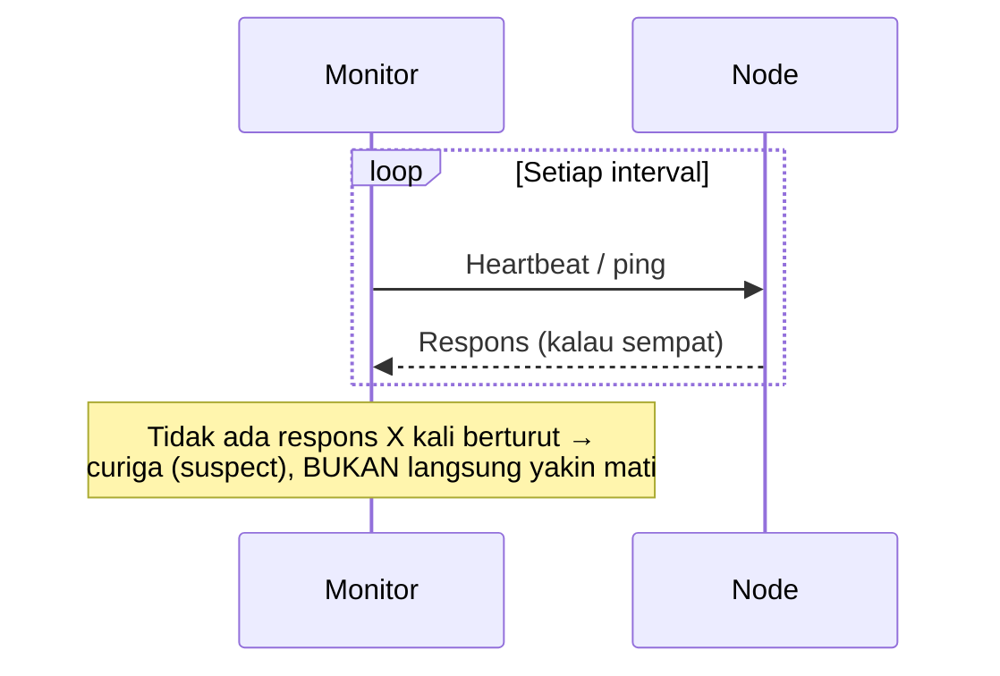

## TL;DR

Dalam sistem terdistribusi, satu node tidak pernah bisa **benar-benar yakin** node lain sudah mati — ia hanya bisa mengamati bahwa node itu berhenti merespons, dan "berhenti merespons" punya banyak kemungkinan penyebab: node itu benar-benar mati, node itu hidup tapi jaringan di antaranya terputus, atau node itu hidup dan jaringan baik-baik saja tapi sedang terlalu sibuk untuk merespons tepat waktu. Failure detector adalah mekanisme yang membuat **tebakan berdasar** tentang status node lain — dan secara teoretis (dibuktikan oleh hasil FLP impossibility), tidak ada failure detector yang bisa 100% akurat dan 100% cepat sekaligus dalam sistem asinkron murni. Failure detector praktis selalu memilih titik keseimbangan antara kecepatan deteksi dan risiko salah menganggap node hidup sebagai mati (atau sebaliknya).

## The Problem

Sebuah cluster database menjalankan mekanisme deteksi kegagalan: kalau sebuah node tidak merespons heartbeat dalam 5 detik, node itu dianggap mati dan perannya dialihkan ke node lain. Suatu malam, salah satu node mengalami garbage collection pause yang panjang (beban memori tinggi memicu GC yang memakan waktu 7 detik) — node itu sebenarnya sepenuhnya hidup dan sehat, hanya sedang "membeku" sesaat karena proses internal, bukan karena mati atau jaringan terputus.

Sistem, yang tidak bisa membedakan "benar-benar mati" dari "hidup tapi lambat merespons", menganggap node itu mati setelah 5 detik berlalu tanpa respons, dan mengalihkan perannya ke node lain. Begitu node yang "dianggap mati" itu pulih dari GC pause dan kembali merespons, ia tidak tahu perannya sudah dialihkan — dan untuk sesaat, dua node sama-sama menganggap diri mereka pemegang peran yang sama, situasi yang persis dibahas di [[Leader Election and Split Brain]]. Akar masalahnya bukan bug di failure detector — ini adalah keterbatasan fundamental yang tidak bisa dihindari sepenuhnya, hanya bisa dikurangi risikonya lewat desain yang lebih hati-hati.

## Intuition

Cara paling mudah memahaminya: mendeteksi kegagalan node seperti **mencoba tahu apakah teman yang tidak membalas pesan sudah tertidur, sedang sibuk, atau ponselnya mati**. Kamu hanya punya satu sinyal — tidak ada balasan — dan sinyal itu **sama persis** untuk ketiga kemungkinan itu. Menunggu lebih lama sebelum menyimpulkan "dia sedang tidak bisa dihubungi" mengurangi risiko salah sangka (mungkin ia hanya butuh waktu lebih lama membalas), tapi juga berarti kamu lebih lambat menyadari kalau memang ada masalah serius.

Analogi ini bocor pada soal konsekuensi kesalahan. Salah sangka tentang teman biasanya tidak berakibat serius. Salah sangka failure detector di sistem produksi — menganggap node hidup padahal mati (data tidak terlindungi karena replika yang dikira ada ternyata tidak), atau menganggap node mati padahal hidup (persis "The Problem", memicu split brain) — punya konsekuensi nyata pada integritas dan ketersediaan sistem.

## How It Works


Failure detector modern yang matang tidak langsung membuat keputusan biner "hidup/mati" dari satu kegagalan respons — ia biasanya punya status antara: **suspect** (dicurigai mati, tapi belum dipastikan) sebelum benar-benar dinyatakan mati, memberi jendela waktu untuk node yang hanya lambat sesaat (seperti GC pause di "The Problem") untuk kembali merespons sebelum konsekuensi permanen (seperti pengalihan peran) benar-benar dijalankan.

Ada dua pendekatan dasar: **heartbeat** (node yang dipantau aktif mengirim sinyal "saya hidup" secara berkala — ketiadaan sinyal berarti dicurigai mati) dan **ping/pull** (monitor aktif bertanya "apakah kamu hidup?" — mirip model pull di [[../70 Infrastructure and Delivery/Pull vs Push Metrics Collection|Pull vs Push Metrics Collection]], hanya untuk tujuan deteksi kegagalan, bukan pengumpulan metrik).

## Under The Hood

Hasil teoretis penting yang mendasari batasan ini adalah **FLP impossibility** (dibuktikan Fischer, Lynch, dan Paterson pada 1985): dalam sistem asinkron murni (di mana tidak ada batas atas pasti untuk waktu tempuh pesan), **tidak mungkin** ada algoritma consensus yang menjamin selalu benar **dan** selalu berakhir (terminating) dalam waktu terbatas, sekalipun hanya satu node yang mungkin gagal. Implikasinya untuk failure detector: dalam sistem asinkron murni, secara matematis tidak mungkin membedakan "node yang sangat lambat" dari "node yang mati" dengan akurasi sempurna — satu-satunya jalan keluar adalah menambahkan asumsi tambahan (batas waktu maksimum yang "cukup masuk akal" meski tidak dijamin, seperti kebanyakan sistem praktis lakukan) yang mengorbankan jaminan matematis sempurna demi kepraktisan.

Failure detector diklasifikasikan berdasarkan dua properti: **completeness** (seberapa yakin node yang benar-benar mati akhirnya terdeteksi) dan **accuracy** (seberapa yakin node yang terdeteksi mati memang benar-benar mati, bukan false positive). Sistem praktis hampir selalu memilih **eventually accurate** — boleh salah sesaat (seperti "The Problem"), tapi pada akhirnya akan benar setelah cukup waktu berlalu — karena mengejar akurasi sempurna seketika terbukti mustahil oleh FLP impossibility.

## In Go

```go
package failuredetector

import (
	"sync"
	"time"
)

// Status memberi ruang untuk "belum pasti" — TIDAK langsung
// biner hidup/mati, mengurangi risiko keputusan drastis dari
// kegagalan respons sesaat seperti GC pause.
type Status int

const (
	Alive Status = iota
	Suspected
	Dead
)

type PhiAccrual struct {
	mu            sync.Mutex
	lastHeartbeat time.Time
	suspectAfter  time.Duration
	deadAfter     time.Duration
}

func (p *PhiAccrual) RecordHeartbeat() {
	p.mu.Lock()
	defer p.mu.Unlock()
	p.lastHeartbeat = time.Now()
}

// CurrentStatus TIDAK langsung menyimpulkan "mati" dari SATU
// heartbeat yang terlewat — ada jendela "suspected" yang memberi
// kesempatan node yang hanya lambat sesaat untuk pulih.
func (p *PhiAccrual) CurrentStatus() Status {
	p.mu.Lock()
	defer p.mu.Unlock()

	elapsed := time.Since(p.lastHeartbeat)
	switch {
	case elapsed < p.suspectAfter:
		return Alive
	case elapsed < p.deadAfter:
		return Suspected
	default:
		return Dead
	}
}
```

## In His Stack

Untuk service yang berjalan di Kubernetes, liveness dan readiness probe (lihat [[../70 Infrastructure and Delivery/Kubernetes Config, Secrets, Probes, and Autoscaling|Kubernetes Config, Secrets, Probes, and Autoscaling]]) sebenarnya adalah implementasi failure detector sederhana — dan keterbatasan yang sama berlaku: Pod yang lambat merespons karena beban tinggi bisa salah terdeteksi "tidak sehat" dan di-restart, padahal ia sebenarnya hanya butuh waktu lebih lama, bukan benar-benar rusak. Memahami trade-off failure detector membantu mengatur threshold probe (`failureThreshold`, `periodSeconds`) dengan lebih sadar, bukan sekadar nilai default yang mungkin terlalu sensitif atau terlalu longgar untuk karakteristik beban aplikasi tertentu.

## Trade-offs and When Not To Use It

Failure detector yang sangat cepat mendeteksi kegagalan (threshold pendek) berisiko tinggi false positive — menganggap node mati padahal hanya lambat sesaat, memicu aksi pemulihan yang sebenarnya tidak perlu (dan bisa memperburuk keadaan lewat split brain seperti "The Problem"). Failure detector yang lambat (threshold panjang) lebih akurat tapi berarti sistem lebih lama "tidak sadar" ada node yang benar-benar mati, memperlama waktu pemulihan nyata. Tidak ada threshold yang benar secara universal — pilihannya bergantung konsekuensi masing-masing jenis kesalahan untuk sistem spesifik: sistem yang konsekuensi split brain-nya mahal (data ganda, keputusan konflik) sebaiknya condong ke threshold lebih panjang; sistem yang konsekuensi downtime-nya mahal condong ke threshold lebih pendek.

## Common Mistakes

> [!warning] Jebakan
> Mengasumsikan failure detector bisa 100% akurat dengan menyetel threshold yang "cukup pendek" — batasan FLP impossibility berarti tidak ada threshold yang menghilangkan trade-off ini sepenuhnya, hanya menggeser keseimbangan antara kecepatan dan akurasi.

> [!warning] Jebakan
> Langsung mengambil aksi permanen (pengalihan peran, penghapusan node dari cluster) begitu satu kegagalan respons terdeteksi, tanpa status "suspected" sebagai jendela toleransi — meningkatkan risiko false positive dari gangguan sesaat seperti GC pause atau lonjakan latency jaringan singkat.

> [!warning] Jebakan
> Memakai threshold yang sama untuk semua jenis node/service tanpa mempertimbangkan karakteristik beban masing-masing — node yang secara normal mengalami pause lebih panjang (misalnya proses dengan garbage collector yang agresif) butuh threshold berbeda dari node yang responsnya konsisten cepat.

## Exercises

1. Jelaskan kenapa satu node tidak pernah bisa benar-benar yakin node lain sudah mati, hanya bisa membuat tebakan berdasar.
2. Apa itu FLP impossibility, dan implikasinya untuk desain failure detector praktis?
3. Kenapa status "suspected" (bukan langsung "dead") mengurangi risiko konsekuensi dari false positive?
4. Desain terbuka: kamu mengelola cluster tiga node untuk salah satu dari 13 aplikasi, dan pernah mengalami insiden split brain akibat satu node yang salah terdeteksi mati karena lonjakan CPU sesaat (bukan benar-benar mati). Rancang perbaikan failure detector untuk cluster ini yang mengurangi risiko kejadian serupa, dengan mempertimbangkan trade-off kecepatan deteksi vs akurasi.

> [!success]- Kunci jawaban
> **1.** Satu node hanya bisa mengamati "tidak ada respons" — sinyal ini identik untuk beberapa kemungkinan penyebab berbeda (node mati, jaringan terputus, node hidup tapi sibuk/lambat) yang tidak bisa dibedakan hanya dari ketiadaan respons semata, tanpa informasi tambahan.
> **4.** (1) Tambahkan status "suspected" dengan jendela waktu yang cukup untuk mengakomodasi lonjakan CPU sesaat berdasarkan data historis (misalnya kalau lonjakan CPU yang pernah terjadi biasanya pulih dalam 3-4 detik, beri jendela suspected setidaknya 2x itu sebelum dianggap benar-benar mati); (2) sebelum benar-benar mengalihkan peran node yang dicurigai mati, verifikasi lewat lebih dari satu node lain (bukan satu monitor tunggal) untuk mengurangi risiko satu monitor yang kebetulan mengalami masalah jaringan sesaat salah menyimpulkan; (3) begitu node yang sempat dicurigai mati pulih dan kembali merespons, pastikan ada mekanisme eksplisit (bukan asumsi implisit) yang membuatnya tahu apakah perannya sudah dialihkan atau belum, mencegah dua node sama-sama menganggap diri mereka pemegang peran yang sama; (4) evaluasi apakah threshold saat ini terlalu ketat dibanding karakteristik beban nyata cluster ini, dan sesuaikan berdasarkan data riwayat lonjakan CPU yang wajar terjadi, bukan angka tebakan.

## Self-Check

- Kenapa satu node tidak pernah bisa 100% yakin node lain sudah mati?
- Apa itu FLP impossibility?
- Kenapa status "suspected" mengurangi risiko dari false positive?
- Apa dua properti yang dipakai mengklasifikasikan failure detector?

## Connected Notes

- [[Time and Ordering - Lamport and Vector Clocks]] — kesulitan mengurutkan kejadian tanpa jam yang sinkron berbagi akar masalah yang sama dengan kesulitan mendeteksi kegagalan node.
- [[Leader Election and Split Brain]] — kelanjutan langsung: false positive pada failure detector adalah salah satu penyebab paling umum split brain.
- [[../70 Infrastructure and Delivery/Kubernetes Config, Secrets, Probes, and Autoscaling|Kubernetes Config, Secrets, Probes, and Autoscaling]] — liveness/readiness probe adalah implementasi failure detector praktis yang sudah dipakai sehari-hari di Kubernetes.
- [[Quorums]] — kelanjutan langsung: mekanisme yang membuat keputusan tetap bisa diambil secara aman meski status node individual tidak pernah 100% pasti.
- [[Consensus - Raft]] — algoritma consensus seperti Raft membangun failure detector (lewat timeout leader election) sebagai komponen intinya.

## Further Reading

- Michael J. Fischer, Nancy A. Lynch, Michael S. Paterson, "Impossibility of Distributed Consensus with One Faulty Process" (1985) — paper asli FLP impossibility, salah satu hasil teoretis paling fundamental di distributed systems, sangat relevan untuk ambisi studi master.
- Naohiro Hayashibara dkk., "The φ Accrual Failure Detector" (2004) — pendekatan failure detector probabilistik yang lebih canggih dari threshold tetap sederhana.

## Catatan Saya

*Tulis di sini insiden di pekerjaanmu yang mungkin disebabkan node atau service yang salah terdeteksi "mati" padahal hanya lambat sesaat.*
