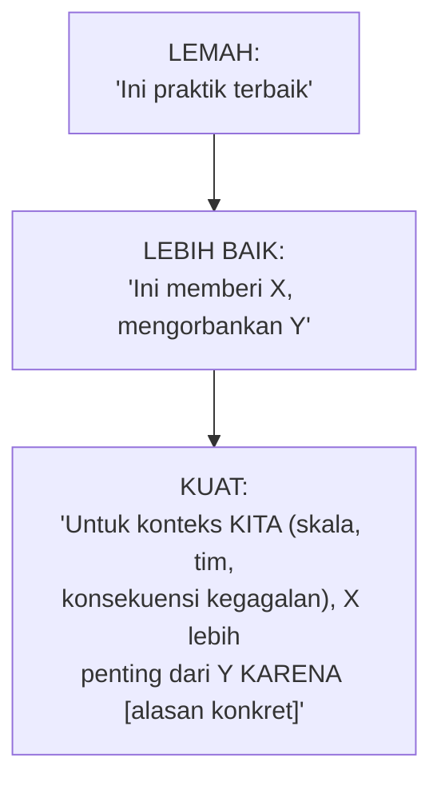

## TL;DR

Setiap keputusan arsitektural non-trivial adalah trade-off — memilih sesuatu berarti mengorbankan sesuatu yang lain. Insinyur junior sering mencari "jawaban yang benar"; insinyur senior tahu bahwa pertanyaan yang lebih berguna adalah "trade-off mana yang paling sesuai untuk konteks ini, dan bisakah aku menjelaskan alasannya dengan meyakinkan ke orang yang tidak setuju?" Forming a trade-off berarti secara sadar mengidentifikasi apa yang didapat dan apa yang dikorbankan dari sebuah pilihan. Defending it berarti mampu mengartikulasikan alasan itu dengan cukup jelas dan jujur sehingga orang lain — termasuk yang skeptis — bisa memahami (meski tidak selalu setuju) kenapa pilihan itu masuk akal untuk situasi spesifik ini.

## The Problem

Dalam rapat desain, seorang engineer mengusulkan memakai message queue untuk memisahkan dua service yang saat ini berkomunikasi sinkron lewat panggilan HTTP langsung. Ketika ditanya "kenapa message queue, bukan tetap sinkron saja?", jawabannya adalah "karena itu praktik terbaik untuk microservices" — jawaban yang terdengar meyakinkan tapi sebenarnya tidak menjelaskan apa pun tentang konteks spesifik sistem ini. Rapat berlanjut tanpa keputusan jelas, karena tidak ada yang benar-benar tahu apakah trade-off ini (latency tambahan, kompleksitas operasional message queue, eventual consistency) benar-benar sepadan dengan manfaat yang diklaim (decoupling, resiliensi) untuk kebutuhan spesifik kedua service ini.

Masalahnya bukan usulan message queue itu sendiri salah — bisa jadi memang pilihan yang tepat. Masalahnya adalah alasan yang diberikan tidak menunjukkan bahwa trade-off-nya benar-benar dipikirkan untuk konteks ini — "praktik terbaik" adalah generalisasi yang bisa benar di banyak konteks tapi tidak selalu benar di konteks spesifik ini, dan mengandalkannya sebagai alasan tunggal gagal menjawab pertanyaan yang sebenarnya penting: apa konsekuensi nyata pilihan ini untuk sistem ini, dan kenapa konsekuensi itu bisa diterima.

## Intuition

Cara paling mudah memahaminya: forming and defending trade-off seperti **argumen pengacara di pengadilan**, bukan sekadar menyatakan pendapat. Pengacara yang baik tidak cukup bilang "klien saya tidak bersalah" — ia membangun argumen yang menunjukkan **bukti konkret**, mengantisipasi keberatan dari pihak lawan, dan menjelaskan kenapa kesimpulannya masuk akal berdasarkan fakta yang ada, bukan berdasarkan otoritas atau keyakinan semata. Argumen arsitektural yang matang punya struktur serupa: menyatakan pilihan, menjelaskan trade-off konkret yang diambil (bukan hanya manfaatnya, tapi juga biayanya), dan menunjukkan kenapa trade-off itu masuk akal untuk **konteks spesifik** ini — bukan konteks generik di mana "praktik terbaik" itu awalnya dirumuskan.

Analogi ini bocor pada soal hasil akhir. Pengadilan mencari satu putusan benar/salah. Perdebatan arsitektural yang sehat sering **tidak** berakhir dengan satu "jawaban benar" mutlak — bisa berakhir dengan kesepakatan bahwa trade-off ini masuk akal untuk sekarang, dengan pemahaman eksplisit bahwa keputusan ini bisa ditinjau ulang kalau konteks berubah. Tujuannya bukan memenangkan argumen, tapi mencapai keputusan yang bisa dipertanggungjawabkan bersama.

## How It Works

Struktur argumen trade-off yang matang, dari yang lemah ke yang kuat:


Argumen yang kuat selalu menjawab tiga hal secara eksplisit: **apa yang didapat** (manfaat konkret, bukan abstrak), **apa yang dikorbankan** (biaya yang jujur diakui, bukan disembunyikan atau diremehkan), dan **kenapa trade-off ini masuk akal untuk konteks spesifik** (skala sistem, ukuran tim, konsekuensi kegagalan, kendala waktu dan sumber daya yang nyata) — bukan generalisasi yang mungkin benar di tempat lain tapi belum tentu relevan di sini.

Bagian "defending" berarti bisa menjawab pertanyaan lanjutan dengan jujur: "apa yang membuatmu berubah pikiran?" adalah pertanyaan yang layak dijawab jelas — kalau tidak ada kondisi yang bisa mengubah keputusan, itu tanda keputusan itu diambil berdasarkan keyakinan, bukan analisis trade-off yang sungguhan terbuka terhadap bukti baru.

## Under The Hood

Trade-off yang dipertahankan dengan baik sering mengacu ke angka konkret yang dihasilkan dari [[Reading Requirements and Capacity Estimation]] — "latency tambahan dari message queue ini sekitar 50-100ms, yang bisa diterima karena SLA yang disepakati untuk endpoint ini adalah di bawah 2 detik" adalah argumen yang jauh lebih kuat dibanding "message queue menambah latency tapi itu wajar" tanpa angka pembanding yang menunjukkan apakah latency tambahan itu benar-benar signifikan untuk kebutuhan nyata sistem ini.

Argumen trade-off yang matang juga secara eksplisit menyebutkan **alternatif yang dipertimbangkan dan ditolak**, bukan hanya membela satu pilihan seolah itu satu-satunya opsi yang pernah dipikirkan — menunjukkan bahwa keputusan ini datang dari perbandingan sadar, bukan pilihan pertama yang terpikir lalu dipertahankan secara defensif. Ini juga yang membedakan diskusi trade-off yang sehat dari eskalasi ego — tujuannya menemukan keputusan terbaik untuk sistem, bukan membuktikan siapa yang paling pintar di ruangan.

## In Go

```go
package tradeoff

// Decision menunjukkan STRUKTUR argumen yang MEMAKSA pemikiran
// eksplisit tentang biaya dan manfaat, bukan sekadar kesimpulan
// tanpa penjelasan.
type Decision struct {
	Choice              string
	Alternatives        []string // apa yang DIPERTIMBANGKAN dan DITOLAK
	Benefits            []string
	Costs               []string // BIAYA diakui secara jujur, bukan disembunyikan
	ContextThatJustifies string   // KENAPA trade-off ini masuk akal DI SINI
	WouldReconsiderIf   string   // kondisi yang BISA mengubah keputusan
}

func Example() Decision {
	return Decision{
		Choice: "Memakai message queue untuk komunikasi antar dua service",
		Alternatives: []string{
			"Tetap panggilan HTTP sinkron",
			"Panggilan HTTP dengan retry dan circuit breaker",
		},
		Benefits: []string{
			"Service pengirim tidak terhenti kalau service penerima sedang down",
			"Beban traffic bisa diserap antrean saat lonjakan",
		},
		Costs: []string{
			"Latency tambahan 50-100ms dibanding panggilan langsung",
			"Kompleksitas operasional tambahan: mengelola message broker",
			"Eventual consistency: penerima tidak langsung memproses pengirim",
		},
		ContextThatJustifies: "SLA endpoint ini 2 detik, latency tambahan 50-100ms masih jauh di bawah ambang; kedua service sering mengalami downtime independen berdasarkan riwayat insiden 3 bulan terakhir, decoupling ini langsung menjawab pola kegagalan yang benar-benar terjadi",
		WouldReconsiderIf:   "kalau kedua service digabung jadi satu tim yang sama dan riwayat downtime independen tidak lagi relevan, atau kalau SLA diperketat jadi di bawah 100ms",
	}
}
```

## In His Stack

Untuk koordinator teknis yang memandu keputusan arsitektural lintas 10+ developer dan 13 aplikasi, kemampuan membentuk dan mempertahankan trade-off dengan jelas adalah keterampilan inti — argumen "praktik terbaik" tanpa konteks spesifik cenderung memicu perdebatan tak berujung atau, lebih buruk, keputusan yang diambil berdasarkan siapa yang paling senior atau paling vokal di ruangan, bukan berdasarkan analisis yang benar-benar sesuai kebutuhan sistem. Kebiasaan ini juga langsung berkaitan dengan [[Writing Architecture Decision Records]] (dibahas di note berikutnya) — trade-off yang dibentuk dengan baik jadi lebih mudah didokumentasikan dengan jelas.

## Trade-offs and When Not To Use It

Membentuk argumen trade-off yang lengkap (alternatif, biaya, manfaat, konteks) butuh waktu dan usaha dibanding sekadar mengambil keputusan cepat — untuk keputusan kecil dan reversibel dengan konsekuensi rendah, proses formal ini adalah overhead yang tidak sepadan. Proses ini bernilai jelas untuk keputusan arsitektural signifikan yang sulit dibatalkan setelah diimplementasikan, atau yang berdampak luas ke banyak tim — situasi di mana biaya memikirkan trade-off dengan matang jauh lebih murah dibanding biaya keputusan buruk yang harus dibongkar kemudian.

## Common Mistakes

> [!warning] Jebakan
> Mengandalkan "praktik terbaik" atau otoritas ("begitu cara perusahaan besar X melakukannya") sebagai satu-satunya alasan tanpa menjelaskan kenapa itu relevan untuk konteks spesifik — argumen yang terdengar meyakinkan tapi tidak benar-benar menjawab apakah trade-off ini masuk akal di sini, persis masalah di "The Problem".

> [!warning] Jebakan
> Hanya menyebutkan manfaat dari pilihan yang diusulkan tanpa mengakui biayanya secara jujur — argumen yang tidak seimbang kehilangan kredibilitas begitu pihak lain menemukan biaya yang tidak disebutkan, dan membuat proses pengambilan keputusan jadi kurang transparan.

> [!warning] Jebakan
> Tidak bisa menjawab "apa yang akan mengubah pikiranmu" — kalau tidak ada kondisi yang bisa mengubah keputusan, itu tanda posisi ini dipertahankan karena keyakinan atau ego, bukan hasil analisis trade-off yang sungguhan terbuka terhadap bukti baru.

## Exercises

1. Jelaskan kenapa "praktik terbaik" saja bukan argumen trade-off yang kuat.
2. Sebutkan tiga elemen yang harus dijawab eksplisit dalam argumen trade-off yang matang.
3. Kenapa menyebutkan alternatif yang dipertimbangkan dan ditolak memperkuat argumen trade-off?
4. Desain terbuka: kamu ingin mengusulkan migrasi salah satu dari 13 aplikasi dari monolit ke beberapa service terpisah, dan tim lain skeptis karena pengalaman buruk proyek microservices sebelumnya di organisasi lain. Rancang argumen trade-off lengkap untuk usulan ini, termasuk bagaimana kamu menjawab keberatan berdasarkan pengalaman buruk sebelumnya.

> [!success]- Kunci jawaban
> **1.** "Praktik terbaik" adalah generalisasi yang mungkin benar di banyak konteks tapi tidak otomatis relevan untuk konteks spesifik yang sedang dihadapi — tanpa penjelasan kenapa trade-off itu masuk akal di sini (skala, tim, konsekuensi kegagalan spesifik), argumen ini tidak benar-benar menunjukkan pemikiran yang matang, hanya mengandalkan otoritas eksternal.
> **4.** Alternatif dipertimbangkan: tetap monolit dengan modularisasi internal yang lebih baik (lihat [[../90 Architecture and Design/Modular Monolith vs Microservices|Modular Monolith vs Microservices]]), atau migrasi parsial hanya untuk modul tertentu. Manfaat: tim yang mengelola modul tertentu bisa deploy independen tanpa menunggu rilis seluruh aplikasi, skalabilitas independen untuk modul dengan beban berbeda. Biaya: kompleksitas operasional tambahan (lebih banyak service untuk dipantau, dideploy, di-debug lintas jaringan), overhead komunikasi antar tim untuk mengoordinasikan perubahan lintas service. Konteks yang menjustifikasi: aplikasi ini sudah menunjukkan tanda konkret kesulitan modularitas (deploy satu perubahan kecil butuh menguji ulang seluruh aplikasi, tim yang berbeda sering saling menunggu giliran deploy) — bukan migrasi karena tren, tapi karena masalah nyata yang sudah teridentifikasi jelas. Menjawab keberatan berdasarkan pengalaman buruk sebelumnya: akui secara eksplisit bahwa migrasi microservices memang sering gagal ketika dilakukan tanpa alasan konkret (migrasi "karena tren") atau tanpa kematangan operasional (observability, CI/CD) yang memadai — jelaskan bagaimana usulan ini berbeda: dimulai dari masalah nyata yang teridentifikasi (bukan tren), dan tim sudah punya fondasi operasional (CI/CD matang, observability terpasang) yang jadi prasyarat migrasi ini berjalan lebih baik dibanding kasus kegagalan yang jadi rujukan kekhawatiran mereka.

## Self-Check

- Kenapa "praktik terbaik" saja bukan argumen yang kuat?
- Sebutkan tiga elemen argumen trade-off yang matang.
- Kenapa menyebutkan alternatif yang ditolak memperkuat argumen?
- Kenapa "apa yang mengubah pikiranmu" adalah pertanyaan penting?

## Connected Notes

- [[Reading Requirements and Capacity Estimation]] — angka konkret dari requirements dan estimasi kapasitas adalah bahan baku yang membuat argumen trade-off lebih kuat dan spesifik, bukan generalisasi abstrak.
- [[Writing Architecture Decision Records]] — kelanjutan langsung: trade-off yang dibentuk dan dipertahankan dengan baik jadi lebih mudah didokumentasikan secara formal.
- [[../90 Architecture and Design/Modular Monolith vs Microservices|Modular Monolith vs Microservices]] — contoh keputusan arsitektural klasik yang selalu butuh argumen trade-off yang kuat, tidak pernah punya jawaban universal.
- [[Running Design Reviews]] — kelanjutan langsung: forum di mana argumen trade-off diuji dan diperdebatkan secara terstruktur bersama tim.
- [[../90 Architecture and Design/Choosing Which Technical Battles to Fight|Choosing Which Technical Battles to Fight]] — kemampuan membentuk trade-off yang kuat berkaitan erat dengan kemampuan memilih argumen mana yang layak diperjuangkan.

## Further Reading

- Materi umum industri mengenai pengambilan keputusan arsitektural, dipopulerkan luas lewat literatur software architecture dan praktik senior engineering.

## Catatan Saya

*Tulis di sini keputusan arsitektural terakhir yang kamu buat atau saksikan di salah satu dari 13 aplikasimu, dan apakah trade-off-nya dijelaskan dengan konkret atau hanya mengandalkan "praktik terbaik".*
