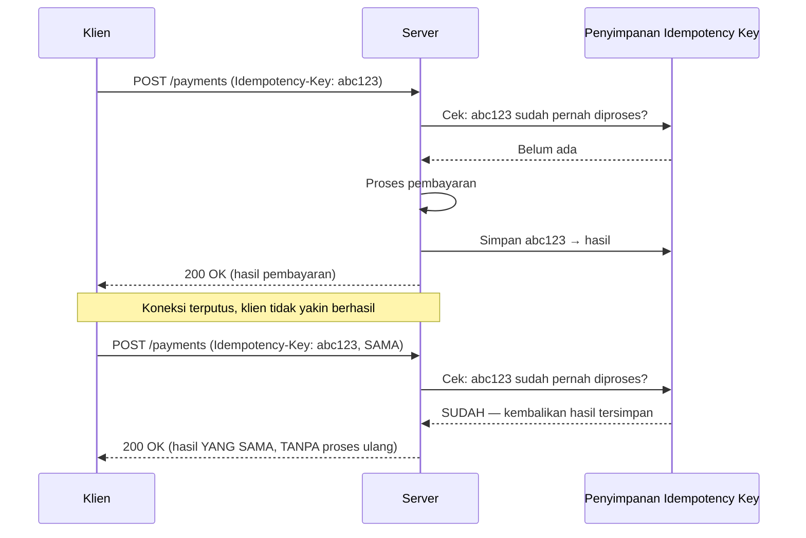

## TL;DR

[[../30 APIs and Web/Idempotency|Idempotency]] level junior menjelaskan **kenapa** operasi idempoten penting dan bagaimana method HTTP tertentu (PUT, DELETE) idempoten secara alami. [[../30 APIs and Web/Idempotent Consumers|Idempotent Consumers]] level intermediate menjelaskan penerapannya di konsumsi pesan asinkron. Note ini membahas mekanisme spesifik untuk kasus yang keduanya tidak sepenuhnya menjawab: operasi yang **secara inheren tidak idempoten** (POST yang membuat transaksi finansial baru, mengeksekusi pembayaran) tapi tetap harus aman dipanggil ulang saat klien tidak yakin apakah permintaan pertamanya berhasil. **Idempotency key** adalah nilai unik yang dibuat **klien** (bukan server) dan disertakan di setiap percobaan permintaan yang sama — server menyimpan hasil permintaan pertama terhadap key itu, dan permintaan berikutnya dengan key yang sama mengembalikan hasil yang **sama persis**, tanpa mengeksekusi ulang efek sampingnya.

## The Problem

Sebuah aplikasi mengirim permintaan pembayaran ke service pembayaran internal. Koneksi jaringan terputus tepat setelah permintaan terkirim, sebelum klien sempat menerima respons — dari sudut pandang klien, tidak jelas apakah pembayaran itu benar-benar berhasil diproses server sebelum koneksi putus, atau gagal total sebelum sempat diproses. Klien, mengikuti praktik retry yang wajar (lihat [[../30 APIs and Web/Retries with Exponential Backoff and Jitter|Retries with Exponential Backoff and Jitter]]), mengirim ulang permintaan yang sama persis.

Masalahnya: kalau permintaan pertama **sebenarnya** sudah berhasil diproses server (hanya responsnya yang tidak sampai ke klien), dan server memproses permintaan kedua ini sebagai permintaan baru yang berbeda, pengguna dikenakan pembayaran **dua kali** untuk satu transaksi yang dimaksudkan. Ini bukan skenario langka atau hipotesis — di sistem terdistribusi dengan traffic nyata, koneksi terputus di titik yang persis seperti ini (setelah server memproses, sebelum respons sampai ke klien) terjadi dengan frekuensi yang cukup untuk jadi kelas bug yang harus ditangani secara sistematis, bukan diabaikan sebagai kasus langka.

## Intuition

Cara paling mudah memahaminya: idempotency key seperti **nomor referensi transfer bank** yang kamu buat sendiri sebelum mengirim instruksi transfer. Kalau kamu mengirim instruksi "transfer 1 juta dengan nomor referensi ABC123" dan tidak yakin instruksi itu sampai, kamu bisa mengirim instruksi **yang persis sama** (termasuk nomor referensi ABC123 yang sama) lagi — bank yang menerapkan sistem yang benar akan mengenali "saya sudah pernah memproses referensi ABC123 ini" dan **tidak** memproses transfer kedua kalinya, cukup mengonfirmasi ulang bahwa transfer dengan referensi itu memang sudah selesai.

Analogi ini nyaris sepenuhnya menangkap esensinya, dengan satu detail penting: nomor referensi itu harus dibuat **oleh pengirim** (klien), bukan oleh bank (server) — kalau bank yang membuat nomor referensi setiap kali menerima instruksi, instruksi kedua yang terlihat identik akan tetap dapat nomor referensi baru dan diproses sebagai transfer terpisah, karena bank tidak tahu instruksi kedua ini "seharusnya" sama dengan yang pertama tanpa penanda yang dibuat klien sejak awal.

## How It Works


Titik krusial ada di langkah kedua "Cek: abc123 sudah pernah diproses?" — server **tidak** menjalankan logika pembayaran lagi begitu menemukan key yang sama sudah pernah diproses, cukup mengembalikan hasil yang tersimpan dari percobaan pertama. Klien menerima respons yang identik terlepas dari berapa kali ia (secara tidak sengaja) mengirim ulang permintaan yang sama.

## Under The Hood

Implementasi yang benar butuh **atomicity** antara pengecekan key dan penyimpanan hasil — kalau dua permintaan dengan idempotency key yang sama datang **hampir bersamaan** (race condition, bukan sekadar retry berurutan), keduanya bisa lolos pengecekan "belum ada" sebelum salah satu sempat menyimpan hasilnya, dan keduanya diproses sebagai transaksi terpisah meski key-nya sama — persis kegagalan yang idempotency key seharusnya cegah. Solusi yang benar butuh constraint unik di level database (`UNIQUE` pada kolom idempotency key) yang membuat percobaan kedua gagal di level database kalau keduanya mencoba menyisipkan baris yang sama secara bersamaan, dipadukan dengan penanganan error itu di kode aplikasi untuk mengembalikan hasil yang benar.

Detail lain yang sering luput: idempotency key harus disimpan bersama **hasil lengkap** dari permintaan pertama (bukan hanya penanda "sudah diproses"), supaya permintaan berikutnya dengan key sama benar-benar mendapat respons yang identik — server yang hanya menyimpan "key ini sudah dipakai" tanpa menyimpan hasilnya tidak bisa memberi jawaban yang benar ke percobaan kedua, hanya bisa menolak tanpa memberi informasi yang berguna ke klien.

## In Go

```go
package idempotency

import (
	"context"
	"database/sql"
	"encoding/json"
	"errors"
	"fmt"
)

type StoredResult struct {
	StatusCode int
	Body       json.RawMessage
}

// ProcessWithIdempotencyKey menunjukkan pola inti: cek-atau-simpan
// dilakukan secara ATOMIK lewat constraint UNIQUE database, bukan
// SELECT lalu INSERT terpisah yang rentan race condition.
func ProcessWithIdempotencyKey(ctx context.Context, db *sql.DB, key string, process func(ctx context.Context) (StoredResult, error)) (StoredResult, error) {
	// Coba insert placeholder DULU — kalau key sudah ada,
	// constraint UNIQUE akan gagal, memberi sinyal ATOMIK bahwa
	// permintaan ini sudah (atau sedang) diproses.
	_, err := db.ExecContext(ctx, `
		INSERT INTO idempotency_keys (key, status) VALUES ($1, 'processing')
	`, key)

	if err != nil {
		// Key sudah ada — ambil hasil yang TERSIMPAN, jangan proses ulang.
		var stored StoredResult
		row := db.QueryRowContext(ctx, `
			SELECT status_code, body FROM idempotency_keys WHERE key = $1 AND status = 'completed'
		`, key)
		if scanErr := row.Scan(&stored.StatusCode, &stored.Body); scanErr != nil {
			return StoredResult{}, fmt.Errorf("idempotency: key %q sedang diproses request lain, coba lagi nanti: %w", key, errors.New("in progress"))
		}
		return stored, nil
	}

	// Key baru — jalankan proses SUNGGUHAN hanya di sini, satu kali.
	result, err := process(ctx)
	if err != nil {
		db.ExecContext(ctx, `DELETE FROM idempotency_keys WHERE key = $1`, key)
		return StoredResult{}, err
	}

	body, _ := json.Marshal(result.Body)
	db.ExecContext(ctx, `
		UPDATE idempotency_keys SET status='completed', status_code=$2, body=$3 WHERE key=$1
	`, key, result.StatusCode, body)

	return result, nil
}
```

## In His Stack

Untuk 13 aplikasi yang saling memanggil (integrasi lintas aplikasi, lihat [[../30 APIs and Web/Designing an API for a Partner You Do Not Control|Designing an API for a Partner You Do Not Control]]), setiap endpoint yang memicu efek samping tidak idempoten secara alami — membuat pengajuan baru, memproses pembayaran, mengirim notifikasi resmi — adalah kandidat yang butuh idempotency key, terutama untuk panggilan antar aplikasi lewat jaringan internal yang, sesuai [[The Fallacies of Distributed Computing]], tidak bisa diasumsikan selalu andal. Menyepakati header standar (`Idempotency-Key` adalah konvensi umum industri) lintas 13 aplikasi memudahkan penerapan pola ini konsisten di semua integrasi, bukan diimplementasikan berbeda-beda per aplikasi.

## Trade-offs and When Not To Use It

Idempotency key menambah kompleksitas nyata — penyimpanan tambahan untuk key dan hasilnya, kebijakan retensi (berapa lama key disimpan sebelum dianggap kedaluwarsa dan dihapus), dan disiplin klien harus benar-benar mengirim key yang sama untuk percobaan ulang permintaan yang sama (bukan membuat key baru setiap kali, yang meniadakan seluruh manfaatnya). Untuk operasi yang secara alami sudah idempoten (GET, PUT dengan semantik replace penuh, DELETE), idempotency key adalah overhead yang tidak perlu — mekanisme ini paling bernilai justru untuk operasi yang **secara inheren** menciptakan sesuatu baru setiap kali dipanggil (POST yang membuat entitas baru, transaksi finansial), di mana idempotency tidak datang gratis dari semantik HTTP itu sendiri.

## Common Mistakes

> [!warning] Jebakan
> Membuat idempotency key baru di sisi klien setiap kali retry (bukan memakai key yang sama dari percobaan pertama) — meniadakan seluruh manfaat mekanisme ini, karena server tidak akan pernah mengenali percobaan kedua sebagai pengulangan dari yang pertama.

> [!warning] Jebakan
> Mengecek keberadaan key dan menyimpan hasil sebagai dua operasi terpisah (SELECT lalu INSERT) tanpa constraint atomik — rentan race condition saat dua permintaan dengan key sama datang hampir bersamaan, keduanya bisa lolos pengecekan sebelum salah satu sempat menyimpan.

> [!warning] Jebakan
> Hanya menyimpan penanda "key ini sudah dipakai" tanpa menyimpan hasil lengkapnya — permintaan kedua dengan key sama tidak bisa mendapat respons yang benar-benar identik dengan percobaan pertama, hanya bisa ditolak tanpa informasi berguna.

## Exercises

1. Jelaskan perbedaan idempotency key dengan idempotency yang datang secara alami dari semantik method HTTP (seperti PUT).
2. Kenapa idempotency key harus dibuat klien, bukan server?
3. Kenapa pengecekan dan penyimpanan idempotency key harus atomik, bukan dua operasi terpisah?
4. Desain terbuka: kamu merancang endpoint pembayaran baru untuk salah satu dari 13 aplikasi yang akan dipanggil aplikasi lain, dan ingin memastikan pembayaran tidak pernah diproses dua kali meski pemanggil melakukan retry karena timeout. Rancang skema idempotency key lengkap untuk endpoint ini, termasuk bagaimana menangani permintaan dengan key sama tapi payload yang berbeda (potensi kesalahan pemanggil).

> [!success]- Kunci jawaban
> **1.** Idempotency alami dari method HTTP (seperti PUT) datang dari semantik operasinya sendiri — "ganti resource ini jadi persis begini" menghasilkan keadaan akhir yang sama meski dipanggil berkali-kali, tanpa perlu mekanisme tambahan. Idempotency key dibutuhkan untuk operasi yang secara inheren **membuat sesuatu baru** setiap kali dipanggil (seperti POST membuat transaksi) — operasi ini tidak idempoten secara alami, dan idempotency key adalah mekanisme eksternal yang ditambahkan untuk membuatnya aman dipanggil ulang.
> **4.** Endpoint menerima header `Idempotency-Key` wajib untuk setiap permintaan pembayaran. Server menyimpan key bersama **hash dari payload** permintaan pertama (bukan hanya key-nya) — kalau permintaan kedua datang dengan key yang sama tapi payload **berbeda** (jumlah pembayaran berbeda, misalnya), ini indikasi kesalahan pemanggil (memakai ulang key untuk transaksi yang sebenarnya berbeda) dan server menolaknya dengan error eksplisit (misalnya 422 dengan pesan "idempotency key sudah dipakai untuk payload berbeda"), bukan diam-diam memproses atau mengembalikan hasil transaksi yang salah. Kalau payload sama persis, server mengembalikan hasil tersimpan dari percobaan pertama tanpa memproses ulang, sesuai pola inti idempotency key. Key disimpan dengan masa retensi yang wajar (misalnya 24 jam) cukup untuk mencakup skenario retry yang realistis, tanpa menyimpannya selamanya.

## Self-Check

- Apa perbedaan idempotency key dengan idempotency alami dari semantik HTTP?
- Kenapa idempotency key harus dibuat klien?
- Kenapa pengecekan dan penyimpanan key harus atomik?
- Bagaimana menangani permintaan dengan key sama tapi payload berbeda?

## Connected Notes

- [[../30 APIs and Web/Idempotency|Idempotency]] — note ini adalah kelanjutan spesifik untuk operasi yang tidak idempoten secara alami, di atas konsep dasar yang dibahas di note itu.
- [[../30 APIs and Web/Idempotent Consumers|Idempotent Consumers]] — pola serupa diterapkan pada konteks konsumsi pesan asinkron, bukan panggilan API sinkron seperti fokus note ini.
- [[Two-Phase Commit and Why It Is Avoided]] — idempotency key adalah salah satu alasan kenapa saga (alternatif 2PC) bisa aman menjalankan retry tanpa risiko efek samping ganda.
- [[Exactly-Once Delivery as an Illusion]] — kelanjutan langsung: idempotency key adalah mekanisme praktis yang membuat "exactly-once" terasa tercapai dari sudut pandang efek samping, meski pengiriman pesan sendiri tetap at-least-once.
- [[../30 APIs and Web/Retries with Exponential Backoff and Jitter|Retries with Exponential Backoff and Jitter]] — idempotency key adalah prasyarat yang membuat strategi retry aman dijalankan tanpa risiko duplikasi efek samping.

## Further Reading

- Dokumentasi API Stripe bagian "Idempotent Requests" — salah satu implementasi idempotency key paling banyak dirujuk dan dipelajari di industri.

## Catatan Saya

*Tulis di sini endpoint di salah satu dari 13 aplikasimu yang memproses pembayaran atau transaksi penting tanpa idempotency key, dan risiko duplikasi yang mungkin belum pernah terjadi (atau sudah pernah, dan baru disadari sekarang).*
