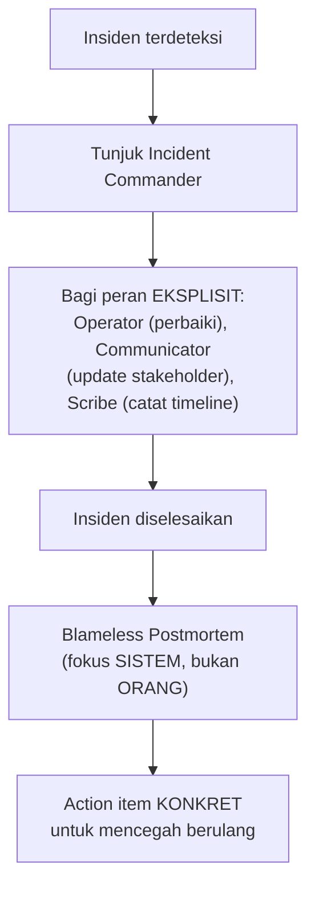

## TL;DR

Dua disiplin yang saling melengkapi tapi terjadi di waktu berbeda. **Incident command** adalah struktur peran yang jelas **selama** insiden sedang berlangsung — siapa yang memimpin koordinasi, siapa yang berkomunikasi ke pemangku kepentingan, siapa yang benar-benar memperbaiki masalah — mencegah kekacauan "semua orang panik dan bicara bersamaan" yang justru memperlambat pemulihan. **Blameless postmortem** adalah proses **setelah** insiden selesai, menganalisis apa yang terjadi dan kenapa, dengan aturan eksplisit: fokus pada sistem dan proses yang gagal, bukan mencari siapa yang harus disalahkan — karena mencari kambing hitam membuat orang menyembunyikan informasi, sementara tujuan sebenarnya adalah belajar sebanyak mungkin dari kegagalan yang sudah terjadi.

## The Problem

Sebuah insiden besar terjadi di salah satu dari 13 aplikasi — layanan mati total selama 40 menit di jam sibuk. Selama insiden, lima orang berbeda mencoba memperbaikinya secara bersamaan tanpa koordinasi jelas: satu orang me-restart service, tanpa tahu orang lain sedang mencoba rollback deployment di waktu yang sama, menyebabkan kebingungan tambahan tentang apa yang sebenarnya sedang terjadi di sistem. Manajemen terus menghubungi berbagai anggota tim secara terpisah menanyakan status, memaksa masing-masing berhenti sejenak dari upaya perbaikan untuk menjawab pertanyaan yang sama berulang kali dari orang berbeda.

Setelah insiden selesai, rapat evaluasi berubah jadi sesi saling menyalahkan — "kenapa kamu deploy tanpa testing yang cukup", "kenapa kamu tidak memberi tahu sedang rollback". Developer yang deploy-nya jadi pemicu awal insiden merasa disudutkan, dan dalam rapat berikutnya (dan insiden-insiden setelahnya), orang mulai enggan mengakui kesalahan atau berbagi detail penuh tentang apa yang sebenarnya mereka lakukan — bukan karena mereka jahat, tapi karena pengalaman rapat sebelumnya mengajarkan bahwa kejujuran penuh berujung disalahkan secara personal. Organisasi kehilangan informasi paling berharga justru dari sumber yang paling tahu apa yang sebenarnya terjadi.

## Intuition

Cara paling mudah memahaminya untuk incident command: bayangkan **tim pemadam kebakaran** di lokasi kejadian — ada satu komandan lapangan yang jelas, bukan setiap petugas bertindak sendiri-sendiri berdasarkan penilaian masing-masing. Komandan mengoordinasikan siapa masuk ke gedung, siapa mengatur selang air, siapa berkomunikasi dengan warga di luar — struktur yang jelas ini bukan tentang hierarki kekuasaan, tapi tentang memastikan setiap orang tahu perannya dan tidak ada dua tim yang tanpa sadar saling menghalangi.

Untuk blameless postmortem, analoginya adalah **kotak hitam pesawat terbang** dan penyelidikan kecelakaan penerbangan — investigasi kecelakaan pesawat secara sengaja **tidak** dirancang untuk menghukum pilot yang masih hidup, karena tujuannya adalah memahami rantai sebab akibat penuh untuk mencegah kecelakaan serupa di masa depan. Pilot dan kru yang tahu mereka tidak akan dihukum atas kejujuran mereka lebih mungkin memberi keterangan lengkap dan akurat, dibanding kalau setiap detail bisa dipakai untuk menyalahkan mereka secara personal.

Analogi ini bocor pada soal akuntabilitas. "Blameless" bukan berarti tidak ada akuntabilitas sama sekali — organisasi penerbangan tetap punya standar dan konsekuensi untuk pelanggaran yang benar-benar disengaja atau ceroboh berulang. Blameless berarti default awal investigasi adalah mencari **penyebab sistemik**, bukan mencari **orang untuk disalahkan** sebagai langkah pertama.

## How It Works


Struktur incident command memisahkan peran secara eksplisit sejak awal insiden — **Incident Commander** mengoordinasikan keseluruhan (tidak selalu orang yang paling teknis, tapi yang paling bisa menjaga fokus dan komunikasi tetap jelas), **Operator** yang benar-benar melakukan perbaikan teknis (idealnya sedikit orang, terkoordinasi, bukan lima orang mencoba hal berbeda bersamaan seperti "The Problem"), **Communicator** yang menangani update ke pemangku kepentingan (membebaskan Operator dari gangguan pertanyaan berulang), dan **Scribe** yang mencatat timeline kejadian secara real-time (bahan mentah paling berharga untuk postmortem nanti).

Blameless postmortem yang matang punya format yang konsisten: timeline kejadian yang faktual (apa yang terjadi, kapan, berdasarkan catatan Scribe dan log sistem), analisis akar masalah (bukan hanya gejala permukaan), dan **action item konkret** dengan pemilik dan tenggat waktu jelas — postmortem yang berakhir hanya dengan "kita harus lebih hati-hati" tanpa aksi konkret adalah postmortem yang gagal mencapai tujuannya.

## Under The Hood

Prinsip blameless bukan sekadar etika yang terasa baik — ia punya alasan mekanis yang konkret: manusia yang tahu kejujuran mereka akan dipakai untuk menyalahkan mereka secara rasional akan **menyaring** informasi yang mereka bagikan, secara sadar atau tidak sadar. Ini berarti postmortem yang tidak blameless secara struktural kehilangan akses ke informasi paling penting — detail kecil yang mungkin tampak "memalukan" untuk diakui, tapi justru sering jadi kunci memahami akar masalah sesungguhnya (misalnya, "saya sebenarnya melihat warning ini tapi mengabaikannya karena terburu-buru" adalah informasi emas untuk memperbaiki proses, tapi hanya akan diungkapkan kalau orang itu yakin tidak akan dihukum karena mengakuinya).

Incident command yang efektif juga butuh **latihan sebelum insiden sungguhan** — struktur peran yang baru pertama kali dicoba di tengah insiden nyata cenderung berantakan karena orang belum terbiasa dengan peran barunya. Ini menghubungkan langsung ke [[Chaos Engineering]] (dibahas di note berikutnya) — latihan insiden simulasi adalah salah satu cara paling efektif membuat struktur incident command benar-benar berfungsi saat dibutuhkan sungguhan, bukan hanya teori yang tertulis di dokumen yang tidak pernah dipraktikkan.

## In Go

```go
package incident

import "time"

// Role menunjukkan PEMBAGIAN EKSPLISIT yang mencegah kekacauan
// "semua orang mencoba memperbaiki bersamaan" seperti di "The Problem".
type Role string

const (
	Commander    Role = "commander"
	Operator     Role = "operator"
	Communicator Role = "communicator"
	Scribe       Role = "scribe"
)

type IncidentEvent struct {
	Timestamp time.Time
	Actor     string
	Action    string
}

// Timeline dicatat SCRIBE secara real-time — bahan mentah paling
// berharga untuk postmortem, MENGGANTIKAN ingatan yang tidak akurat
// setelah insiden mereda.
type Timeline struct {
	Events []IncidentEvent
}

func (t *Timeline) Record(actor, action string) {
	t.Events = append(t.Events, IncidentEvent{
		Timestamp: time.Now(),
		Actor:     actor,
		Action:    action,
	})
}

// PostmortemAction MEWAJIBKAN pemilik dan tenggat — postmortem yang
// berakhir tanpa action item konkret dianggap GAGAL mencapai tujuannya.
type PostmortemAction struct {
	Description string
	Owner       string
	DueDate     time.Time
	Completed   bool
}
```

## In His Stack

Untuk insiden di sistem legal-services yang melibatkan lintas beberapa dari 13 aplikasi (persis skenario yang butuh koordinasi lintas tim seperti di "The Problem"), struktur incident command dengan Incident Commander yang jelas — bukan seluruh tim panik menghubungi satu sama lain secara acak — jadi jauh lebih penting justru karena melibatkan tim yang berbeda-beda yang mungkin belum terbiasa berkoordinasi bersama di luar konteks insiden. Budaya blameless postmortem juga khusus penting untuk sistem pemerintah — tekanan politik atau institusional untuk "mencari yang bertanggung jawab" bisa jauh lebih kuat dibanding perusahaan swasta biasa, membuat komitmen eksplisit terhadap prinsip blameless (dan penjelasan kenapa ini penting untuk kualitas sistem jangka panjang) jadi lebih krusial, bukan kurang.

## Trade-offs and When Not To Use It

Struktur incident command formal (peran eksplisit, prosedur baku) menambah overhead untuk insiden yang sangat kecil dan cepat diselesaikan satu orang — memanggil rapat penunjukan Incident Commander untuk bug kecil yang selesai dalam lima menit adalah birokrasi berlebihan. Struktur ini bernilai jelas untuk insiden signifikan yang melibatkan lebih dari satu-dua orang, atau yang berlangsung cukup lama sehingga koordinasi jadi masalah nyata. Blameless postmortem, sebaliknya, hampir tidak punya kasus "kapan tidak dipakai" — prinsip ini bernilai untuk insiden seukuran apa pun, meski format formalnya (dokumen lengkap dengan timeline detail) mungkin disederhanakan untuk insiden kecil.

## Common Mistakes

> [!warning] Jebakan
> Membiarkan banyak orang mencoba memperbaiki masalah yang sama secara bersamaan tanpa koordinasi eksplisit — bukan hanya tidak efisien, tapi bisa saling menghalangi atau bahkan memperburuk keadaan, persis masalah di "The Problem".

> [!warning] Jebakan
> Menjalankan postmortem yang secara implisit (atau eksplisit) mencari siapa yang harus disalahkan — mengajarkan tim untuk menyembunyikan informasi di insiden berikutnya, kehilangan detail paling berharga untuk benar-benar memahami akar masalah.

> [!warning] Jebakan
> Menyelesaikan postmortem tanpa action item konkret dengan pemilik dan tenggat jelas — "kita harus lebih hati-hati ke depan" bukan perbaikan yang bisa diverifikasi, dan pelajaran dari insiden ini berisiko terulang tanpa perubahan nyata di sistem atau proses.

## Exercises

1. Jelaskan perbedaan tujuan incident command (selama insiden) dan blameless postmortem (setelah insiden).
2. Kenapa mencari kambing hitam dalam postmortem justru merugikan kualitas investigasi ke depannya?
3. Sebutkan empat peran umum dalam struktur incident command dan tanggung jawab masing-masing.
4. Desain terbuka: insiden di salah satu dari 13 aplikasimu seperti di "The Problem" (lima orang mencoba memperbaiki bersamaan, rapat evaluasi berubah jadi saling menyalahkan) baru saja terjadi. Rancang perbaikan proses untuk insiden serupa di masa depan, mencakup baik struktur incident command maupun format blameless postmortem.

> [!success]- Kunci jawaban
> **1.** Incident command fokus pada koordinasi efektif **selama** insiden berlangsung — memastikan upaya perbaikan terorganisir dan komunikasi tidak mengganggu orang yang sedang bekerja. Blameless postmortem fokus pada pembelajaran **setelah** insiden selesai — memahami akar masalah sistemik dan menghasilkan perbaikan konkret untuk mencegah pengulangan.
> **4.** (1) Perkenalkan struktur incident command formal: begitu insiden signifikan terdeteksi, tunjuk satu Incident Commander (bisa bergiliran, tidak harus selalu orang yang sama) yang mengoordinasikan siapa yang benar-benar melakukan perbaikan teknis (Operator, idealnya satu-dua orang untuk menghindari tindakan yang saling bertabrakan), siapa yang menangani komunikasi ke pemangku kepentingan (Communicator, membebaskan Operator dari gangguan), dan siapa mencatat timeline (Scribe); (2) latih struktur ini lewat simulasi insiden sebelum insiden sungguhan berikutnya terjadi, supaya peran-peran ini tidak asing saat benar-benar dibutuhkan; (3) untuk postmortem, tetapkan format baku yang secara eksplisit menyatakan aturan blameless di awal dokumen/rapat, fokus pertanyaan pada "apa yang membuat sistem/proses memungkinkan ini terjadi" bukan "siapa yang melakukan kesalahan"; (4) pastikan setiap postmortem menghasilkan action item konkret dengan pemilik dan tenggat jelas, ditinjau ulang di postmortem/rapat berikutnya untuk memastikan benar-benar diselesaikan, bukan hanya niat baik yang terlupakan.

## Self-Check

- Apa perbedaan tujuan incident command dan blameless postmortem?
- Kenapa mencari kambing hitam merugikan kualitas investigasi?
- Sebutkan empat peran umum dalam incident command.
- Kenapa postmortem butuh action item konkret dengan pemilik dan tenggat?

## Connected Notes

- [[Error Budgets]] — insiden yang ditangani lewat incident command adalah kejadian yang mengonsumsi error budget, menghubungkan kedua konsep secara langsung.
- [[Chaos Engineering]] — kelanjutan langsung: latihan simulasi insiden adalah cara membuat struktur incident command benar-benar teruji sebelum insiden sungguhan menuntutnya.
- [[../70 Infrastructure and Delivery/Alerts That Do Not Cause Fatigue|Alerts That Do Not Cause Fatigue]] — alert yang efektif adalah titik masuk yang memicu proses incident command, koneksi langsung antar kedua topik.
- [[Planned Degradation]] — keputusan yang diambil selama incident command (fitur mana yang boleh dimatikan dulu demi stabilitas) sering mengacu langsung pada rencana planned degradation yang sudah disiapkan sebelumnya.
- [[../90 Architecture and Design/Mentoring|Mentoring]] — budaya blameless yang sehat berkaitan erat dengan budaya mentoring yang tidak menghukum kesalahan, dibahas di domain arsitektur dan kepemimpinan teknis.

## Further Reading

- Google, "Site Reliability Engineering" (buku, tersedia daring gratis) — bab tentang manajemen insiden dan postmortem adalah rujukan luas dikutip di industri.
- John Allspaw, "Blameless PostMortems and a Just Culture" — tulisan berpengaruh yang mempopulerkan istilah dan prinsip blameless postmortem.

## Catatan Saya

*Tulis di sini insiden terakhir di salah satu dari 13 aplikasimu, dan apakah penanganannya (selama dan setelah insiden) mengikuti prinsip di note ini atau justru berujung kebingungan dan saling menyalahkan.*
