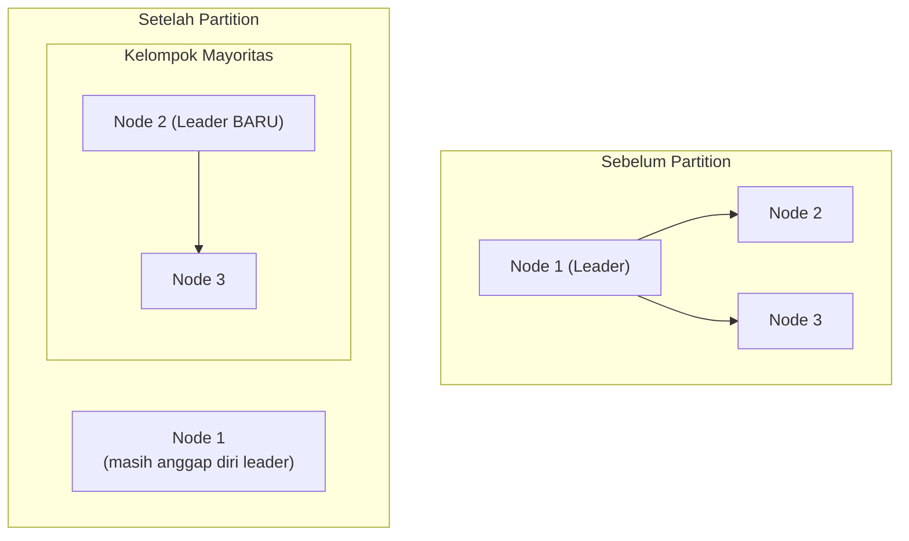

## TL;DR

Banyak sistem terdistribusi butuh **satu** node yang memegang peran khusus (leader) untuk mengoordinasikan pekerjaan tertentu — menghindari konflik yang muncul kalau banyak node mencoba melakukan hal yang sama secara bersamaan. Leader election adalah proses memilih node itu, dan mekanismenya sudah dibahas konkret di [[Consensus - Raft]]. **Split brain** adalah kegagalan paling berbahaya yang bisa terjadi pada sistem semacam ini: dua node **sama-sama** yakin dirinya leader yang sah, biasanya karena partition jaringan memisahkan cluster jadi dua bagian yang masing-masing tidak tahu bagian lain masih hidup — dan keduanya terus beroperasi seolah-olah merekalah satu-satunya otoritas, menghasilkan keputusan yang saling bertentangan tanpa ada yang menyadarinya sampai partition pulih dan kerusakannya sudah terjadi.

## The Problem

Sebuah cluster tiga node menjalankan sistem antrean pemrosesan dokumen untuk salah satu dari 13 aplikasi, dengan satu leader yang bertanggung jawab menugaskan dokumen ke worker. Suatu malam, jaringan antara node 1 dan dua node lainnya (node 2, node 3) terputus — bukan karena salah satu node mati, tapi karena masalah jaringan yang membelah cluster jadi dua kelompok terisolasi. Node 1, yang sebelumnya adalah leader, tidak menerima heartbeat dari node lain dan mengira dirinya kehilangan follower — tapi karena tidak ada mekanisme yang memaksanya berhenti bertindak sebagai leader begitu saja, ia terus menganggap dirinya leader dan terus menugaskan dokumen ke worker yang masih bisa dihubunginya.

Sementara itu, node 2 dan node 3 (yang masih bisa saling bicara dan merupakan mayoritas cluster) memilih leader baru di antara mereka, karena mengira node 1 sudah mati. Selama beberapa menit sampai jaringan pulih, **dua** node — node 1 (leader lama yang tidak sadar sudah "digantikan") dan leader baru dari node 2/3 — sama-sama menugaskan dokumen yang sama ke worker berbeda, menghasilkan dokumen yang diproses dua kali dengan hasil yang bisa saling bertentangan, tanpa ada satu pihak pun yang menyadari ada konflik sampai kerusakannya sudah terjadi dan ditemukan lewat audit belakangan.

## Intuition

Cara paling mudah memahaminya: split brain seperti **dua kantor cabang perusahaan yang kehilangan kontak satu sama lain**, dan masing-masing, karena tidak bisa menghubungi kantor pusat atau cabang lain, memutuskan bertindak sebagai "pengambil keputusan utama" untuk seluruh perusahaan — masing-masing menyetujui kontrak, mengeluarkan kebijakan, dan membuat komitmen atas nama perusahaan yang sama, tanpa tahu cabang lain melakukan hal serupa. Begitu komunikasi pulih, ditemukan dua rangkaian keputusan yang saling bertentangan, dibuat oleh dua "otoritas" yang masing-masing merasa sah sepenuhnya selama periode itu.

Analogi ini nyaris sepenuhnya menangkap esensi masalahnya. Yang tidak tertangkap sepenuhnya: manusia di cabang perusahaan biasanya punya insting untuk curiga dan berhati-hati saat komunikasi terputus lama ("sesuatu pasti salah, mungkin sebaiknya kita menahan diri"). Node dalam sistem terdistribusi tidak punya insting semacam itu secara default — ia hanya menjalankan aturan yang diprogramkan, dan tanpa aturan eksplisit yang memaksa "berhenti bertindak sebagai leader kalau tidak yakin masih jadi mayoritas", ia akan terus bertindak percaya diri penuh sampai diberi tahu sebaliknya.

## How It Works


Pencegahan split brain di algoritma consensus formal seperti Raft mengandalkan syarat mayoritas: leader **hanya** boleh menganggap tulisannya committed setelah dikonfirmasi mayoritas (lihat [[Quorums]]) — node 1 yang terisolasi sendirian (minoritas) tidak akan pernah mendapat konfirmasi mayoritas untuk tulisan barunya, meski ia tetap mengira dirinya leader. Ini mencegah **data** dari split brain berhasil ter-commit secara resmi, meski tidak sepenuhnya mencegah node 1 dari "berpura-pura" bertindak sebagai leader sampai ia menyadari kegagalannya sendiri.

Mekanisme term di Raft menambah lapisan pencegahan lain: begitu jaringan pulih dan node 1 menerima pesan dari leader baru (dengan term lebih tinggi), aturan Raft **memaksanya** mundur jadi follower — bukan opsional, tapi bagian dari protokol yang wajib diikuti. Kombinasi "tidak bisa commit tanpa mayoritas" dan "wajib mundur begitu menemukan term lebih baru" adalah dua lapis pertahanan yang membuat split brain, meski secara teori bisa terjadi sesaat, tidak bisa menghasilkan kerusakan data permanen pada sistem yang memakai consensus formal dengan benar.

## Under The Hood

**Fencing** adalah teknik tambahan yang sering dipakai bersamaan dengan leader election untuk mencegah leader lama menyebabkan kerusakan nyata, bahkan sebelum ia sadar sudah digantikan — setiap leader diberi token (sering berupa nomor yang terus naik, disebut fencing token) yang harus disertakan setiap kali berinteraksi dengan resource bersama (misalnya penyimpanan atau perangkat eksternal). Resource itu menolak operasi dari token yang lebih lama dari token tertinggi yang pernah dilihatnya — jadi meski leader lama masih "yakin" dirinya berwenang dan mencoba menulis, penulisannya ditolak resource itu sendiri karena tokennya sudah usang, bukan mengandalkan leader lama untuk sadar sendiri.

Sistem yang tidak memakai consensus formal dan hanya mengandalkan mekanisme leader election sederhana (misalnya lewat lock sederhana tanpa jaminan matematis quorum) jauh lebih rentan split brain menyebabkan kerusakan nyata — inilah salah satu alasan kuat kenapa tool matang seperti Consul/etcd (berbasis Raft) lebih disukai dibanding membangun mekanisme leader election kustom yang sederhana tapi tidak punya jaminan formal yang sama.

## In Go

```go
package fencing

import "fmt"

// FencingToken menunjukkan pertahanan TAMBAHAN di luar consensus
// itu sendiri — bahkan kalau leader lama "salah sangka" masih
// berwenang, resource bersama ini menolaknya berdasarkan token,
// bukan mengandalkan leader lama sadar sendiri.
type SharedResource struct {
	highestTokenSeen int
}

func (r *SharedResource) Write(token int, data string) error {
	if token < r.highestTokenSeen {
		// Token USANG — penolakan ini TIDAK bergantung pada apakah
		// pengirim tahu dirinya sudah digantikan atau tidak.
		return fmt.Errorf("fencing: token %d usang, token tertinggi sudah %d", token, r.highestTokenSeen)
	}
	r.highestTokenSeen = token
	// data ditulis di sini
	return nil
}

// Setiap kali leader BARU terpilih, token yang diberikan LEBIH
// TINGGI dari token leader manapun sebelumnya — biasanya dari
// term/index consensus itu sendiri, bukan counter terpisah yang
// bisa tidak sinkron.
func NewLeaderToken(currentTerm int) int {
	return currentTerm
}
```

## In His Stack

Untuk sistem legal-services yang melibatkan koordinasi lintas 13 aplikasi (misalnya sistem penugasan kasus ke petugas, atau sistem antrean pemrosesan dokumen bersama), split brain punya konsekuensi yang bisa sangat serius — dua "leader" yang sama-sama menugaskan kasus yang sama ke petugas berbeda, atau dua proses yang sama-sama menganggap diri mereka berwenang memberi keputusan resmi atas sebuah kasus, bukan sekadar bug teknis tapi berpotensi jadi masalah hukum dan akuntabilitas nyata. Ini memperkuat alasan memakai tool consensus matang (Consul/etcd) untuk koordinasi kritis semacam ini, alih-alih mekanisme lock sederhana yang dibangun sendiri tanpa jaminan formal.

## Trade-offs and When Not To Use It

Mekanisme pencegahan split brain penuh (consensus formal, fencing token) menambah kompleksitas dan latency — untuk sistem yang tidak benar-benar butuh satu leader tunggal (operasi yang bisa dilakukan idempoten oleh banyak node sekaligus tanpa konflik, lihat [[../30 APIs and Web/Idempotency|Idempotency]]), menghindari kebutuhan leader election sama sekali adalah solusi yang lebih sederhana dan lebih tahan terhadap masalah ini secara struktural — kalau tidak ada leader tunggal, tidak ada split brain yang mungkin terjadi. Leader election dan pencegahan split brain formal bernilai jelas untuk operasi yang memang secara inheren butuh koordinasi tunggal dan tidak bisa dibuat idempoten dengan mudah.

## Common Mistakes

> [!warning] Jebakan
> Membangun mekanisme leader election kustom sederhana (misalnya berdasarkan lock database tanpa jaminan quorum formal) untuk kebutuhan koordinasi kritis — rentan split brain tanpa pertahanan matematis yang disediakan algoritma consensus formal seperti Raft.

> [!warning] Jebakan
> Mengasumsikan leader lama akan "otomatis sadar" dirinya sudah digantikan begitu koneksi jaringan pulih — tanpa mekanisme eksplisit (seperti term di Raft) yang memaksa pengecekan ini, leader lama bisa terus bertindak dengan otoritas yang sudah tidak sah untuk sementara waktu.

> [!warning] Jebakan
> Tidak menerapkan fencing token pada resource bersama yang diakses leader — bahkan dengan consensus yang benar mencegah data ter-commit dari split brain, tanpa fencing, leader lama masih bisa mencoba (dan dalam beberapa kasus berhasil) menulis langsung ke resource eksternal sebelum menyadari kegagalannya.

## Exercises

1. Jelaskan apa itu split brain, dan skenario paling umum yang menyebabkannya.
2. Bagaimana mekanisme term pada Raft membantu mencegah leader lama terus bertindak sebagai leader setelah digantikan?
3. Apa itu fencing token, dan kenapa ia adalah lapisan pertahanan tambahan di luar consensus itu sendiri?
4. Desain terbuka: sistem antrean pemrosesan dokumen di salah satu dari 13 aplikasimu (seperti di "The Problem") pernah mengalami insiden split brain yang menyebabkan dokumen diproses dua kali dengan hasil bertentangan. Rancang perbaikan untuk mencegah insiden serupa terulang, mempertimbangkan baik pencegahan (consensus yang benar) maupun mitigasi (fencing, deteksi duplikasi).

> [!success]- Kunci jawaban
> **1.** Split brain adalah kondisi ketika dua (atau lebih) node sama-sama yakin dirinya memegang otoritas/peran yang seharusnya tunggal (leader), biasanya karena partition jaringan membelah cluster jadi bagian-bagian yang tidak bisa saling bicara, dan masing-masing bagian (terutama yang tidak menyadari sudah jadi minoritas) terus beroperasi seolah dirinya satu-satunya otoritas yang sah.
> **4.** (1) Pastikan sistem antrean memakai algoritma consensus formal (Raft, lewat tool seperti Consul/etcd) untuk leader election, bukan mekanisme lock sederhana yang tidak punya jaminan quorum matematis; (2) tambahkan fencing token — setiap kali worker menerima tugas dari leader, sertakan token dari leader itu, dan sistem penyimpanan hasil (atau worker itu sendiri) menolak tugas dengan token yang lebih lama dari token tertinggi yang pernah dilihat, mencegah leader lama berhasil menugaskan pekerjaan meski ia belum sadar sudah digantikan; (3) sebagai lapisan pertahanan tambahan (defense in depth), tambahkan deteksi duplikasi di level aplikasi — dokumen yang sudah punya status "sedang diproses" tidak boleh ditugaskan ulang tanpa pengecekan eksplisit, memakai pola idempotency key (lihat [[Idempotency Keys]]) sebagai jaring pengaman kalau kedua lapisan pertahanan sebelumnya entah bagaimana masih gagal.

## Self-Check

- Apa itu split brain, dan skenario paling umum penyebabnya?
- Bagaimana term Raft membantu mencegah leader lama terus bertindak?
- Apa itu fencing token?
- Kenapa menghindari kebutuhan leader tunggal sama sekali kadang jadi solusi paling aman?

## Connected Notes

- [[Consensus - Raft]] — mekanisme term dan syarat mayoritas yang dibahas mendalam di note itu adalah pertahanan inti terhadap split brain.
- [[Quorums]] — syarat mayoritas untuk commit adalah lapisan pertahanan pertama yang mencegah data dari split brain berhasil ter-commit secara resmi.
- [[Sagas - Orchestration vs Choreography]] — kelanjutan langsung: memindahkan pembahasan dari "siapa yang berwenang" ke "bagaimana transaksi lintas service ditangani dengan aman meski ada kegagalan".
- [[../30 APIs and Web/Idempotency|Idempotency]] — deteksi duplikasi berbasis idempotency adalah jaring pengaman tambahan yang berguna bahkan setelah pencegahan split brain formal diterapkan.
- [[../92 Tools/Consul|Consul]] — tool konkret yang mengimplementasikan leader election dengan jaminan formal, mengurangi risiko split brain dibanding mekanisme kustom.

## Further Reading

- Martin Kleppmann, "How to do distributed locking" — tulisan yang membahas fencing token secara mendalam dan kenapa lock terdistribusi tanpa fencing rawan gagal.

## Catatan Saya

*Tulis di sini sistem di pekerjaanmu yang mengandalkan satu "leader" atau otoritas tunggal, dan apakah mekanisme pemilihannya punya jaminan formal atau hanya lock sederhana yang rentan split brain.*
