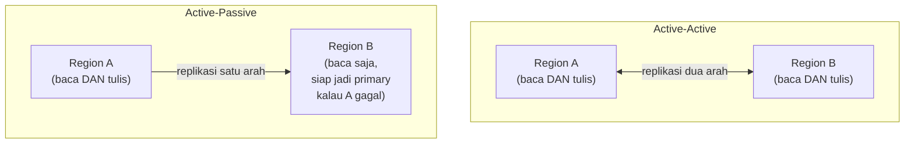

## TL;DR

Sistem yang melayani pengguna dari lokasi geografis yang sangat tersebar menghadapi masalah fisik yang tidak bisa direkayasa hilang: kecepatan cahaya. Permintaan dari pengguna di satu ujung negara ke server yang berlokasi di ujung lainnya butuh waktu tempuh jaringan yang signifikan, tidak peduli seberapa cepat server itu memproses permintaan begitu sampai. Multi-region architecture menempatkan **salinan** sistem (atau sebagiannya) di beberapa lokasi geografis berbeda, melayani pengguna dari lokasi terdekat — tapi ini menciptakan pertanyaan yang langsung berakar dari CAP theorem ([[CAP Theorem and PACELC]]): kalau data yang sama disimpan di banyak region, bagaimana menjaganya tetap konsisten, dan apa yang terjadi kalau koneksi antar region terputus?

## The Problem

Sebuah sistem legal-services nasional melayani petugas dari seluruh provinsi, tapi server utamanya berlokasi di satu data center saja. Petugas di provinsi yang jauh dari lokasi data center itu secara konsisten mengalami latency yang jauh lebih tinggi dibanding petugas di kota tempat data center berada — bukan karena ada yang salah dengan aplikasinya, tapi karena setiap permintaan harus menempuh jarak fisik yang jauh lebih panjang lewat jaringan, dan waktu tempuh ini adalah batasan fisik yang tidak bisa diselesaikan dengan mengoptimalkan kode aplikasi sekencang apa pun.

Tim mempertimbangkan menempatkan server tambahan di region lain untuk melayani petugas yang jauh dari data center utama — tapi begitu ide ini didiskusikan, muncul pertanyaan yang jauh lebih rumit dari sekadar "tambah server di tempat lain": kalau seorang petugas mengubah data kasus lewat server region A, dan petugas lain di region B membaca data yang sama sesaat kemudian, apakah region B pasti melihat perubahan itu? Kalau koneksi antar region A dan B terputus (yang, mengingat jarak geografis, punya risiko lebih tinggi dibanding koneksi dalam satu data center), apa yang terjadi pada kedua region selama partition itu berlangsung?

## Intuition

Cara paling mudah memahaminya: bayangkan sebuah organisasi nasional dengan kantor cabang di berbagai kota, masing-masing menyimpan salinan arsip dokumen penting yang sama. Kalau setiap cabang harus **selalu** menunggu konfirmasi dari kantor pusat sebelum mengizinkan siapa pun membaca atau mengubah arsipnya (analog consistency ketat), setiap transaksi jadi lambat karena harus menunggu komunikasi jarak jauh setiap saat — meniadakan sebagian besar manfaat punya cabang lokal sejak awal. Kalau setiap cabang bebas mengubah arsipnya sendiri tanpa menunggu konfirmasi (analog availability tinggi), transaksi jadi cepat, tapi risiko dua cabang mencatat perubahan yang saling bertentangan untuk dokumen yang sama (karena belum sempat saling memberi tahu) jadi nyata.

Analogi ini bocor pada soal frekuensi konflik. Organisasi fisik dengan proses manusia biasanya jarang mengalami dua cabang mengubah dokumen yang persis sama di waktu yang nyaris bersamaan. Sistem software dengan traffic tinggi menghadapi kemungkinan konflik semacam ini jauh lebih sering — inilah kenapa desain multi-region butuh keputusan eksplisit soal trade-off consistency-latency yang dibahas di [[CAP Theorem and PACELC]], bukan sekadar "tambah server di tempat lain dan berharap semuanya beres sendiri".

## How It Works


**Active-passive**: satu region jadi primary yang menerima seluruh tulisan, region lain hanya replika baca yang menerima salinan data (mirip [[../40 Databases/Read Replicas and Replication Lag|Read Replicas and Replication Lag]] tapi lintas geografis) — lebih sederhana dan menghindari konflik tulisan ganda, tapi region non-primary tetap kena latency tinggi untuk operasi tulis (harus diteruskan ke region primary), dan kalau region primary gagal total, butuh proses failover (mempromosikan region lain jadi primary) yang tidak instan.

**Active-active**: setiap region bisa menerima tulisan, dan perubahan direplikasi dua arah — memberi latency rendah untuk tulisan di semua region (petugas menulis ke region terdekat mereka), tapi membuka kemungkinan **konflik**: dua region menerima tulisan berbeda untuk data yang sama hampir bersamaan, sebelum sempat saling memberi tahu. Menyelesaikan konflik ini butuh strategi eksplisit — "yang terakhir menang" (last-write-wins, sederhana tapi bisa diam-diam kehilangan data), resolusi berbasis aturan bisnis kustom, atau menghindari konflik sejak desain (partisi data sehingga setiap potongan data hanya pernah ditulis dari satu region tertentu).

## Under The Hood

Latency antar region geografis yang jauh (misalnya lintas benua) bisa mencapai ratusan milidetik — angka yang, dibandingkan latency dalam satu data center (biasanya di bawah satu milidetik), adalah perbedaan berorde besarnya, bukan sekadar sedikit lebih lambat. Ini kenapa strategi consistency ketat (menunggu konfirmasi semua region sebelum tulisan dianggap berhasil) untuk sistem multi-region lintas jarak jauh punya biaya latency yang sangat terasa — trade-off PACELC (lihat [[CAP Theorem and PACELC]]) di sini bukan detail teoretis abstrak, tapi sesuatu yang langsung dirasakan pengguna dalam hitungan ratusan milidetik nyata setiap kali mereka menulis data.

Pendekatan yang sering dipakai untuk menyeimbangkan trade-off ini: **partisi geografis berdasarkan data yang relevan secara lokal** — data yang secara alami "milik" satu region (misalnya data kasus yang hanya relevan untuk satu provinsi tertentu) disimpan dan ditulis primer di region terdekat data itu, sementara data yang benar-benar butuh konsistensi global (misalnya kebijakan nasional yang berlaku ke semua region) tetap disimpan terpusat dengan menerima latency lebih tinggi untuk operasi yang jarang terjadi tapi kritis itu.

## In Go

```go
package multiregion

import "context"

// DataAffinity menunjukkan strategi PARTISI GEOGRAFIS — data
// diarahkan ke region yang secara alami relevan, MENGURANGI
// kebutuhan replikasi konsisten lintas region untuk SEBAGIAN BESAR
// operasi.
type DataAffinity struct {
	PrimaryRegion string
}

func RegionForCase(caseProvince string) DataAffinity {
	regionMap := map[string]string{
		"jawa-barat":  "region-jakarta",
		"jawa-timur":  "region-surabaya",
		// ...
	}
	region, ok := regionMap[caseProvince]
	if !ok {
		region = "region-jakarta" // default
	}
	return DataAffinity{PrimaryRegion: region}
}

// WriteWithAffinity menulis ke region yang RELEVAN secara lokal,
// BUKAN selalu ke satu region terpusat — mengurangi latency untuk
// mayoritas operasi yang memang berkaitan dengan data lokal region itu.
func WriteWithAffinity(ctx context.Context, affinity DataAffinity, data string) error {
	// Tulis ke region yang sesuai affinity, replikasi ke region lain
	// terjadi ASINKRON di belakang layar untuk kebutuhan baca lintas
	// region (misalnya laporan nasional).
	return writeToRegion(ctx, affinity.PrimaryRegion, data)
}

func writeToRegion(ctx context.Context, region, data string) error { return nil }
```

## In His Stack

Untuk sistem legal-services nasional dengan pengguna tersebar di berbagai provinsi, strategi partisi geografis (data kasus disimpan primer di region terdekat provinsi asalnya) sering lebih realistis dan lebih murah dibanding active-active penuh dengan resolusi konflik kompleks — kebanyakan kasus hukum secara alami relevan untuk satu wilayah tertentu, dan hanya laporan atau kebijakan tingkat nasional yang benar-benar butuh visibilitas lintas seluruh region. Ini mengurangi kompleksitas resolusi konflik tulisan ganda, karena mayoritas data memang "dimiliki" secara alami oleh satu region tertentu, bukan ditulis serentak dari banyak tempat untuk objek data yang sama.

## Trade-offs and When Not To Use It

Multi-region architecture menambah biaya infrastruktur signifikan (menjalankan salinan sistem di beberapa lokasi) dan kompleksitas operasional (mengelola replikasi, resolusi konflik, failover). Untuk sistem yang penggunanya terkonsentrasi di satu wilayah geografis (atau yang latency tambahan dari satu data center terpusat masih bisa diterima), investasi multi-region tidak sepadan — [[CDNs and Edge Compute]] (dibahas di note berikutnya) sering jadi solusi yang jauh lebih murah untuk sebagian masalah latency, tanpa kompleksitas penuh multi-region untuk seluruh sistem. Multi-region penuh bernilai jelas untuk sistem dengan basis pengguna benar-benar tersebar luas secara geografis dan latency adalah faktor kritis bagi pengalaman pengguna.

## Common Mistakes

> [!warning] Jebakan
> Menerapkan active-active tanpa strategi resolusi konflik yang jelas — mengasumsikan replikasi otomatis "akan menyelesaikan sendiri" konflik tulisan ganda, padahal butuh keputusan eksplisit (last-write-wins, aturan bisnis, atau partisi data) yang harus dirancang sebelumnya.

> [!warning] Jebakan
> Memaksakan consistency ketat lintas region jarak jauh tanpa mempertimbangkan biaya latency-nya — ratusan milidetik tambahan di setiap operasi tulis adalah biaya nyata yang langsung dirasakan pengguna, bukan detail teknis yang bisa diabaikan.

> [!warning] Jebakan
> Membangun multi-region penuh untuk masalah yang sebenarnya bisa diselesaikan lebih murah dengan CDN atau edge caching — tidak semua masalah latency butuh replikasi data penuh lintas region, sebagian cukup diselesaikan dengan mendekatkan konten statis atau cache ke pengguna.

## Exercises

1. Jelaskan perbedaan strategi active-active dan active-passive dalam multi-region architecture.
2. Kenapa latency antar region geografis jauh menjadi pertimbangan yang jauh lebih signifikan dibanding latency dalam satu data center?
3. Jelaskan strategi partisi geografis, dan kenapa ia mengurangi kebutuhan resolusi konflik dibanding active-active penuh.
4. Desain terbuka: sistem legal-services nasional yang kamu rancang melayani petugas dari seluruh provinsi, tapi juga butuh laporan agregat tingkat nasional yang menggabungkan data dari semua provinsi. Rancang arsitektur multi-region yang menyeimbangkan kebutuhan latency rendah untuk operasi harian petugas lokal dengan kebutuhan visibilitas nasional untuk laporan.

> [!success]- Kunci jawaban
> **1.** Active-active: setiap region bisa menerima tulisan, direplikasi dua arah — latency rendah di semua region, tapi berisiko konflik tulisan ganda yang butuh strategi resolusi eksplisit. Active-passive: satu region jadi primary tunggal untuk tulisan, region lain hanya replika baca — menghindari konflik tulisan ganda, tapi operasi tulis dari region non-primary tetap kena latency tinggi (harus diteruskan ke primary), dan butuh proses failover kalau primary gagal.
> **4.** Terapkan partisi geografis: data kasus disimpan dan ditulis primer di region yang paling dekat dengan provinsi asal kasus itu (misalnya region Jakarta untuk provinsi-provinsi di Jawa bagian barat, region Surabaya untuk Jawa bagian timur, dst.) — petugas lokal menulis dan membaca data kasus mereka dengan latency rendah karena beroperasi di region terdekat, tanpa konflik tulisan ganda karena setiap kasus "dimiliki" satu region tertentu. Untuk laporan agregat nasional, bangun read model terpisah (mirip CQRS, lihat [[CQRS]]) yang mengumpulkan data dari seluruh region secara asinkron (lewat CDC atau mekanisme replikasi berkala, lihat [[Change Data Capture]]) ke satu tempat terpusat — laporan ini secara sadar menerima eventual consistency (data mungkin tertinggal beberapa menit dari kondisi real-time tiap region), trade-off yang bisa diterima karena laporan agregat nasional secara alami tidak butuh akurasi detik-ke-detik seperti operasi harian petugas lokal.

## Self-Check

- Apa perbedaan active-active dan active-passive?
- Kenapa latency antar region geografis jauh jadi pertimbangan signifikan?
- Apa itu strategi partisi geografis, dan kenapa ia mengurangi risiko konflik?
- Kapan multi-region penuh tidak sepadan dibanding CDN/edge caching?

## Connected Notes

- [[CAP Theorem and PACELC]] — trade-off consistency-latency pada multi-region architecture adalah penerapan langsung dari prinsip PACELC yang dibahas formal sebelumnya.
- [[Consistent Hashing]] — prinsip partisi data berdasarkan lokasi berbagi filosofi yang sama dengan partisi berdasarkan hash, hanya kriteria pembagiannya berbeda (geografis vs matematis).
- [[CDNs and Edge Compute]] — kelanjutan langsung: alternatif yang lebih ringan untuk sebagian masalah latency yang tidak selalu butuh replikasi data penuh.
- [[../40 Databases/Read Replicas and Replication Lag|Read Replicas and Replication Lag]] — active-passive multi-region adalah perluasan geografis dari konsep read replica yang dibahas di domain databases.
- [[Defensible Eventual Consistency]] — replikasi lintas region hampir selalu eventual consistent, dan kebutuhan mempertanggungjawabkan jendela ketidakkonsistenannya berlaku sama seperti dibahas di note itu.

## Further Reading

- Dokumentasi arsitektur multi-region dari penyedia cloud besar (AWS, GCP, Azure) — sumber praktis yang membahas pola implementasi nyata trade-off yang dibahas di note ini.

## Catatan Saya

*Tulis di sini apakah pengguna salah satu dari 13 aplikasimu tersebar secara geografis luas, dan apakah latency jarak jauh pernah jadi keluhan yang perlu diselesaikan.*
