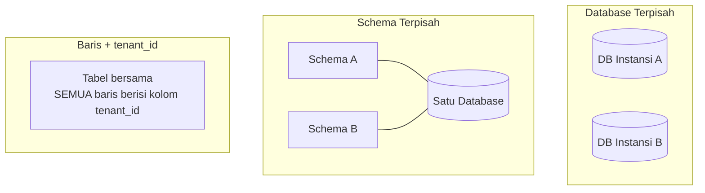

## TL;DR

Multi-tenancy adalah desain sistem yang melayani banyak pelanggan (tenant) independen — bisa berarti organisasi, instansi, atau perusahaan berbeda — dari **satu instalasi sistem yang sama**, dengan jaminan bahwa data dan operasi satu tenant tidak pernah terlihat atau terganggu tenant lain. Tiga model isolasi dari paling ketat ke paling longgar: **database terpisah per tenant** (paling terisolasi, paling mahal dioperasikan), **schema terpisah dalam database yang sama** (isolasi menengah), dan **baris data yang sama dengan kolom `tenant_id`** (paling murah dioperasikan, tapi butuh disiplin ketat mencegah kebocoran data lintas tenant lewat query yang lupa memfilter tenant_id).

## The Problem

Sebuah sistem legal-services melayani 13 instansi berbeda, dan pada awalnya setiap instansi punya instalasi sistem dan database sendiri-sendiri — 13 salinan aplikasi yang identik, masing-masing dengan database terpisah. Seiring waktu, ini jadi beban operasional yang berat: setiap perbaikan bug atau fitur baru harus di-deploy 13 kali, setiap kali ada masalah performa di satu instansi, tim harus mendiagnosis instalasi itu secara terpisah tanpa bisa membandingkan dengan pola di instansi lain, dan kapasitas server yang dialokasikan untuk instansi kecil dengan traffic rendah sering menganggur sia-sia sementara instansi besar dengan traffic tinggi kadang kekurangan kapasitas.

Tim mempertimbangkan menggabungkan seluruh 13 instansi jadi satu sistem multi-tenant — tapi ini memunculkan pertanyaan yang sangat sensitif untuk sistem legal-services pemerintah: bagaimana **menjamin** data kasus hukum satu instansi tidak pernah bisa dilihat atau diakses instansi lain, bahkan lewat bug yang tidak sengaja (query yang lupa memfilter berdasarkan instansi, atau kesalahan konfigurasi otorisasi)? Konsekuensi kebocoran data lintas instansi di sistem semacam ini bukan sekadar bug teknis — bisa jadi masalah hukum dan kepercayaan publik yang serius.

## Intuition

Cara paling mudah memahaminya: tiga model isolasi multi-tenancy seperti tiga cara berbeda menyewakan ruang penyimpanan. **Database terpisah per tenant** seperti setiap penyewa punya **gudang sendiri** dengan gembok sendiri — isolasi paling kuat (tidak mungkin barang penyewa satu tercampur penyewa lain, karena secara fisik berada di gudang berbeda), tapi paling mahal (setiap gudang butuh perawatan sendiri, meski sebagian besar gudang kecil jarang terpakai penuh). **Schema terpisah** seperti satu gudang besar dengan **ruang bersekat** untuk setiap penyewa — lebih murah dioperasikan (satu gudang, satu sistem keamanan utama), tapi sekat itu tetap memberi pemisahan fisik yang jelas. **Kolom `tenant_id`** seperti satu **ruang terbuka besar** tanpa sekat sama sekali, dengan setiap barang diberi label nama pemiliknya — paling murah dan paling efisien memakai ruang, tapi bergantung sepenuhnya pada disiplin **setiap orang** yang mengambil barang untuk selalu memeriksa label sebelum mengambil, karena tidak ada sekat fisik yang mencegah kesalahan.

Analogi ini bocor pada soal konsekuensi kesalahan. Kesalahan mengambil barang di gudang terbuka biasanya bisa diperbaiki (kembalikan barangnya). Kebocoran data lintas tenant lewat query yang lupa memfilter `tenant_id` di sistem software **tidak bisa "dikembalikan"** setelah data itu terlihat pihak yang tidak berhak — inilah kenapa model kolom `tenant_id`, meski paling murah, butuh lapisan pertahanan tambahan yang jauh lebih ketat dibanding sekadar "hati-hati saat menulis query".

## How It Works


Ketiga model punya trade-off yang berbeda di sumbu isolasi vs efisiensi operasional. Model database terpisah paling mudah **dijamin** aman (isolasi fisik), tapi paling mahal dioperasikan pada skala banyak tenant kecil (13 database terpisah butuh 13 kali overhead operasional dasar, meski masing-masing traffic-nya rendah). Model kolom `tenant_id` paling efisien (satu database, satu skema, kapasitas dibagi fleksibel), tapi menuntut **setiap** query yang menyentuh data tenant menyertakan filter `tenant_id` yang benar — tanpa kecuali, tanpa lupa satu kali pun.

## Under The Hood

Untuk model kolom `tenant_id`, pertahanan yang benar-benar aman **tidak boleh** hanya bergantung pada disiplin developer mengingat menambahkan `WHERE tenant_id = ?` di setiap query secara manual — pendekatan yang lebih tahan kesalahan manusia adalah menegakkan isolasi ini di **lapisan yang tidak bisa dilewati**: row-level security di level database (fitur yang tersedia di PostgreSQL, memaksa setiap query otomatis terfilter berdasarkan tenant tanpa developer perlu mengingatnya di setiap tempat), atau lapisan abstraksi data terpusat (repository layer, lihat [[../90 Architecture and Design/Handler-Service-Repository Layering|Handler-Service-Repository Layering]]) yang **selalu** menyuntikkan filter tenant secara otomatis, membuat query yang lupa memfilter tenant secara struktural tidak mungkin ditulis, bukan sekadar "seharusnya tidak lupa".

Model hybrid juga umum dipakai dalam praktik: data yang sangat sensitif (misalnya dokumen kasus hukum lengkap) disimpan dengan isolasi lebih ketat (schema terpisah atau bahkan database terpisah untuk tenant besar/sensitif), sementara data yang kurang sensitif atau butuh agregasi lintas tenant (metrik penggunaan, konfigurasi umum) memakai model kolom `tenant_id` yang lebih efisien — keputusan yang diambil sadar berdasarkan sensitivitas data, bukan satu model tunggal dipaksakan ke seluruh sistem.

## In Go

```go
package multitenancy

import (
	"context"
	"database/sql"
	"fmt"
)

type ctxKey struct{}

// TenantFromContext MEMAKSA setiap operasi mengetahui tenant-nya
// lewat context — TIDAK ada jalur kode yang bisa "lupa" tenant
// karena tenant selalu diteruskan eksplisit lewat ctx.
func TenantFromContext(ctx context.Context) (string, error) {
	tenantID, ok := ctx.Value(ctxKey{}).(string)
	if !ok || tenantID == "" {
		return "", fmt.Errorf("multitenancy: tenant ID tidak ada di context — operasi DITOLAK untuk mencegah kebocoran data")
	}
	return tenantID, nil
}

// TenantScopedRepository adalah SATU-SATUNYA jalur akses data —
// SETIAP query lewat repository ini otomatis terfilter tenant,
// developer TIDAK PERLU (dan TIDAK BISA) menulis query mentah yang
// lupa filter tenant.
type TenantScopedRepository struct {
	db *sql.DB
}

func (r *TenantScopedRepository) FindCases(ctx context.Context) ([]string, error) {
	tenantID, err := TenantFromContext(ctx)
	if err != nil {
		return nil, err
	}

	// Filter tenant_id DIPAKSAKAN di satu tempat ini — developer yang
	// memanggil FindCases TIDAK BISA melewatkan filter ini, karena
	// tidak ada jalur lain mengakses tabel kasus.
	rows, err := r.db.QueryContext(ctx, `SELECT id FROM kasus WHERE tenant_id = $1`, tenantID)
	if err != nil {
		return nil, fmt.Errorf("multitenancy: query gagal: %w", err)
	}
	defer rows.Close()

	var ids []string
	for rows.Next() {
		var id string
		if err := rows.Scan(&id); err != nil {
			return nil, err
		}
		ids = append(ids, id)
	}
	return ids, nil
}
```

## In His Stack

Untuk konsolidasi 13 aplikasi instansi jadi satu sistem multi-tenant, model **schema terpisah** sering jadi titik tengah yang realistis untuk sistem legal-services — memberi isolasi yang lebih kuat dan lebih mudah dijelaskan ke auditor/pemangku kepentingan dibanding kolom `tenant_id` murni (yang butuh kepercayaan penuh pada disiplin implementasi), sambil tetap jauh lebih efisien dioperasikan dibanding 13 database terpisah. Keputusan model isolasi juga berkaitan langsung dengan [[../80 Security/RBAC|RBAC]] — batas tenant dan batas peran/izin dalam satu tenant adalah dua lapisan otorisasi yang berbeda dan harus diperiksa keduanya, bukan mengandalkan salah satunya saja.

## Trade-offs and When Not To Use It

Database terpisah per tenant paling aman tapi paling mahal dioperasikan pada skala banyak tenant kecil — untuk 13 instansi dengan traffic yang bervariasi, overhead mengelola 13 instalasi terpisah (monitoring, backup, patching, scaling masing-masing) jauh lebih besar dibanding satu sistem multi-tenant yang dikelola terpusat. Kolom `tenant_id` paling efisien tapi butuh investasi rekayasa yang matang (row-level security atau repository layer yang memaksa filter tenant) untuk benar-benar aman — tanpa investasi ini, risikonya terlalu besar untuk data sensitif seperti kasus hukum. Untuk tenant tunggal yang tidak pernah butuh berbagi infrastruktur dengan tenant lain (misalnya sistem internal yang hanya dipakai satu organisasi), multi-tenancy sama sekali tidak relevan — kompleksitas tambahan tanpa manfaat apa pun.

## Common Mistakes

> [!warning] Jebakan
> Mengandalkan disiplin developer menambahkan `WHERE tenant_id = ?` secara manual di setiap query tanpa penegakan struktural (row-level security atau repository layer terpusat) — satu query yang lupa filter ini adalah kebocoran data lintas tenant yang tidak bisa "dikembalikan" setelah terjadi.

> [!warning] Jebakan
> Menganggap batas tenant dan batas peran/izin (RBAC) sebagai satu hal yang sama — keduanya adalah lapisan otorisasi berbeda; pengguna bisa punya peran yang sah dalam satu tenant, tapi itu tidak berarti otomatis boleh mengakses tenant lain, dan sebaliknya.

> [!warning] Jebakan
> Memilih model isolasi berdasarkan kemudahan implementasi awal tanpa mempertimbangkan sensitivitas data dan konsekuensi kebocoran — untuk data sekritis kasus hukum, kolom `tenant_id` murni tanpa penegakan struktural yang kuat adalah risiko yang tidak sepadan dengan penghematan biaya operasional yang didapat.

## Exercises

1. Jelaskan tiga model isolasi multi-tenancy, dari paling ketat ke paling longgar.
2. Kenapa model kolom `tenant_id` butuh penegakan struktural (row-level security atau repository terpusat), bukan cukup disiplin manual developer?
3. Jelaskan perbedaan batas tenant dan batas RBAC, dan kenapa keduanya harus diperiksa terpisah.
4. Desain terbuka: kamu memimpin konsolidasi 13 instalasi terpisah instansi menjadi satu sistem multi-tenant untuk sistem legal-services. Rancang model isolasi yang tepat, dengan mempertimbangkan bahwa data kasus hukum sangat sensitif tapi biaya operasional 13 instalasi terpisah sudah menjadi beban nyata. Jelaskan alasan memilih model itu dibanding dua alternatif lain.

> [!success]- Kunci jawaban
> **1.** Database terpisah per tenant (isolasi paling kuat, paling mahal dioperasikan); schema terpisah dalam database yang sama (isolasi menengah, lebih efisien); baris data dengan kolom `tenant_id` dalam tabel bersama (paling efisien, isolasi paling lemah, butuh disiplin ketat).
> **4.** Pilih model **schema terpisah** — setiap instansi mendapat schema sendiri dalam satu instalasi database yang sama. Alasan dibanding database terpisah: 13 database terpisah tetap membawa beban operasional signifikan (13 kali proses backup, monitoring, patching) yang jadi masalah nyata yang ingin diselesaikan konsolidasi ini; schema terpisah tetap memberi satu instalasi database untuk dikelola sambil mempertahankan pemisahan struktural yang jelas dan mudah diverifikasi (auditor bisa diperlihatkan langsung bahwa data instansi A secara fisik berada di schema berbeda dari instansi B, argumen yang lebih meyakinkan dibanding "kami punya filter `tenant_id` di setiap query"). Alasan dibanding kolom `tenant_id`: mengingat sensitivitas data kasus hukum dan konsekuensi hukum serius kalau terjadi kebocoran lintas instansi, isolasi struktural lewat schema terpisah memberi lapisan pertahanan tambahan yang tidak bergantung sepenuhnya pada kebenaran setiap baris kode aplikasi — risiko satu bug query yang lupa filter tenant tidak bisa menyebabkan kebocoran lintas instansi sama sekali, karena secara struktural query terhadap schema instansi A tidak pernah bisa "salah mengambil" data dari schema instansi B.

## Self-Check

- Sebutkan tiga model isolasi multi-tenancy.
- Kenapa kolom `tenant_id` butuh penegakan struktural, bukan cukup disiplin manual?
- Apa perbedaan batas tenant dan batas RBAC?
- Kapan database terpisah per tenant adalah pilihan yang tepat meski lebih mahal?

## Connected Notes

- [[../80 Security/RBAC|RBAC]] — batas tenant dan batas peran/izin adalah dua lapisan otorisasi berbeda yang harus diperiksa keduanya, tidak saling menggantikan.
- [[../90 Architecture and Design/Handler-Service-Repository Layering|Handler-Service-Repository Layering]] — repository layer yang terpusat adalah salah satu mekanisme penegakan struktural yang membuat filter tenant tidak bisa terlewat.
- [[Sharding Strategies and Hot Partitions]] — hot partition akibat satu tenant yang jauh lebih besar dari yang lain adalah pertimbangan langsung yang relevan dengan pilihan model isolasi multi-tenancy.
- [[../80 Security/Compliance Trails for Government Systems|Compliance Trails for Government Systems]] — sistem multi-tenant untuk instansi pemerintah punya kebutuhan audit yang harus membuktikan isolasi data antar instansi terjaga.
- [[Error Budgets]] — kelanjutan langsung: kelompok reliability engineering yang membahas bagaimana menetapkan dan menegakkan target keandalan yang bisa berbeda per tenant dalam sistem multi-tenant.

## Further Reading

- Dokumentasi resmi PostgreSQL bagian "Row Security Policies" — mekanisme konkret menegakkan isolasi tenant di level database untuk model kolom `tenant_id`.

## Catatan Saya

*Tulis di sini apakah 13 aplikasimu (atau sebagiannya) sudah, sedang, atau berencana dikonsolidasi jadi sistem multi-tenant, dan model isolasi apa yang dipakai atau dipertimbangkan.*
