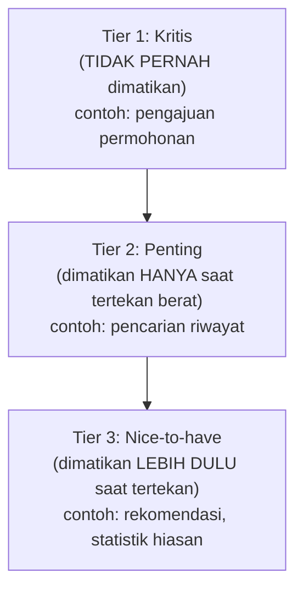

## TL;DR

[[../30 APIs and Web/Graceful Degradation|Graceful Degradation]] menjawab pertanyaan teknis "bagaimana sistem tetap memberi sebagian nilai saat komponen gagal" — mekanisme konkret di level kode (cache basi, circuit breaker, load shedding). Planned degradation menjawab pertanyaan **sebelum** itu, di level organisasi: **fitur mana** yang boleh dikorbankan lebih dulu saat sistem tertekan, dan **siapa yang memutuskan urutan prioritas itu** — keputusan yang idealnya diambil tenang di ruang rapat jauh sebelum krisis, bukan diputuskan terburu-buru oleh satu engineer di tengah insiden yang sedang berlangsung, tanpa wewenang atau konteks bisnis penuh untuk membuat trade-off semacam itu.

## The Problem

Sistem kasus hukum mengalami lonjakan traffic tak terduga menjelang tenggat pengajuan tahunan, dan mulai kehabisan kapasitas database. Seorang engineer yang sedang bertugas malam itu harus memutuskan cepat: fitur mana yang dimatikan sementara untuk mengurangi beban dan menyelamatkan fitur inti (pengajuan permohonan) tetap berjalan? Ia mematikan fitur notifikasi email karena terlihat "kurang penting" — tapi ternyata, notifikasi email itu yang dipakai supervisor untuk memantau kasus yang mendekati tenggat hukum, dan mematikannya tanpa sepengetahuan tim hukum menyebabkan beberapa kasus terlewat batas waktu tanpa peringatan, konsekuensi yang jauh lebih serius dari yang disadari engineer itu saat mengambil keputusan cepat di tengah tekanan.

Masalahnya bukan keputusan teknis mematikan fitur untuk menyelamatkan sistem — itu keputusan yang benar secara prinsip. Masalahnya adalah **prioritas** fitur mana yang boleh dikorbankan tidak pernah didiskusikan dan disepakati sebelumnya dengan pihak yang punya konteks bisnis penuh (tim hukum, dalam kasus ini) — keputusan yang seharusnya diambil berdasarkan pemahaman konsekuensi bisnis lengkap justru diambil sendirian oleh satu orang di tengah tekanan waktu, tanpa informasi yang cukup untuk membuat pilihan yang benar.

## Intuition

Cara paling mudah memahaminya: planned degradation seperti **rencana penjatahan** yang disiapkan pemerintah **sebelum** krisis pasokan terjadi — bukan diputuskan mendadak begitu krisis sudah berlangsung. Otoritas yang berwenang, bersama para ahli yang paham kebutuhan berbagai sektor, menentukan di muka: kalau pasokan air terbatas, rumah sakit dan fasilitas kritis dapat prioritas pertama, industri tertentu berikutnya, dan seterusnya — daftar prioritas yang disepakati tenang jauh sebelum krisis, supaya begitu krisis benar-benar terjadi, keputusan tinggal dijalankan sesuai rencana, bukan diperdebatkan dari nol di tengah kepanikan dengan informasi yang tidak lengkap.

Analogi ini nyaris sepenuhnya menangkap esensinya. Perbedaan penting: rencana penjatahan pemerintah biasanya jarang berubah drastis. Prioritas fitur dalam sistem software perlu **ditinjau ulang secara berkala** — fitur yang dulu dianggap "boleh dikorbankan" bisa jadi kritis seiring waktu (seperti notifikasi email di "The Problem", yang mungkin awalnya memang fitur sekunder tapi berkembang jadi alat pemantauan kritis tanpa perubahan status prioritasnya ikut diperbarui).

## How It Works


Klasifikasi fitur ke dalam tier prioritas ini dilakukan **sebelum** krisis, lewat diskusi eksplisit dengan pemangku kepentingan bisnis yang paham konsekuensi nyata setiap fitur — bukan tebakan teknis semata tentang "fitur mana yang terlihat kurang dipakai". Notifikasi email di "The Problem", kalau melalui proses klasifikasi eksplisit ini, kemungkinan besar akan diklasifikasi sebagai Tier 2 (penting untuk kepatuhan hukum) bukan Tier 3, mengubah keputusan yang diambil saat insiden nyata.

Rencana ini juga mendefinisikan **siapa** yang berwenang mengaktifkan degradasi tingkat tertentu — biasanya melalui prosedur yang jelas (bagian dari [[Incident Command and Blameless Postmortems]]) yang tidak mengharuskan satu engineer membuat keputusan bisnis besar sendirian, tapi juga tidak melumpuhkan respons cepat dengan birokrasi berlebihan saat keadaan benar-benar mendesak.

## Under The Hood

Klasifikasi tier yang matang mempertimbangkan lebih dari sekadar "seberapa sering fitur ini dipakai" — ia mempertimbangkan **konsekuensi kegagalan**, yang bisa sangat tidak intuitif dari sudut pandang teknis murni. Fitur yang jarang dipakai (statistik jarang diakses) tapi konsekuensi kegagalannya minimal jelas Tier 3. Fitur yang juga jarang dipakai tapi konsekuensi kegagalannya serius (notifikasi tenggat hukum yang hanya relevan menjelang deadline, tapi krusial justru di momen itu) butuh klasifikasi yang jauh lebih hati-hati — inilah kenapa proses ini butuh input dari pihak yang paham konteks bisnis, bukan diputuskan murni dari data pemakaian teknis.

Implementasi teknis dari planned degradation biasanya berupa feature flag (lihat [[../70 Infrastructure and Delivery/Feature Flags|Feature Flags]]) yang dikonfigurasi per tier — sekali rencana degradasi disetujui, mematikan seluruh Tier 3 saat tertekan bisa jadi operasi satu perintah yang cepat, bukan proses mematikan fitur satu per satu secara manual di tengah krisis yang justru menambah waktu respons di momen paling tidak tepat untuk itu.

## In Go

```go
package degradation

import "context"

type Tier int

const (
	TierCritical  Tier = 1 // TIDAK PERNAH dimatikan
	TierImportant Tier = 2 // dimatikan HANYA saat tertekan berat
	TierNiceToHave Tier = 3 // dimatikan LEBIH DULU
)

// FeatureRegistry menunjukkan klasifikasi yang DITENTUKAN SEBELUMNYA,
// disepakati bersama pemangku kepentingan bisnis — BUKAN keputusan
// ad-hoc satu engineer di tengah insiden.
var FeatureRegistry = map[string]Tier{
	"pengajuan_permohonan":   TierCritical,
	"notifikasi_tenggat":     TierImportant, // BUKAN TierNiceToHave!
	"pencarian_riwayat":      TierImportant,
	"rekomendasi_terkait":    TierNiceToHave,
	"statistik_dashboard":    TierNiceToHave,
}

// DegradationLevel menunjukkan AKTIVASI CEPAT — sekali disetujui,
// mematikan seluruh tier tertentu adalah satu perintah, bukan
// mematikan fitur satu per satu manual di tengah krisis.
type DegradationLevel struct {
	MaxActiveTier Tier // hanya fitur dengan tier <= ini yang AKTIF
}

func IsFeatureActive(feature string, level DegradationLevel) bool {
	tier, exists := FeatureRegistry[feature]
	if !exists {
		return true // fitur tak terdaftar, default aktif (perlu diklasifikasi!)
	}
	return tier <= level.MaxActiveTier
}

func ActivateEmergencyDegradation(ctx context.Context) DegradationLevel {
	// Aktifkan HANYA fitur kritis — Tier 2 dan 3 dimatikan.
	return DegradationLevel{MaxActiveTier: TierCritical}
}
```

## In His Stack

Untuk sistem legal-services dengan tenggat hukum yang ketat (seperti di "The Problem"), sesi klasifikasi tier fitur idealnya melibatkan bukan hanya tim teknis tapi juga tim hukum atau operasional yang memahami konsekuensi nyata setiap fitur — konsekuensi kegagalan yang tidak selalu terlihat jelas dari sudut pandang murni teknis (seberapa sering fitur diakses) tapi sangat nyata dari sudut pandang kepatuhan hukum (fitur yang jarang diakses tapi krusial menjelang tenggat). Untuk 13 aplikasi dengan tim yang berbeda-beda, memiliki template klasifikasi tier yang konsisten lintas aplikasi memudahkan koordinasi saat insiden yang melibatkan lebih dari satu aplikasi sekaligus.

## Trade-offs and When Not To Use It

Membangun klasifikasi tier yang matang dan disepakati bersama butuh waktu diskusi dengan pemangku kepentingan bisnis — untuk sistem kecil dengan sedikit fitur di mana konsekuensi setiap fitur mudah dipahami tanpa proses formal, investasi ini mungkin berlebihan. Untuk sistem dengan banyak fitur dan konsekuensi kegagalan yang tidak selalu intuitif dari sudut pandang teknis (seperti sistem legal-services), planned degradation adalah investasi yang jelas sepadan — biaya sesi klasifikasi di muka jauh lebih murah dibanding biaya keputusan salah yang diambil terburu-buru saat krisis sungguhan, seperti yang dialami di "The Problem".

## Common Mistakes

> [!warning] Jebakan
> Mengklasifikasikan fitur ke tier berdasarkan intuisi teknis semata (seberapa sering dipakai) tanpa melibatkan pemangku kepentingan bisnis yang paham konsekuensi nyata — persis kesalahan di "The Problem", notifikasi yang jarang dipakai tapi krusial diklasifikasikan salah.

> [!warning] Jebakan
> Tidak meninjau ulang klasifikasi tier secara berkala — fitur yang berkembang perannya seiring waktu (dari sekadar pelengkap jadi alat pemantauan kritis) bisa tertinggal dengan klasifikasi lama yang sudah tidak sesuai kenyataan.

> [!warning] Jebakan
> Membiarkan keputusan degradasi darurat diambil sendirian oleh satu orang tanpa wewenang atau konteks bisnis penuh di tengah insiden — mengulang pola yang seharusnya sudah dicegah dengan adanya rencana yang disepakati sebelumnya.

## Exercises

1. Jelaskan perbedaan planned degradation dan graceful degradation, dan bagaimana keduanya saling melengkapi.
2. Kenapa klasifikasi fitur ke tier prioritas sebaiknya melibatkan pemangku kepentingan bisnis, bukan hanya tim teknis?
3. Kenapa konsekuensi kegagalan fitur tidak selalu berkorelasi dengan seberapa sering fitur itu dipakai?
4. Desain terbuka: kamu diminta merancang rencana planned degradation untuk salah satu dari 13 aplikasimu, sistem legal-services dengan fitur pengajuan permohonan, verifikasi dokumen, notifikasi tenggat, pencarian riwayat kasus, dan dashboard statistik penggunaan. Klasifikasikan fitur-fitur ini ke tiga tier, dan jelaskan proses yang akan kamu jalankan untuk memvalidasi klasifikasi ini dengan pemangku kepentingan yang tepat.

> [!success]- Kunci jawaban
> **1.** Graceful degradation adalah mekanisme teknis di level kode yang menjawab "bagaimana" sistem tetap memberi sebagian nilai saat komponen gagal. Planned degradation adalah keputusan organisasi yang menjawab "fitur mana" yang boleh dikorbankan dan dalam urutan apa — planned degradation menentukan **rencana**, graceful degradation adalah **implementasi teknis** yang menjalankan rencana itu.
> **4.** Tier 1 (Kritis, tidak pernah dimatikan): pengajuan permohonan (fungsi inti sistem) dan verifikasi dokumen (bagian tak terpisahkan dari proses inti). Tier 2 (Penting, dimatikan hanya saat tertekan berat): notifikasi tenggat (konsekuensi hukum kalau terlewat, meski jarang diakses) dan pencarian riwayat kasus (penting untuk operasional tapi bukan bagian dari alur pengajuan aktif). Tier 3 (Nice-to-have, dimatikan lebih dulu): dashboard statistik penggunaan (informatif tapi tidak berdampak langsung pada proses hukum apa pun). Proses validasi: jadwalkan sesi khusus dengan perwakilan tim hukum/operasional (bukan hanya tim teknis) untuk meninjau klasifikasi awal ini, secara eksplisit menanyakan "apa konsekuensi nyata kalau fitur ini mati selama satu jam, satu hari" untuk setiap fitur — pertanyaan yang mengungkap konsekuensi seperti notifikasi tenggat yang mungkin tidak terlihat jelas dari data pemakaian teknis semata, dan dokumentasikan hasil kesepakatan ini sebagai rujukan resmi yang bisa diakses tim teknis saat insiden benar-benar terjadi.

## Self-Check

- Apa perbedaan planned degradation dan graceful degradation?
- Kenapa klasifikasi tier butuh input pemangku kepentingan bisnis?
- Kenapa konsekuensi kegagalan tidak selalu berkorelasi dengan frekuensi pemakaian?
- Kenapa klasifikasi tier perlu ditinjau ulang secara berkala?

## Connected Notes

- [[../30 APIs and Web/Graceful Degradation|Graceful Degradation]] — planned degradation adalah lapisan keputusan organisasi di atas mekanisme teknis yang dibahas di note itu.
- [[Chaos Engineering]] — eksperimen chaos adalah cara memverifikasi bahwa implementasi teknis planned degradation benar-benar berfungsi seperti rencana yang disepakati.
- [[../70 Infrastructure and Delivery/Feature Flags|Feature Flags]] — mekanisme teknis yang paling umum dipakai mengimplementasikan aktivasi cepat degradasi per tier.
- [[Incident Command and Blameless Postmortems]] — keputusan mengaktifkan tingkat degradasi tertentu selama insiden adalah bagian dari struktur incident command yang dibahas di note itu.
- [[Disaster Recovery - RTO and RPO]] — kelanjutan langsung: planned degradation adalah salah satu strategi mengurangi dampak sebelum skenario disaster recovery penuh dibutuhkan.

## Further Reading

- Google, "Site Reliability Engineering" (buku, tersedia daring gratis) — bab tentang graceful degradation dan load shedding membahas prinsip serupa dalam konteks operasional Google.

## Catatan Saya

*Tulis di sini apakah salah satu dari 13 aplikasimu punya rencana degradasi yang disepakati eksplisit, atau keputusan semacam ini masih diambil ad-hoc setiap kali insiden terjadi.*
