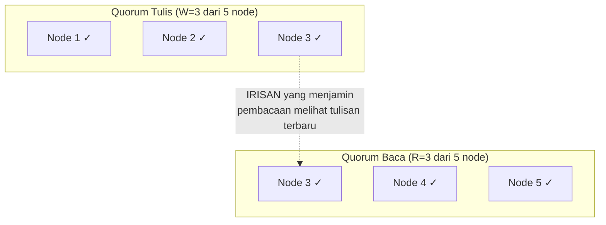

## TL;DR

Quorum adalah jumlah minimum node yang harus setuju sebelum sebuah operasi (baca atau tulis) dianggap sah — biasanya mayoritas (`N/2 + 1` dari total `N` node). Alasan mayoritas dipilih, bukan angka lain: dua kelompok mayoritas dari node yang sama **selalu** punya setidaknya satu node yang beririsan di antara keduanya (secara matematis tidak mungkin dua mayoritas dari himpunan yang sama sepenuhnya terpisah) — irisan ini yang menjamin konsistensi tanpa perlu setiap node saling bicara setiap saat. Quorum adalah mekanisme praktis yang mengubah trade-off abstrak CAP theorem jadi angka konkret yang bisa dikonfigurasi: berapa banyak node yang harus setuju untuk baca, berapa banyak untuk tulis, dan bagaimana keduanya berinteraksi menentukan jaminan consistency yang benar-benar didapat.

## The Problem

Sebuah sistem menyimpan data di lima node untuk redundansi. Desain awal mengizinkan tulisan dianggap berhasil begitu **satu** node saja mengonfirmasinya (demi latency rendah), dan pembacaan juga cukup dari **satu** node mana pun yang kebetulan paling dekat atau paling cepat merespons. Suatu saat, seorang pengguna menulis data baru yang kebetulan hanya sempat tersimpan di Node 1 sebelum sistem melanjutkan (empat node lain belum sempat menerima salinannya). Pengguna lain, hampir bersamaan, membaca data yang sama — tapi permintaan bacanya kebetulan diarahkan ke Node 3, yang belum menerima tulisan terbaru itu. Pengguna kedua ini melihat data **lama**, meski tulisan baru sudah "berhasil" menurut sistem.

Masalahnya bukan bug — sistem berfungsi persis sesuai desain yang dipilih (satu konfirmasi untuk tulis, satu node mana pun untuk baca). Masalahnya adalah desain ini tidak menjamin **irisan** antara node yang menerima tulisan dan node yang dibaca — tanpa jaminan irisan itu, tidak ada cara memastikan pembacaan selalu melihat tulisan terbaru, persis kelemahan yang quorum secara matematis dirancang untuk menutup.

## Intuition

Cara paling mudah memahaminya: bayangkan lima orang di sebuah komite, dan setiap keputusan penting butuh **mayoritas** (minimal tiga dari lima) setuju sebelum dianggap sah. Kalau satu keputusan disetujui oleh tiga orang tertentu, dan keputusan lain (yang harus konsisten dengan keputusan pertama) juga butuh persetujuan tiga orang, secara matematis **pasti** ada minimal satu orang yang terlibat di kedua keputusan itu — dari lima orang, dua kelompok yang masing-masing beranggotakan tiga orang tidak mungkin sepenuhnya terpisah (3+3=6, lebih banyak dari 5 total). Orang yang beririsan ini "membawa" pengetahuan dari keputusan pertama ke keputusan kedua, menjamin konsistensi tanpa seluruh lima orang harus selalu hadir bersamaan setiap saat.

Analogi ini nyaris sepenuhnya menangkap esensi quorum. Yang tidak tertangkap: pada sistem terdistribusi nyata, "kehadiran" itu bukan pertemuan fisik sekali waktu — quorum untuk **tulis** dan quorum untuk **baca** bisa terjadi di waktu yang jauh berbeda, dan jaminannya bergantung pada bagaimana kedua ukuran quorum ini dikonfigurasi relatif satu sama lain, bukan sekadar "mayoritas hadir" dalam satu momen.

## How It Works


Node 3 hadir di kedua quorum — inilah irisan yang menjamin siapa pun yang membaca dengan quorum baca akan menemukan setidaknya satu node yang tahu tulisan terbaru. Aturan formalnya: kalau `W` (jumlah node yang harus mengonfirmasi tulis) ditambah `R` (jumlah node yang harus mengonfirmasi baca) **lebih besar** dari `N` (total node), irisan dijamin ada — inilah rumus `W + R > N` yang jadi dasar mengonfigurasi trade-off consistency-latency secara konkret.

Konfigurasi `W` dan `R` bisa disesuaikan untuk kebutuhan berbeda: `W=N, R=1` (tulis butuh semua node setuju, baca cukup satu node mana pun) memberi baca super cepat dengan tulis yang lambat dan rentan gagal kalau satu node saja bermasalah. `W=1, R=N` adalah kebalikannya. Titik tengah yang paling umum, `W=R=(N/2)+1` (keduanya mayoritas), menyeimbangkan latency baca dan tulis sambil tetap menjamin `W+R>N`.

## Under The Hood

Quorum menjawab pertanyaan **berapa banyak node yang harus setuju**, tapi tidak dengan sendirinya menjawab pertanyaan **bagaimana** node-node itu menyetujui sesuatu secara koheren saat ada konflik (dua tulisan bersamaan ke data yang sama dari node berbeda). Inilah kenapa quorum sering jadi bahan bangunan untuk algoritma consensus yang lebih lengkap seperti [[Consensus - Raft]] — Raft memakai mayoritas (bentuk quorum) untuk memutuskan siapa leader dan kapan sebuah entri log dianggap ter-commit, tapi menambah struktur tambahan (leader tunggal, log berurutan) yang tidak disediakan quorum murni sendirian.

Poin yang sering luput: quorum menjamin konsistensi **hanya** kalau setiap operasi benar-benar menunggu konfirmasi dari jumlah node yang disyaratkan **sebelum** dianggap berhasil — sistem yang mengklaim memakai quorum tapi diam-diam melanjutkan sebelum quorum benar-benar terpenuhi (demi mengejar latency) kehilangan jaminan matematis yang jadi alasan quorum dipakai sejak awal.

## In Go

```go
package quorum

import (
	"context"
	"fmt"
	"sync"
)

type Node interface {
	Write(ctx context.Context, key, value string) error
	Read(ctx context.Context, key string) (string, error)
}

// QuorumConfig SECARA EKSPLISIT menyatakan trade-off yang dipilih —
// W+R > N menjamin irisan, W+R <= N BERARTI kehilangan jaminan
// konsistensi baca-setelah-tulis.
type QuorumConfig struct {
	W, R, N int
}

func (c QuorumConfig) GuaranteesConsistency() bool {
	return c.W+c.R > c.N
}

// WriteQuorum mengirim tulisan ke SEMUA node secara paralel, tapi
// baru dianggap berhasil setelah SEJUMLAH W node mengonfirmasi —
// tidak lebih cepat dari itu, meski node lain belum merespons.
func WriteQuorum(ctx context.Context, nodes []Node, config QuorumConfig, key, value string) error {
	var wg sync.WaitGroup
	acked := make(chan struct{}, len(nodes))

	for _, node := range nodes {
		wg.Add(1)
		go func(n Node) {
			defer wg.Done()
			if err := n.Write(ctx, key, value); err == nil {
				acked <- struct{}{}
			}
		}(node)
	}

	go func() {
		wg.Wait()
		close(acked)
	}()

	count := 0
	for range acked {
		count++
		if count >= config.W {
			return nil // quorum tulis terpenuhi
		}
	}
	return fmt.Errorf("quorum: hanya %d/%d node mengonfirmasi, butuh W=%d", count, len(nodes), config.W)
}
```

## In His Stack

Sistem replikasi database yang dipakai 13 aplikasi (baik MariaDB dengan setup multi-node, atau sistem terdistribusi lain yang mungkin diadopsi ke depan) sering menyediakan opsi konfigurasi yang secara implisit adalah pengaturan quorum — memahami rumus `W+R>N` membantu menjelaskan **kenapa** pengaturan replikasi tertentu (misalnya semi-synchronous replication) memberi jaminan tertentu, dan kenapa pengaturan lain (replikasi asinkron murni) tidak menjamin baca-setelah-tulis konsisten sama sekali, sesuatu yang penting dipahami sebelum memutuskan boleh atau tidak membaca dari replica untuk kebutuhan tertentu.

## Trade-offs and When Not To Use It

Quorum yang besar (mendekati `N`) memberi consistency lebih kuat tapi mengorbankan availability — satu-dua node gagal saja bisa membuat quorum tidak tercapai, menghentikan operasi sepenuhnya. Quorum yang kecil memberi availability lebih tinggi tapi melemahkan (atau menghilangkan) jaminan consistency, seperti "The Problem". Untuk sistem dengan sedikit node (tiga atau kurang) yang semuanya harus tetap berjalan untuk sistem berfungsi sama sekali, quorum ketat mungkin terasa berlebihan — tapi justru pada sistem kecil inilah quorum sering paling murah diterapkan (mayoritas dari tiga node hanya butuh dua, overhead yang kecil untuk jaminan yang signifikan).

## Common Mistakes

> [!warning] Jebakan
> Mengonfigurasi `W` dan `R` sehingga `W+R <= N` sambil tetap mengasumsikan baca selalu melihat tulisan terbaru — kehilangan jaminan irisan yang jadi dasar matematis konsistensi quorum, persis masalah di "The Problem".

> [!warning] Jebakan
> Menganggap quorum saja cukup untuk menyelesaikan konflik tulisan bersamaan ke data yang sama — quorum menjamin **berapa banyak** node yang harus setuju, bukan **bagaimana** menyelesaikan konflik saat dua tulisan bersamaan terjadi; itu butuh mekanisme tambahan seperti yang disediakan algoritma consensus penuh.

> [!warning] Jebakan
> Mengklaim memakai quorum tapi diam-diam melanjutkan operasi sebelum jumlah node yang disyaratkan benar-benar mengonfirmasi (demi mengejar latency) — meniadakan seluruh jaminan matematis yang jadi alasan quorum dipakai.

## Exercises

1. Jelaskan kenapa mayoritas (bukan angka lain) menjamin irisan antara dua kelompok node yang berbeda.
2. Apa rumus `W+R>N`, dan apa konsekuensinya kalau rumus ini tidak dipenuhi?
3. Kenapa quorum sendirian tidak cukup menyelesaikan konflik tulisan bersamaan, dan mekanisme tambahan apa yang biasanya dibutuhkan?
4. Desain terbuka: kamu merancang sistem penyimpanan terdistribusi lima node untuk data konfigurasi kritis salah satu dari 13 aplikasi, di mana pembacaan jauh lebih sering terjadi dibanding penulisan (rasio 100:1). Rancang konfigurasi `W` dan `R` yang menjamin consistency sambil mengoptimalkan untuk pola akses ini, dan jelaskan alasannya.

> [!success]- Kunci jawaban
> **1.** Dari total `N` node, dua kelompok mayoritas (masing-masing lebih dari `N/2`) yang dijumlahkan akan selalu melebihi `N` — secara matematis, dua himpunan yang jumlahnya melebihi total anggota yang tersedia tidak mungkin sepenuhnya terpisah, harus ada irisan minimal satu anggota.
> **4.** Karena baca jauh lebih sering dari tulis, optimalkan `R` sekecil mungkin dan terima `W` yang lebih besar (tulis yang jarang terjadi boleh sedikit lebih lambat, demi baca yang sering terjadi jadi secepat mungkin): pilih `R=1` (baca dari satu node mana pun, tercepat) dan `W=5` (tulis harus dikonfirmasi SEMUA node) — ini menjamin `W+R=6 > N=5`, memenuhi syarat konsistensi, sekaligus membuat operasi baca (yang dominan) berjalan secepat mungkin dengan mengorbankan latency tulis (yang jarang terjadi, jadi lebih bisa diterima jika sedikit lebih lambat). Trade-off ini masuk akal justru karena pola akses 100:1 — mengoptimalkan untuk operasi yang jarang (tulis) dengan mengorbankan yang sering (baca) akan menjadi keputusan yang salah arah untuk pola akses ini.

## Self-Check

- Kenapa mayoritas menjamin irisan antara dua kelompok node?
- Apa rumus `W+R>N`, dan apa artinya kalau rumus ini dilanggar?
- Kenapa quorum sendirian tidak cukup menyelesaikan konflik tulisan bersamaan?
- Bagaimana konfigurasi `W` dan `R` diatur untuk pola akses yang dominan baca?

## Connected Notes

- [[Failure Detectors]] — quorum memberi cara membuat keputusan aman meski status node individual tidak pernah 100% pasti, seperti dibahas di note sebelumnya.
- [[CAP Theorem and PACELC]] — konfigurasi `W` dan `R` adalah cara konkret mengimplementasikan trade-off consistency-availability yang dibahas abstrak di CAP theorem.
- [[Consensus - Raft]] — kelanjutan langsung: quorum adalah bahan bangunan inti yang dipakai Raft untuk memutuskan leader dan commit log entry.
- [[../40 Databases/Read Replicas and Replication Lag|Read Replicas and Replication Lag]] — replikasi database asinkron adalah contoh sistem yang secara implisit memilih `R=1` tanpa jaminan `W+R>N`, dengan konsekuensi yang sekarang lebih mudah dipahami lewat note ini.
- [[Leader Election and Split Brain]] — quorum adalah mekanisme utama mencegah dua kelompok node yang terpisah (partition) sama-sama mengklaim diri sebagai mayoritas yang sah.

## Further Reading

- David K. Gifford, "Weighted Voting for Replicated Data" (1979) — paper awal yang meletakkan dasar formal untuk quorum dalam sistem terdistribusi.

## Catatan Saya

*Tulis di sini sistem replikasi di salah satu dari 13 aplikasimu, dan apakah konfigurasinya (kalau kamu tahu detailnya) memenuhi `W+R>N` atau tidak.*
