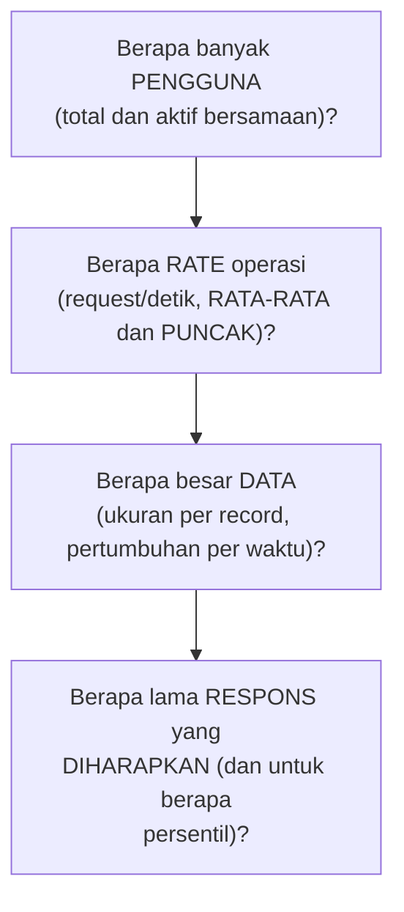

## TL;DR

Sebelum arsitektur bisa dirancang, kebutuhan yang samar ("sistem ini harus cepat dan bisa menangani banyak pengguna") harus diterjemahkan jadi **angka konkret** — berapa request per detik, berapa besar data yang disimpan, berapa banyak pengguna aktif bersamaan. Reading requirements adalah keterampilan menggali angka nyata dari pemangku kepentingan yang sering hanya punya gambaran kualitatif, bukan kuantitatif. Capacity estimation adalah menerjemahkan angka-angka itu jadi perkiraan kebutuhan infrastruktur (berapa server, berapa kapasitas database) — perhitungan kasar (back-of-the-envelope) yang cukup akurat untuk membuat keputusan desain awal, tanpa perlu presisi sempurna yang toh tidak mungkin dicapai di tahap perencanaan.

## The Problem

Seorang engineer diminta merancang sistem baru untuk menangani pengajuan permohonan online, dengan spesifikasi dari pemangku kepentingan bisnis: "sistem harus bisa menangani lonjakan traffic saat musim pengajuan tahunan, dan responsnya harus cepat." Engineer ini langsung mulai merancang arsitektur — memilih database, menentukan jumlah server, merencanakan caching — berdasarkan asumsi sendiri tentang apa yang dimaksud "lonjakan" dan "cepat", tanpa pernah menanyakan angka konkret.

Sistem yang dirancang berdasarkan asumsi ini ternyata jauh melebihi kebutuhan sebenarnya (over-engineered, biaya infrastruktur yang tidak perlu) untuk skenario normal, tapi ternyata **tidak cukup** untuk lonjakan sungguhan yang terjadi — karena "lonjakan" yang dibayangkan pemangku kepentingan bisnis (berdasarkan pengalaman mereka mengelola proses manual sebelumnya) ternyata jauh lebih besar dari yang dibayangkan engineer (yang mengestimasi berdasarkan pengalaman sistem serupa di konteks berbeda). Kedua belah pihak sama-sama yakin mereka "sudah membicarakan kebutuhan sistem ini" — tapi tidak pernah benar-benar menyepakati angka yang sama.

## Intuition

Cara paling mudah memahaminya: reading requirements seperti **wawancara dokter dengan pasien yang mengeluh "sakit"** tanpa detail lebih lanjut. Dokter yang baik tidak langsung meresepkan obat berdasarkan kata "sakit" saja — ia menggali lebih dalam: sakit di mana, sejak kapan, seberapa parah dari skala 1-10, apa yang memperburuk atau meredakannya. Jawaban kualitatif pasien ("sangat sakit") diterjemahkan jadi informasi yang bisa dipakai membuat keputusan medis konkret. Reading requirements melakukan hal yang sama untuk kebutuhan sistem — "harus cepat" diterjemahkan jadi "response time di bawah berapa milidetik, untuk berapa persen request", "banyak pengguna" diterjemahkan jadi angka pengguna aktif bersamaan yang konkret.

Analogi ini bocor pada soal siapa yang punya jawaban pasti. Pasien biasanya tahu persis di mana rasa sakitnya, hanya perlu dipandu mengartikulasikannya. Pemangku kepentingan bisnis sering **benar-benar tidak tahu** angka pasti yang mereka butuhkan — "lonjakan traffic saat musim pengajuan" mungkin memang belum pernah diukur secara eksplisit sebelumnya. Bagian dari keterampilan ini adalah membantu menemukan atau memperkirakan angka itu bersama-sama, bukan mengasumsikan mereka selalu tahu jawabannya dan hanya perlu ditanya dengan benar.

## How It Works

Pertanyaan inti yang perlu dijawab sebelum estimasi kapasitas bisa dimulai:


Untuk setiap pertanyaan ini, jawaban langsung dari pemangku kepentingan sering berupa perkiraan kasar atau bahkan tidak tahu — bagian penting dari keterampilan ini adalah membantu **menurunkan** angka dari data yang **memang** mereka miliki: "berapa banyak pengajuan yang biasanya diterima per hari selama musim normal, dan berapa kali lipat biasanya naik saat musim puncak" adalah pertanyaan yang lebih mudah dijawab dari pengalaman operasional nyata, dan dari situ engineer bisa menurunkan estimasi rate request yang dibutuhkan.

Estimasi kapasitas (back-of-the-envelope) memakai angka-angka ini untuk perhitungan kasar: kalau rate puncak adalah 100 request per detik, dan setiap request rata-rata memakan waktu 50ms untuk diproses satu server, [[../50 Concurrency and Performance/Little's Law|Little's Law]] memberi cara menghitung berapa banyak kapasitas konkuren yang dibutuhkan untuk melayani rate itu tanpa antrean menumpuk — perhitungan sederhana yang cukup akurat untuk keputusan desain awal (berapa banyak instance dibutuhkan), meski jauh dari presisi sempurna yang baru bisa diverifikasi lewat load testing sungguhan nanti.

## Under The Hood

Perhitungan back-of-the-envelope sengaja **kasar** dan cepat — tujuannya bukan angka presisi sampai desimal, tapi **orde besar** yang cukup untuk membuat keputusan desain (apakah butuh 3 server atau 300 server adalah perbedaan besar yang menentukan arsitektur secara mendasar; apakah butuh 10 atau 12 server adalah detail yang bisa disesuaikan belakangan lewat load testing dan monitoring nyata). Kesalahan yang sering terjadi adalah menghabiskan waktu berlebihan mengejar presisi di tahap perencanaan awal, padahal ketidakpastian mendasar (apakah asumsi rate traffic itu sendiri akurat) jauh lebih besar dari presisi perhitungan matematis di atasnya — presisi angka yang dihitung tidak bisa melebihi presisi data mentah yang jadi dasarnya.

Estimasi yang baik juga secara eksplisit mencatat **asumsi** yang dipakai (bukan hanya hasil akhirnya) — "estimasi ini mengasumsikan rasio baca-tulis 10:1 berdasarkan pola sistem serupa, karena data historis belum tersedia" adalah asumsi yang bisa diverifikasi atau dikoreksi belakangan begitu data nyata mulai terkumpul, jauh lebih berguna dibanding angka final tanpa jejak bagaimana angka itu didapat.

## In Go

```go
package capacity

import "math"

// CapacityEstimate menunjukkan gagasan inti: hasil PERHITUNGAN
// KASAR yang secara eksplisit mencatat asumsi-asumsinya, bukan
// angka presisi yang menyembunyikan ketidakpastian di baliknya.
type CapacityEstimate struct {
	PeakRequestsPerSecond float64
	AvgProcessingTimeMs   float64
	Assumptions           []string
}

// RequiredConcurrency menerapkan Little's Law: L = λ × W
// (jumlah request konkuren = rate × waktu proses).
func (c CapacityEstimate) RequiredConcurrency() float64 {
	avgProcessingTimeSeconds := c.AvgProcessingTimeMs / 1000
	return c.PeakRequestsPerSecond * avgProcessingTimeSeconds
}

// RequiredServers menghitung PERKIRAAN KASAR jumlah server —
// SENGAJA dibulatkan ke atas dan diberi margin, karena presisi
// sempurna di tahap ini tidak realistis DAN tidak dibutuhkan.
func (c CapacityEstimate) RequiredServers(capacityPerServer float64, safetyMargin float64) int {
	concurrency := c.RequiredConcurrency()
	withMargin := concurrency * (1 + safetyMargin)
	return int(math.Ceil(withMargin / capacityPerServer))
}

func Example() CapacityEstimate {
	return CapacityEstimate{
		PeakRequestsPerSecond: 100,
		AvgProcessingTimeMs:   50,
		Assumptions: []string{
			"Rate puncak diasumsikan 5x rate normal berdasarkan pola musim pengajuan tahun lalu",
			"Waktu proses rata-rata diukur dari sistem serupa yang sudah berjalan, belum diverifikasi untuk sistem baru ini",
		},
	}
}
```

## In His Stack

Untuk sistem legal-services yang menghadapi lonjakan musiman (seperti tenggat pengajuan tahunan), reading requirements yang baik berarti secara eksplisit menanyakan data historis operasional — berapa banyak pengajuan yang diterima instansi secara manual atau lewat sistem lama selama periode puncak, sebagai dasar mengestimasi rate traffic sistem baru, alih-alih menebak berdasarkan asumsi teknis semata seperti di "The Problem". Untuk 13 aplikasi dengan skala dan pola pemakaian yang berbeda-beda antar instansi, estimasi kapasitas idealnya dilakukan per aplikasi berdasarkan data historis masing-masing, bukan menyeragamkan asumsi kapasitas untuk semua instansi tanpa mempertimbangkan perbedaan skala nyata mereka.

## Trade-offs and When Not To Use It

Investasi waktu menggali requirements detail dan melakukan estimasi kapasitas formal bisa terasa berlebihan untuk proyek kecil dengan skala yang jelas dan risiko rendah — untuk skrip internal sederhana yang jelas hanya dipakai segelintir orang, proses formal ini adalah overhead yang tidak sepadan. Investasi ini jelas sepadan untuk sistem yang akan menghadapi skala tidak pasti atau kritis (seperti sistem dengan lonjakan musiman yang konsekuensinya serius kalau kapasitas tidak cukup) — biaya menggali requirements dan estimasi di awal jauh lebih murah dibanding biaya mendesain ulang arsitektur setelah sistem terbukti tidak cukup kapasitas di production.

## Common Mistakes

> [!warning] Jebakan
> Merancang arsitektur berdasarkan asumsi sendiri tentang kebutuhan tanpa menggali angka konkret dari pemangku kepentingan — persis kesalahan di "The Problem", menghasilkan sistem yang tidak sesuai kebutuhan sebenarnya (baik over-engineered maupun kurang kapasitas).

> [!warning] Jebakan
> Mengejar presisi berlebihan dalam estimasi kapasitas di tahap perencanaan awal, menghabiskan waktu berlebihan pada perhitungan detail padahal data mentah yang jadi dasarnya sendiri masih berupa perkiraan kasar.

> [!warning] Jebakan
> Tidak mencatat asumsi yang dipakai dalam estimasi kapasitas — angka final tanpa jejak asumsi di baliknya sulit dikoreksi atau diverifikasi belakangan begitu data nyata mulai terkumpul.

## Exercises

1. Jelaskan kenapa kebutuhan kualitatif ("harus cepat dan bisa menangani banyak pengguna") harus diterjemahkan jadi angka konkret sebelum arsitektur bisa dirancang dengan baik.
2. Kenapa estimasi kapasitas back-of-the-envelope sengaja dibuat kasar, bukan berusaha presisi sempurna?
3. Bagaimana Little's Law dipakai menerjemahkan rate request dan waktu proses jadi kebutuhan kapasitas konkuren?
4. Desain terbuka: kamu diminta merancang sistem baru untuk pengajuan permohonan online, dan pemangku kepentingan bisnis hanya bilang "harus bisa menangani lonjakan saat musim pengajuan tahunan dan responsnya harus cepat". Rancang daftar pertanyaan yang akan kamu ajukan untuk menggali requirements konkret, dan jelaskan bagaimana kamu akan menurunkan estimasi kapasitas dari jawaban yang mungkin kamu dapat.

> [!success]- Kunci jawaban
> **1.** Keputusan arsitektur (berapa server, database mana, perlu caching atau tidak, perlu sharding atau tidak) semuanya bergantung pada skala nyata yang harus dilayani — tanpa angka konkret, setiap keputusan ini hanya tebakan yang bisa jauh meleset ke arah manapun (terlalu besar dan mahal, atau terlalu kecil dan gagal menangani beban sungguhan).
> **4.** Pertanyaan yang diajukan: "Berapa banyak pengajuan yang biasanya diterima per hari di musim normal, berdasarkan data sistem lama atau proses manual sebelumnya?" "Berapa kali lipat biasanya naik selama seminggu terakhir mendekati tenggat, berdasarkan pengalaman tahun-tahun sebelumnya?" "Kalau 'cepat' — apakah ada pengalaman konkret sistem lama yang terasa lambat, berapa detik yang dianggap 'terlalu lama' oleh pengguna?" "Berapa banyak petugas/pengguna yang biasanya mengakses sistem bersamaan di jam sibuk?" Dari jawaban ini (misalnya: normal 1000 pengajuan/hari, puncak 5x lipat jadi 5000/hari terkonsentrasi di jam kerja, "cepat" berarti di bawah 2 detik), turunkan estimasi: rate puncak per detik dihitung dari 5000 pengajuan dibagi jam kerja efektif (misalnya 8 jam = 28800 detik, menghasilkan sekitar 0.17 pengajuan/detik rata-rata — tapi karena traffic tidak merata sepanjang hari, kalikan dengan faktor puncak tambahan, misalnya 5-10x rata-rata untuk jam tersibuk, menghasilkan perkiraan realistis untuk kapasitas yang harus disiapkan, dicatat sebagai asumsi eksplisit yang bisa dikoreksi begitu data traffic nyata mulai terkumpul setelah sistem berjalan).

## Self-Check

- Kenapa kebutuhan kualitatif harus diterjemahkan jadi angka konkret?
- Kenapa estimasi back-of-the-envelope sengaja dibuat kasar?
- Bagaimana Little's Law dipakai dalam estimasi kapasitas?
- Kenapa asumsi dalam estimasi harus dicatat eksplisit?

## Connected Notes

- [[../50 Concurrency and Performance/Little's Law|Little's Law]] — alat matematis inti yang dipakai menerjemahkan rate dan waktu proses jadi kebutuhan kapasitas konkuren.
- [[Backfilling Large Datasets Safely]] — kelanjutan langsung: estimasi kapasitas yang akurat sering jadi dasar keputusan apakah sebuah operasi (seperti backfill) butuh strategi khusus atau bisa dijalankan sederhana.
- [[Forming and Defending Trade-offs]] — kelanjutan langsung: setelah requirements dan estimasi kapasitas jelas, keputusan trade-off arsitektural bisa dibentuk dan dipertahankan dengan dasar yang lebih kuat.
- [[../50 Concurrency and Performance/Load Testing|Load Testing]] — estimasi kapasitas adalah perkiraan awal yang harus diverifikasi lewat load testing sungguhan setelah sistem dibangun.
- [[Cost Engineering]] — estimasi kapasitas adalah masukan langsung untuk perhitungan biaya infrastruktur yang dibahas di klaster yang sama.

## Further Reading

- Materi umum industri mengenai system design interview dan capacity planning, dipopulerkan luas lewat buku dan kursus persiapan wawancara teknis — meski konteksnya wawancara, prinsipnya sama berlaku untuk perencanaan sistem nyata.

## Catatan Saya

*Tulis di sini proyek di pekerjaanmu yang requirementsnya tidak pernah digali secara konkret sebelum desain dimulai, dan konsekuensi apa yang muncul karenanya.*
