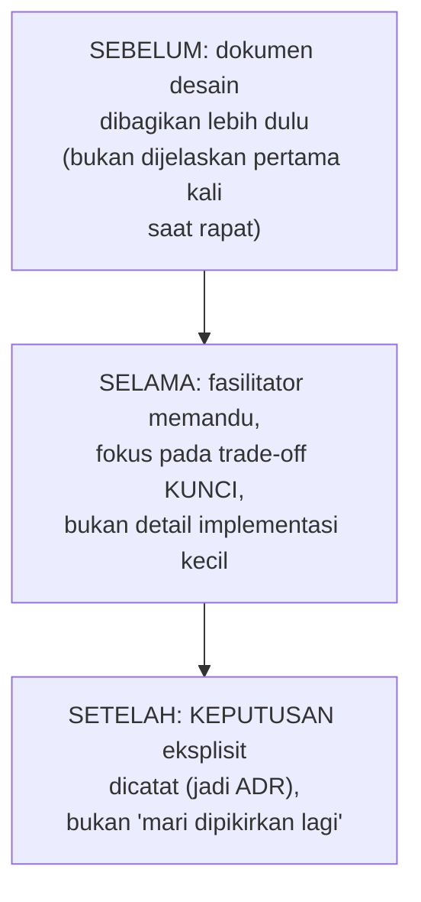

## TL;DR

Design review adalah forum terstruktur untuk mengevaluasi rancangan sistem **sebelum** implementasi dimulai — kesempatan menemukan masalah desain saat masih murah diperbaiki (di atas kertas), bukan setelah ribuan baris kode ditulis berdasarkan asumsi yang keliru. Design review yang baik menghasilkan **keputusan**, bukan sekadar kumpulan opini yang saling bertabrakan tanpa kesimpulan jelas — perbedaan yang bergantung sepenuhnya pada bagaimana forum ini dipandu, bukan pada seberapa pintar orang-orang yang hadir di dalamnya.

## The Problem

Sebuah tim mengadakan rapat desain untuk sistem baru, mengundang sepuluh orang dari berbagai tim yang mungkin terkait. Rapat berlangsung dua jam, penuh diskusi ramai — tapi begitu selesai, tidak ada satu keputusan pun yang benar-benar disepakati. Beberapa orang berpendapat pendekatan A lebih baik, beberapa lain condong ke pendekatan B, dan rapat berakhir dengan "mari kita pikirkan lagi" tanpa tindak lanjut jelas siapa yang memikirkan apa dan kapan keputusan akan diambil.

Dua minggu kemudian, engineer yang bertanggung jawab atas implementasi, karena tidak ada keputusan jelas dari rapat, akhirnya memutuskan sendiri berdasarkan preferensi pribadinya — bukan karena itu keputusan terbaik yang muncul dari diskusi kolektif, tapi karena seseorang harus memutuskan dan tidak ada mekanisme jelas siapa yang berwenang melakukannya setelah forum diskusi yang ramai tapi tidak konklusif itu. Waktu sepuluh orang selama dua jam terbuang tanpa hasil yang proporsional dengan investasi waktu itu.

## Intuition

Cara paling mudah memahaminya: design review yang baik seperti **sidang pengadilan yang dipandu hakim**, bukan **debat kusir di warung kopi**. Keduanya melibatkan orang-orang dengan pendapat berbeda mendiskusikan sebuah isu — tapi sidang pengadilan punya struktur jelas: ada agenda (bukti apa yang dibahas kapan), ada seseorang yang memandu diskusi tetap fokus dan mencegahnya melebar tak terarah, dan yang paling penting, ada **keputusan** di akhir, bukan sekadar "diskusi yang menarik". Debat warung kopi bisa sama serunya, tapi tidak dirancang untuk menghasilkan kesimpulan yang mengikat.

Analogi ini bocor pada soal formalitas. Sidang pengadilan sungguhan sangat formal dan lambat. Design review yang efektif tidak perlu seformal itu — cukup punya elemen struktural minimal (agenda, fasilitator, keputusan eksplisit di akhir) tanpa harus jadi birokrasi berat yang memperlambat proses. Struktur minimal ini yang membedakan design review produktif dari rapat panjang yang berakhir tanpa hasil seperti di "The Problem".

## How It Works


**Sebelum rapat**: dokumen desain (bisa sesederhana beberapa paragraf yang menjelaskan masalah, opsi, dan rekomendasi) dibagikan **sebelum** rapat, memberi peserta waktu membaca dan berpikir, bukan mencerna informasi baru sambil harus langsung memberi opini di tempat — cara ini juga membuat waktu rapat bisa langsung fokus ke diskusi trade-off, bukan menghabiskan separuh waktu menjelaskan desain dari nol.

**Selama rapat**: seorang fasilitator (tidak harus orang paling senior secara hierarki, tapi orang yang bisa menjaga diskusi tetap fokus) memandu diskusi ke **trade-off kunci** yang benar-benar butuh masukan kolektif, bukan membiarkan diskusi melebar ke detail implementasi kecil yang sebenarnya bisa diputuskan sendiri oleh engineer yang mengimplementasikan tanpa perlu forum besar.

**Setelah rapat**: keputusan eksplisit dicatat — siapa yang setuju, apa yang diputuskan, dan (kalau relevan) jadi bahan langsung untuk [[Writing Architecture Decision Records]]. Rapat yang berakhir dengan "kita pikirkan lagi" tanpa tindak lanjut jelas siapa dan kapan adalah tanda fasilitasi yang gagal mencapai tujuannya.

## Under The Hood

Perbedaan design review yang produktif dan tidak sering terletak pada **kapan** feedback diberikan relatif terhadap seberapa jauh keputusan sudah "mengeras". Review yang dilakukan terlalu dini (ide masih sangat kasar) menghasilkan diskusi yang tidak fokus karena terlalu banyak hal masih terbuka sekaligus. Review yang dilakukan terlalu lambat (setelah keputusan sudah terasa final di kepala pengusul, atau bahkan setelah sebagian kode sudah ditulis) menghasilkan forum yang secara psikologis sulit menerima perubahan besar — orang cenderung mempertahankan keputusan yang sudah mereka investasikan waktu di dalamnya (sunk cost), meski secara rasional masih bisa diubah. Titik ideal: dokumen desain sudah cukup matang untuk didiskusikan konkret, tapi belum begitu "mengeras" sehingga perubahan besar terasa seperti membuang kerja yang sudah dilakukan.

Ukuran forum juga penting — sepuluh orang seperti di "The Problem" sering terlalu banyak untuk diskusi yang produktif; semakin banyak orang, semakin sulit mencapai konsensus dalam waktu terbatas, dan semakin besar godaan sebagian peserta diam saja alih-alih benar-benar terlibat. Forum yang lebih kecil (tiga sampai lima orang yang benar-benar relevan dengan keputusan ini) dengan mekanisme jelas mengumpulkan masukan tertulis dari pihak yang tidak hadir langsung, sering menghasilkan keputusan lebih cepat dan lebih baik dibanding forum besar yang mencoba melibatkan semua orang sekaligus di satu ruangan.

## In Go

```go
package designreview

// ReviewOutcome MEMAKSA keputusan eksplisit — TIDAK ADA opsi
// "masih didiskusikan" tanpa tindak lanjut jelas siapa dan kapan.
type ReviewOutcome string

const (
	Approved         ReviewOutcome = "approved"
	ApprovedWithChanges ReviewOutcome = "approved_with_changes"
	NeedsMoreWork    ReviewOutcome = "needs_more_work" // WAJIB disertai owner dan tenggat berikutnya
)

type DesignReview struct {
	Title           string
	DocumentSharedDaysAhead int // dokumen dibagikan berapa hari SEBELUM rapat
	Attendees       []string
	Outcome         ReviewOutcome
	NextStepOwner   string // WAJIB diisi kalau Outcome = NeedsMoreWork
	NextStepDueDate string
}

// Validate menegakkan STRUKTUR MINIMAL yang mencegah rapat berakhir
// tanpa hasil jelas seperti di "The Problem".
func (r DesignReview) Validate() []string {
	var issues []string
	if r.DocumentSharedDaysAhead < 1 {
		issues = append(issues, "dokumen desain harus dibagikan sebelum rapat, bukan dijelaskan pertama kali saat rapat berlangsung")
	}
	if len(r.Attendees) > 7 {
		issues = append(issues, "peserta terlalu banyak untuk diskusi produktif, pertimbangkan mempersempit ke pihak yang benar-benar relevan")
	}
	if r.Outcome == NeedsMoreWork && (r.NextStepOwner == "" || r.NextStepDueDate == "") {
		issues = append(issues, "hasil 'needs more work' TANPA owner dan tenggat jelas berisiko jadi 'mari dipikirkan lagi' yang tidak pernah ditindaklanjuti")
	}
	return issues
}
```

## In His Stack

Untuk keputusan arsitektural signifikan yang melibatkan lebih dari satu dari 13 aplikasi (integrasi baru, perubahan kontrak API bersama), design review dengan dokumen yang dibagikan sebelumnya jauh lebih efektif dibanding rapat besar yang mengundang perwakilan semua tim sekaligus tanpa persiapan — terutama karena masing-masing tim mungkin punya konteks dan prioritas berbeda yang butuh waktu dipikirkan sebelum bisa memberi masukan bermakna, bukan reaksi spontan di tempat. Koordinator teknis lintas tim sering jadi fasilitator alami forum semacam ini, dengan tanggung jawab memastikan diskusi menghasilkan keputusan konkret, bukan sekadar forum bertukar opini tanpa kesimpulan.

## Trade-offs and When Not To Use It

Design review formal (dokumen tertulis, forum terstruktur, keputusan tercatat) menambah waktu dan proses dibanding keputusan yang langsung diambil satu engineer — untuk keputusan kecil dengan dampak terbatas dan mudah dibalik, proses formal ini adalah overhead yang tidak sepadan. Design review bernilai jelas untuk keputusan signifikan yang berdampak luas atau sulit dibalik — situasi persis yang juga membenarkan investasi menulis ADR setelahnya, keduanya berbagi kriteria "kapan layak" yang serupa.

## Common Mistakes

> [!warning] Jebakan
> Mengadakan rapat besar tanpa dokumen desain yang dibagikan sebelumnya, memaksa peserta mencerna informasi baru sambil harus langsung memberi opini — hasil diskusi cenderung dangkal karena kurang waktu berpikir matang.

> [!warning] Jebakan
> Membiarkan rapat berakhir dengan "mari kita pikirkan lagi" tanpa owner dan tenggat jelas untuk langkah berikutnya — persis pola di "The Problem", keputusan akhirnya diambil sepihak tanpa benar-benar mencerminkan hasil diskusi kolektif.

> [!warning] Jebakan
> Mengundang terlalu banyak peserta ke forum design review, membuat diskusi sulit fokus dan konsensus sulit dicapai dalam waktu terbatas — forum yang lebih kecil dengan mekanisme mengumpulkan masukan tertulis dari pihak lain sering lebih efektif.

## Exercises

1. Jelaskan tiga elemen struktural yang membedakan design review produktif dari rapat diskusi yang tidak konklusif.
2. Kenapa dokumen desain sebaiknya dibagikan sebelum rapat, bukan dijelaskan pertama kali saat rapat berlangsung?
3. Kenapa timing design review penting — kenapa terlalu dini dan terlalu lambat sama-sama bermasalah?
4. Desain terbuka: kamu diminta memfasilitasi design review untuk integrasi baru antara tiga dari 13 aplikasi, melibatkan perwakilan tiga tim berbeda. Rancang proses design review lengkap untuk pertemuan ini, dari persiapan sebelum rapat sampai tindak lanjut setelahnya, dengan mempertimbangkan pengalaman buruk rapat besar tanpa hasil seperti di "The Problem".

> [!success]- Kunci jawaban
> **1.** Dokumen desain dibagikan sebelum rapat (memberi waktu berpikir, bukan reaksi spontan); fasilitator yang memandu diskusi fokus pada trade-off kunci, bukan melebar ke detail kecil; keputusan eksplisit dicatat di akhir, bukan berakhir dengan "mari dipikirkan lagi" tanpa tindak lanjut jelas.
> **4.** (1) Sebelum rapat: tulis dokumen desain ringkas (masalah yang dipecahkan, dua-tiga opsi pendekatan dengan trade-off masing-masing, rekomendasi awal) dan bagikan ke perwakilan tiga tim minimal dua hari sebelum rapat, memberi waktu mereka membaca dan mempersiapkan pertanyaan/keberatan; (2) batasi peserta rapat ke perwakilan yang benar-benar berwenang mengambil keputusan untuk timnya masing-masing (bukan seluruh anggota tim), menjaga forum tetap kecil dan fokus; (3) selama rapat, sebagai fasilitator, arahkan diskusi ke trade-off kunci yang sudah diidentifikasi di dokumen (bukan membiarkan diskusi melebar ke detail implementasi yang bisa diputuskan belakangan oleh engineer masing-masing); (4) di akhir rapat, paksa keputusan eksplisit — kalau belum bisa disepakati penuh, tetapkan owner spesifik dan tenggat jelas untuk menyelesaikan poin yang masih terbuka, bukan "mari dipikirkan lagi" tanpa kejelasan; (5) setelah rapat, dokumentasikan hasil sebagai ADR yang bisa dirujuk ketiga tim ke depan, mencegah keputusan ini perlu didebat ulang dari nol di kemudian hari.

## Self-Check

- Sebutkan tiga elemen struktural design review yang produktif.
- Kenapa dokumen desain sebaiknya dibagikan sebelum rapat?
- Kenapa timing design review (tidak terlalu dini, tidak terlalu lambat) penting?
- Kenapa forum yang lebih kecil sering lebih efektif dibanding rapat besar?

## Connected Notes

- [[Writing Architecture Decision Records]] — hasil design review yang menghasilkan keputusan signifikan sering langsung jadi bahan ADR yang didokumentasikan.
- [[Forming and Defending Trade-offs]] — kemampuan membentuk dan mempertahankan trade-off yang dibahas di note itu adalah keterampilan inti yang dipakai selama design review berlangsung.
- [[../90 Architecture and Design/The RFC Process|The RFC Process]] — design review dan proses RFC berbagi tujuan yang sama: mengumpulkan masukan terstruktur sebelum keputusan besar diambil, dengan format yang sedikit berbeda.
- [[../90 Architecture and Design/Mentoring|Mentoring]] — design review yang difasilitasi dengan baik juga jadi kesempatan mentoring implisit, di mana engineer yang lebih junior belajar cara berpikir trade-off dari diskusi yang mereka saksikan.
- [[Cost Engineering]] — kelanjutan langsung: pertimbangan biaya infrastruktur idealnya menjadi salah satu trade-off eksplisit yang dibahas dalam design review, bukan dipikirkan belakangan setelah implementasi selesai.

## Further Reading

- Materi umum industri mengenai design review dan RFC process, dipopulerkan luas lewat praktik engineering di berbagai perusahaan teknologi besar.

## Catatan Saya

*Tulis di sini rapat desain terakhir di pekerjaanmu yang berakhir tanpa keputusan jelas, dan apa yang mungkin berbeda kalau struktur di note ini diterapkan.*
