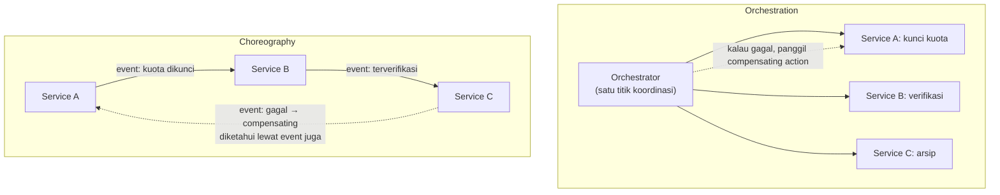

## TL;DR

Transaksi database tunggal punya rollback: kalau satu langkah gagal, seluruh transaksi dibatalkan dan sistem kembali ke keadaan semula, dijamin ACID. Begitu sebuah proses bisnis melibatkan **beberapa service berbeda** (masing-masing dengan database sendiri), rollback lintas service semacam itu tidak tersedia — tidak ada mekanisme yang bisa "membatalkan" perubahan yang sudah di-commit di service lain secara atomik. Saga menyelesaikan ini dengan mengganti satu transaksi besar dengan **rangkaian transaksi lokal** yang masing-masing di-commit sendiri-sendiri, dan setiap langkah punya **compensating action** — operasi pembalik yang dijalankan kalau langkah setelahnya gagal, secara efektif "membatalkan" efek langkah itu meski tidak lewat rollback database sungguhan.

## The Problem

Proses pengajuan permohonan di sistem legal-services melibatkan tiga langkah lintas aplikasi berbeda: Aplikasi A mencatat pengajuan dan mengunci kuota, Aplikasi B melakukan verifikasi dokumen, Aplikasi C mencatat hasil resmi ke sistem arsip. Ketiganya adalah service terpisah dengan database masing-masing. Suatu hari, langkah pertama dan kedua berhasil (kuota terkunci, dokumen terverifikasi), tapi langkah ketiga gagal karena Aplikasi C sedang mengalami gangguan. Sekarang sistem berada di keadaan yang **tidak lengkap**: kuota sudah terkunci di Aplikasi A meski proses keseluruhan tidak pernah benar-benar selesai — tidak ada mekanisme otomatis yang membatalkan penguncian kuota itu, karena "transaksi" itu sudah lama commit sepenuhnya di database Aplikasi A, dan Aplikasi A tidak pernah tahu langkah setelahnya (di Aplikasi C) gagal.

Tanpa desain eksplisit untuk menangani kegagalan parsial seperti ini, sistem terjebak dalam keadaan yang tidak konsisten — kuota terkunci selamanya untuk pengajuan yang sebenarnya tidak pernah benar-benar berhasil, sesuatu yang baru ditemukan lewat komplain pengguna atau audit manual, bukan lewat mekanisme sistem yang secara sadar dirancang menangani skenario ini.

## Intuition

Cara paling mudah memahaminya: saga seperti **memesan liburan lewat tiga pemesanan terpisah** — tiket pesawat, hotel, dan penyewaan mobil, masing-masing dari penyedia berbeda yang tidak saling terhubung. Tidak ada "transaksi tunggal" yang mencakup ketiganya sekaligus; kalau penyewaan mobil ternyata gagal setelah tiket dan hotel sudah dipesan, tidak ada tombol ajaib yang otomatis membatalkan ketiganya sekaligus. Yang bisa dilakukan: secara eksplisit **membatalkan** tiket dan hotel satu per satu (compensating action), mengembalikan keadaan sedekat mungkin ke sebelum proses pemesanan dimulai — meski proses pembatalan ini sendiri adalah aksi terpisah, bukan rollback otomatis.

Analogi ini bocor pada soal kesempurnaan pembatalan. Membatalkan tiket pesawat biasanya bisa mengembalikan uang penuh (mendekati "rollback sempurna"). Compensating action di sistem software **tidak selalu bisa membatalkan sepenuhnya** — kalau langkah verifikasi dokumen di "The Problem" sudah mengirim notifikasi ke petugas bahwa dokumen terverifikasi, compensating action bisa membatalkan status verifikasi, tapi tidak bisa "menarik kembali" fakta bahwa notifikasi itu sudah dilihat petugas — inilah kenapa desain compensating action butuh pemikiran khusus per kasus, bukan sekadar "kebalikan otomatis" dari aksi aslinya.

## How It Works

Dua pola implementasi saga, dengan filosofi koordinasi yang berbeda:


**Orchestration**: satu komponen pusat (orchestrator) secara eksplisit memanggil setiap langkah secara berurutan, dan tahu persis di langkah mana kegagalan terjadi — kalau langkah ketiga gagal, orchestrator yang memutuskan compensating action apa yang harus dipanggil untuk langkah pertama dan kedua. Alur logika terpusat, mudah dilacak dan dipahami dari satu tempat.

**Choreography**: tidak ada koordinator pusat — setiap service bereaksi terhadap event dari service sebelumnya, dan memicu event baru untuk service berikutnya (mirip [[../30 APIs and Web/The Transactional Outbox Pattern|The Transactional Outbox Pattern]] untuk memastikan event terkirim dengan andal). Kegagalan ditangani lewat event kegagalan yang juga disebarkan, dan setiap service yang relevan bereaksi menjalankan compensating action-nya sendiri. Lebih terdesentralisasi, tapi alur logika keseluruhan tersebar di banyak service, lebih sulit dilihat sebagai satu kesatuan.

## Under The Hood

Pemilihan antara orchestration dan choreography bukan soal mana yang "lebih baik" secara universal — orchestration lebih mudah dipahami dan di-debug untuk alur yang kompleks (banyak langkah, banyak kemungkinan percabangan kegagalan) karena logikanya terpusat di satu tempat, tapi menciptakan titik ketergantungan tunggal (orchestrator) yang harus selalu tersedia dan tahu tentang semua service yang terlibat. Choreography lebih longgar-kopel (setiap service hanya perlu tahu event apa yang ia dengarkan dan hasilkan, tidak perlu tahu keseluruhan alur), cocok untuk alur sederhana dengan sedikit langkah, tapi begitu jumlah langkah dan skenario kegagalan bertambah, memahami alur keseluruhan dari melihat kode masing-masing service secara terpisah menjadi semakin sulit — "logika tersembunyi" dalam jaringan reaksi event yang tidak terlihat dari satu tempat.

Compensating action yang didesain dengan baik bersifat **idempoten** (lihat [[../30 APIs and Web/Idempotency|Idempotency]]) — kemungkinan compensating action dipanggil lebih dari sekali (karena retry setelah kegagalan jaringan, misalnya) harus tetap menghasilkan keadaan akhir yang benar, bukan membatalkan sesuatu dua kali dengan efek yang salah (misalnya mengembalikan kuota dua kali untuk satu pembatalan).

## In Go

```go
package saga

import (
	"context"
	"fmt"
)

// Step merepresentasikan satu langkah saga — Action dan
// CompensatingAction adalah PASANGAN yang harus dipikirkan bersamaan
// sejak desain, bukan Action yang ditambahkan compensating-nya
// belakangan sebagai renungan.
type Step struct {
	Name               string
	Action             func(ctx context.Context) error
	CompensatingAction func(ctx context.Context) error
}

// Orchestrator menjalankan langkah SATU PER SATU, dan begitu ada
// yang gagal, memanggil compensating action untuk SEMUA langkah
// yang sudah berhasil, dalam urutan TERBALIK.
type Orchestrator struct {
	Steps []Step
}

func (o *Orchestrator) Run(ctx context.Context) error {
	completed := []Step{}

	for _, step := range o.Steps {
		if err := step.Action(ctx); err != nil {
			// Kegagalan di sini — jalankan compensating action untuk
			// SEMUA langkah yang sudah berhasil, urutan terbalik.
			o.compensate(ctx, completed)
			return fmt.Errorf("saga: langkah %q gagal, saga dibatalkan: %w", step.Name, err)
		}
		completed = append(completed, step)
	}
	return nil
}

func (o *Orchestrator) compensate(ctx context.Context, completed []Step) {
	for i := len(completed) - 1; i >= 0; i-- {
		step := completed[i]
		if err := step.CompensatingAction(ctx); err != nil {
			// Kegagalan compensating action adalah masalah SERIUS —
			// butuh alert manual, bukan diam-diam diabaikan, karena
			// sistem sekarang mungkin berada di keadaan tidak konsisten
			// yang tidak bisa diperbaiki otomatis.
			fmt.Printf("PERINGATAN: compensating action untuk %q gagal: %v\n", step.Name, err)
		}
	}
}
```

## In His Stack

Proses pengajuan permohonan lintas beberapa dari 13 aplikasi, seperti di "The Problem", adalah kandidat tepat untuk pola orchestration — jumlah langkahnya terbatas dan konsekuensi kegagalan cukup kritis untuk butuh visibilitas terpusat yang jelas tentang di langkah mana kegagalan terjadi dan compensating action apa yang dijalankan. Untuk alur yang lebih sederhana (misalnya notifikasi berantai yang tidak butuh compensating action rumit), choreography lewat event bus yang sudah ada (lihat domain messaging di [[../30 APIs and Web/_Overview|APIs and Web Overview]]) mungkin lebih sesuai dengan arsitektur yang sudah ada.

## Trade-offs and When Not To Use It

Saga menambah kompleksitas nyata dibanding transaksi database tunggal — setiap langkah butuh compensating action yang dipikirkan matang, dan compensating action yang tidak sempurna (tidak bisa membatalkan sepenuhnya, seperti notifikasi yang sudah terkirim) butuh penanganan khusus. Untuk proses yang seluruhnya berada dalam satu service dan satu database, transaksi ACID biasa jauh lebih sederhana dan seharusnya tetap dipakai — saga hanya relevan begitu proses benar-benar melintasi batas service dengan database terpisah, di mana transaksi ACID lintas service secara teknis tidak tersedia tanpa [[Two-Phase Commit and Why It Is Avoided]] (yang punya masalahnya sendiri, dibahas di note berikutnya).

## Common Mistakes

> [!warning] Jebakan
> Menambahkan compensating action sebagai renungan setelah aksi utama selesai ditulis, bukan didesain bersamaan sejak awal — compensating action yang dipikirkan belakangan sering tidak benar-benar bisa membatalkan efek yang sudah terjadi, terutama untuk aksi yang punya efek samping eksternal (notifikasi, panggilan ke pihak ketiga).

> [!warning] Jebakan
> Membuat compensating action yang tidak idempoten — kalau compensating action dipanggil dua kali (karena retry), efeknya bisa salah (mengembalikan kuota dua kali, misalnya), menciptakan bug baru saat mencoba memperbaiki kegagalan yang lama.

> [!warning] Jebakan
> Memilih choreography untuk alur yang kompleks dengan banyak kemungkinan percabangan kegagalan, tanpa mempertimbangkan kesulitan melacak keseluruhan alur logika yang tersebar di banyak service — kesulitan debugging yang baru terasa nyata saat insiden sungguhan terjadi dan tim harus merekonstruksi apa yang terjadi dari log banyak service berbeda.

## Exercises

1. Jelaskan kenapa transaksi ACID biasa tidak bisa dipakai untuk proses yang melintasi beberapa service dengan database terpisah.
2. Jelaskan perbedaan orchestration dan choreography, dan trade-off masing-masing.
3. Kenapa compensating action harus idempoten?
4. Desain terbuka: proses pengajuan permohonan di "The Problem" (kunci kuota → verifikasi dokumen → arsip resmi) mengalami kegagalan di langkah ketiga setelah dua langkah pertama berhasil. Rancang saga lengkap untuk proses ini memakai pola orchestration, termasuk compensating action untuk setiap langkah, dan jelaskan bagaimana kamu memastikan compensating action ini idempoten.

> [!success]- Kunci jawaban
> **1.** Transaksi ACID bergantung pada mekanisme database tunggal (write-ahead log, lock) yang bisa membatalkan seluruh perubahan sekaligus sebelum benar-benar di-commit. Begitu proses melintasi beberapa database independen, tidak ada mekanisme tunggal yang bisa "melihat" dan membatalkan perubahan di semua database itu sekaligus secara atomik — setiap database hanya tahu transaksinya sendiri, sudah commit atau belum, tanpa pengetahuan tentang keadaan database lain.
> **4.** Orchestrator menjalankan: (1) Kunci Kuota di Aplikasi A — compensating: Lepas Kuota (idempoten: memeriksa dulu apakah kuota memang masih terkunci untuk pengajuan ini sebelum melepaskannya, sehingga panggilan berulang tidak melepas kuota yang sudah dilepas atau milik pengajuan lain); (2) Verifikasi Dokumen di Aplikasi B — compensating: Batalkan Status Verifikasi (idempoten: mengatur status jadi "dibatalkan" tanpa peduli status sekarang, operasi set-value yang aman diulang); (3) Arsip Resmi di Aplikasi C — tidak butuh compensating karena ini langkah terakhir. Begitu langkah 3 gagal, orchestrator memanggil compensating untuk langkah 2 lalu langkah 1 (urutan terbalik) — Batalkan Status Verifikasi di Aplikasi B, lalu Lepas Kuota di Aplikasi A — mengembalikan sistem ke keadaan konsisten meski bukan lewat rollback database sungguhan, dan seluruh proses (termasuk compensating action-nya) dicatat lewat audit logging untuk investigasi kalau ada yang perlu ditinjau ulang belakangan.

## Self-Check

- Kenapa transaksi ACID biasa tidak berfungsi lintas service dengan database terpisah?
- Apa perbedaan orchestration dan choreography?
- Kenapa compensating action harus idempoten?
- Kapan orchestration lebih cocok dibanding choreography?

## Connected Notes

- [[Leader Election and Split Brain]] — orchestrator dalam pola orchestration sering butuh jaminan ketersediaan yang sama seperti leader dalam consensus, meski masalah yang diselesaikan berbeda.
- [[../30 APIs and Web/The Transactional Outbox Pattern|The Transactional Outbox Pattern]] — mekanisme yang membuat event pada pola choreography terkirim dengan andal, tidak hilang begitu saja saat service yang mengirimnya gagal di tengah jalan.
- [[Two-Phase Commit and Why It Is Avoided]] — kelanjutan langsung: alternatif "transaksi terdistribusi sungguhan" yang secara historis dicoba sebelum saga menjadi pola yang lebih disukai, dan kenapa pendekatan itu punya masalah sendiri.
- [[../30 APIs and Web/Idempotency|Idempotency]] — properti wajib yang harus dimiliki setiap compensating action agar aman dipanggil berulang.
- [[Compensating Transactions]] — pendalaman langsung konsep compensating action yang jadi inti mekanisme saga, dibahas lebih jauh di klaster yang sama.

## Further Reading

- Hector Garcia-Molina dan Kenneth Salem, "Sagas" (1987) — paper akademik asli yang memperkenalkan konsep saga, meski dalam konteks database tunggal; adaptasinya ke microservices adalah perkembangan industri belakangan.

## Catatan Saya

*Tulis di sini proses lintas beberapa dari 13 aplikasimu yang saat ini tidak punya penanganan kegagalan parsial yang jelas, dan risiko konkret kalau salah satu langkahnya gagal di tengah jalan.*
