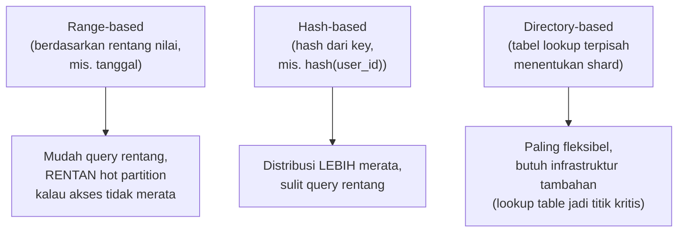

## TL;DR

[[../40 Databases/Introduction to Sharding|Introduction to Sharding]] menjelaskan **apa** sharding dan **kenapa** dibutuhkan begitu data melampaui kapasitas satu mesin. Note ini menjawab pertanyaan lanjutan yang jauh lebih sulit: **bagaimana** memilih shard key yang tepat, dan apa yang terjadi kalau pilihan itu salah. Shard key yang buruk menghasilkan **hot partition** — satu atau beberapa shard menerima beban jauh lebih besar dari shard lain, karena data (atau akses ke data itu) tidak terdistribusi merata di antara shard yang ada. Hasilnya paradoks yang menyakitkan: sistem yang di-sharding untuk skalabilitas justru dibatasi oleh satu shard yang kepanasan, sementara shard lain menganggur dengan kapasitas berlebih.

## The Problem

Sebuah tim men-sharding data kasus berdasarkan tanggal pengajuan — shard 1 untuk kasus yang diajukan bulan ini, shard 2 untuk bulan lalu, dan seterusnya, dengan asumsi ini akan membagi beban rata karena setiap bulan punya jumlah kasus baru yang relatif sama. Pilihan ini terlihat masuk akal, tapi mengabaikan satu kenyataan penting: kasus yang **baru diajukan** (di shard bulan ini) jauh lebih sering diakses (dibaca, diverifikasi, diubah statusnya berkali-kali) dibanding kasus lama yang sudah selesai diproses — shard bulan ini menerima traffic baca-tulis yang jauh lebih tinggi dibanding shard-shard bulan sebelumnya, meski jumlah **datanya** kurang lebih sama rata.

Konsekuensinya: shard bulan ini menjadi bottleneck yang membatasi performa keseluruhan sistem, sementara shard-shard lama duduk nyaris tidak terpakai. Menambah lebih banyak shard tidak menyelesaikan masalah ini — shard baru yang ditambahkan untuk bulan berikutnya akan mengalami pola yang sama persis begitu bulan itu tiba. Masalahnya bukan jumlah shard yang kurang, tapi **shard key** yang dipilih (tanggal pengajuan) tidak mencerminkan pola **akses** yang sebenarnya, hanya mencerminkan pola **penyimpanan** — dua hal yang ternyata sangat berbeda dalam kasus ini.

## Intuition

Cara paling mudah memahaminya: bayangkan sebuah perpustakaan besar yang membagi rak bukunya berdasarkan **abjad judul buku** (A-F di rak 1, G-M di rak 2, dan seterusnya) — pembagian yang terlihat rapi dan merata secara jumlah buku per rak. Tapi kalau ternyata buku-buku dengan judul berawalan huruf tertentu (katakanlah, novel populer yang kebetulan banyak berjudul dengan huruf tertentu) jauh lebih sering dipinjam dibanding yang lain, rak yang menyimpan huruf itu akan selalu ramai dikunjungi dan sering kehabisan stok, sementara rak lain nyaris tidak pernah disentuh — pembagian yang rata secara **jumlah buku**, tapi sangat tidak rata secara **frekuensi kunjungan**.

Analogi ini bocor pada soal fleksibilitas menata ulang. Perpustakaan fisik bisa menata ulang rak dengan relatif mudah begitu pola peminjaman diketahui. Rebalancing data yang sudah di-sharding jauh lebih mahal dan berisiko — memindahkan data dari satu shard ke shard lain sambil sistem tetap melayani traffic production butuh perencanaan matang (lihat [[Zero-Downtime Database Migration Using CDC]]), bukan sekadar "pindahkan saja bukunya".

## How It Works

Tiga strategi umum memilih shard key, dengan trade-off berbeda:


**Range-based sharding** (seperti di "The Problem") mudah dipahami dan mendukung query rentang secara efisien (mencari semua kasus bulan ini cukup ke satu shard), tapi rentan hot partition kalau distribusi akses tidak merata sepanjang rentang itu. **Hash-based sharding** (menghitung hash dari shard key, misalnya `hash(user_id) % jumlah_shard`) menyebarkan data jauh lebih merata secara statistik, tapi mengorbankan kemampuan query rentang efisien (mencari semua data dalam rentang waktu tertentu berarti harus memeriksa **semua** shard, karena data yang berdekatan waktu tersebar acak lintas shard). **Directory-based sharding** memakai tabel lookup terpisah yang secara eksplisit memetakan setiap key ke shard tertentu — paling fleksibel untuk rebalancing (cukup ubah entri lookup, tidak perlu menghitung ulang hash), tapi tabel lookup itu sendiri jadi komponen kritis yang harus tersedia dan cepat diakses setiap kali.

## Under The Hood

Kunci memilih shard key yang baik: pilih berdasarkan **pola akses nyata**, bukan pola penyimpanan yang terlihat rapi secara matematis. Untuk kasus di "The Problem", shard key yang lebih baik mungkin adalah `hash(case_id)` — menyebarkan kasus (baik yang baru maupun lama) secara acak lintas shard, sehingga beban akses (yang dominan datang dari kasus-kasus aktif, tersebar acak di antara shard karena hash) jadi jauh lebih merata, dengan konsekuensi query "semua kasus bulan ini" menjadi lebih mahal (harus query semua shard dan menggabungkan hasilnya) — trade-off yang harus diterima sadar, bukan kebetulan.

**Hot partition** juga bisa muncul bukan dari pilihan shard key yang salah sejak awal, tapi dari **perubahan pola akses seiring waktu** — sebuah shard key yang terdistribusi merata saat sistem baru diluncurkan bisa menjadi tidak merata begitu satu segmen data (misalnya satu instansi tertentu dalam sistem multi-tenant, lihat [[Multi-Tenancy]]) tumbuh jauh lebih besar dan lebih aktif dibanding yang lain. Ini kenapa monitoring distribusi beban per shard (bukan hanya total beban sistem) penting sebagai sinyal dini sebelum hot partition benar-benar jadi bottleneck yang terasa.

## In Go

```go
package sharding

import (
	"crypto/sha256"
	"encoding/binary"
)

// RangeBasedShard MENUNJUKKAN kerentanan hot partition — shard
// ditentukan dari rentang waktu, TIDAK peduli pola akses nyata.
func RangeBasedShard(month int, totalShards int) int {
	return month % totalShards
	// MASALAH: kasus bulan ini (shard aktif) menerima traffic jauh
	// lebih tinggi dari kasus bulan lalu (shard "dingin").
}

// HashBasedShard MENYEBARKAN beban lebih merata secara statistik —
// tidak peduli kapan data dibuat, hanya peduli identitasnya.
func HashBasedShard(caseID string, totalShards int) int {
	h := sha256.Sum256([]byte(caseID))
	// Ambil 8 byte pertama sebagai angka untuk modulo
	n := binary.BigEndian.Uint64(h[:8])
	return int(n % uint64(totalShards))
}

// DirectoryBasedShard menunjukkan fleksibilitas lookup EKSPLISIT —
// rebalancing cukup ubah entri di sini, TANPA menghitung ulang hash
// untuk seluruh data yang sudah ada.
type ShardDirectory struct {
	assignments map[string]int // caseID -> shard number
}

func (d *ShardDirectory) ShardFor(caseID string) (int, bool) {
	shard, ok := d.assignments[caseID]
	return shard, ok
}

func (d *ShardDirectory) Reassign(caseID string, newShard int) {
	d.assignments[caseID] = newShard
}
```

## In His Stack

Untuk sistem legal-services yang mungkin butuh sharding di masa depan seiring pertumbuhan data (lihat konteks [[../40 Databases/Introduction to Sharding|Introduction to Sharding]]), pilihan shard key harus mempertimbangkan pola akses nyata sistem — kasus aktif jauh lebih sering diakses dibanding kasus yang sudah selesai bertahun-tahun lalu, dan sharding berdasarkan instansi (kalau sistem melayani banyak instansi pemerintah sekaligus) berisiko hot partition kalau satu instansi jauh lebih besar dan aktif dibanding yang lain — pertimbangan yang relevan langsung dengan [[Multi-Tenancy]], dibahas di klaster yang sama.

## Trade-offs and When Not To Use It

Hash-based sharding yang menyebarkan beban lebih merata mengorbankan kemampuan query rentang efisien — untuk sistem yang sering butuh query "semua data dalam periode tertentu" (laporan bulanan, misalnya), trade-off ini bisa jadi mahal kalau tidak diantisipasi lewat mekanisme tambahan (seperti read model terpisah dari CQRS, lihat [[CQRS]], yang dioptimalkan khusus untuk query rentang tanpa terikat struktur shard yang mendasari). Directory-based sharding memberi fleksibilitas paling besar tapi menambah komponen infrastruktur (lookup table) yang harus tersedia dan cepat — untuk sistem dengan jumlah shard kecil dan stabil, kompleksitas tambahan ini mungkin tidak sepadan dibanding hash-based sharding yang lebih sederhana.

## Common Mistakes

> [!warning] Jebakan
> Memilih shard key berdasarkan kemudahan implementasi atau kerapian matematis (seperti rentang tanggal) tanpa mempertimbangkan pola akses nyata — persis kesalahan di "The Problem", menghasilkan hot partition meski distribusi data terlihat merata di atas kertas.

> [!warning] Jebakan
> Menganggap sharding sekali diterapkan tidak perlu dipantau lagi — pola akses bisa berubah seiring waktu (satu segmen data tumbuh jauh lebih besar dari yang lain), mengubah distribusi yang tadinya merata jadi hot partition di kemudian hari.

> [!warning] Jebakan
> Memilih hash-based sharding tanpa mempertimbangkan kebutuhan query rentang yang mungkin sering dilakukan sistem — trade-off yang valid kalau diambil sadar, tapi jadi masalah kalau kebutuhan query rentang baru disadari setelah sharding sudah diterapkan dan sulit diubah.

## Exercises

1. Jelaskan apa itu hot partition, dan kenapa sistem yang di-sharding bisa tetap dibatasi kapasitasnya oleh hot partition.
2. Sebutkan tiga strategi memilih shard key, dan trade-off masing-masing.
3. Kenapa shard key yang terlihat merata secara jumlah data belum tentu merata secara beban akses?
4. Desain terbuka: sistem legal-services yang kamu rancang melayani 13 instansi berbeda, dan data kasus tiap instansi disimpan dalam sistem yang sama. Salah satu instansi (yang menangani kasus terbanyak secara nasional) punya volume data dan traffic jauh lebih besar dari 12 instansi lain gabungan. Rancang strategi sharding yang mempertimbangkan ketimpangan ini, dan jelaskan kenapa sharding sederhana berdasarkan ID instansi berisiko hot partition.

> [!success]- Kunci jawaban
> **1.** Hot partition adalah kondisi ketika satu atau beberapa shard menerima beban jauh lebih besar dari shard lain karena distribusi data atau akses yang tidak merata. Sistem yang di-sharding untuk skalabilitas tetap dibatasi kapasitasnya oleh shard yang paling terbebani (hot partition) — menambah lebih banyak shard tidak membantu kalau beban tetap terkonsentrasi di satu atau sedikit shard yang sama.
> **4.** Sharding sederhana berdasarkan ID instansi (satu shard per instansi, atau instansi dipetakan langsung ke shard tertentu) akan membuat shard milik instansi terbesar menjadi hot partition — instansi itu sendirian menanggung volume data dan traffic yang jauh melebihi shard lain, persis pola yang harus dihindari. Strategi yang lebih baik: pisahkan shard key dari identitas instansi — misalnya `hash(case_id)` yang menyebarkan kasus dari instansi manapun (termasuk instansi terbesar) secara merata lintas shard yang tersedia, sehingga beban dari instansi besar itu ikut tersebar, bukan terkonsentrasi di satu shard. Trade-off yang diterima: query "semua kasus instansi X" menjadi query lintas-shard (harus memeriksa semua shard dan menggabungkan hasil), yang bisa diatasi dengan read model terpisah (CQRS) yang diindeks khusus per instansi untuk kebutuhan laporan, tanpa memaksa struktur sharding utama mengikuti kebutuhan query itu.

## Self-Check

- Apa itu hot partition, dan kenapa ia membatasi manfaat sharding?
- Sebutkan tiga strategi memilih shard key.
- Kenapa shard key yang merata secara data belum tentu merata secara beban akses?
- Kenapa hash-based sharding mengorbankan kemampuan query rentang?

## Connected Notes

- [[../40 Databases/Introduction to Sharding|Introduction to Sharding]] — note ini adalah kelanjutan langsung, membahas strategi memilih shard key yang tidak dibahas mendalam di note intermediate itu.
- [[Consistent Hashing]] — kelanjutan langsung: mekanisme yang membuat rebalancing shard (menambah/mengurangi shard) tidak memerlukan menghitung ulang seluruh pemetaan hash dari nol.
- [[Multi-Tenancy]] — hot partition akibat satu tenant yang jauh lebih besar dari yang lain adalah pertimbangan langsung yang dibahas lebih dalam di note itu.
- [[CQRS]] — read model terpisah bisa jadi solusi untuk kebutuhan query rentang yang sulit dipenuhi hash-based sharding tanpa mengubah struktur sharding utama.
- [[Zero-Downtime Database Migration Using CDC]] — rebalancing shard yang aman di sistem production butuh pendekatan migrasi yang sama seperti dibahas di note itu.

## Further Reading

- Dokumentasi resmi berbagai sistem database terdistribusi (Vitess, CockroachDB) bagian strategi sharding — sumber yang membahas implementasi nyata trade-off yang dibahas di note ini.

## Catatan Saya

*Tulis di sini bagian dari 13 aplikasimu yang datanya tumbuh paling cepat, dan apakah pola aksesnya (bukan hanya volumenya) sudah dipertimbangkan untuk kebutuhan sharding di masa depan.*
