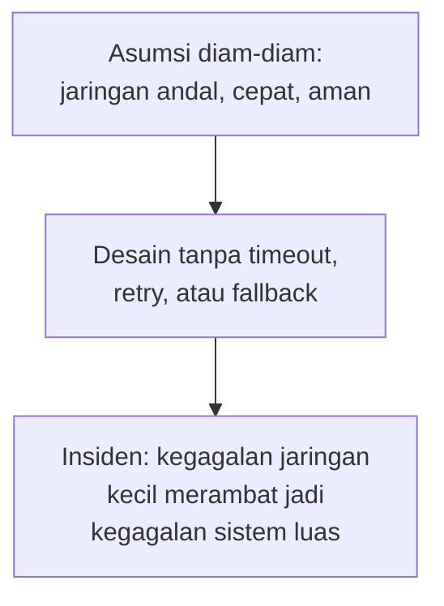

## TL;DR

Delapan asumsi yang secara diam-diam salah, dituliskan pertama kali oleh sekelompok insinyur di Sun Microsystems pada era 1990-an, tetap dipercaya banyak engineer setiap kali mereka mendesain sistem yang melibatkan lebih dari satu mesin: jaringan itu andal, latency-nya nol, bandwidth-nya tak terbatas, jaringan itu aman, topologi tidak berubah, ada satu administrator, biaya transportasi nol, dan jaringan itu homogen. Setiap asumsi ini benar **cukup sering** untuk terasa aman dipercaya sampai suatu hari salah satunya gagal — dan begitu gagal, sistem yang dibangun di atas asumsi itu rusak dengan cara yang mengejutkan pembuatnya, karena kegagalannya tidak pernah benar-benar dipertimbangkan sejak awal desain.

## The Problem

Sebuah tim membangun integrasi antara dua dari 13 aplikasi lewat panggilan API sinkron — Aplikasi A memanggil Aplikasi B, menunggu respons, lalu melanjutkan prosesnya. Di lingkungan pengembangan dan staging, panggilan ini nyaris selalu berhasil dalam hitungan milidetik, jaringan internal terasa instan dan tidak pernah terputus. Kode ditulis dengan asumsi implisit bahwa panggilan ini "pasti berhasil dan cepat" — tidak ada penanganan timeout yang berarti, tidak ada strategi kalau Aplikasi B lambat merespons.

Begitu sistem berjalan di production dengan traffic nyata, jaringan internal sesekali mengalami latency yang melonjak (beban tinggi, masalah infrastruktur sesaat) — dan kode yang menganggap "latency nol" mulai menumpuk request yang menunggu tanpa batas waktu jelas, menghabiskan resource, dan akhirnya membuat Aplikasi A sendiri ikut lambat merespons penggunanya, meski masalah aslinya ada di Aplikasi B. Satu asumsi yang diam-diam salah — latency itu nol — merambat jadi insiden yang jauh lebih luas dari sumber masalah aslinya.

## Intuition

Cara paling mudah memahaminya: kedelapan fallacy ini seperti **kebiasaan mengemudi tanpa pernah membayangkan ban bocor**. Selama bertahun-tahun mengemudi tanpa masalah, seorang pengemudi bisa lupa bahwa ban **bisa** bocor kapan saja — bukan karena ia tidak tahu secara teori, tapi karena pengalaman sehari-hari yang mulus membuat kemungkinan itu terasa jauh dan tidak perlu dipikirkan aktif. Begitu ban benar-benar bocor di jalan tol saat sedang terburu-buru, reaksi yang muncul bukan "saya sudah siap untuk ini", tapi kepanikan dari sesuatu yang seharusnya diantisipasi tapi tidak pernah benar-benar dipersiapkan.

Analogi ini bocor pada soal frekuensi. Ban bocor adalah kejadian langka bagi kebanyakan pengemudi. Kegagalan jaringan — latency yang melonjak, paket yang hilang, koneksi yang terputus — jauh lebih sering terjadi di sistem terdistribusi berskala besar dibanding yang dibayangkan kebanyakan engineer, justru karena jumlah komponen jaringan yang terlibat (router, switch, kabel, DNS) jauh lebih banyak dan lebih sering berubah dibanding jalan yang dilalui mobil sehari-hari.

## How It Works

Delapan fallacy, dan konsekuensi nyata mempercayainya secara diam-diam:

1. **Jaringan itu andal** — kenyataannya, paket bisa hilang, koneksi bisa putus di tengah jalan. Konsekuensi: kode tanpa retry atau penanganan kegagalan berasumsi setiap panggilan pasti sukses.
2. **Latency-nya nol** — kenyataannya, setiap panggilan jaringan punya latency, dan latency itu **bervariasi**, kadang melonjak tak terduga. Konsekuensi: kode tanpa timeout menumpuk request yang menunggu tanpa batas, persis "The Problem" di atas.
3. **Bandwidth-nya tak terbatas** — kenyataannya, bandwidth adalah resource terbatas yang bisa jenuh. Konsekuensi: mengirim payload besar tanpa mempertimbangkan ukuran (lihat [[../30 APIs and Web/Request Size Limits Along The Path|Request Size Limits Along The Path]]) bisa memperlambat seluruh jaringan yang dipakai bersama.
4. **Jaringan itu aman** — kenyataannya, siapa pun di jaringan (termasuk yang seharusnya tidak berhak) berpotensi menyadap atau memanipulasi traffic. Konsekuensi: komunikasi internal tanpa [[../80 Security/mTLS|mTLS]] atau enkripsi mengasumsikan "kan cuma internal" — asumsi yang sama persis dibongkar di [[../80 Security/Zero Trust|Zero Trust]].
5. **Topologi tidak berubah** — kenyataannya, service pindah alamat, instance bertambah dan berkurang terus-menerus (lihat [[../70 Infrastructure and Delivery/Service Discovery|Service Discovery]]). Konsekuensi: alamat yang di-hardcode jadi usang.
6. **Ada satu administrator** — kenyataannya, sistem besar dikelola banyak tim dengan kebijakan dan prioritas berbeda. Konsekuensi: perubahan konfigurasi jaringan oleh satu tim bisa mematahkan asumsi tim lain tanpa koordinasi.
7. **Biaya transportasi nol** — kenyataannya, setiap panggilan jaringan (serialisasi, deserialisasi, round-trip) punya biaya komputasi dan waktu nyata. Konsekuensi: memanggil service lain berkali-kali dalam satu alur (pola N+1 versi jaringan) jadi mahal tanpa disadari.
8. **Jaringan itu homogen** — kenyataannya, jaringan terdiri dari berbagai teknologi, versi protokol, dan konfigurasi berbeda. Konsekuensi: asumsi bahwa semua node "berbicara" dengan cara yang persis sama bisa gagal saat menghadapi node lama yang belum di-upgrade, atau jaringan lintas region dengan karakteristik berbeda.


Pola kegagalan yang berulang di seluruh delapan fallacy ini sama: asumsi yang tidak pernah diuji secara sadar diam-diam masuk ke desain, dan begitu asumsi itu terbukti salah di dunia nyata, sistem tidak punya jalur pemulihan karena jalur itu tidak pernah dirancang untuk skenario yang "seharusnya tidak terjadi".

## Under The Hood

Fallacy-fallacy ini pertama kali dikumpulkan sebagai daftar informal oleh sejumlah insinyur di Sun Microsystems (paling sering dikaitkan dengan nama Peter Deutsch dan kontributor lain di perusahaan yang sama) pada era 1990-an, dari pengalaman langsung membangun sistem terdistribusi awal. Nilainya bukan sebagai daftar lengkap segala hal yang bisa salah — ia adalah daftar **asumsi paling umum** yang secara konsisten menjebak engineer berpengalaman sekalipun, justru karena asumsi itu benar cukup sering untuk terasa aman dipercaya begitu saja.

Poin yang sering luput: kedelapan fallacy ini bukan alasan untuk paranoid terhadap setiap panggilan jaringan sampai melumpuhkan produktivitas — tujuannya adalah membuat asumsi itu **eksplisit dan sadar**, bukan diam-diam ada di kode tanpa pernah dipertimbangkan. Sistem yang secara sadar memutuskan "kami menerima risiko latency jaringan internal karena riwayatnya sangat stabil" berbeda jauh dari sistem yang tidak pernah memikirkan kemungkinan itu sama sekali.

## In Go

```go
package resilience

import (
	"context"
	"fmt"
	"net/http"
	"time"
)

// CallService menunjukkan kode yang SECARA SADAR menolak asumsi
// fallacy #1 dan #2 (jaringan andal, latency nol) — timeout eksplisit
// dan penanganan kegagalan yang tidak berasumsi panggilan pasti sukses.
func CallService(ctx context.Context, url string) (*http.Response, error) {
	// Timeout eksplisit: MENOLAK asumsi "latency-nya nol".
	ctx, cancel := context.WithTimeout(ctx, 3*time.Second)
	defer cancel()

	req, err := http.NewRequestWithContext(ctx, http.MethodGet, url, nil)
	if err != nil {
		return nil, fmt.Errorf("resilience: membuat request: %w", err)
	}

	resp, err := http.DefaultClient.Do(req)
	if err != nil {
		// MENOLAK asumsi "jaringan itu andal" — kegagalan panggilan
		// adalah kondisi yang DIHARAPKAN bisa terjadi, bukan kejutan
		// yang tidak ditangani.
		return nil, fmt.Errorf("resilience: panggilan gagal (jaringan tidak selalu andal): %w", err)
	}
	return resp, nil
}
```

## In His Stack

Untuk koordinator teknis lintas 13 aplikasi, delapan fallacy ini adalah kerangka yang berguna saat mereview desain integrasi baru antar aplikasi — pertanyaan sederhana "asumsi mana dari delapan ini yang diam-diam dipercaya desain ini?" sering langsung mengungkap celah yang tidak terlihat dari membaca kode saja. Integrasi dengan partner eksternal (lihat [[../30 APIs and Web/Designing an API for a Partner You Do Not Control|Designing an API for a Partner You Do Not Control]]) adalah tempat paling jelas fallacy-fallacy ini muncul — partner yang jaringannya lebih lambat, kurang andal, atau punya topologi yang berubah tanpa pemberitahuan adalah kenyataan sehari-hari, bukan pengecualian langka.

## Trade-offs and When Not To Use It

Merancang setiap panggilan seolah-olah kedelapan fallacy ini akan terjadi setiap saat (retry di semua tempat, timeout sangat ketat, circuit breaker untuk setiap panggilan sekecil apa pun) adalah overhead yang tidak sepadan untuk sistem kecil dengan sedikit komponen dan konsekuensi kegagalan yang rendah. Kesadaran akan fallacy-fallacy ini paling bernilai untuk memandu **keputusan desain yang disengaja** — kapan menambahkan timeout, kapan menambahkan retry, kapan cukup menerima risiko — bukan sebagai resep "selalu tambahkan semua proteksi di semua tempat" yang justru menambah kompleksitas tanpa mempertimbangkan risiko nyata yang dihadapi.

## Common Mistakes

> [!warning] Jebakan
> Menulis kode yang memanggil service lain tanpa timeout eksplisit — mewarisi timeout default library (yang kadang tidak terbatas) berarti diam-diam mempercayai fallacy "latency-nya nol", dan request bisa menumpuk tanpa batas saat service tujuan melambat.

> [!warning] Jebakan
> Menganggap jaringan internal (dalam satu data center atau cluster) otomatis andal dan aman hanya karena "internal" — fallacy #1 dan #4 berlaku sama kuatnya untuk jaringan internal seperti untuk internet publik, hanya frekuensi kegagalannya mungkin lebih rendah, bukan nol.

> [!warning] Jebakan
> Mendesain sistem berdasarkan pengalaman staging yang mulus tanpa mempertimbangkan bahwa production punya skala, topologi, dan pola kegagalan yang berbeda — staging yang stabil sering menyembunyikan asumsi fallacy yang baru terbongkar begitu sistem menghadapi traffic dan kondisi jaringan nyata.

## Exercises

1. Sebutkan delapan fallacy distributed computing dan konsekuensi nyata mempercayai masing-masing secara diam-diam.
2. Kenapa fallacy-fallacy ini justru menjebak engineer berpengalaman, bukan hanya pemula?
3. Jelaskan kenapa kesadaran akan fallacy ini tidak berarti harus menambahkan proteksi maksimal di setiap panggilan jaringan.
4. Desain terbuka: kamu sedang mereview desain integrasi baru antara dua dari 13 aplikasi yang akan saling memanggil secara sinkron untuk proses verifikasi dokumen real-time. Jelaskan fallacy mana saja yang paling relevan diperiksa untuk desain ini, dan pertanyaan konkret apa yang akan kamu ajukan ke tim yang merancangnya.

> [!success]- Kunci jawaban
> **1.** Jaringan itu andal (bisa gagal); latency-nya nol (selalu ada, dan bervariasi); bandwidth-nya tak terbatas (resource terbatas); jaringan itu aman (bisa disadap/dimanipulasi); topologi tidak berubah (alamat service berubah); ada satu administrator (banyak tim, kebijakan berbeda); biaya transportasi nol (setiap panggilan punya biaya nyata); jaringan itu homogen (teknologi dan versi berbeda-beda).
> **4.** Fallacy paling relevan: #1 dan #2 (jaringan andal, latency nol) — proses verifikasi real-time yang sinkron sangat rentan terhadap kegagalan atau kelambatan panggilan; pertanyaan: "apa yang terjadi kalau panggilan ini timeout? apakah pengguna menunggu tanpa batas, atau ada fallback?" Fallacy #4 (jaringan aman) — apakah komunikasi ini memakai mTLS/otentikasi, atau berasumsi "internal jadi aman"? Fallacy #5 (topologi tidak berubah) — apakah alamat service di-hardcode atau lewat service discovery, mengingat kedua aplikasi ini bisa saja bermigrasi infrastruktur ke depan? Fallacy #7 (biaya transportasi nol) — apakah proses verifikasi ini memanggil service lain berkali-kali dalam satu alur (pola N+1 jaringan) yang bisa diringkas jadi satu panggilan batch?

## Self-Check

- Sebutkan delapan fallacy distributed computing.
- Kenapa fallacy ini menjebak engineer berpengalaman, bukan hanya pemula?
- Apa konsekuensi nyata mempercayai "latency-nya nol" secara diam-diam?
- Kenapa kesadaran fallacy ini tidak berarti harus paranoid di setiap panggilan?

## Connected Notes

- [[../30 APIs and Web/Designing an API for a Partner You Do Not Control|Designing an API for a Partner You Do Not Control]] — integrasi dengan partner eksternal adalah tempat paling jelas fallacy-fallacy ini terwujud dalam praktik.
- [[../70 Infrastructure and Delivery/Service Discovery|Service Discovery]] — jawaban langsung terhadap fallacy #5 (topologi tidak berubah), yang secara struktural tidak benar di lingkungan container modern.
- [[../80 Security/Zero Trust|Zero Trust]] — jawaban langsung terhadap fallacy #4 (jaringan itu aman), menolak asumsi bahwa lokasi jaringan berarti kepercayaan.
- [[CAP Theorem and PACELC]] — kelanjutan langsung: begitu fallacy soal jaringan diterima sebagai kenyataan, CAP theorem menjelaskan trade-off formal yang harus diambil karena kenyataan itu.
- [[../90 Architecture and Design/Synchronous vs Asynchronous Communication|Synchronous vs Asynchronous Communication]] — keputusan sinkron vs asinkron sering langsung dipengaruhi seberapa serius fallacy latency dan reliability dipertimbangkan.

## Further Reading

- Daftar asli "Fallacies of Distributed Computing", paling sering dikaitkan dengan Peter Deutsch dan kolega di Sun Microsystems (1990-an) — dipopulerkan luas sebagai referensi standar di literatur distributed systems.

## Catatan Saya

*Tulis di sini integrasi antar aplikasi di pekerjaanmu yang paling diam-diam mempercayai salah satu dari delapan fallacy ini, dan apa yang akan terjadi kalau asumsi itu terbukti salah.*
