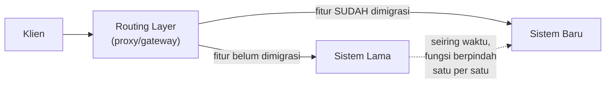

## TL;DR

Strangler fig pattern mengambil namanya dari tanaman ara pencekik — tumbuhan yang tumbuh **mengelilingi** pohon inang, perlahan mengambil alih fungsi pohon itu sepenuhnya, sampai akhirnya pohon inang aslinya bisa mati dan membusuk di dalam, sementara tanaman ara pencekik tetap berdiri tegak menggunakan struktur yang sama. Diterapkan pada software: mengganti sistem lama tidak dilakukan lewat **big-bang rewrite** (membangun ulang semuanya dari nol, lalu mengganti sekaligus) — melainkan membangun fungsi baru **di sekeliling** sistem lama secara bertahap, mengalihkan traffic sedikit demi sedikit dari fungsi lama ke fungsi baru, sampai akhirnya sistem lama tidak lagi menangani traffic apa pun dan bisa dimatikan dengan aman.

## The Problem

Sebuah tim mewarisi salah satu dari 13 aplikasi yang dibangun bertahun-tahun lalu dengan arsitektur PHP Yii1 yang sudah sulit dipelihara — kode yang saling terkait erat, dependency yang usang, dan setiap perubahan kecil butuh waktu lama karena risiko efek samping tak terduga di bagian lain sistem. Tim memutuskan menulis ulang seluruh sistem dari nol memakai Go dengan arsitektur modern — proyek yang direncanakan selesai dalam enam bulan.

Delapan belas bulan kemudian, proyek penulisan ulang ini masih belum selesai — kebutuhan bisnis terus berubah selama proses penulisan ulang berlangsung, memaksa penyesuaian rencana berulang kali; sistem lama tetap harus dipelihara dan menerima perubahan mendesak (karena masih melayani pengguna nyata) yang tidak pernah sinkron dengan progres sistem baru; dan tim mulai kehilangan kepercayaan bahwa sistem baru akan pernah benar-benar "selesai" dan siap menggantikan yang lama sepenuhnya. Ini adalah pola kegagalan klasik big-bang rewrite: proyek yang, alih-alih menyelesaikan masalah, menciptakan dua sistem yang harus dipelihara bersamaan tanpa satu pun yang benar-benar lengkap.

## Intuition

Cara paling mudah memahaminya lewat asal nama pola ini: pohon ara pencekik tumbuh dengan mengirim akar udara turun mengelilingi pohon inang, secara bertahap menyerap nutrisi dan cahaya, tanpa pernah menunggu satu momen tunggal "sekarang saatnya berpindah sepenuhnya". Pohon inang tetap hidup dan berfungsi normal untuk waktu yang lama sementara tanaman ara pencekik tumbuh di sekelilingnya — sampai suatu titik, cukup sudah berkembang untuk berdiri sendiri, dan pohon inang boleh mati tanpa ada satu momen dramatis "penggantian sistem" yang berisiko.

Analogi ini nyaris sepenuhnya menangkap esensi pola ini dalam software: fungsi baru dibangun **di depan** sistem lama (biasanya lewat lapisan routing atau proxy yang memutuskan permintaan mana diarahkan ke sistem lama, mana ke sistem baru), dan pengalihan terjadi **per fitur atau per endpoint**, bukan sekaligus. Yang tidak sepenuhnya tertangkap: pohon ara pencekik tidak perlu koordinasi eksplisit dengan pohon inangnya. Migrasi software butuh perencanaan sadar tentang urutan fitur mana yang dimigrasikan lebih dulu, biasanya dimulai dari yang risikonya paling rendah dan nilainya paling jelas, membangun kepercayaan sebelum melangkah ke bagian yang lebih kritis.

## How It Works


Routing layer di depan kedua sistem adalah komponen kunci — ia memutuskan, per request, sistem mana yang menangani permintaan itu, berdasarkan fitur atau endpoint apa yang diminta. Di awal migrasi, hampir semua traffic diarahkan ke sistem lama, hanya sebagian kecil fitur (biasanya yang paling sederhana dan risikonya rendah) yang sudah diarahkan ke sistem baru. Seiring waktu, semakin banyak fitur dimigrasi dan diarahkan ke sistem baru, sampai akhirnya sistem lama tidak menerima traffic sama sekali dan bisa dimatikan.

Setiap langkah pengalihan fitur dari lama ke baru **sendiri** adalah operasi yang bisa dievaluasi dan (kalau perlu) dibatalkan secara independen — kalau fitur X yang baru dipindah ternyata bermasalah, routing layer bisa dikembalikan mengarahkan fitur itu ke sistem lama lagi, tanpa memengaruhi fitur lain yang sudah berhasil dipindah. Ini kontras tajam dengan big-bang rewrite di "The Problem", di mana tidak ada jalan kembali parsial — begitu berpindah, seluruh sistem harus berpindah sekaligus.

## Under The Hood

Tantangan teknis terbesar strangler fig biasanya bukan membangun fungsi baru itu sendiri, tapi **data yang harus tetap konsisten** antara sistem lama dan baru selama masa transisi yang bisa berlangsung berbulan-bulan atau bertahun-tahun. Kalau sistem lama dan baru sama-sama bisa mengubah data yang sama (karena beberapa fitur sudah dipindah, beberapa belum, dan keduanya menyentuh entitas data yang sama), sinkronisasi data antar kedua sistem jadi masalah nyata yang butuh strategi eksplisit — sering diselesaikan lewat [[Change Data Capture]] yang menyinkronkan perubahan dari database lama ke database baru (atau sebaliknya) secara otomatis selama masa transisi.

Urutan migrasi fitur idealnya dipilih berdasarkan kombinasi **risiko** (mulai dari yang aman) dan **nilai pembelajaran** (fitur yang membantu tim memahami pola-pola yang akan berulang di fitur lain) — bukan urutan acak atau sekadar "yang paling mudah dulu". Fitur yang benar-benar terisolasi (tidak banyak bergantung pada data yang dipakai fitur lain) adalah kandidat migrasi pertama yang ideal, memberi kemenangan awal yang membangun kepercayaan tim dan pemangku kepentingan terhadap pendekatan ini sebelum melangkah ke bagian yang lebih terjalin erat dengan sisa sistem lama.

## In Go

```go
package strangler

import "net/http"

// RoutingLayer menunjukkan komponen KUNCI strangler fig — keputusan
// PER-ENDPOINT tentang sistem mana yang menangani request, BUKAN
// keputusan tunggal untuk seluruh sistem sekaligus.
type RoutingLayer struct {
	migratedEndpoints map[string]bool // endpoint yang SUDAH dipindah ke sistem baru
	newSystemProxy    http.Handler
	oldSystemProxy    http.Handler
}

func (r *RoutingLayer) ServeHTTP(w http.ResponseWriter, req *http.Request) {
	if r.migratedEndpoints[req.URL.Path] {
		r.newSystemProxy.ServeHTTP(w, req)
		return
	}
	r.oldSystemProxy.ServeHTTP(w, req)
}

// MigrateEndpoint adalah operasi ATOMIK dan REVERSIBLE — memindah
// satu endpoint tanpa memengaruhi endpoint lain, dan bisa dibatalkan
// kapan saja tanpa dampak ke bagian sistem yang sudah berhasil dipindah.
func (r *RoutingLayer) MigrateEndpoint(path string) {
	r.migratedEndpoints[path] = true
}

func (r *RoutingLayer) RollbackEndpoint(path string) {
	delete(r.migratedEndpoints, path)
}
```

## In His Stack

Untuk 13 aplikasi yang sebagian dibangun dengan arsitektur Yii1/Yii2 lama, strangler fig adalah pendekatan yang jauh lebih realistis dibanding big-bang rewrite untuk memodernisasi sistem secara bertahap ke Go — dimulai dari endpoint atau fitur yang paling terisolasi (misalnya endpoint yang jarang diakses dan tidak banyak bergantung pada logika bisnis kompleks di sistem lama), membangun kepercayaan sebelum melangkah ke fitur inti yang lebih kritis. Routing layer di depan sistem lama dan baru bisa diimplementasikan sesederhana konfigurasi reverse proxy (lihat [[../92 Tools/Nginx|Nginx]]) yang mengarahkan path tertentu ke service baru, tanpa perlu infrastruktur canggih untuk mulai bermigrasi bertahap.

## Trade-offs and When Not To Use It

Strangler fig butuh masa transisi yang lebih lama dibanding big-bang rewrite yang (kalau berhasil) selesai dalam satu waktu — untuk sistem yang benar-benar kecil dan sederhana, di mana rewrite lengkap bisa dilakukan cepat dan aman, kompleksitas menjaga dua sistem berjalan berdampingan mungkin tidak sepadan. Strangler fig bernilai jelas untuk sistem besar dan kompleks (seperti aplikasi legacy yang sudah dipakai bertahun-tahun) di mana risiko dan waktu big-bang rewrite terbukti secara historis sering gagal atau jauh melebihi estimasi awal, seperti pola yang dialami tim di "The Problem".

## Common Mistakes

> [!warning] Jebakan
> Memilih big-bang rewrite untuk sistem besar dan kompleks tanpa mempertimbangkan riwayat industri yang menunjukkan pola ini sering gagal atau jauh melampaui estimasi waktu — persis kesalahan di "The Problem".

> [!warning] Jebakan
> Memigrasikan fitur yang saling terjalin erat dengan data yang sama tanpa strategi sinkronisasi data yang jelas antara sistem lama dan baru — menciptakan inkonsistensi data selama masa transisi yang bisa berlangsung lama.

> [!warning] Jebakan
> Memulai migrasi dari fitur paling kritis dan berisiko tinggi, alih-alih dari fitur yang paling terisolasi dan risikonya rendah — kehilangan kesempatan membangun kepercayaan dan pengalaman dari kemenangan awal sebelum menghadapi bagian tersulit.

## Exercises

1. Jelaskan filosofi inti strangler fig pattern, dan kenapa namanya diambil dari tanaman ara pencekik.
2. Kenapa strangler fig lebih tahan risiko dibanding big-bang rewrite untuk sistem besar dan kompleks?
3. Kenapa tantangan teknis terbesar strangler fig biasanya bukan membangun fungsi baru, melainkan menjaga konsistensi data selama masa transisi?
4. Desain terbuka: salah satu dari 13 aplikasimu adalah sistem PHP Yii1 legacy yang sulit dipelihara, dan tim ingin memodernisasi ke Go tanpa mengulang kegagalan big-bang rewrite yang pernah dicoba sebelumnya (seperti di "The Problem"). Rancang rencana migrasi strangler fig untuk sistem ini, termasuk kriteria memilih fitur mana yang dimigrasikan lebih dulu.

> [!success]- Kunci jawaban
> **1.** Filosofi intinya: mengganti sistem lama secara bertahap dengan membangun fungsi baru di sekelilingnya, mengalihkan sedikit demi sedikit sampai sistem lama tidak lagi dibutuhkan — bukan mengganti semuanya sekaligus. Namanya diambil dari tanaman ara pencekik yang tumbuh mengelilingi pohon inang, perlahan mengambil alih fungsinya, sampai pohon inang bisa mati sementara tanaman itu tetap berdiri menggunakan struktur yang telah dibangunnya.
> **4.** (1) Bangun routing layer (reverse proxy) di depan sistem Yii1 lama, yang pada awalnya meneruskan **semua** traffic ke sistem lama tanpa perubahan; (2) identifikasi fitur yang paling terisolasi — biasanya fitur yang tidak banyak bergantung data bersama dengan fitur lain, dan bukan bagian dari alur kritis bisnis (misalnya halaman informasi statis, atau endpoint pelaporan sederhana yang read-only) — sebagai kandidat migrasi pertama; (3) bangun ulang fitur itu di Go, arahkan routing layer untuk fitur itu ke sistem baru, pantau selama periode tertentu untuk memastikan berfungsi benar; (4) setelah kemenangan awal ini terbukti dan tim mendapat pengalaman nyata dengan proses migrasi bertahap, lanjutkan ke fitur berikutnya yang sedikit lebih kompleks, secara bertahap menaikkan tingkat kesulitan dan risiko seiring kepercayaan dan pengalaman tim bertambah; (5) untuk fitur yang menyentuh data bersama antara sistem lama dan baru, terapkan CDC (lihat [[Change Data Capture]]) untuk menjaga sinkronisasi data selama masa transisi; (6) setelah seluruh fitur berhasil dipindah dan routing layer tidak lagi mengarahkan traffic apa pun ke sistem lama, sistem Yii1 lama bisa dimatikan dengan aman.

## Self-Check

- Apa filosofi inti strangler fig pattern?
- Kenapa strangler fig lebih tahan risiko dibanding big-bang rewrite?
- Kenapa konsistensi data adalah tantangan terbesar dalam praktik?
- Bagaimana kriteria memilih fitur mana yang dimigrasikan lebih dulu?

## Connected Notes

- [[Expand-Contract Schema Migration]] — strangler fig berbagi filosofi yang sama dengan expand-contract: perubahan bertahap yang selalu bisa dibatalkan sebagian, bukan perubahan besar sekaligus.
- [[../90 Architecture and Design/Modular Monolith vs Microservices|Modular Monolith vs Microservices]] — strangler fig sering dipakai justru sebagai jalur migrasi bertahap dari monolit menuju arsitektur yang lebih modular.
- [[Change Data Capture]] — mekanisme praktis menjaga sinkronisasi data antara sistem lama dan baru selama masa transisi strangler fig yang panjang.
- [[Zero-Downtime Database Migration Using CDC]] — kelanjutan langsung: penerapan konkret migrasi data skala besar yang sering menyertai proses strangler fig.
- [[../90 Architecture and Design/Managing Technical Debt Explicitly|Managing Technical Debt Explicitly]] — keputusan memilih strangler fig atas big-bang rewrite adalah contoh konkret mengelola utang teknis secara sadar dan bertahap.

## Further Reading

- Martin Fowler, "StranglerFigApplication" (martinfowler.com) — tulisan yang mempopulerkan istilah dan konsep ini secara luas di industri software.

## Catatan Saya

*Tulis di sini apakah salah satu dari 13 aplikasimu pernah mencoba (atau sedang mempertimbangkan) migrasi besar-besaran, dan apakah pendekatannya lebih mirip big-bang rewrite atau strangler fig.*
