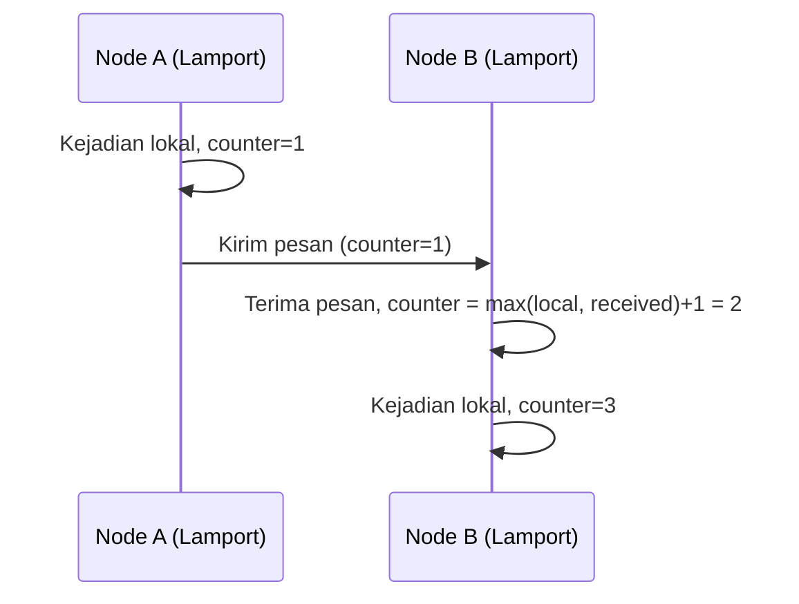

## TL;DR

Jam dinding (wall clock) di mesin berbeda tidak pernah benar-benar tersinkronisasi sempurna — bahkan dengan NTP, selalu ada sedikit selisih (clock skew), dan selisih ini cukup untuk membuat "urutan kejadian berdasarkan timestamp" jadi tidak bisa dipercaya di sistem terdistribusi. **Lamport clock** menyelesaikan ini dengan mengganti timestamp fisik dengan **counter logis** — angka yang naik setiap kejadian, disinkronkan lewat pesan yang dikirim antar node, cukup untuk menentukan urutan sebab-akibat tanpa bergantung pada jam fisik sama sekali. **Vector clock** memperluas ide ini: alih-alih satu angka, setiap node menyimpan **vektor angka** (satu per node dalam sistem), memungkinkan bukan hanya urutan sebab-akibat, tapi juga mendeteksi kejadian yang **concurrent** (tidak berkaitan sebab-akibat sama sekali) — sesuatu yang tidak bisa dibedakan Lamport clock sendirian.

## The Problem

Dua node dalam sistem terdistribusi masing-masing mencatat kejadian dengan timestamp dari jam sistemnya sendiri. Node A mencatat kejadian "X" pada 10:00:00.100, Node B mencatat kejadian "Y" pada 10:00:00.050 — berdasarkan timestamp mentah ini, terlihat seperti Y terjadi sebelum X. Tapi jam Node B sebenarnya sedikit lebih lambat dari jam Node A (clock skew beberapa puluh milidetik, hal yang sangat wajar bahkan dengan sinkronisasi NTP yang baik) — kenyataannya, X terjadi lebih dulu, dan Y bahkan mungkin adalah **respons** terhadap pesan yang dikirim setelah X terjadi. Timestamp mentah membohongi urutan sebab-akibat yang sebenarnya.

Konsekuensinya bisa serius: sebuah sistem yang mengurutkan log kejadian berdasarkan timestamp mentah dari berbagai node bisa menyajikan urutan yang salah secara sebab-akibat — perubahan yang seharusnya terlihat sebagai konsekuensi dari perubahan lain justru terlihat mendahuluinya, membingungkan siapa pun yang mencoba merekonstruksi apa yang sebenarnya terjadi, persis masalah yang dibahas di [[Consistency Models]] soal balasan komentar yang muncul sebelum komentar aslinya.

## Intuition

Cara paling mudah memahaminya untuk Lamport clock: bayangkan **nomor antrean yang terus naik setiap kali seseorang berbicara di rapat**, bukan jam dinding. Kalau si A bicara (dapat nomor 5), lalu si B merespons apa yang dikatakan si A (dapat nomor 6, lebih besar dari nomor si A karena tahu ucapan si A lebih dulu), urutan nomor ini mencerminkan urutan sebab-akibat dengan tepat — terlepas dari jam dinding sungguhan di ruangan itu. Kalau si C berbicara tanpa pernah mendengar A atau B (di ruangan berbeda, topik berbeda), nomornya tetap naik dari counter lokalnya sendiri, tapi tidak ada cara membedakan apakah ucapan C "sebelum" atau "sesudah" A dan B secara sebab-akibat — Lamport clock hanya memberi urutan **total** yang konsisten, bukan mengungkap mana yang benar-benar tidak berkaitan.

Vector clock menambah detail yang hilang itu: bayangkan setiap orang membawa **buku catatan** yang mencatat "nomor terakhir yang saya dengar dari setiap orang lain di ruangan". Dengan membandingkan buku catatan dua orang, kamu bisa tahu persis apakah ucapan satu orang **benar-benar** terjadi sebelum, sesudah, atau **sama sekali tidak berkaitan** (concurrent) dengan ucapan orang lain — informasi yang tidak bisa didapat hanya dari satu nomor urut Lamport.

Analogi ini bocor pada soal skala. Rapat dengan segelintir orang mudah dibayangkan setiap orang membawa "buku catatan" lengkap. Sistem dengan ribuan node butuh vector clock berukuran ribuan entri per pesan — biaya yang jadi pertimbangan praktis nyata, dibahas di bagian trade-off di bawah.

## How It Works


Aturan Lamport clock sederhana: setiap kejadian lokal menaikkan counter sebesar 1; setiap kali mengirim pesan, counter saat ini disertakan; setiap kali menerima pesan, counter lokal diset jadi `max(counter lokal, counter yang diterima) + 1`. Aturan ini menjamin: kalau kejadian A **benar-benar** menyebabkan kejadian B (lewat rantai pesan apa pun), maka `Lamport(A) < Lamport(B)` — tapi **kebalikannya tidak selalu benar**: `Lamport(A) < Lamport(B)` tidak menjamin A menyebabkan B, karena keduanya bisa saja terjadi di node yang sama sekali tidak berkaitan.

Vector clock menutup celah itu dengan menyimpan satu counter **per node**, bukan satu counter tunggal — dengan membandingkan vektor lengkap (bukan satu angka), sistem bisa membedakan "A terjadi sebelum B" dari "A dan B concurrent (tidak berkaitan)" secara pasti, seperti dibahas mekanismenya di [[Consistency Models]].

## Under The Hood

Poin krusial yang membedakan kedua mekanisme: Lamport clock memberi **urutan total** (setiap dua kejadian selalu bisa dibandingkan, salah satu "lebih kecil" dari yang lain) tapi urutan total ini **tidak selalu mencerminkan sebab-akibat sungguhan** — dua kejadian yang tidak berkaitan tetap dapat nomor yang berbeda dan terlihat "berurutan" meski sebenarnya independen. Vector clock memberi **urutan parsial** yang jujur: sebagian pasangan kejadian memang bisa dibandingkan (kalau salah satu benar-benar menyebabkan yang lain), tapi sebagian lain secara eksplisit ditandai sebagai "tidak bisa dibandingkan" (concurrent) — informasi yang lebih akurat, dengan harga struktur data yang lebih besar.

Biaya vector clock tumbuh linear dengan jumlah node dalam sistem — untuk sistem dengan ribuan node yang saling berkomunikasi, menyertakan vektor lengkap di setiap pesan menjadi mahal. Sistem production skala besar sering memakai varian yang lebih hemat (dotted version vector, atau membatasi vector clock hanya untuk node yang benar-benar relevan pada satu potongan data tertentu, bukan seluruh sistem) — detail optimasi yang di luar cakupan note ini, tapi penting diketahui ada trade-off nyata di sini, bukan solusi gratis.

## In Go

```go
package clocks

// LamportClock: SATU counter, memberi urutan total tapi bisa
// "berbohong" soal sebab-akibat untuk kejadian yang tidak berkaitan.
type LamportClock struct {
	counter int
}

func (c *LamportClock) LocalEvent() int {
	c.counter++
	return c.counter
}

func (c *LamportClock) Send() int {
	c.counter++
	return c.counter // disertakan di pesan yang dikirim
}

func (c *LamportClock) Receive(receivedCounter int) int {
	if receivedCounter > c.counter {
		c.counter = receivedCounter
	}
	c.counter++
	return c.counter
}

// VectorClock: satu counter PER NODE, memberi urutan parsial yang
// jujur — bisa membedakan "sebelum" dari "concurrent".
type VectorClock map[string]int

func NewVectorClock(nodeID string) VectorClock {
	return VectorClock{nodeID: 0}
}

func (v VectorClock) LocalEvent(nodeID string) {
	v[nodeID]++
}

// Merge menggabungkan vector clock yang diterima dari pesan masuk —
// setiap entri diambil nilai MAKSIMUM, mencerminkan pengetahuan
// terbaru tentang setiap node.
func (v VectorClock) Merge(received VectorClock, selfNodeID string) {
	for node, val := range received {
		if val > v[node] {
			v[node] = val
		}
	}
	v[selfNodeID]++
}
```

## In His Stack

Untuk 13 aplikasi yang mencatat log aktivitas atau riwayat perubahan lintas beberapa service, memahami kenapa "urutan berdasarkan timestamp server" tidak selalu bisa dipercaya adalah pengetahuan yang menyelamatkan waktu debugging — insiden yang terlihat seperti "urutan kejadian tidak masuk akal" di log gabungan lintas service sering sebenarnya adalah clock skew biasa, bukan bug logika. Correlation ID (lihat [[../70 Infrastructure and Delivery/Correlation IDs|Correlation IDs]]) membantu mengelompokkan log yang berkaitan, tapi tidak menyelesaikan masalah urutan lintas service — untuk itu, prinsip di balik Lamport clock (counter logis yang diteruskan lewat pesan) adalah solusi yang lebih tepat sasaran dibanding berharap jam server selalu tersinkron sempurna.

## Trade-offs and When Not To Use It

Untuk sistem dengan satu node saja, atau sistem terdistribusi kecil di mana konsekuensi salah urutan sebab-akibat rendah (log debugging biasa yang tidak jadi dasar keputusan otomatis apa pun), investasi mengimplementasikan Lamport atau vector clock formal jarang sepadan — memakai timestamp jam dinding plus toleransi kesalahan yang dipahami (dan correlation ID untuk pengelompokan) sudah cukup praktis. Lamport dan vector clock bernilai jelas untuk sistem yang benar-benar butuh jaminan urutan sebab-akibat yang bisa diverifikasi formal — replikasi database terdistribusi, resolusi konflik otomatis pada sistem yang mendukung banyak penulis bersamaan (multi-master).

## Common Mistakes

> [!warning] Jebakan
> Mengandalkan timestamp jam dinding dari node berbeda untuk mengurutkan kejadian secara sebab-akibat — clock skew, meski kecil, cukup untuk menghasilkan urutan yang salah, seperti dibahas di "The Problem".

> [!warning] Jebakan
> Menganggap urutan total Lamport clock berarti kejadian yang lebih kecil nomornya pasti "menyebabkan" yang lebih besar — Lamport clock hanya menjamin arah sebaliknya (sebab-akibat sungguhan pasti tercermin di nomor), bukan bahwa setiap perbandingan nomor mencerminkan sebab-akibat nyata.

> [!warning] Jebakan
> Memakai vector clock penuh untuk sistem dengan sangat banyak node tanpa mempertimbangkan biaya penyimpanan dan bandwidth-nya — ukuran vektor yang tumbuh linear dengan jumlah node bisa jadi signifikan pada skala besar tanpa optimasi tambahan.

## Exercises

1. Jelaskan kenapa timestamp jam dinding dari node berbeda tidak bisa dipercaya untuk menentukan urutan sebab-akibat kejadian di sistem terdistribusi.
2. Jelaskan aturan dasar Lamport clock, dan apa yang dijaminnya (serta apa yang **tidak** dijaminnya).
3. Apa yang ditambahkan vector clock dibanding Lamport clock, dan kenapa tambahan itu penting?
4. Desain terbuka: kamu membangun sistem log aktivitas lintas tiga dari 13 aplikasi yang saling memanggil, dan tim sering kebingungan saat urutan log gabungan dari ketiga aplikasi terlihat tidak masuk akal (efek terlihat mendahului sebabnya). Rancang solusi memakai prinsip Lamport clock untuk mengatasi masalah ini, termasuk bagaimana counter logis ini diteruskan lintas panggilan HTTP antar aplikasi.

> [!success]- Kunci jawaban
> **1.** Jam sistem di setiap node, meski disinkronkan lewat NTP, selalu punya sedikit selisih (clock skew) yang tidak bisa dihilangkan sepenuhnya — selisih ini cukup untuk membuat kejadian yang sebenarnya terjadi lebih dulu terlihat memiliki timestamp lebih besar dari kejadian yang sebenarnya terjadi belakangan, membalik urutan sebab-akibat yang sesungguhnya.
> **4.** Tambahkan header kustom (misalnya `X-Logical-Clock`) yang membawa counter Lamport, diteruskan bersama correlation ID di setiap panggilan HTTP antar tiga aplikasi ini. Setiap aplikasi menaikkan counter lokalnya untuk setiap kejadian yang dicatat, menyertakan nilai counter saat mengirim request ke aplikasi lain, dan saat menerima request, mengatur countернya jadi `max(counter lokal, counter yang diterima) + 1` sebelum melanjutkan. Log kemudian mencatat baik timestamp jam dinding (untuk pembacaan manusia) maupun counter logis ini (untuk pengurutan yang benar secara sebab-akibat) — saat menyusun ulang cerita lintas ketiga aplikasi, urutkan berdasarkan counter logis, bukan timestamp mentah, menjamin kejadian yang benar-benar menyebabkan kejadian lain selalu terlihat lebih dulu, terlepas dari clock skew antar server ketiga aplikasi itu.

## Self-Check

- Kenapa timestamp jam dinding tidak bisa dipercaya untuk urutan sebab-akibat di sistem terdistribusi?
- Apa aturan dasar Lamport clock, dan apa yang dijaminnya?
- Apa yang ditambahkan vector clock dibanding Lamport clock?
- Kapan investasi vector clock formal tidak sepadan?

## Connected Notes

- [[Consistency Models]] — vector clock adalah mekanisme konkret yang membuat causal consistency, dibahas di note sebelumnya, bisa diimplementasikan.
- [[../70 Infrastructure and Delivery/Correlation IDs|Correlation IDs]] — correlation ID mengelompokkan log yang berkaitan; prinsip Lamport clock menyelesaikan masalah berbeda, yaitu urutan yang benar di antara log yang sudah dikelompokkan itu.
- [[../70 Infrastructure and Delivery/Distributed Tracing|Distributed Tracing]] — span dalam distributed tracing punya masalah urutan yang sama, dan sering diselesaikan dengan prinsip serupa (urutan sebab-akibat lewat propagasi konteks, bukan timestamp mentah semata).
- [[Failure Detectors]] — kelanjutan langsung: setelah memahami cara mengurutkan kejadian, pertanyaan berikutnya adalah bagaimana satu node tahu node lain masih hidup, tanpa jam yang sama persis.
- [[Leader Election and Split Brain]] — algoritma leader election sering bergantung pada mekanisme pengurutan kejadian yang mirip prinsip di note ini.

## Further Reading

- Leslie Lamport, "Time, Clocks, and the Ordering of Events in a Distributed System" (1978) — paper asli yang memperkenalkan Lamport clock, salah satu paper paling berpengaruh dalam sejarah distributed systems, sangat layak dibaca langsung untuk ambisi studi master.
- Colin Fidge dan Friedemann Mattern, penemu independen konsep vector clock (1988).

## Catatan Saya

*Tulis di sini insiden di pekerjaanmu di mana log dari beberapa server terlihat "tidak masuk akal urutannya", dan apakah clock skew mungkin jadi penyebabnya.*
