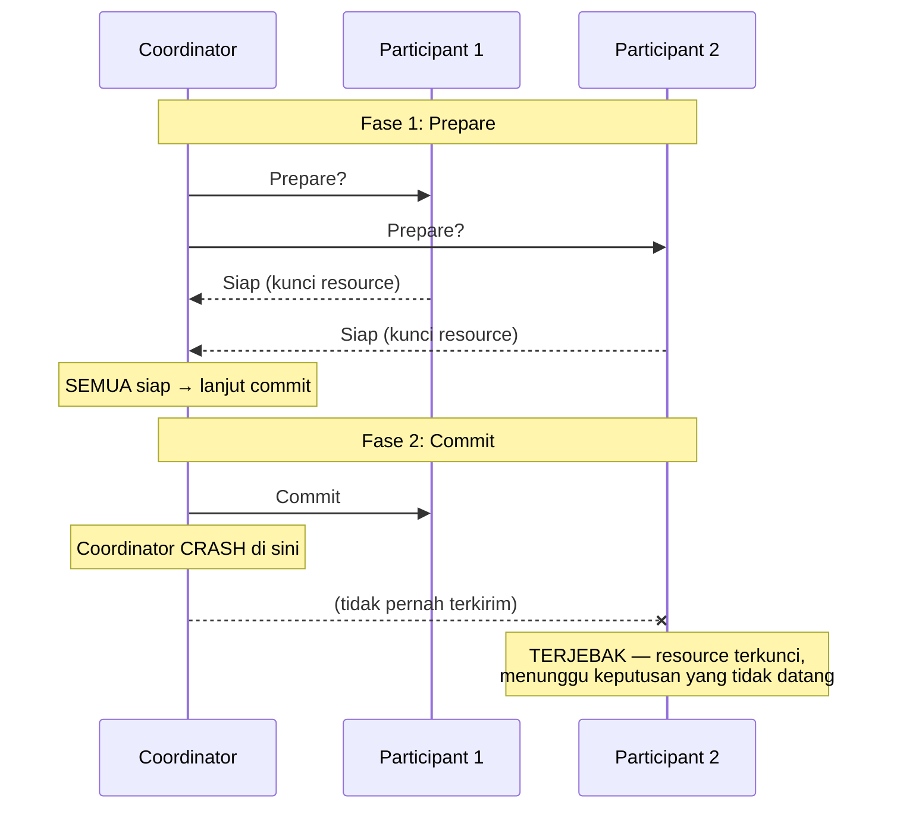

## TL;DR

Two-phase commit (2PC) adalah protokol yang, secara tekstual, terlihat seperti solusi sempurna untuk transaksi lintas service: satu **coordinator** meminta semua **participant** (database atau service yang terlibat) untuk **prepare** (memastikan siap commit tapi belum benar-benar commit), dan hanya setelah **semua** participant setuju siap, coordinator memerintahkan **commit** ke semuanya sekaligus — meniru atomicity transaksi database tunggal, tapi lintas banyak sistem. Masalahnya bukan di logika protokolnya, tapi di konsekuensi kegagalan: kalau coordinator mati tepat setelah sebagian participant menerima perintah commit tapi sebelum yang lain menerimanya, participant yang sudah "siap" tapi belum tahu keputusan akhir terjebak **mengunci resource-nya** menunggu keputusan yang mungkin tidak pernah datang — inilah kenapa 2PC, meski terbukti benar secara logika, dihindari luas dalam praktik sistem terdistribusi modern.

## The Problem

Sebuah tim mencoba 2PC untuk menyinkronkan perubahan data lintas dua sistem: database utama dan sistem pencarian (search index). Coordinator meminta kedua sistem untuk prepare — keduanya menjawab siap, mengunci resource yang relevan (baris database terkunci, index sementara ditahan) menunggu perintah final. Coordinator kemudian mengirim perintah commit ke database utama — berhasil — tapi tepat sebelum mengirim perintah yang sama ke sistem pencarian, coordinator itu sendiri mengalami crash (server-nya mati, atau jaringan terputus).

Sistem pencarian sekarang berada di kondisi **blocking**: ia sudah bilang "siap" dan mengunci resource-nya, tapi tidak pernah menerima perintah final (commit atau abort). Ia tidak bisa memutuskan sendiri — melanjutkan commit tanpa perintah eksplisit berisiko tidak sinkron dengan database utama (yang mungkin sebenarnya sudah di-abort di sisi lain, meski dalam skenario ini kebetulan sudah commit), tapi membatalkan begitu saja juga berisiko salah kalau ternyata coordinator akan mengirim perintah commit setelah pulih. Resource yang terkunci ini tetap terkunci — mengganggu operasi lain yang butuh resource yang sama — sampai seseorang (atau coordinator yang pulih) akhirnya menyelesaikan keputusan yang menggantung ini, yang bisa memakan waktu lama tanpa intervensi manual.

## Intuition

Cara paling mudah memahaminya: 2PC seperti **upacara pernikahan dengan wali dari pihak ketiga** yang harus mengonfirmasi kedua mempelai sama-sama setuju sebelum pernikahan dianggap sah — kedua mempelai masing-masing bilang "saya siap" (prepare), lalu wali itu mengucapkan "sah" ke keduanya secara berurutan (commit). Bayangkan wali itu, tepat setelah mengucapkan "sah" ke mempelai pertama, tiba-tiba pingsan sebelum sempat mengucapkannya ke mempelai kedua — mempelai kedua kini terjebak dalam status ambigu: sudah bilang "siap" (berkomitmen secara sosial), tapi belum tahu apakah pernikahan ini resmi sah atau tidak, dan tidak bisa memutuskan sendiri tanpa berisiko salah.

Analogi ini bocor pada soal siapa yang bisa menyelamatkan situasi. Dalam pernikahan nyata, orang-orang di sekitar bisa mengambil inisiatif berdasarkan penilaian manusiawi ("kita anggap saja sah, semua orang sudah menyaksikan kesepakatannya"). Sistem software yang mengikuti protokol 2PC secara ketat **tidak boleh** mengambil keputusan sepihak seperti itu — participant yang terjebak menunggu **harus** menunggu keputusan resmi dari coordinator (atau coordinator baru yang mengambil alih setelah pemulihan), karena mengambil keputusan sendiri berisiko melanggar jaminan atomicity yang jadi tujuan protokol ini sejak awal.

## How It Works


Titik kegagalan paling berbahaya ada tepat di antara fase 1 dan fase 2 — begitu semua participant sudah "setuju siap" (dan mengunci resource), keputusan final ada sepenuhnya di tangan coordinator, dan **participant tidak bisa bertindak mandiri** tanpa berisiko melanggar atomicity. Kalau coordinator gagal tepat di titik kritis ini, participant terjebak (blocking) tanpa cara aman keluar dari situasi itu sendiri.

## Under The Hood

Masalah mendasar 2PC bukan di logikanya (yang secara matematis benar untuk kasus tanpa kegagalan) — masalahnya ada di **ketergantungan tunggal pada coordinator** yang menjadi single point of failure untuk seluruh transaksi. Ini kontras tajam dengan algoritma consensus seperti Raft ([[Consensus - Raft]]) yang secara eksplisit dirancang untuk tetap berfungsi meski sebagian node (termasuk leader) gagal — 2PC klasik tidak punya mekanisme serupa; kalau coordinator gagal di waktu yang salah, sistem butuh intervensi eksternal (coordinator baru yang membaca log dan melanjutkan, atau operator manusia) untuk keluar dari keadaan blocking.

Varian yang lebih canggih (three-phase commit, atau 2PC yang dikombinasikan dengan consensus untuk memilih coordinator baru secara otomatis) mengurangi masalah ini, tapi menambah kompleksitas signifikan tanpa menghilangkan trade-off fundamentalnya: menjaga atomicity ketat lintas banyak sistem selalu berarti mengorbankan availability saat sebagian dari sistem itu gagal — persis trade-off yang dijelaskan CAP theorem ([[CAP Theorem and PACELC]]), diterapkan pada konteks transaksi terdistribusi. Inilah kenapa industri secara luas beralih ke saga ([[Sagas - Orchestration vs Choreography]]) yang secara sengaja **menerima** ketidakkonsistenan sementara (keadaan "setengah selesai" yang terlihat sebentar) demi menghindari blocking, lalu memperbaikinya lewat compensating action — trade-off yang secara praktik terbukti lebih tahan terhadap kegagalan nyata dibanding mempertahankan atomicity ketat yang rapuh terhadap kegagalan coordinator tunggal.

## In Go

```go
package twopc

import (
	"context"
	"errors"
	"fmt"
)

type Participant interface {
	Prepare(ctx context.Context) error
	Commit(ctx context.Context) error
	Abort(ctx context.Context) error
}

// ErrCoordinatorFailed menunjukkan SECARA EKSPLISIT titik kegagalan
// paling berbahaya di 2PC — kode ini TIDAK menyembunyikan risiko
// blocking yang inheren pada protokol ini.
var ErrCoordinatorFailed = errors.New("twopc: coordinator gagal di antara fase prepare dan commit, participant mungkin TERJEBAK")

func RunTwoPhaseCommit(ctx context.Context, participants []Participant) error {
	// Fase 1: Prepare
	for _, p := range participants {
		if err := p.Prepare(ctx); err != nil {
			// SATU participant menolak → abort SEMUA
			for _, p2 := range participants {
				_ = p2.Abort(ctx)
			}
			return fmt.Errorf("twopc: prepare gagal, semua di-abort: %w", err)
		}
	}

	// Fase 2: Commit — TITIK PALING RAWAN. Kalau proses ini crash
	// di tengah loop, sebagian participant sudah commit, sebagian
	// masih menunggu (BLOCKED) tanpa mekanisme pemulihan otomatis
	// dalam implementasi sederhana ini.
	for _, p := range participants {
		if err := p.Commit(ctx); err != nil {
			// Kegagalan DI SINI adalah skenario paling berbahaya —
			// sebagian sudah commit, tidak bisa "un-commit".
			return fmt.Errorf("twopc: commit gagal SETELAH sebagian participant commit — keadaan TIDAK KONSISTEN: %w", err)
		}
	}
	return nil
}
```

## In His Stack

Untuk 13 aplikasi yang masing-masing punya database MariaDB terpisah, godaan mencoba 2PC (baik lewat fitur `XA transaction` yang tersedia di beberapa database, atau membangunnya sendiri) untuk sinkronisasi lintas aplikasi biasanya muncul dari keinginan wajar mempertahankan "konsistensi sempurna" — tapi berdasarkan riwayat industri luas, saga (dengan compensating action yang dipikirkan matang) hampir selalu jadi pilihan yang lebih tahan terhadap kegagalan nyata untuk kebutuhan lintas 13 aplikasi yang independen ini, dibanding 2PC yang menciptakan ketergantungan erat dan risiko blocking antar aplikasi yang seharusnya bisa beroperasi independen.

## Trade-offs and When Not To Use It

2PC (lewat `XA transaction`) masih relevan untuk skenario yang sangat spesifik: jumlah participant kecil dan **tetap** (bukan puluhan service dinamis), semua berada dalam kendali operasional yang sama (bukan lintas organisasi atau tim independen), dan konsekuensi ketidakkonsistenan sementara benar-benar tidak bisa diterima sama sekali (lebih penting daripada availability). Untuk mayoritas sistem microservices modern — terutama yang melintasi tim atau organisasi berbeda, seperti integrasi antar 13 aplikasi yang dikelola tim berbeda-beda — saga hampir selalu pilihan yang lebih matang dan lebih tahan kegagalan, karena tidak menciptakan titik blocking tunggal yang bisa melumpuhkan banyak sistem sekaligus kalau satu coordinator gagal.

## Common Mistakes

> [!warning] Jebakan
> Memilih 2PC karena terlihat "lebih benar secara matematis" (menjaga atomicity ketat) tanpa mempertimbangkan risiko blocking saat coordinator gagal — konsistensi teoretis yang sempurna tidak ada gunanya kalau sistem justru sering macet menunggu keputusan yang tidak kunjung datang.

> [!warning] Jebakan
> Menerapkan 2PC lintas service yang dikelola tim atau organisasi berbeda — menciptakan ketergantungan erat (tight coupling) yang berlawanan dengan alasan utama memisahkan sistem jadi service independen sejak awal.

> [!warning] Jebakan
> Tidak membangun mekanisme pemulihan untuk participant yang terjebak (blocked) menunggu keputusan coordinator yang gagal — tanpa mekanisme ini, satu-satunya jalan keluar adalah intervensi manual, yang berarti downtime yang lebih lama dari yang seharusnya.

## Exercises

1. Jelaskan dua fase dalam 2PC, dan di titik mana risiko blocking paling berbahaya muncul.
2. Kenapa 2PC dianggap terbukti benar secara logika tapi tetap dihindari luas dalam praktik?
3. Kenapa saga (yang menerima ketidakkonsistenan sementara) sering jadi pilihan lebih baik dibanding 2PC (yang menjaga atomicity ketat) untuk sistem terdistribusi modern?
4. Desain terbuka: seorang rekan kerja mengusulkan memakai `XA transaction` (2PC) untuk menyinkronkan perubahan data antara dua dari 13 aplikasi yang dikelola tim berbeda, dengan alasan "kita butuh data yang selalu 100% konsisten antara keduanya". Bagaimana kamu akan merespons usulan ini, dan apa alternatif yang akan kamu rekomendasikan?

> [!success]- Kunci jawaban
> **1.** Fase 1 (Prepare): coordinator meminta semua participant memastikan siap commit, participant mengunci resource dan menjawab siap/tidak. Fase 2 (Commit): coordinator memerintahkan commit ke semua participant yang sudah siap. Risiko blocking paling berbahaya muncul tepat setelah fase 1 selesai (semua participant sudah mengunci resource dan menunggu) tapi sebelum fase 2 selesai sepenuhnya ke semua participant — kalau coordinator gagal di titik ini, participant yang sudah terkunci tidak bisa memutuskan sendiri dan terjebak menunggu.
> **4.** Jelaskan bahwa "selalu 100% konsisten" lewat 2PC datang dengan biaya tersembunyi yang serius: risiko blocking yang bisa melumpuhkan kedua aplikasi kalau coordinator gagal di waktu yang salah, dan ketergantungan erat antar tim yang mengelola aplikasi berbeda (perubahan di satu aplikasi butuh koordinasi ketat dengan aplikasi lain untuk transaksi 2PC). Rekomendasikan pola saga sebagai gantinya: pecah proses jadi langkah-langkah dengan transaksi lokal di masing-masing aplikasi, plus compensating action untuk membatalkan efeknya kalau langkah setelahnya gagal — menerima bahwa akan ada jendela waktu singkat di mana kedua sistem "belum sinkron sempurna" (keadaan yang biasanya bisa diterima untuk kebanyakan kasus penggunaan nyata), demi menghindari risiko blocking yang jauh lebih mahal konsekuensinya kalau benar-benar terjadi.

## Self-Check

- Sebutkan dua fase dalam 2PC.
- Di titik mana risiko blocking paling berbahaya muncul pada 2PC?
- Kenapa 2PC dihindari luas meski terbukti benar secara logika?
- Kapan 2PC masih masuk akal dipakai?

## Connected Notes

- [[Sagas - Orchestration vs Choreography]] — saga adalah pola yang secara historis menggantikan 2PC di kebanyakan sistem microservices modern, dibahas di note sebelumnya.
- [[CAP Theorem and PACELC]] — trade-off atomicity vs availability pada 2PC adalah penerapan langsung dari trade-off consistency-availability yang dibahas formal di CAP theorem.
- [[Consensus - Raft]] — kontras penting: Raft dirancang eksplisit untuk tetap berfungsi meski sebagian node gagal, berbeda dari 2PC klasik yang rentan terhadap kegagalan coordinator tunggal.
- [[Idempotency Keys]] — kelanjutan langsung: mekanisme praktis yang membuat operasi retry (termasuk dalam konteks saga) aman dijalankan berulang.
- [[Exactly-Once Delivery as an Illusion]] — pembahasan lanjutan tentang kenapa jaminan sekuat 2PC (yang mencoba meniru "pasti terjadi sekali, di semua tempat, atau tidak sama sekali") secara fundamental sulit dicapai sempurna di sistem terdistribusi.

## Further Reading

- Jim Gray, "Notes on Data Base Operating Systems" (1978) — salah satu deskripsi awal protokol two-phase commit dalam konteks database terdistribusi.
- Pat Helland, "Life beyond Distributed Transactions: an Apostate's Opinion" (2007) — argumen berpengaruh dari industri tentang kenapa transaksi terdistribusi ketat (seperti 2PC) sebaiknya dihindari dalam skala besar.

## Catatan Saya

*Tulis di sini apakah ada bagian dari 13 aplikasimu yang pernah mencoba (atau mempertimbangkan) transaksi terdistribusi ketat semacam 2PC, dan masalah apa yang muncul (atau berpotensi muncul) darinya.*
