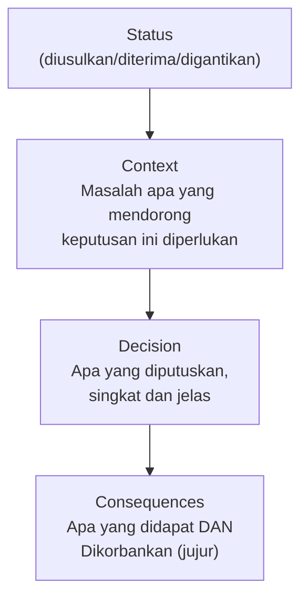

## TL;DR

Architecture Decision Record (ADR) adalah dokumen pendek yang mencatat **satu** keputusan arsitektural penting: apa yang diputuskan, konteks yang membuat keputusan itu perlu diambil, alternatif yang dipertimbangkan, dan konsekuensi yang diterima. Nilainya bukan di formalitas dokumentasi — nilainya ada di **masa depan**: enam bulan atau dua tahun kemudian, ketika seseorang (mungkin orang yang berbeda dari yang membuat keputusan awal) bertanya "kenapa sistem ini dirancang seperti ini?", ADR menjawab pertanyaan itu tanpa harus menebak-nebak atau mewawancarai orang yang mungkin sudah pindah tim atau lupa detailnya.

## The Problem

Dua tahun setelah sebuah sistem dibangun, seorang developer baru bergabung dan menemukan keputusan arsitektural yang terlihat aneh — sistem memakai dua database berbeda untuk dua bagian yang terlihat serupa, alih-alih satu database yang konsisten. Ia bertanya ke tim, dan tidak ada satu pun anggota tim saat ini yang tahu alasannya — orang yang membuat keputusan itu sudah pindah ke tim lain setahun lalu, dan tidak ada dokumentasi yang menjelaskan alasan di balik pilihan ini.

Developer baru ini punya dua pilihan yang sama-sama buruk: menghabiskan waktu berharga mencoba melacak orang yang mungkin ingat (kalau ada), atau mengasumsikan keputusan ini tidak punya alasan kuat dan mempertimbangkan menyederhanakannya jadi satu database — risiko yang bisa jadi berbahaya kalau ternyata alasan aslinya memang kuat dan relevan (misalnya kedua database itu punya karakteristik beban yang sangat berbeda), hanya saja alasan itu tidak pernah tertulis di mana pun yang bisa diakses.

## Intuition

Cara paling mudah memahaminya: ADR seperti **buku harian keputusan** yang ditulis bukan untuk diri sendiri hari ini, tapi untuk **orang asing di masa depan** yang tidak punya konteks apa pun tentang situasi saat keputusan dibuat. Seorang arsitek bangunan yang baik meninggalkan catatan desain yang menjelaskan kenapa fondasi diperkuat di titik tertentu, kenapa jalur pipa dirancang melewati rute tertentu — bukan karena arsitek itu ragu keputusannya, tapi karena tahu suatu hari nanti seseorang lain (kontraktor renovasi, insinyur pemeliharaan) akan perlu memahami keputusan itu tanpa bisa bertanya langsung ke arsitek aslinya.

Analogi ini nyaris sepenuhnya menangkap esensi ADR. Perbedaan penting: catatan desain arsitek bangunan biasanya ditulis sekali di akhir proyek. ADR yang matang ditulis **sepanjang perjalanan proyek**, satu dokumen per keputusan penting, bukan satu dokumen besar yang mencoba merangkum semuanya di akhir — pendekatan yang membuat setiap keputusan lebih mudah dilacak dan ditemukan secara terpisah, dibanding tenggelam dalam satu dokumen raksasa yang jarang dibaca ulang secara utuh.

## How It Works

Format ADR yang umum dipakai, ringkas dan konsisten:


**Status** menunjukkan keadaan keputusan saat ini — diusulkan (masih didiskusikan), diterima (sudah berlaku), atau digantikan (ada ADR baru yang menggantikan keputusan ini, dengan tautan ke ADR penggantinya, menjaga riwayat evolusi keputusan tetap terlihat). **Context** menjelaskan situasi yang memaksa keputusan ini diambil — bagian yang paling sering hilang di dokumentasi ad-hoc, padahal justru paling penting untuk memahami **kenapa** keputusan ini masuk akal saat itu. **Decision** adalah pernyataan singkat dan jelas tentang apa yang diputuskan. **Consequences** mencatat trade-off yang diterima secara jujur — persis elemen yang sudah dibahas mendalam di [[Forming and Defending Trade-offs]], sekarang didokumentasikan secara permanen.

## Under The Hood

ADR yang baik **tidak** mencoba mendokumentasikan setiap keputusan kecil — hanya keputusan yang **signifikan dan sulit dibalik** (memilih database, memilih pola komunikasi antar service, memilih strategi sharding) layak jadi ADR. Keputusan kecil dan mudah diubah (nama variabel, struktur folder internal satu service) tidak butuh dokumentasi formal semacam ini — mendokumentasikan segalanya menghasilkan volume ADR yang tidak pernah benar-benar dibaca, meniadakan nilai praktisnya.

Praktik yang membuat ADR benar-benar bertahan nilai jangka panjang: **jangan pernah mengedit ADR lama untuk mencerminkan keputusan baru** — kalau keputusan berubah, tulis ADR **baru** yang menjelaskan kenapa keputusan lama digantikan, dan tandai ADR lama sebagai "digantikan" dengan tautan ke yang baru. Ini menjaga riwayat evolusi keputusan tetap utuh — seseorang yang membaca ADR lama tetap bisa memahami konteks aslinya, sambil tahu bahwa keputusan itu sudah tidak berlaku dan kenapa, alih-alih riwayat yang hilang begitu dokumen lama ditimpa.

## In Go

```go
// ADR biasanya ditulis sebagai file Markdown, bukan kode Go — tapi
// struktur di bawah menunjukkan gagasan intinya dalam bentuk data,
// berguna kalau ADR dikelola lewat sistem terstruktur.
package adr

type Status string

const (
	Proposed  Status = "proposed"
	Accepted  Status = "accepted"
	Superseded Status = "superseded"
)

type Record struct {
	Number       int
	Title        string
	Status       Status
	SupersededBy int // 0 kalau tidak digantikan
	Context      string
	Decision     string
	Consequences struct {
		Positive []string
		Negative []string // BIAYA diakui secara jujur
	}
}

// Contoh ADR nyata, sebagai data — dalam praktik biasanya file
// terpisah "0007-pisahkan-database-analitik.md".
func ExampleRecord() Record {
	r := Record{
		Number: 7,
		Title:  "Pisahkan database analitik dari database transaksional",
		Status: Accepted,
		Context: "Query laporan bulanan mulai memperlambat operasi transaksional " +
			"utama karena bersaing memakai resource database yang sama.",
		Decision: "Replikasi data transaksional ke database analitik terpisah " +
			"(ClickHouse), laporan berjalan di sana, bukan di database utama.",
	}
	r.Consequences.Positive = []string{"Query laporan tidak lagi memperlambat transaksi utama"}
	r.Consequences.Negative = []string{"Data laporan tertinggal beberapa menit dari data live (eventual consistency)", "Infrastruktur tambahan yang harus dipelihara"}
	return r
}
```

## In His Stack

Untuk 13 aplikasi dengan tim developer yang berganti-ganti seiring waktu (turnover, rotasi tim), ADR adalah investasi murah dengan manfaat besar jangka panjang — keputusan seperti "kenapa aplikasi ini memakai arsitektur berbeda dari aplikasi lain", "kenapa integrasi dengan partner X memakai pendekatan tertentu" sering jadi pertanyaan berulang dari developer baru yang bergabung membantu aplikasi yang bukan mereka bangun sejak awal. Menyimpan ADR bersama kode di repository (folder `docs/adr/` yang umum dipakai) membuatnya mudah ditemukan tanpa perlu mencari di tempat terpisah yang mudah terlupakan.

## Trade-offs and When Not To Use It

Menulis ADR untuk setiap keputusan kecil menambah overhead yang tidak sepadan — disiplin menulis ADR paling bernilai kalau diterapkan selektif, hanya untuk keputusan yang benar-benar signifikan dan sulit dibalik. Untuk proyek yang sangat kecil dan berumur pendek (prototipe yang dibuang setelah eksperimen selesai), investasi menulis ADR mungkin tidak sepadan karena tidak ada "masa depan jauh" yang perlu dijawab dokumentasi ini. Untuk sistem production yang diharapkan hidup bertahun-tahun dengan tim yang berubah, ADR untuk keputusan signifikan jelas sepadan.

## Common Mistakes

> [!warning] Jebakan
> Menulis ADR untuk setiap keputusan kecil, bukan hanya yang signifikan dan sulit dibalik — menghasilkan volume dokumen yang tidak pernah benar-benar dibaca, meniadakan nilai praktisnya sebagai referensi cepat.

> [!warning] Jebakan
> Mengedit ADR lama untuk mencerminkan keputusan baru, alih-alih menulis ADR baru yang menandai yang lama sebagai digantikan — menghilangkan riwayat evolusi keputusan yang justru berguna untuk memahami perjalanan pemikiran tim dari waktu ke waktu.

> [!warning] Jebakan
> Hanya mencatat keputusan tanpa konteks yang memadai — ADR yang hanya bilang "kami memakai X" tanpa menjelaskan masalah apa yang mendorong keputusan itu kehilangan bagian paling berharga: alasan yang membuatnya masuk akal saat itu.

## Exercises

1. Jelaskan tujuan utama ADR, dan kenapa nilainya paling terasa di masa depan, bukan saat ditulis.
2. Sebutkan empat elemen inti format ADR yang umum dipakai.
3. Kenapa ADR lama sebaiknya tidak diedit, melainkan digantikan ADR baru?
4. Desain terbuka: tim kamu baru saja memutuskan memisahkan database analitik dari database transaksional utama di salah satu dari 13 aplikasi, seperti contoh di note ini. Tulis draft ADR lengkap untuk keputusan ini, mengikuti format Context-Decision-Consequences.

> [!success]- Kunci jawaban
> **1.** Tujuan utama ADR adalah menjawab pertanyaan "kenapa sistem ini dirancang seperti ini?" untuk orang di masa depan yang tidak punya konteks saat keputusan dibuat — nilainya paling terasa nanti karena keputusan yang terlihat jelas alasannya saat ini sering terlupakan atau sulit dilacak begitu waktu berlalu dan orang yang membuat keputusan itu berpindah atau lupa detailnya.
> **4.** **Status**: Accepted. **Context**: Query laporan bulanan yang menganalisis data kasus di seluruh instansi mulai memperlambat operasi transaksional utama (pengajuan, verifikasi) karena bersaing memakai resource database yang sama, terutama di jam kerja saat kedua jenis beban terjadi bersamaan. **Decision**: Replikasi data transaksional secara berkala (atau lewat CDC) ke database analitik terpisah yang dioptimalkan untuk query agregat besar, laporan bulanan dijalankan di sana, bukan lagi di database transaksional utama. **Consequences** (positif): operasi transaksional utama tidak lagi terganggu beban query laporan berat; database analitik bisa dioptimalkan khusus untuk pola query agregat tanpa mengorbankan performa transaksional. **Consequences** (negatif): data di database analitik tertinggal beberapa waktu dari data live (jendela eventual consistency yang perlu dikomunikasikan ke pengguna laporan); infrastruktur dan proses sinkronisasi tambahan yang harus dipelihara dan dipantau ke depan.

## Self-Check

- Apa tujuan utama ADR?
- Sebutkan empat elemen inti format ADR.
- Kenapa ADR lama sebaiknya digantikan, bukan diedit?
- Kapan sebuah keputusan layak didokumentasikan sebagai ADR?

## Connected Notes

- [[Forming and Defending Trade-offs]] — ADR adalah bentuk permanen dari argumen trade-off yang sudah dibentuk dan dipertahankan, didokumentasikan untuk referensi jangka panjang.
- [[Running Design Reviews]] — kelanjutan langsung: ADR sering jadi hasil akhir yang ditulis setelah proses design review menyepakati sebuah keputusan.
- [[../90 Architecture and Design/API Governance|API Governance]] — proses formal mendokumentasikan keputusan berbagi filosofi yang sama dengan governance standar API lintas tim.
- [[../90 Architecture and Design/Managing Technical Debt Explicitly|Managing Technical Debt Explicitly]] — ADR membantu membedakan utang teknis yang diambil secara sadar (dengan alasan terdokumentasi) dari yang tidak sengaja.
- [[../90 Architecture and Design/Mentoring|Mentoring]] — ADR adalah alat mentoring pasif yang efektif, membantu developer baru memahami sejarah keputusan tanpa harus bertanya langsung ke setiap orang.

## Further Reading

- Michael Nygard, "Documenting Architecture Decisions" (2011) — tulisan yang mempopulerkan format ADR yang banyak diadopsi luas di industri.

## Catatan Saya

*Tulis di sini keputusan arsitektural di salah satu dari 13 aplikasimu yang alasannya sudah terlupakan tim sekarang, dan apakah ADR bisa mencegah hal ini terulang ke depan.*
