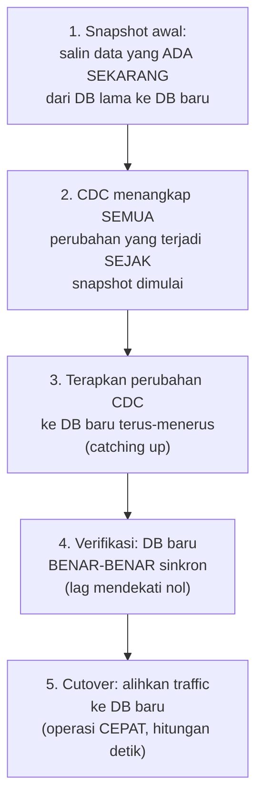

## TL;DR

[[../70 Infrastructure and Delivery/Zero-Downtime Database Migrations|Zero-Downtime Database Migrations]] membahas mengubah **skema** dalam database yang sama tanpa downtime. Note ini membahas skenario yang lebih besar: memindahkan **seluruh dataset** ke database yang **berbeda sepenuhnya** — migrasi dari MariaDB ke PostgreSQL, dari database on-premise ke managed cloud database, atau konsolidasi beberapa database instansi jadi satu sistem multi-tenant (lihat [[Multi-Tenancy]]) — sambil sistem lama tetap melayani traffic production penuh sampai migrasi benar-benar selesai dan terverifikasi. [[Change Data Capture]] adalah mekanisme inti yang membuat ini mungkin: menangkap setiap perubahan yang terjadi di database lama secara real-time dan menerapkannya ke database baru, menjaga keduanya tetap sinkron selama masa transisi yang bisa berlangsung berminggu-minggu.

## The Problem

Sebuah tim ingin memigrasikan database MariaDB yang menyimpan data kasus hukum (puluhan juta baris, terus bertambah setiap hari) ke sistem database baru yang lebih sesuai kebutuhan skala mendatang. Pendekatan naif: jadwalkan downtime, matikan sistem, salin seluruh data (proses yang bisa memakan waktu berjam-jam untuk dataset sebesar itu), verifikasi, lalu nyalakan sistem lagi mengarah ke database baru. Untuk sistem legal-services dengan tenggat hukum yang ketat, downtime berjam-jam ini bukan pilihan yang bisa diterima — petugas di seluruh instansi butuh akses terus-menerus, dan penundaan proses pengajuan karena maintenance terjadwal bisa berkonsekuensi serius.

Masalah kedua yang lebih halus: bahkan kalau downtime bisa diterima, proses "salin data lalu nyalakan lagi" mengasumsikan data tidak berubah selama proses penyalinan berlangsung — asumsi yang salah untuk sistem yang terus menerima tulisan baru sampai detik terakhir sebelum dimatikan. Kalau proses penyalinan memakan waktu berjam-jam, perubahan yang terjadi di menit-menit terakhir sebelum downtime bisa terlewat atau tercatat tidak konsisten di database baru.

## Intuition

Cara paling mudah memahaminya: migrasi database naif seperti **memindahkan seluruh isi rumah dalam sekali angkut**, menutup rumah lama sepenuhnya sampai proses pindah selesai — keluarga tidak bisa tinggal di mana pun selama proses ini berlangsung. Migrasi berbasis CDC seperti **memindahkan barang secara bertahap sambil tetap tinggal di rumah lama**, dengan seseorang terus memantau dan menyalin barang baru yang masuk ke rumah lama (perubahan data baru) ke rumah baru **secara real-time**, sampai suatu titik di mana rumah baru benar-benar identik dengan rumah lama — barulah keluarga pindah sepenuhnya, dalam waktu yang sangat singkat karena hampir semuanya sudah tersalin sebelumnya.

Analogi ini nyaris sepenuhnya menangkap esensi migrasi berbasis CDC. Yang tidak sepenuhnya tertangkap: memantau "barang baru yang masuk" ke rumah fisik relatif mudah dilihat mata manusia. CDC membaca transaction log database (mekanisme yang sudah dibahas mendalam di [[Change Data Capture]]) untuk menangkap setiap perubahan secara otomatis dan andal — tidak bergantung pada seseorang "mengawasi" secara manual, dan tidak melewatkan satu perubahan pun selama periode transisi.

## How It Works


Tahap paling krusial ada di transisi dari tahap 4 ke tahap 5 — cutover hanya dilakukan setelah **diverifikasi** bahwa database baru benar-benar mengejar ketertinggalan dan sinkron mendekati real-time dengan database lama (lag CDC mendekati nol). Karena sebagian besar data sudah tersalin jauh sebelum cutover (lewat snapshot awal dan proses catching up berkelanjutan), operasi cutover itu sendiri — mengalihkan aplikasi untuk membaca dan menulis ke database baru — bisa dilakukan dalam hitungan detik, bukan jam, karena tidak ada lagi data besar yang harus dipindahkan tepat saat cutover terjadi.

## Under The Hood

Snapshot awal dan CDC yang berjalan berkelanjutan menyelesaikan masalah **konsistensi waktu** yang jadi kelemahan pendekatan naif: snapshot menangkap keadaan data pada satu titik waktu tertentu, dan CDC menangkap **setiap** perubahan yang terjadi **setelah** titik itu — kombinasi keduanya menjamin tidak ada data yang terlewat, apa pun yang terjadi selama proses migrasi berlangsung, karena CDC membaca dari transaction log yang mencatat semua perubahan tanpa kecuali.

Poin yang sering luput dalam praktik: cutover yang aman butuh **periode dual-read/dual-write sesaat** sebagai jaring pengaman — aplikasi mulai menulis ke **kedua** database (lama dan baru) untuk periode singkat sebelum sepenuhnya berpindah, memberi kesempatan mendeteksi masalah tak terduga di database baru sebelum database lama benar-benar dimatikan. Periode dual-write ini punya risikonya sendiri yang cukup signifikan untuk dibahas terpisah, dijelaskan mendalam di [[Dual Writes and Their Dangers]] — bukan solusi tanpa cacat, hanya trade-off yang lebih aman dibanding cutover langsung tanpa jaring pengaman sama sekali.

## In Go

```go
package cdcmigration

import (
	"context"
	"fmt"
	"time"
)

type MigrationStatus struct {
	SnapshotComplete bool
	CDCLagSeconds    float64
}

// ReadyForCutover MEMAKSA verifikasi eksplisit sebelum cutover —
// TIDAK PERNAH mengasumsikan "sudah cukup lama, pasti sinkron".
func ReadyForCutover(status MigrationStatus, maxAcceptableLag float64) (bool, string) {
	if !status.SnapshotComplete {
		return false, "snapshot awal belum selesai"
	}
	if status.CDCLagSeconds > maxAcceptableLag {
		return false, fmt.Sprintf("CDC lag %.1f detik, masih di atas ambang %.1f detik", status.CDCLagSeconds, maxAcceptableLag)
	}
	return true, ""
}

// ExecuteCutover menunjukkan operasi yang SENGAJA dibuat CEPAT —
// bukan menyalin data (sudah selesai sebelumnya via snapshot+CDC),
// hanya MENGALIHKAN ke mana aplikasi membaca/menulis.
func ExecuteCutover(ctx context.Context, status MigrationStatus, maxAcceptableLag float64) error {
	ready, reason := ReadyForCutover(status, maxAcceptableLag)
	if !ready {
		return fmt.Errorf("cdcmigration: cutover DIBATALKAN, belum siap: %s", reason)
	}

	// Cutover sungguhan: ubah konfigurasi aplikasi untuk menunjuk
	// ke database baru — operasi yang HITUNGAN DETIK, bukan jam,
	// karena data sudah tersalin jauh sebelumnya.
	return switchDatabaseTarget(ctx, "new-database")
}

func switchDatabaseTarget(ctx context.Context, target string) error { return nil }

// VerifyDataIntegrity membandingkan CHECKSUM atau ROW COUNT antara
// kedua database SEBELUM cutover — lapisan verifikasi tambahan di
// luar sekadar CDC lag mendekati nol.
func VerifyDataIntegrity(ctx context.Context, table string) (matched bool, err error) {
	// implementasi nyata: bandingkan checksum/count kedua database
	return true, nil
}

var _ = time.Second
```

## In His Stack

Untuk 13 aplikasi yang mempertimbangkan migrasi ke database yang berbeda (atau konsolidasi ke sistem multi-tenant terpusat, lihat [[Multi-Tenancy]]), pendekatan berbasis CDC adalah satu-satunya cara realistis melakukan migrasi tanpa downtime signifikan untuk sistem dengan tenggat hukum ketat. [[../92 Tools/Debezium|Debezium]] adalah tool CDC yang sama dipakai untuk sinkronisasi data operasional sehari-hari (dibahas di [[Change Data Capture]]) dan juga bisa dipakai khusus untuk kebutuhan migrasi satu kali ini — infrastruktur yang sama, tujuan berbeda (sinkronisasi berkelanjutan versus migrasi satu kali menuju cutover final).

## Trade-offs and When Not To Use It

Migrasi berbasis CDC menambah kompleksitas signifikan dibanding pendekatan "matikan, salin, nyalakan" — butuh infrastruktur CDC tambahan, verifikasi konsistensi data yang teliti, dan periode dual-write yang punya risikonya sendiri. Untuk dataset kecil yang bisa disalin dalam hitungan menit, dan sistem yang benar-benar bisa menerima downtime singkat terjadwal (misalnya sistem internal dengan jam operasional yang jelas), pendekatan sederhana tanpa CDC mungkin lebih murah dan lebih cepat diimplementasikan. Migrasi berbasis CDC bernilai jelas untuk dataset besar dan sistem yang benar-benar tidak bisa menerima downtime signifikan, seperti sistem legal-services dengan tenggat hukum yang ketat.

## Common Mistakes

> [!warning] Jebakan
> Melakukan cutover berdasarkan asumsi waktu ("sudah berjalan seminggu, pasti sudah sinkron") tanpa verifikasi eksplisit lag CDC dan integritas data — cutover prematur bisa memindahkan aplikasi ke database yang sebenarnya belum sepenuhnya sinkron.

> [!warning] Jebakan
> Tidak memverifikasi integritas data (checksum, row count) di luar sekadar memeriksa lag CDC mendekati nol — lag yang rendah menunjukkan CDC "mengejar", tapi tidak otomatis membuktikan tidak ada data yang hilang atau salah selama proses transformasi/penyalinan.

> [!warning] Jebakan
> Tidak menyiapkan rencana rollback kalau database baru ternyata bermasalah setelah cutover — mempertahankan database lama tetap hidup (bahkan setelah cutover) untuk periode tertentu sebagai jaring pengaman, bukan langsung mematikannya begitu cutover terlihat berhasil.

## Exercises

1. Jelaskan kenapa pendekatan "matikan, salin, nyalakan" tidak realistis untuk migrasi database besar dengan kebutuhan minim downtime.
2. Jelaskan bagaimana kombinasi snapshot awal dan CDC berkelanjutan menjamin tidak ada data yang terlewat selama migrasi.
3. Kenapa cutover hanya boleh dilakukan setelah verifikasi eksplisit, bukan berdasarkan asumsi waktu?
4. Desain terbuka: kamu diminta memigrasikan database kasus hukum (50 juta baris, terus bertambah) dari MariaDB on-premise ke database cloud terkelola, untuk sistem yang harus tetap melayani petugas 24/7 tanpa downtime signifikan. Rancang rencana migrasi lengkap memakai CDC, termasuk kriteria kapan cutover aman dilakukan dan rencana rollback kalau ada masalah.

> [!success]- Kunci jawaban
> **1.** Untuk dataset besar (jutaan baris), proses menyalin seluruh data memakan waktu signifikan (jam, bahkan lebih), dan mengasumsikan data tidak berubah selama proses itu adalah asumsi yang salah untuk sistem yang terus menerima tulisan baru — perubahan yang terjadi selama proses penyalinan berisiko terlewat atau tercatat tidak konsisten di database baru.
> **4.** (1) Mulai snapshot awal database lama ke database cloud baru, proses ini berjalan sambil sistem lama tetap melayani traffic penuh; (2) aktifkan CDC (Debezium) yang membaca binlog MariaDB sejak titik snapshot dimulai, menangkap setiap perubahan yang terjadi selama dan setelah snapshot berlangsung, menerapkannya terus-menerus ke database cloud baru; (3) pantau lag CDC secara berkala — begitu lag mendekati nol (database baru benar-benar "mengejar" perubahan real-time), jalankan verifikasi integritas data tambahan (checksum atau row count per tabel) untuk memastikan tidak ada data yang hilang atau salah selama proses; (4) setelah kedua kriteria terpenuhi (lag rendah DAN integritas terverifikasi), jalankan periode dual-write singkat (aplikasi menulis ke kedua database) sebagai jaring pengaman tambahan, memantau apakah database baru berperilaku benar untuk operasi tulis nyata sebelum sepenuhnya bergantung padanya; (5) setelah periode dual-write ini berjalan tanpa masalah, lakukan cutover penuh — alihkan aplikasi membaca dan menulis hanya ke database baru; (6) pertahankan database lama tetap hidup (read-only) selama periode observasi tambahan (misalnya beberapa hari) sebagai rencana rollback — kalau ditemukan masalah tak terduga di database baru, aplikasi bisa dialihkan kembali ke database lama tanpa kehilangan data, karena database lama masih menyimpan keadaan yang valid sampai titik cutover.

## Self-Check

- Kenapa pendekatan "matikan, salin, nyalakan" tidak realistis untuk migrasi database besar?
- Bagaimana snapshot dan CDC berkelanjutan menjamin tidak ada data terlewat?
- Kenapa cutover butuh verifikasi eksplisit, bukan asumsi waktu?
- Apa fungsi periode dual-write dalam migrasi berbasis CDC?

## Connected Notes

- [[Change Data Capture]] — note ini adalah penerapan langsung mekanisme CDC untuk kebutuhan migrasi satu kali, bukan sinkronisasi berkelanjutan seperti dibahas di note sebelumnya.
- [[The Strangler Fig Pattern]] — migrasi berbasis CDC sering menyertai proses strangler fig yang lebih besar, khususnya untuk fitur yang butuh migrasi data besar-besaran.
- [[Dual Writes and Their Dangers]] — kelanjutan langsung: risiko periode dual-write yang jadi jaring pengaman sebelum cutover penuh dibahas mendalam di note berikutnya.
- [[../70 Infrastructure and Delivery/Zero-Downtime Database Migrations|Zero-Downtime Database Migrations]] — note ini adalah kelanjutan skala lebih besar dari perubahan skema dalam satu database yang dibahas di note itu.
- [[Backfilling Large Datasets Safely]] — snapshot awal migrasi ini pada dasarnya adalah operasi backfill skala besar, dibahas prinsip amannya di note berikutnya.

## Further Reading

- Dokumentasi resmi Debezium bagian "Database Migration Use Cases" — panduan praktis migrasi database memakai Debezium untuk skenario yang sama dibahas di note ini.

## Catatan Saya

*Tulis di sini apakah salah satu dari 13 aplikasimu pernah membutuhkan migrasi database besar-besaran, dan bagaimana migrasi itu dilakukan (dengan atau tanpa downtime signifikan).*
