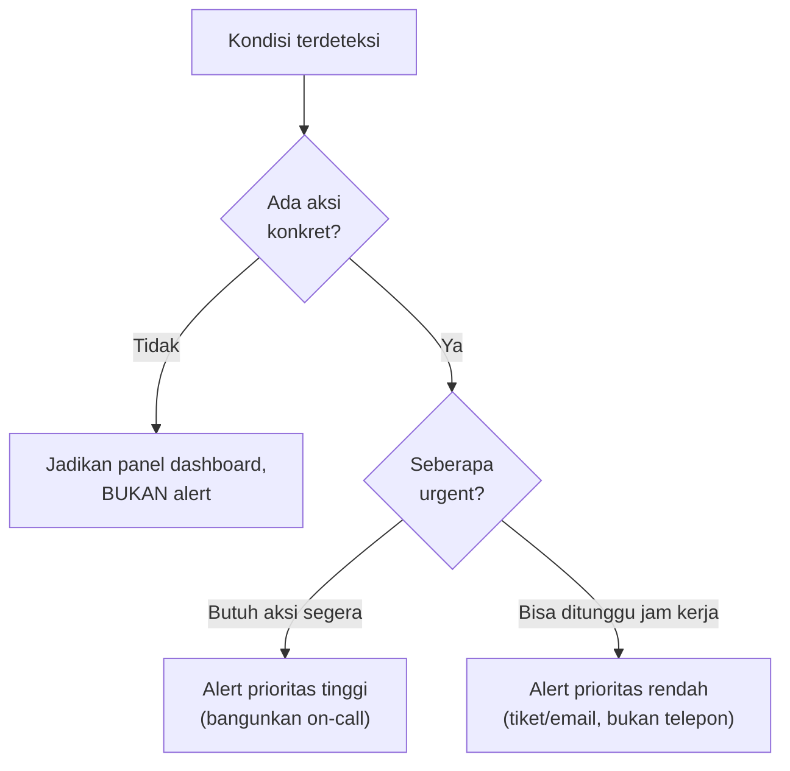

## TL;DR

Alert fatigue terjadi ketika alert dikonfigurasi terlalu sensitif atau terlalu banyak yang tidak menuntut aksi nyata — akibatnya, manusia yang menerimanya belajar (secara sadar atau tidak) untuk mengabaikannya, persis seperti alarm mobil yang terlalu sering berbunyi karena angin sepoi-sepoi sehingga tidak ada yang bereaksi lagi bahkan saat pencurian sungguhan terjadi. Alert yang baik punya sifat yang jelas: **actionable** (ada aksi konkret yang bisa diambil begitu alert diterima, bukan sekadar informasi), **jarang salah** (rasio false positive rendah, supaya kepercayaan terhadap alert terjaga), dan **jelas urgensinya** (memisahkan yang butuh bangun tengah malam dari yang bisa ditunggu sampai jam kerja).

## The Problem

Sebuah tim mengonfigurasi alert untuk hampir setiap metrik yang tersedia di salah satu dari 13 aplikasi — CPU di atas 70%, memori di atas 80%, satu request gagal dalam lima menit terakhir, latency di atas rata-rata historis sedikit saja. Dalam minggu pertama, on-call engineer menerima puluhan notifikasi per hari, sebagian besar untuk kondisi yang sebenarnya tidak butuh aksi apa pun (CPU 70% yang kembali normal beberapa detik kemudian, satu request gagal yang memang wajar terjadi sesekali dalam sistem apa pun).

Setelah beberapa minggu, pola yang bisa ditebak muncul: engineer mulai membisukan notifikasi ini di ponsel mereka, atau melihatnya sekilas lalu mengabaikannya tanpa benar-benar memeriksa. Ini persis kondisi berbahaya yang seharusnya dicegah sistem alert — ketika alert sungguhan yang benar-benar butuh aksi cepat (database mendekati kehabisan kapasitas koneksi, proporsi error yang benar-benar melonjak) datang, ia tenggelam di tengah kebiasaan mengabaikan yang sudah terbentuk dari ratusan alert palsu sebelumnya.

## Intuition

Cara paling mudah memahaminya: cerita **penggembala yang berteriak "serigala!"** — begitu ia berteriak palsu berkali-kali untuk bersenang-senang, penduduk desa berhenti bereaksi, dan saat serigala sungguhan datang, tidak ada yang percaya lagi. Sistem alert yang terlalu sensitif melakukan persis hal yang sama secara tidak sengaja — setiap alert palsu yang tidak butuh aksi adalah satu "teriakan serigala palsu" yang mengikis kepercayaan terhadap sistem alert itu sendiri, sedikit demi sedikit, sampai alert sungguhan pun tidak lagi dipercaya penuh.

Analogi ini nyaris sepenuhnya berlaku, dengan satu tambahan penting: penggembala dalam cerita itu berteriak palsu dengan sengaja. Sistem alert yang menyebabkan fatigue biasanya **tidak sengaja** — dikonfigurasi dengan niat baik ("lebih baik terlalu banyak alert daripada terlewat"), tapi hasilnya sama saja dari sudut pandang manusia yang menerimanya: kepercayaan yang terkikis, dan reaksi yang makin lambat atau bahkan tidak ada sama sekali saat masalah sungguhan terjadi.

## How It Works

Tiga pertanyaan yang layak diajukan untuk setiap alert sebelum dikonfigurasi:

1. **Apakah ada aksi konkret yang bisa diambil begitu alert ini diterima?** Kalau jawabannya "tidak, cuma informasi", itu seharusnya jadi entri di dashboard, bukan alert yang membangunkan orang.
2. **Seberapa sering kondisi ini terpicu padahal sebenarnya tidak masalah (false positive)?** Threshold yang terlalu ketat memicu alert untuk fluktuasi normal — threshold yang tepat butuh kalibrasi berdasarkan data historis nyata, bukan angka yang terasa "masuk akal" secara intuitif.
3. **Seberapa urgent ini benar-benar?** Tidak semua alert butuh membangunkan orang tengah malam — banyak yang cukup ditinjau di jam kerja berikutnya, dan mencampur keduanya di saluran notifikasi yang sama (semuanya jadi push notification prioritas tinggi) adalah cara pasti membangun kebiasaan mengabaikan.


Percabangan ini memastikan hanya kondisi yang benar-benar butuh perhatian segera yang mengganggu tidur seseorang — kondisi lain tetap tercatat dan ditinjau, hanya lewat saluran yang tidak memaksa reaksi instan.

## Under The Hood

Alert yang baik idealnya dipicu berdasarkan **dampak terhadap pengguna** (SLI yang dibahas di [[SLIs and SLOs]]), bukan berdasarkan angka teknis mentah — error rate yang melonjak signifikan atau latency yang melewati ambang yang benar-benar dirasakan pengguna adalah sinyal yang jauh lebih bernilai dibanding "CPU di atas 70%" yang belum tentu berkorelasi dengan pengalaman pengguna yang memburuk sama sekali. Prinsip ini membalik cara berpikir umum: alih-alih memasang alert untuk setiap metrik teknis yang tersedia (pendekatan "lebih banyak lebih aman" yang menyebabkan fatigue), mulai dari pertanyaan "gejala apa yang benar-benar dirasakan pengguna kalau sistem ini bermasalah", baru bekerja mundur ke metrik teknis yang menjelaskannya.

Threshold yang dikalibrasi dari data historis (bukan angka tebakan) juga penting — sistem yang normalnya punya error rate 0.5% tidak seharusnya diberi threshold alert di 1% kalau riwayatnya menunjukkan fluktuasi normal bisa mencapai 0.8% tanpa masalah nyata; threshold yang lebih realistis (misalnya 2x lipat dari baseline normal, atau memakai deteksi anomali statistik) mengurangi false positive tanpa kehilangan sensitivitas terhadap masalah sungguhan.

## In Go

```go
package alerting

import "time"

// AlertCandidate merepresentasikan kondisi yang MUNGKIN layak
// alert — struktur ini memaksa menjawab pertanyaan actionability
// dan urgency sebelum kondisi ini benar-benar dikirim sebagai alert.
type AlertCandidate struct {
	Name        string
	Actionable  bool   // ada aksi konkret yang bisa diambil?
	Urgency     string // "page" (bangunkan on-call) atau "ticket" (jam kerja)
	Description string
}

// ShouldPage menentukan apakah kondisi ini layak MEMBANGUNKAN
// seseorang — kombinasi actionable DAN urgency tinggi, bukan salah
// satunya saja.
func (a AlertCandidate) ShouldPage() bool {
	return a.Actionable && a.Urgency == "page"
}

// ErrorRateAlert adalah contoh kalibrasi threshold dari BASELINE,
// bukan angka tebakan tetap.
type ErrorRateAlert struct {
	Current       float64
	BaselineP99   float64 // dari data historis, bukan angka tebakan
	Multiplier    float64 // toleransi kelipatan dari baseline
}

func (e ErrorRateAlert) ShouldFire() bool {
	threshold := e.BaselineP99 * e.Multiplier
	return e.Current > threshold
}

// SustainedFor memastikan alert hanya terpicu kalau kondisi
// BERTAHAN cukup lama, bukan lonjakan sesaat yang kembali normal
// sebelum siapa pun sempat bereaksi.
func SustainedFor(conditionStart time.Time, minDuration time.Duration) bool {
	return time.Since(conditionStart) >= minDuration
}
```

## In His Stack

Untuk 13 aplikasi, alert yang membangunkan on-call di tengah malam sebaiknya dibatasi hanya untuk kondisi yang benar-benar berdampak langsung ke pengguna sistem legal-services yang aktif dipakai (layanan tidak bisa diakses sama sekali, proses kritis seperti pengajuan permohonan gagal total) — bukan untuk kondisi teknis yang belum tentu berdampak nyata. Kondisi yang lebih longgar (peringatan kapasitas mendekati batas, tren yang perlu diperhatikan) cukup masuk sebagai tiket yang ditinjau tim di jam kerja, menjaga alert prioritas tinggi tetap benar-benar berarti "sesuatu yang serius sedang terjadi sekarang".

## Trade-offs and When Not To Use It

Kalibrasi alert yang baik (menetapkan threshold dari data historis, memisahkan urgensi, menguji ulang secara berkala) butuh investasi waktu dan data historis yang cukup — untuk sistem yang baru dibangun dan belum punya riwayat traffic normal, threshold awal terpaksa berupa perkiraan yang perlu dikalibrasi ulang setelah beberapa minggu berjalan nyata. Sistem yang sangat kecil dengan sedikit pengguna dan konsekuensi downtime rendah mungkin tidak butuh disiplin sedetail ini — tapi begitu sistem itu tumbuh dan jumlah alert bertambah, disiplin ini menjadi jauh lebih murah diterapkan sejak awal dibanding memperbaiki budaya "abaikan semua alert" yang sudah terlanjur terbentuk.

## Common Mistakes

> [!warning] Jebakan
> Memasang alert untuk setiap metrik teknis yang tersedia tanpa menyaring mana yang benar-benar actionable — menghasilkan volume alert yang tinggi tanpa proporsi yang benar-benar butuh aksi, mempercepat terbentuknya kebiasaan mengabaikan.

> [!warning] Jebakan
> Mencampur alert urgensi tinggi dan rendah di saluran notifikasi yang sama (semua jadi push notification yang membangunkan) — menghilangkan sinyal urgensi yang seharusnya membedakan mana yang butuh reaksi segera dari mana yang bisa ditunggu.

> [!warning] Jebakan
> Menetapkan threshold alert sekali di awal dan tidak pernah mengalibrasi ulang berdasarkan data nyata yang terkumpul — pola traffic yang berubah seiring waktu (pertumbuhan pengguna, perubahan pola pemakaian) membuat threshold lama jadi terlalu ketat atau terlalu longgar dari kenyataan yang berlaku sekarang.

## Exercises

1. Jelaskan tiga pertanyaan yang layak diajukan sebelum mengonfigurasi sebuah alert.
2. Kenapa alert yang tidak actionable sebaiknya jadi panel dashboard, bukan alert?
3. Kenapa threshold alert idealnya dikalibrasi dari data historis, bukan angka tebakan yang terasa masuk akal?
4. Desain terbuka: on-call engineer di salah satu dari 13 aplikasimu menerima rata-rata 15 alert per malam, dan mengaku sudah mulai mengabaikan sebagian besar karena kebanyakan ternyata bukan masalah nyata. Rancang proses audit dan perbaikan sistem alert ini, termasuk kriteria memutuskan alert mana yang dihapus, diturunkan urgensinya, atau dipertahankan.

> [!success]- Kunci jawaban
> **1.** Apakah ada aksi konkret yang bisa diambil begitu alert diterima? Seberapa sering kondisi ini terpicu padahal sebenarnya tidak masalah? Seberapa urgent kondisi ini — butuh reaksi segera atau bisa ditunggu jam kerja?
> **4.** (1) Audit seluruh 15 alert yang biasa terpicu per malam — untuk masing-masing, catat berapa kali dalam sebulan terakhir alert itu terpicu dan berapa kali di antaranya benar-benar butuh aksi (bukan sekadar dilihat lalu diabaikan); (2) alert dengan rasio false positive sangat tinggi dan tidak actionable dihapus sepenuhnya atau diubah jadi panel dashboard; (3) alert yang actionable tapi tidak benar-benar urgent (bisa ditunggu sampai jam kerja tanpa dampak signifikan ke pengguna) diturunkan jadi tiket, bukan panggilan yang membangunkan; (4) alert yang tersisa (benar-benar actionable dan urgent) dikalibrasi ulang threshold-nya berdasarkan data historis riil, bukan angka lama yang mungkin sudah tidak relevan; (5) setelah perubahan ini berjalan beberapa minggu, ulangi audit yang sama — kalibrasi alert bukan aktivitas sekali jalan, tapi proses berkelanjutan yang mengikuti perubahan pola traffic dan pemakaian sistem dari waktu ke waktu.

## Self-Check

- Sebutkan tiga pertanyaan sebelum mengonfigurasi sebuah alert.
- Kenapa alert yang tidak actionable sebaiknya bukan alert sama sekali?
- Kenapa threshold sebaiknya dikalibrasi dari data historis?
- Apa konsekuensi jangka panjang alert fatigue?

## Connected Notes

- [[Correlation IDs]] — alert yang baik idealnya langsung menyertakan correlation ID atau trace ID untuk mempercepat investigasi begitu diterima.
- [[Metrics - The RED and USE Methods]] — RED dan USE memberi kerangka memilih metrik yang layak dijadikan dasar alert, bukan sembarang metrik teknis.
- [[SLIs and SLOs]] — kelanjutan langsung: alert yang paling bernilai adalah yang dipicu berdasarkan SLI yang benar-benar dirasakan pengguna, dibahas mendalam di note berikutnya.
- [[Dashboard Design]] — kondisi yang tidak actionable sebagai alert sebaiknya dipindahkan jadi panel dashboard, bukan dihilangkan sepenuhnya.
- [[../94 Case Studies/Case - The Retry Storm That Became a Total Outage|Case - The Retry Storm That Became a Total Outage]] — contoh konkret konsekuensi ketika sinyal peringatan dini tidak diperhatikan karena alert fatigue.

## Further Reading

- Materi umum industri mengenai on-call practices dan alert design, dipopulerkan luas lewat literatur Site Reliability Engineering (SRE).

## Catatan Saya

*Tulis di sini berapa banyak alert yang biasa diterima on-call untuk salah satu dari 13 aplikasimu, dan berapa persen di antaranya yang benar-benar butuh aksi.*
