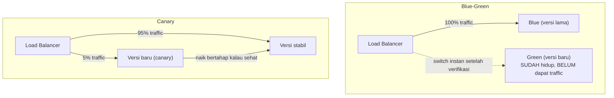

## TL;DR

Rolling update biasa (mengganti Pod versi lama dengan versi baru secara bertahap) sudah mengurangi downtime, tapi tetap punya kelemahan: begitu versi baru mulai menerima traffic, ia langsung melayani sebagian pengguna nyata, dan kalau ternyata bermasalah, sebagian pengguna itu sudah terdampak sebelum masalah terdeteksi. **Blue-green deployment** menjalankan dua lingkungan identik penuh (blue = versi lama yang masih melayani semua traffic, green = versi baru yang sudah hidup tapi belum menerima traffic sama sekali) dan memindahkan **seluruh** traffic sekaligus hanya setelah versi baru terverifikasi sehat — rollback berarti memindahkan traffic kembali ke blue secara instan. **Canary release** mengambil pendekatan berbeda: mengalirkan **sebagian kecil** traffic ke versi baru sambil memantau, lalu menaikkan porsinya bertahap kalau tidak ada masalah — membatasi jumlah pengguna yang terdampak kalau versi baru ternyata bermasalah, tanpa perlu dua lingkungan penuh yang identik.

## The Problem

Sebuah tim melakukan rolling update biasa untuk merilis versi baru salah satu dari 13 aplikasi. Rolling update berjalan sesuai desain — Pod lama diganti bertahap dengan Pod baru. Masalahnya baru terlihat setelah rollout selesai sepenuhnya: versi baru punya bug yang hanya muncul pada kombinasi data tertentu yang kebetulan sering ada di traffic production nyata (tidak pernah ketemu di staging karena data ujinya tidak mencakup kombinasi itu). Karena rolling update sudah menyelesaikan penggantian seluruh Pod sebelum masalah terdeteksi, **seluruh** traffic sudah dilayani versi bermasalah itu, dan rollback (mengembalikan ke versi lama) butuh menjalankan siklus rolling update lagi — proses yang, meski cepat, tetap makan waktu sementara pengguna terus terdampak.

Masalah intinya: rolling update tidak punya konsep "coba dulu sedikit, lihat hasilnya, baru lanjutkan" — begitu rollout dimulai, ia terus berjalan menuju keadaan akhir tanpa jeda verifikasi eksplisit di tengah jalan, kecuali dihentikan manual saat sudah terlanjur separuh jalan.

## Intuition

Cara paling mudah memahaminya untuk blue-green: bayangkan **dua panggung kembar** yang dibangun bersebelahan, dan lampu sorot penonton bisa dipindahkan dari satu panggung ke panggung lain secara instan. Panggung baru (green) disiapkan penuh dan diuji dulu **di belakang layar**, tanpa penonton melihatnya sama sekali, sebelum lampu sorot benar-benar dipindahkan ke sana. Kalau ada yang salah setelah lampu dipindah, memindahkan kembali ke panggung lama (blue) sama instannya.

Untuk canary, analogi klasiknya adalah **burung kenari di tambang batu bara** — pekerja tambang zaman dulu membawa burung kenari ke dalam tambang karena burung itu lebih sensitif terhadap gas beracun dibanding manusia; kalau burung itu pingsan, pekerja tahu ada masalah sebelum manusia sendiri terpapar cukup lama untuk terluka. Canary release memakai sebagian kecil traffic nyata sebagai "burung kenari" — kalau versi baru bermasalah, hanya sebagian kecil pengguna yang "menjadi burung kenari", bukan seluruh basis pengguna sekaligus.

Kedua analogi ini bocor pada soal biaya sumber daya. Panggung kembar fisik mahal dibangun dua kali. Blue-green deployment juga secara harfiah butuh **dua kali kapasitas penuh** berjalan bersamaan selama masa transisi — biaya yang sering diabaikan sampai tagihan infrastruktur datang.

## How It Works


Blue-green memindahkan **seluruh** traffic sekaligus di satu titik keputusan, setelah verifikasi penuh di belakang layar. Canary memindahkan **sebagian kecil** traffic secara bertahap, dengan verifikasi berjalan terus-menerus di setiap kenaikan porsi — perbedaan filosofis inti antara "verifikasi dulu, baru pindah semua" versus "pindah sedikit dulu sambil terus verifikasi".

## Under The Hood

Blue-green butuh kemampuan menjalankan **dua versi penuh secara bersamaan** dan memindahkan traffic secara atomik di level routing (load balancer atau Service di Kubernetes yang selector-nya diubah untuk menunjuk ke Deployment baru) — kompleksitas utamanya ada di memastikan kedua versi benar-benar identik dari sisi infrastruktur pendukung (skema database yang kompatibel dengan kedua versi selama masa transisi, lihat [[Zero-Downtime Database Migrations]]).

Canary butuh kemampuan **routing traffic berdasarkan persentase** (bukan hanya on/off), dan yang lebih penting, kemampuan **mengukur** apakah versi canary benar-benar sehat sebelum menaikkan porsinya — tanpa metrik yang jelas (lihat [[Metrics - The RED and USE Methods]]) untuk membandingkan error rate dan latency antara versi stabil dan versi canary, canary release hanya jadi "rolling update yang lebih lambat" tanpa manfaat verifikasi nyata. Canary yang matang sering otomatis dibatalkan (auto-rollback) kalau metrik versi canary menyimpang signifikan dari versi stabil, tanpa menunggu manusia menyadarinya.

## In Go

```go
package canary

import (
	"context"
	"crypto/rand"
	"math/big"
)

// Router memutuskan versi mana yang menangani sebuah request,
// berdasarkan persentase canary yang berlaku SEKARANG — nilai ini
// yang dinaikkan bertahap seiring canary terbukti sehat.
type Router struct {
	CanaryPercent int // 0-100
}

func (r *Router) SelectVersion(ctx context.Context) (string, error) {
	n, err := rand.Int(rand.Reader, big.NewInt(100))
	if err != nil {
		return "", err
	}

	if int(n.Int64()) < r.CanaryPercent {
		return "canary", nil
	}
	return "stable", nil
}

// HealthComparator membandingkan metrik dua versi — inilah yang
// SEHARUSNYA menentukan apakah CanaryPercent boleh dinaikkan, bukan
// jadwal waktu tetap yang tidak peduli kondisi nyata.
type HealthComparator struct {
	StableErrorRate float64
	CanaryErrorRate float64
	Threshold       float64 // toleransi selisih yang masih dianggap sehat
}

func (h HealthComparator) ShouldPromote() bool {
	return h.CanaryErrorRate <= h.StableErrorRate+h.Threshold
}
```

## In His Stack

Untuk 13 aplikasi legal-services, blue-green paling masuk akal untuk aplikasi dengan traffic tidak terlalu tinggi tapi konsekuensi bug production yang mahal (sistem yang menangani kasus hukum aktif) — biaya menjalankan dua lingkungan penuh sesaat lebih murah dibanding risiko bug yang lolos ke seluruh pengguna sekaligus. Canary lebih masuk akal untuk aplikasi dengan traffic cukup tinggi dan basis pengguna besar, di mana 5% traffic tetap cukup banyak permintaan nyata untuk memberi sinyal statistik yang berarti sebelum memutuskan lanjut atau rollback — untuk aplikasi dengan traffic sangat rendah, 5% mungkin cuma beberapa request sehari, tidak cukup untuk mendeteksi masalah secara statistik andal.

## Trade-offs and When Not To Use It

Blue-green mengorbankan **biaya infrastruktur** (dua kali kapasitas penuh selama masa transisi) demi kecepatan rollback yang instan. Canary mengorbankan **kecepatan rollout penuh** (butuh waktu bertahap menaikkan persentase, bukan langsung 100%) demi menekan blast radius kalau ada masalah, dan butuh trafik cukup besar untuk memberi sinyal yang berarti secara statistik. Untuk perubahan yang risikonya sangat rendah dan sudah teruji menyeluruh di staging (perbaikan typo di teks statis, misalnya), keduanya adalah overhead yang tidak sepadan — rolling update biasa sudah cukup, dan menambah proses verifikasi bertahap untuk perubahan berisiko rendah hanya memperlambat tanpa manfaat proporsional.

## Common Mistakes

> [!warning] Jebakan
> Memakai blue-green tapi tidak memastikan skema database kompatibel dengan kedua versi selama masa transisi — kalau versi baru butuh skema yang berbeda dan versi lama masih menerima traffic sampai switch terjadi, salah satu versi akan gagal berinteraksi dengan database dengan benar (lihat [[Zero-Downtime Database Migrations]]).

> [!warning] Jebakan
> Menaikkan persentase canary berdasarkan jadwal waktu tetap ("naikkan 25% setiap 10 menit") tanpa benar-benar memeriksa metrik kesehatan versi canary — kenaikan otomatis tanpa verifikasi nyata meniadakan seluruh manfaat canary sebagai mekanisme deteksi dini.

> [!warning] Jebakan
> Menjalankan canary dengan traffic yang terlalu sedikit untuk memberi sinyal statistik yang berarti — beberapa request saja tidak cukup membedakan "versi baru memang bermasalah" dari "kebetulan beberapa request gagal karena alasan tidak terkait".

## Exercises

1. Jelaskan perbedaan filosofis inti antara blue-green deployment dan canary release.
2. Kenapa blue-green butuh dua kali kapasitas infrastruktur penuh, sementara canary tidak?
3. Kenapa canary release butuh metrik pembanding yang jelas antara versi stabil dan versi baru, bukan hanya jadwal waktu tetap?
4. Desain terbuka: salah satu dari 13 aplikasimu melayani traffic yang cukup tinggi (ribuan request per menit) dan baru saja mengalami insiden akibat rolling update biasa yang menyebarkan bug ke seluruh pengguna sebelum terdeteksi. Kamu diminta memilih antara blue-green dan canary untuk rilis berikutnya, dan merancang kriteria konkret kapan rollout boleh lanjut atau harus dibatalkan otomatis.

> [!success]- Kunci jawaban
> **1.** Blue-green memverifikasi versi baru sepenuhnya di belakang layar dulu, baru memindahkan seluruh traffic sekaligus di satu titik keputusan. Canary mengalirkan sebagian kecil traffic nyata ke versi baru sejak awal, menaikkan porsinya bertahap berdasarkan hasil pemantauan berkelanjutan, tanpa pernah ada titik "pindah semua sekaligus" yang tunggal.
> **4.** Dengan traffic tinggi, canary lebih cocok — 5% dari ribuan request per menit tetap memberi sinyal statistik yang cukup, dan biaya infrastruktur canary jauh lebih rendah dibanding menjalankan blue-green penuh untuk kapasitas sebesar itu. Kriteria konkret: definisikan metrik pembanding (error rate, p95 latency dari [[Metrics - The RED and USE Methods]]) antara versi stabil dan canary; tetapkan ambang toleransi (misalnya error rate canary tidak boleh lebih dari 1 poin persentase di atas versi stabil); jalankan canary di persentase kecil (5%) selama jendela waktu minimum yang cukup untuk mengumpulkan sampel bermakna secara statistik (bergantung volume traffic, tapi cukup untuk ratusan-ribuan request); kalau metrik dalam ambang toleransi, naikkan bertahap (5% → 25% → 50% → 100%) dengan jendela verifikasi yang sama di tiap tahap; kalau metrik melewati ambang di tahap mana pun, rollback otomatis ke 0% canary tanpa menunggu keputusan manual.

## Self-Check

- Apa perbedaan filosofis inti blue-green dan canary release?
- Kenapa blue-green butuh dua kali kapasitas infrastruktur?
- Kenapa canary butuh metrik pembanding, bukan sekadar jadwal waktu?
- Kapan rolling update biasa sudah cukup, tanpa perlu blue-green atau canary?

## Connected Notes

- [[Kubernetes Core Concepts - Pods, Deployments, Services, Ingress]] — Service dan Deployment adalah bahan bangunan yang dipakai mengimplementasikan blue-green maupun canary di Kubernetes.
- [[Zero-Downtime Database Migrations]] — kompatibilitas skema database dengan dua versi aplikasi yang berjalan bersamaan adalah prasyarat blue-green dan canary yang aman.
- [[Feature Flags]] — kelanjutan langsung: mekanisme lain untuk mengurangi risiko rilis yang bekerja di level kode, bukan di level infrastruktur seperti note ini.
- [[Metrics - The RED and USE Methods]] — metrik pembanding yang jadi syarat mutlak canary release berjalan aman, dibahas lebih dalam nanti di klaster observability.
- [[../90 Architecture and Design/Managing Technical Debt Explicitly|Managing Technical Debt Explicitly]] — keputusan kapan investasi blue-green/canary sepadan adalah bagian dari trade-off eksplisit yang sama dibahas di note itu.

## Further Reading

- Materi umum industri mengenai blue-green deployment dan canary release, dipopulerkan luas lewat praktik continuous delivery — bukan rujukan satu sumber tunggal.

## Catatan Saya

*Tulis di sini insiden rilis di pekerjaanmu yang mungkin bisa dicegah kalau memakai blue-green atau canary, dan alasan kenapa itu belum diterapkan sekarang.*
