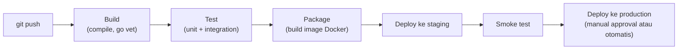

## TL;DR

CI/CD adalah otomatisasi jalur dari kode yang di-commit sampai kode itu berjalan di production. **Continuous Integration (CI)** menjalankan build dan test secara otomatis setiap kali kode di-push, menangkap kesalahan sedekat mungkin dengan saat kesalahan itu dibuat. **Continuous Delivery/Deployment (CD)** mengotomasi langkah setelahnya — mengemas artifact, memindahkannya ke tiap environment, dan (untuk deployment penuh) merilisnya ke production tanpa campur tangan manual. Nilainya bukan sekadar kecepatan: pipeline yang sama dijalankan persis sama setiap kali, menghapus variasi "di mesin saya jalan" yang muncul kalau proses build dan deploy dilakukan manual oleh orang berbeda.

## The Problem

Sebuah tim mendeploy salah satu dari 13 aplikasi secara manual: developer melakukan `git pull` di server, menjalankan `composer install`, menjalankan migration secara manual lewat SSH, lalu me-restart service. Prosesnya didokumentasikan di wiki internal, tapi dokumentasi itu lima langkah, dan suatu malam saat rilis mendadak dikerjakan terburu-buru menjelang tenggat, satu langkah — menjalankan migration sebelum kode baru berjalan — terlewat. Aplikasi baru langsung crash begitu diakses, karena kode baru mengharapkan kolom yang belum ada di skema database.

Masalahnya bukan satu developer yang ceroboh. Masalahnya adalah proses deploy yang bergantung pada manusia mengingat urutan langkah yang benar, setiap kali, di bawah tekanan waktu — sesuatu yang manusia secara sistematis buruk melakukannya secara konsisten. Proses yang didokumentasikan tapi dijalankan manual akan, cepat atau lambat, dijalankan salah urutan atau dilewati sebagian, justru di momen paling tidak tepat untuk itu terjadi.

## Intuition

Cara paling mudah memahaminya: CI/CD adalah **lini produksi pabrik** yang punya titik pemeriksaan kualitas built-in di setiap tahap, dibanding satu orang yang memeriksa produk jadi di ujung dan berharap semua tahap sebelumnya benar. Di lini produksi, barang yang gagal pemeriksaan di tahap tertentu berhenti di situ dan tidak lanjut ke tahap berikutnya — bukan diperiksa sekali di akhir setelah semua sumber daya sudah dihabiskan untuk membuatnya.

Analogi ini bocor pada satu hal: lini produksi pabrik memproses barang fisik yang identik setiap kali. Pipeline software memproses **kode yang berubah** di setiap commit — pemeriksaan yang lolos kemarin bisa gagal hari ini karena perubahan kode yang sama sekali tidak berkaitan dengan pemeriksaan itu (dependency yang di-upgrade, konfigurasi yang berubah). Pipeline tidak hanya memeriksa kualitas tetap; ia memeriksa ulang dari nol setiap kali, karena setiap commit berpotensi mematahkan sesuatu yang sebelumnya berfungsi.

## How It Works


Setiap panah adalah gerbang: kalau satu tahap gagal, pipeline berhenti di situ dan tahap berikutnya tidak pernah dijalankan — kode yang gagal test tidak pernah sampai membangun image, apalagi ter-deploy.

Prinsip yang paling sering dilanggar tim yang baru mulai memakai CI/CD adalah **build once, promote many** — artifact (image Docker, binary yang dikompilasi) dibangun **sekali**, lalu artifact yang **persis sama** itu dipindahkan dari staging ke production, bukan dibangun ulang dari kode sumber untuk tiap environment. Membangun ulang di tiap environment membuka celah: kode yang lolos test di staging bisa menghasilkan artifact berbeda di production kalau ada perbedaan kecil (versi dependency yang tidak dikunci, waktu build yang berbeda menarik versi base image terbaru) — perbedaan yang seharusnya tidak mungkin terjadi kalau artifact yang sama benar-benar dipromosikan apa adanya.

## Under The Hood

Pipeline yang matang mendefinisikan dirinya sebagai kode (pipeline-as-code, biasanya file YAML yang disimpan bersama repository), bukan dikonfigurasi lewat klik-klik di UI tool CI/CD — ini membuat perubahan pipeline sendiri lewat code review yang sama seperti perubahan kode aplikasi, dan pipeline lama bisa direproduksi ulang dari riwayat Git kapan saja. Tahap-tahap yang tidak saling bergantung (misalnya menjalankan linter dan unit test yang mencakup package berbeda) idealnya dijalankan **paralel**, bukan berurutan — mengurangi waktu total pipeline tanpa mengurangi cakupan pemeriksaan, penting karena pipeline yang lambat mendorong developer menunda-nunda push atau, lebih buruk, melewati pipeline sama sekali lewat jalur darurat.

## In Go

```go
package smoketest

import (
	"context"
	"fmt"
	"net/http"
	"time"
)

// CheckHealth dipanggil pipeline SETELAH deploy ke sebuah environment,
// SEBELUM tahap promosi ke environment berikutnya — inilah gerbang
// otomatis yang menggantikan "developer login lalu klik-klik manual
// untuk memastikan aplikasi hidup."
func CheckHealth(ctx context.Context, baseURL string, timeout time.Duration) error {
	ctx, cancel := context.WithTimeout(ctx, timeout)
	defer cancel()

	req, err := http.NewRequestWithContext(ctx, http.MethodGet, baseURL+"/healthz", nil)
	if err != nil {
		return fmt.Errorf("smoketest: membuat request: %w", err)
	}

	resp, err := http.DefaultClient.Do(req)
	if err != nil {
		return fmt.Errorf("smoketest: request gagal, deploy TIDAK dipromosikan: %w", err)
	}
	defer resp.Body.Close()

	if resp.StatusCode != http.StatusOK {
		return fmt.Errorf("smoketest: healthz mengembalikan status %d, deploy TIDAK dipromosikan", resp.StatusCode)
	}
	return nil
}
```

## In His Stack

Jenkins adalah tool CI/CD yang paling umum dipakai untuk ekosistem Yii1/Yii2 dan Go milik 13 aplikasi (lihat [[../92 Tools/Jenkins|Jenkins]]). Titik yang paling sering luput di migrasi dari deploy manual ke pipeline otomatis: proses migration database (lihat [[Zero-Downtime Database Migrations]]) sering masih dijalankan manual lewat SSH terpisah dari pipeline, justru karena tim takut mengotomasi langkah yang dianggap "berisiko" — padahal langkah manual yang dianggap berisiko itulah yang paling sering terlewat atau salah urutan, seperti di skenario "The Problem" di atas.

## Trade-offs and When Not To Use It

Untuk skrip internal kecil yang dipakai satu orang dan jarang berubah, membangun pipeline CI/CD penuh (build, test, staging, smoke test, approval, production) adalah overhead yang tidak sepadan — investasi pipeline paling bernilai untuk kode yang sering berubah dan dipakai banyak orang, di mana biaya kesalahan manual terakumulasi cepat. Pipeline juga menambah satu lapisan sistem yang harus dipelihara sendiri — pipeline yang rusak (bukan kode aplikasinya) bisa memblokir seluruh tim melakukan deploy sampai diperbaiki, sesuatu yang tidak terjadi pada proses manual yang (meski rawan salah) tidak punya titik kegagalan sistemik tunggal seperti itu.

## Common Mistakes

> [!warning] Jebakan
> Membangun ulang artifact dari kode sumber untuk setiap environment, alih-alih mempromosikan artifact yang sama — melanggar prinsip build once, promote many, membuka celah perbedaan tak terduga antara apa yang diuji di staging dan apa yang benar-benar berjalan di production.

> [!warning] Jebakan
> Menaruh kredensial atau secret langsung di file konfigurasi pipeline (bukan lewat secret manager terpisah) — file pipeline biasanya tersimpan di repository yang sama dengan kode, sehingga secret itu ikut ter-commit dan berpotensi bocor lewat riwayat Git (lihat [[../80 Security/Secret Management|Secret Management]]).

> [!warning] Jebakan
> Membuat pipeline yang begitu lambat sehingga developer mulai mencari jalan pintas melewatinya (deploy manual "sekali ini saja" saat tenggat mepet) — pipeline yang dilewati sesekali lama-lama jadi kebiasaan, dan menghapus seluruh manfaat konsistensi yang jadi alasan pipeline dibangun.

## Exercises

1. Jelaskan perbedaan cakupan Continuous Integration dan Continuous Delivery/Deployment.
2. Apa itu prinsip "build once, promote many", dan risiko konkret apa yang dicegahnya?
3. Kenapa tahap yang gagal di pipeline harus menghentikan tahap berikutnya, bukan sekadar mencatat peringatan lalu lanjut?
4. Desain terbuka: salah satu dari 13 aplikasimu masih dideploy manual lewat SSH, dengan lima langkah yang didokumentasikan di wiki dan riwayat insiden karena satu langkah pernah terlewat. Rancang pipeline CI/CD bertahap untuk aplikasi ini, termasuk tahap apa yang kamu otomasi lebih dulu dan kenapa.

> [!success]- Kunci jawaban
> **1.** CI mencakup build dan test otomatis setiap kode di-push — tujuannya menangkap kesalahan sedini mungkin. CD mencakup otomasi setelahnya: mengemas artifact dan memindahkannya lewat tiap environment sampai (opsional) production, tanpa langkah manual. CI menjamin kode yang lolos "cukup baik untuk dilanjutkan"; CD menjamin kode yang lolos itu benar-benar sampai ke tempat yang seharusnya tanpa proses manual yang rawan salah.
> **4.** Prioritaskan langkah yang paling sering jadi sumber insiden lebih dulu: (1) otomasi build dan test dulu — paling murah dan paling cepat memberi manfaat (menangkap regresi sebelum deploy sama sekali); (2) otomasi packaging jadi image Docker yang konsisten, menggantikan `composer install` manual di server; (3) otomasi migration database sebagai tahap eksplisit **sebelum** kode baru di-deploy (lihat [[Zero-Downtime Database Migrations]]) — ini justru langkah yang paling berisiko kalau tetap manual, karena riwayat insidennya sudah membuktikan itu; (4) baru setelah tahap-tahap di atas stabil dan terpercaya, otomasi deploy ke staging dan production, dengan smoke test sebagai gerbang sebelum promosi.

## Self-Check

- Apa perbedaan cakupan CI dan CD?
- Apa itu prinsip build once, promote many?
- Kenapa tahap pipeline yang gagal harus menghentikan pipeline, bukan hanya mencatat peringatan?
- Kapan investasi pipeline CI/CD penuh tidak sepadan?

## Connected Notes

- [[../90 Architecture and Design/Git Workflow and Code Review|Git Workflow and Code Review]] — CI adalah lapisan otomatis yang melengkapi code review manusia, menangkap kesalahan yang review manusia bisa lewatkan.
- [[Docker - Images, Layers, and Multi-Stage Builds for Go|Docker - Images, Layers, and Multi-Stage Builds for Go]] — image Docker adalah bentuk artifact paling umum yang dibangun sekali dan dipromosikan lewat pipeline.
- [[Zero-Downtime Database Migrations]] — migration database adalah salah satu tahap paling berisiko dalam pipeline deploy, dibahas lebih dalam di note itu.
- [[Blue-Green and Canary Releases]] — kelanjutan langsung: strategi rilis yang dijalankan di ujung pipeline CD untuk mengurangi dampak kalau deploy ternyata bermasalah.
- [[../92 Tools/Jenkins|Jenkins]] — tool CI/CD konkret yang mengimplementasikan pipeline-as-code yang dibahas di note ini.

## Further Reading

- Materi umum industri mengenai continuous delivery (dipopulerkan luas lewat buku dan praktik industri, bukan rujukan satu sumber tunggal).

## Catatan Saya

*Tulis di sini berapa lama pipeline deploy salah satu dari 13 aplikasimu berjalan dari commit sampai production, dan tahap mana yang paling sering gagal.*
