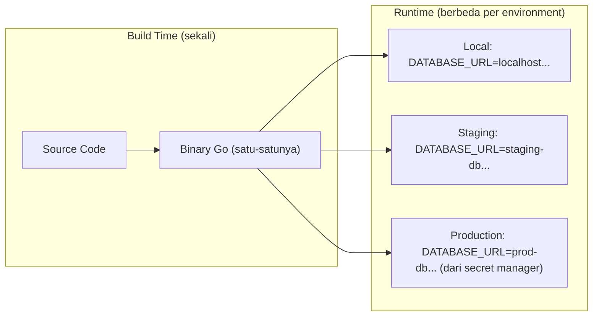

## TL;DR

Konfigurasi yang di-hardcode di kode atau tersimpan di file config yang ikut ter-commit ke Git — alamat database, credential, feature flag — membuat aplikasi tidak bisa dipindah dari satu environment ke environment lain (local, staging, production) tanpa mengubah kode itu sendiri, dan yang lebih berbahaya, sering membocorkan secret ke riwayat Git secara permanen. Prinsip 12-Factor App mengatakan konfigurasi harus datang dari **environment**, sepenuhnya terpisah dari kode — binary yang sama, tanpa diubah satu baris pun, harus bisa dijalankan di local, staging, atau production hanya dengan mengganti environment variable di sekelilingnya. Ini bukan sekadar gaya penulisan kode; ini prasyarat untuk deployment yang aman dan bisa diulang.

## The Problem

Sebuah service menyimpan connection string database dan API key partner eksternal langsung di file `config.go` sebagai konstanta, karena "lebih cepat" saat development. Beberapa bulan kemudian, file itu perlu diubah setiap kali service di-deploy ke environment berbeda — staging butuh database staging, production butuh database production — dan setiap perubahan berarti commit baru, kadang oleh orang yang berbeda dari yang menulis fitur aslinya, dengan risiko nyata credential production ter-commit ke branch yang salah atau bahkan ter-push ke repository publik. Ketika suatu hari repository itu di-audit untuk kepatuhan (compliance) sistem pemerintah, ditemukan bahwa API key partner produksi sudah tersimpan di riwayat Git sejak enam bulan lalu, terlihat oleh siapa pun yang punya akses ke repository, dan rotasi credential sesudahnya menjadi insiden tersendiri karena tidak ada yang tahu pasti siapa saja yang pernah melihat commit itu.

## Intuition

Anggap binary aplikasi seperti **alat listrik** — sebuah bor listrik yang sama bisa dipakai di rumah mana pun selama dicolokkan ke stopkontak yang sesuai (environment), tanpa perlu membongkar bor itu dan mengganti kabel internalnya setiap pindah rumah. Environment variable adalah stopkontak itu: binary yang sama, di-build sekali, berjalan identik di local, staging, atau production, hanya berbeda "listrik" (nilai konfigurasi) yang mengalir ke dalamnya saat runtime.

Analogi ini bocor pada satu hal: bor listrik tidak peduli siapa yang menyalakan stopkontak, sementara environment variable untuk secret **harus** peduli siapa yang bisa membacanya — stopkontak konfigurasi ini butuh kontrol akses (lihat [[../80 Security/Secret Management|Secret Management]]) yang jauh lebih ketat daripada sekadar "asal tersambung", karena isinya sering berupa credential yang kalau bocor, dampaknya jauh melebihi analogi listrik apa pun.

## How It Works



Diagram ini menunjukkan pemisahan inti 12-Factor: **satu** binary hasil build dipakai di ketiga environment, dan yang berbeda hanya nilai yang disuntikkan dari luar saat runtime — tidak ada rebuild ulang khusus untuk staging atau production.

Prinsip ini juga menuntut **strict separation** antara config dan kode: sebuah nilai dianggap config kalau ia berbeda antar deployment (URL database, feature flag, log level), dan bukan config kalau ia sama di semua environment (misalnya route HTTP atau struktur query SQL) — yang terakhir ini tetap boleh berada di kode.

## In Go

```go
package config

import (
	"fmt"
	"os"
	"strconv"
	"time"
)

// Config menampung seluruh nilai yang berbeda antar environment. Struct ini
// sengaja eksplisit (bukan map[string]string) supaya kompiler menangkap typo
// nama field, dan supaya jelas konfigurasi apa saja yang dibutuhkan aplikasi
// hanya dengan membaca satu struct ini.
type Config struct {
	DatabaseURL    string
	RedisAddr      string
	HTTPPort       int
	RequestTimeout time.Duration
	LogLevel       string
}

// Muat membaca seluruh konfigurasi dari environment variable, gagal cepat
// (fail fast) kalau ada nilai wajib yang tidak diset — lebih baik aplikasi
// gagal start dengan pesan jelas daripada berjalan dengan konfigurasi kosong
// yang baru ketahuan salah saat request pertama masuk.
func Muat() (Config, error) {
	dbURL := os.Getenv("DATABASE_URL")
	if dbURL == "" {
		return Config{}, fmt.Errorf("environment variable DATABASE_URL wajib diset")
	}

	redisAddr := os.Getenv("REDIS_ADDR")
	if redisAddr == "" {
		return Config{}, fmt.Errorf("environment variable REDIS_ADDR wajib diset")
	}

	httpPort := 8080
	if v := os.Getenv("HTTP_PORT"); v != "" {
		parsed, err := strconv.Atoi(v)
		if err != nil {
			return Config{}, fmt.Errorf("HTTP_PORT tidak valid: %w", err)
		}
		httpPort = parsed
	}

	timeout := 10 * time.Second
	if v := os.Getenv("REQUEST_TIMEOUT_SECONDS"); v != "" {
		parsed, err := strconv.Atoi(v)
		if err != nil {
			return Config{}, fmt.Errorf("REQUEST_TIMEOUT_SECONDS tidak valid: %w", err)
		}
		timeout = time.Duration(parsed) * time.Second
	}

	logLevel := os.Getenv("LOG_LEVEL")
	if logLevel == "" {
		logLevel = "info"
	}

	return Config{
		DatabaseURL:    dbURL,
		RedisAddr:      redisAddr,
		HTTPPort:       httpPort,
		RequestTimeout: timeout,
		LogLevel:       logLevel,
	}, nil
}
```

```go
package main

import (
	"fmt"
	"os"

	"example.com/app/config"
)

func main() {
	cfg, err := config.Muat()
	if err != nil {
		fmt.Fprintf(os.Stderr, "gagal memuat konfigurasi: %v\n", err)
		os.Exit(1)
	}

	// cfg dipakai untuk inisialisasi database, HTTP server, dst. — tidak ada
	// satu pun nilai konfigurasi yang di-hardcode di tempat lain di aplikasi.
	_ = cfg
}
```

Pola "gagal cepat saat startup kalau config wajib kosong" jauh lebih baik daripada default diam-diam (misalnya `DatabaseURL` kosong lalu aplikasi baru gagal saat query pertama dijalankan) — kegagalan yang terjadi di detik pertama proses menyala jauh lebih mudah didiagnosis daripada kegagalan yang muncul samar di tengah traffic production.

## In His Stack

Yii2 secara default membaca konfigurasi dari file PHP (`config/web.php`, `config/db.php`) yang sering **ikut ter-commit ke repository** dengan nilai default untuk local development, dan di banyak setup lama, environment production hanya berbeda lewat file config terpisah yang di-maintain manual di server (bukan lewat environment variable) — pola yang jauh lebih rawan drift antara apa yang ada di server dan apa yang ada di Git, dibanding pendekatan Go/12-Factor yang memaksa nilai environment-spesifik sepenuhnya keluar dari kode. Kubernetes menyediakan mekanisme native untuk pola 12-Factor ini lewat `ConfigMap` (untuk nilai non-sensitif) dan `Secret` (untuk credential), keduanya disuntikkan sebagai environment variable atau file terpasang (mounted file) ke dalam container tanpa pernah menyentuh image itu sendiri.

## Trade-offs and When Not To Use It

Environment variable sederhana dan universal, tapi kurang cocok untuk struktur konfigurasi yang kompleks (nested, array panjang) — untuk kasus itu, banyak tim memakai file konfigurasi terstruktur (YAML/JSON) yang **isinya sendiri** tetap disuntikkan lewat environment (nama file, atau isinya lewat secret manager) alih-alih di-commit ke Git. Untuk secret (password, API key, private key), environment variable murni juga bukan solusi lengkap — ia terlihat oleh siapa pun yang bisa membaca proses (lewat `/proc/<pid>/environ` di Linux) atau lewat `docker inspect`, sehingga untuk kebutuhan security yang lebih ketat (rotasi otomatis, audit akses), secret manager (lihat [[../80 Security/Secret Management|Secret Management]]) adalah lapisan tambahan yang dibutuhkan di atas sekadar environment variable biasa.

## Common Mistakes

> [!warning] Jebakan
> Meng-commit file `.env` berisi credential asli ke Git "sementara", lalu lupa menghapusnya — begitu ter-commit, credential itu tetap ada di riwayat Git selamanya kecuali riwayatnya sendiri dibersihkan (dan credential itu tetap harus dianggap bocor serta di-rotasi).

> [!warning] Jebakan
> Menyediakan default diam-diam untuk config wajib (misalnya `DatabaseURL` default ke string kosong) alih-alih gagal cepat saat startup — membuat aplikasi terlihat "berhasil start" padahal sebenarnya berjalan dengan konfigurasi yang rusak, dan kegagalan sesungguhnya baru muncul di request user pertama.

> [!warning] Jebakan
> Mencampur nilai yang seharusnya sama di semua environment (misalnya nama field JSON, path routing) ke dalam mekanisme konfigurasi environment — bukan setiap nilai yang "bisa" dikonfigurasi harus dikonfigurasi; nilai yang identik di semua deployment sebaiknya tetap jadi konstanta di kode, bukan menambah permukaan konfigurasi yang harus dijaga konsisten manual di setiap environment.

## Exercises

1. Jelaskan kenapa "satu binary, banyak environment" adalah tujuan inti dari prinsip konfigurasi 12-Factor, bukan sekadar preferensi gaya kode.
2. Kenapa aplikasi sebaiknya gagal start (bukan berjalan dengan nilai default kosong) ketika environment variable wajib tidak diset?
3. Sebutkan satu alasan kenapa environment variable saja belum cukup aman untuk menyimpan secret seperti password database.
4. Desain terbuka: timmu mengelola 13 aplikasi pemerintah yang masing-masing punya kombinasi environment variable yang mirip tapi tidak identik (beberapa butuh koneksi Kafka, beberapa tidak). Rancang strategi mengelola dan mendokumentasikan environment variable ini lintas 13 aplikasi supaya developer baru bisa tahu variable apa saja yang wajib diset untuk aplikasi tertentu tanpa harus membaca seluruh source code-nya, dan supaya rotasi credential bersama (misalnya API key partner yang dipakai lebih dari satu aplikasi) tidak perlu diubah manual di 13 tempat berbeda.

> [!success]- Kunci jawaban
> **1.** Kalau konfigurasi tertanam di kode, setiap environment butuh **build berbeda** dari source code yang (mungkin) sedikit dimodifikasi — ini membuka celah "binary yang dites di staging belum tentu sama persis dengan yang di-deploy ke production", karena secara teknis keduanya adalah artifact build yang berbeda. Dengan konfigurasi murni dari environment, artifact build yang di-deploy ke production adalah **byte yang identik** dengan yang sudah dites di staging — perbedaan environment hanya di luar binary, bukan di dalamnya, sehingga apa yang sudah divalidasi di staging punya jaminan lebih kuat akan berperilaku sama di production.
> **4.** Pendekatan yang skalabel: (1) dokumentasikan setiap environment variable yang dibutuhkan tiap aplikasi lewat file `.env.example` (tanpa nilai asli) yang di-commit bersama kode aplikasi itu, sebagai referensi cepat developer baru; (2) untuk credential yang dipakai bersama banyak aplikasi (API key partner), simpan di satu secret manager terpusat (bukan disalin manual ke 13 tempat), dan setiap aplikasi membaca credential itu lewat referensi ke secret manager saat deployment, bukan menyalin nilainya langsung — rotasi berarti mengubah satu nilai di secret manager, bukan mengubah 13 manifest deployment berbeda; (3) gunakan konvensi penamaan environment variable yang konsisten lintas aplikasi (misalnya selalu `KAFKA_BROKERS`, bukan bercampur `KAFKA_ADDR` di satu aplikasi dan `BROKER_LIST` di aplikasi lain) supaya pengetahuan tentang satu aplikasi bisa ditransfer ke aplikasi lain tanpa belajar ulang dari nol.

## Self-Check

- Apa perbedaan mendasar antara nilai yang "seharusnya" jadi config environment vs nilai yang tetap boleh jadi konstanta di kode?
- Kenapa file `.env` berisi credential asli tidak boleh ter-commit ke Git, bahkan "sementara"?
- Kenapa aplikasi sebaiknya gagal start kalau environment variable wajib kosong, bukan memakai default diam-diam?
- Mekanisme apa di Kubernetes yang menjadi wujud konkret dari `ConfigMap` vs `Secret`, dan kenapa keduanya dipisah?

## Connected Notes

- [[Docker Compose for Local Development]] — blok `environment:` di `docker-compose.yml` adalah wujud konkret paling sederhana dari prinsip di note ini.
- [[../80 Security/Secret Management|Secret Management]] — environment variable saja belum cukup untuk secret; note itu membahas lapisan tambahan yang dibutuhkan.
- [[../90 Architecture and Design/Handler-Service-Repository Layering|Handler-Service-Repository Layering]] — `Config` yang dimuat di sini biasanya diinjeksikan ke layer service/repository lewat [[../90 Architecture and Design/Manual Dependency Injection in Go|Manual Dependency Injection in Go]].
- [[Kubernetes Config, Secrets, Probes, and Autoscaling]] — `ConfigMap` dan `Secret` di Kubernetes adalah implementasi native dari prinsip 12-Factor yang dibahas lebih dalam di note intermediate itu.
- [[Feature Flags]] — feature flag adalah salah satu bentuk config yang perlu berubah lebih sering daripada sekadar per-environment, dibahas lebih dalam di note itu.

## Further Reading

- 12factor.net, faktor ketiga ("Config") — dokumen asli yang merumuskan prinsip ini.

## Catatan Saya

*Tulis di sini contoh nyata konfigurasi yang masih hardcode di kode kerjaanmu, kalau ada, dan alasan kenapa belum dipindah ke environment variable.*
