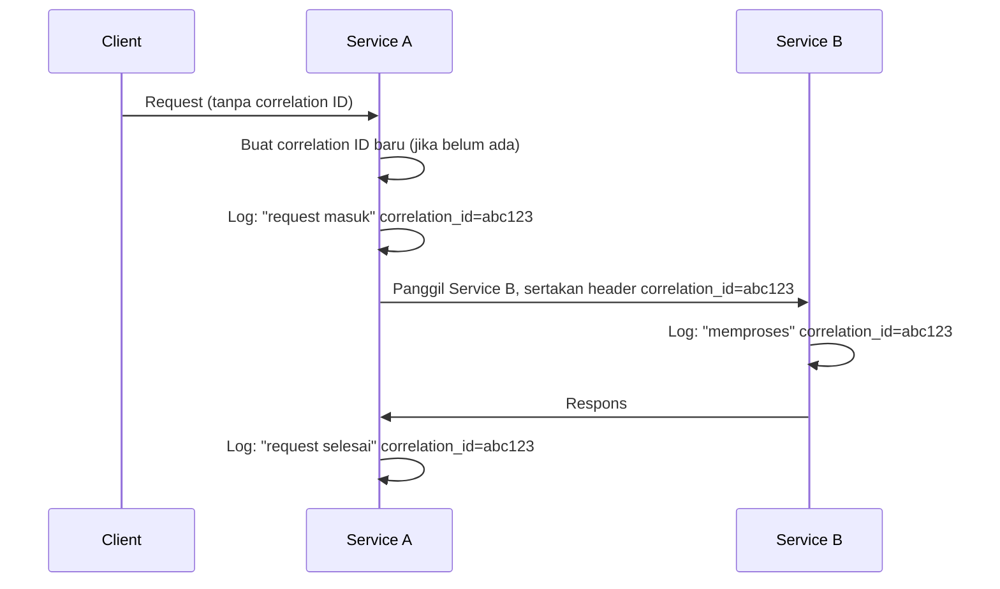

## TL;DR

Correlation ID adalah satu nilai unik yang dibuat di titik masuk sebuah request, disertakan di **setiap** baris log yang dihasilkan selama pemrosesan request itu, dan diteruskan ke setiap service lain yang dipanggil selama request itu berlangsung. Ia adalah benang merah paling sederhana yang menyatukan log yang tersebar di banyak baris, banyak service, dan banyak waktu berbeda menjadi satu cerita yang bisa diikuti. Dibanding [[Distributed Tracing]] yang penuh (span, durasi, hierarki bersarang), correlation ID adalah versi paling minimal dan paling murah diterapkan — sering jadi langkah pertama yang realistis sebelum investasi tracing penuh.

## The Problem

Sebuah aplikasi menerima ribuan request per menit, dan setiap request menghasilkan beberapa baris log selama diproses (log masuk, log validasi, log query database, log respons keluar). Saat pengguna melaporkan error spesifik, tim ingin melihat semua log yang berkaitan dengan request pengguna itu — tapi tanpa cara membedakan baris log request satu dengan request lain, semua baris log dari ribuan request yang berjalan bersamaan tercampur begitu saja di aliran log yang sama. Mencari "log request pengguna X" berarti menebak-nebak berdasarkan timestamp perkiraan dan detail seperti nama pengguna yang mungkin muncul di sebagian baris tapi tidak semua.

Masalahnya sederhana tapi mendasar: tidak ada satu field pun di log yang bisa dipakai memfilter "hanya baris yang berkaitan dengan request spesifik ini", meski aplikasi itu sendiri tahu persis kapan satu request dimulai dan selesai — pengetahuan itu hanya tidak pernah dicatat secara eksplisit ke dalam log.

## Intuition

Cara paling mudah memahaminya: correlation ID seperti **nomor antrean** di kantor pelayanan publik. Setiap orang yang datang diberi nomor unik saat mengambil antrean, dan nomor itu dipakai di setiap tahap layanan yang mereka lalui (loket pendaftaran, loket verifikasi, loket pengambilan dokumen) — petugas di setiap loket mencatat aktivitas dengan menyertakan nomor antrean itu, sehingga siapa pun bisa melacak "apa yang terjadi dengan nomor antrean 042" dari awal sampai akhir, meski orang itu dilayani beberapa petugas berbeda di titik waktu berbeda.

Analogi ini nyaris tidak bocor sama sekali — correlation ID memang persis sesederhana itu, dan kesederhanaan itulah kekuatannya. Bedanya dengan trace penuh: nomor antrean tidak mencatat berapa lama masing-masing loket memprosesnya atau urutan hierarki di dalamnya (itu peran [[Distributed Tracing]]) — ia hanya menjawab "baris log mana saja yang berkaitan dengan request ini", tidak lebih.

## How It Works


Correlation ID dibuat sekali di titik masuk (kalau belum ada — misalnya diteruskan dari upstream), lalu disertakan di **setiap** baris log berikutnya sepanjang perjalanan request itu, termasuk saat diteruskan ke service lain lewat header. Hasilnya: mencari `correlation_id=abc123` di sistem agregasi log langsung menampilkan seluruh cerita request itu, terlepas dari service mana yang menghasilkannya atau kapan persis setiap baris ditulis.

## Under The Hood

Correlation ID paling berguna kalau dibuat di **titik paling awal** yang memungkinkan — idealnya di load balancer atau API gateway sebelum request menyentuh kode aplikasi sama sekali, supaya bahkan request yang gagal sangat dini (sebelum mencapai handler aplikasi) tetap punya ID yang bisa dilacak. Kalau request datang dari klien yang sudah menyertakan correlation ID sendiri (umum untuk integrasi antar sistem, partner yang menyertakan ID request mereka sendiri), praktik yang baik adalah **menghormati ID yang sudah ada** alih-alih membuat yang baru — memudahkan partner mengorelasikan log mereka sendiri dengan log sistemmu memakai ID yang sama.

Perbedaan mendasar dari trace ID di distributed tracing: correlation ID **tidak** punya struktur hierarki span, tidak mencatat durasi per operasi, dan biasanya jauh lebih murah diimplementasikan (cukup satu string yang diteruskan lewat context dan header, tanpa infrastruktur collector terpisah). Banyak sistem tracing modern sebenarnya memakai trace ID **sebagai** correlation ID — keduanya bisa jadi nilai yang sama, hanya dipakai untuk tujuan berbeda (mencari log vs memvisualisasikan durasi).

## In Go

```go
package correlation

import (
	"context"
	"net/http"

	"github.com/google/uuid"
)

type ctxKey struct{}

const headerName = "X-Correlation-ID"

// Middleware memastikan SETIAP request punya correlation ID —
// menghormati ID yang sudah ada dari klien/upstream, atau membuat
// baru kalau belum ada.
func Middleware(next http.Handler) http.Handler {
	return http.HandlerFunc(func(w http.ResponseWriter, r *http.Request) {
		id := r.Header.Get(headerName)
		if id == "" {
			id = uuid.NewString()
		}

		ctx := context.WithValue(r.Context(), ctxKey{}, id)
		w.Header().Set(headerName, id) // dikembalikan ke klien juga, berguna untuk debugging klien

		next.ServeHTTP(w, r.WithContext(ctx))
	})
}

func FromContext(ctx context.Context) string {
	if id, ok := ctx.Value(ctxKey{}).(string); ok {
		return id
	}
	return ""
}

// PropagateToRequest menyertakan correlation ID saat memanggil
// service lain — inilah yang membuat ID ini "menyambung" lintas
// service, bukan hanya berguna di satu aplikasi saja.
func PropagateToRequest(ctx context.Context, req *http.Request) {
	req.Header.Set(headerName, FromContext(ctx))
}
```

## In His Stack

Untuk 13 aplikasi, correlation ID adalah langkah paling murah dan paling cepat memberi manfaat sebelum investasi distributed tracing penuh — cukup satu middleware kecil di setiap aplikasi, tanpa infrastruktur collector tambahan yang harus dioperasikan. Menyepakati nama header yang sama (`X-Correlation-ID` atau serupa) lintas seluruh 13 aplikasi penting supaya ID yang sama benar-benar tersambung saat satu aplikasi memanggil aplikasi lain — kalau setiap aplikasi memakai nama header berbeda, correlation ID berhenti "berkorelasi" tepat di batas antar aplikasi.

## Trade-offs and When Not To Use It

Correlation ID hampir tidak punya kekurangan berarti untuk sistem yang sudah punya structured logging — biayanya sangat kecil (satu string tambahan per log), dan manfaatnya langsung terasa begitu ada insiden yang butuh mengikuti satu request lintas banyak baris log. Satu-satunya kasus di mana ia kurang relevan adalah sistem yang sudah punya distributed tracing penuh terpasang di seluruh jalur — di situ, trace ID sudah memenuhi peran yang sama (dan lebih), membuat correlation ID terpisah jadi redundan.

## Common Mistakes

> [!warning] Jebakan
> Membuat correlation ID baru di setiap service alih-alih meneruskan yang sudah ada dari upstream — memutus rangkaian korelasi tepat di batas antar service, membuat log dari service berbeda tidak bisa dihubungkan meski berasal dari request yang sama.

> [!warning] Jebakan
> Menyepakati nama header correlation ID yang berbeda-beda antar 13 aplikasi — ID yang seharusnya sama justru tidak pernah benar-benar tersambung karena setiap aplikasi mencari nama header yang berbeda.

> [!warning] Jebakan
> Lupa menyertakan correlation ID di log error yang terjadi paling dini (sebelum middleware sempat jalan, misalnya error parsing di lapisan paling luar) — justru log paling awal ini sering paling penting untuk didiagnosis, tapi paling mudah terlewat dari instrumentasi.

## Exercises

1. Jelaskan tujuan correlation ID dan bagaimana ia berbeda dari trace ID pada distributed tracing.
2. Kenapa correlation ID sebaiknya dibuat di titik paling awal yang memungkinkan (load balancer/gateway), bukan di dalam handler aplikasi?
3. Kenapa penting menghormati correlation ID yang sudah dikirim klien, alih-alih selalu membuat yang baru?
4. Desain terbuka: 13 aplikasimu belum punya correlation ID sama sekali, dan tim menghabiskan rata-rata 20 menit hanya untuk mengumpulkan log yang relevan setiap kali ada laporan bug dari pengguna. Rancang rencana menambahkan correlation ID secara bertahap ke seluruh 13 aplikasi, termasuk kesepakatan apa yang perlu dibuat lintas tim sebelum implementasi dimulai.

> [!success]- Kunci jawaban
> **1.** Correlation ID adalah nilai unik yang disertakan di setiap baris log terkait satu request, berfungsi mengikuti dan mengorelasikan log yang tersebar. Trace ID pada distributed tracing melakukan hal serupa, tapi ditambah struktur span yang mencatat durasi dan hierarki tiap operasi — correlation ID adalah versi lebih sederhana yang hanya menjawab "log mana saja yang berkaitan", bukan "berapa lama masing-masing bagian memakan waktu".
> **4.** (1) Sepakati dulu satu nama header standar (misalnya `X-Correlation-ID`) yang berlaku di seluruh 13 aplikasi — kesepakatan ini harus terjadi **sebelum** implementasi dimulai, karena mengubahnya belakangan setelah sebagian aplikasi sudah memakai nama berbeda jauh lebih mahal; (2) mulai dari aplikasi yang paling sering jadi sumber laporan bug sulit dilacak, tambahkan middleware correlation ID di situ dulu; (3) pastikan middleware menghormati header yang sudah ada dari request masuk, bukan selalu membuat ID baru; (4) tambahkan penyertaan correlation ID di setiap pemanggilan ke aplikasi lain dari 13 aplikasi itu; (5) perluas bertahap ke aplikasi lain, memprioritaskan aplikasi yang paling sering terlibat memanggil atau dipanggil aplikasi yang sudah diinstrumentasi lebih dulu, supaya manfaat korelasi lintas aplikasi terasa secepat mungkin.

## Self-Check

- Apa tujuan correlation ID, dan bagaimana bedanya dari trace ID?
- Kenapa correlation ID sebaiknya dibuat di titik paling awal yang memungkinkan?
- Kenapa penting menghormati correlation ID yang sudah ada dari klien/upstream?
- Kapan correlation ID terpisah jadi redundan?

## Connected Notes

- [[Distributed Tracing]] — correlation ID adalah versi lebih sederhana dan lebih murah dari mekanisme trace ID yang dibahas di note sebelumnya.
- [[Structured Logging and Log Levels]] — correlation ID hanya benar-benar berguna kalau log sudah terstruktur dan bisa difilter berdasarkan field, seperti dibahas di note itu.
- [[Alerts That Do Not Cause Fatigue]] — kelanjutan langsung: begitu log bisa dikorelasikan dengan baik, alert yang dipicu bisa langsung menyertakan correlation ID untuk mempercepat investigasi.
- [[../30 APIs and Web/_Overview|APIs and Web Overview]] — correlation ID yang diteruskan lintas partner eksternal adalah praktik umum dalam integrasi antar organisasi.
- [[../90 Architecture and Design/API Governance|API Governance]] — kesepakatan nama header correlation ID lintas 13 aplikasi adalah contoh konkret governance yang dibahas di note itu.

## Further Reading

- Materi umum industri mengenai correlation ID dan request ID, dipopulerkan luas dalam praktik logging terdistribusi.

## Catatan Saya

*Tulis di sini berapa lama biasanya tim mengumpulkan log yang relevan saat ada laporan bug di salah satu dari 13 aplikasimu, dan apakah correlation ID sudah terpasang.*
