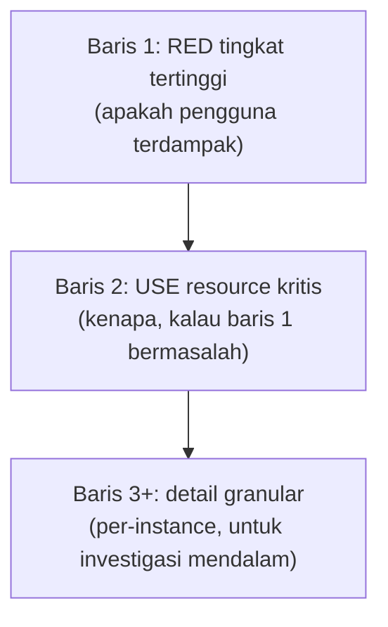

## TL;DR

Sebuah dashboard yang benar-benar dilihat orang saat insiden punya sifat yang berbeda dari dashboard yang dipasang lalu dilupakan: ia punya **hierarki yang jelas** (angka paling penting terlihat pertama, tanpa harus mencari), **konteks** (angka dibandingkan dengan sesuatu — baseline normal, threshold, waktu lalu — bukan berdiri sendiri), dan **cakupan yang disengaja** (satu dashboard untuk satu tujuan spesifik, bukan mencoba menampung segalanya). Dashboard yang gagal punya pola yang mudah dikenali: puluhan panel setara tanpa urutan prioritas, angka tanpa konteks pembanding, dan dibuat sekali lalu tidak pernah disesuaikan lagi dengan kebutuhan nyata tim yang memakainya.

## The Problem

Sebuah tim punya dashboard dengan 40 panel untuk salah satu dari 13 aplikasi — dibuat dengan niat baik untuk "mencakup semua metrik yang tersedia". Saat insiden terjadi, engineer yang membuka dashboard ini dihadapkan pilihan yang membingungkan: panel mana yang harus dilihat lebih dulu? Tidak ada yang secara visual menonjol sebagai "mulai dari sini" — semua panel berukuran sama, disusun dalam grid tanpa hierarki, dan beberapa di antaranya adalah metrik yang sebenarnya tidak relevan untuk sebagian besar jenis insiden yang biasa terjadi.

Konsekuensinya: dalam praktik, tim berhenti memakai dashboard ini saat insiden sungguhan — mereka justru langsung membuka log mentah atau bertanya di grup chat "ada yang tahu kenapa lambat?", karena dashboard yang ada terasa lebih membingungkan daripada membantu. Dashboard yang dibuat dengan niat mencakup semuanya justru berakhir tidak dipakai sama sekali saat paling dibutuhkan — investasi waktu membuatnya jadi sia-sia bukan karena datanya salah, tapi karena penyajiannya tidak dirancang untuk dipakai di bawah tekanan waktu.

## Intuition

Cara paling mudah memahaminya: dashboard yang baik seperti **dasbor mobil**, bukan **panel kontrol pesawat kargo**. Dasbor mobil menampilkan sedikit angka yang benar-benar penting untuk berkendara (kecepatan, bahan bakar, suhu mesin) dengan ukuran dan posisi yang mencerminkan urgensinya — lampu peringatan menyala mencolok tepat saat dibutuhkan, bukan tersembunyi di antara puluhan indikator lain. Panel kontrol pesawat kargo yang penuh ratusan tombol dan indikator memang perlu ada untuk insinyur yang merawatnya secara mendalam, tapi supir yang hanya perlu tahu "apakah aman melaju" akan kewalahan kalau diberi panel semacam itu.

Analogi ini bocor pada soal siapa penggunanya. Mobil hanya punya satu jenis pengemudi dengan kebutuhan yang sama. Dashboard sistem software dipakai orang dengan kebutuhan berbeda — engineer yang merespons insiden butuh ringkasan cepat (dasbor mobil), sementara engineer yang men-debug akar masalah mendalam butuh detail penuh (panel pesawat kargo). Dashboard yang mencoba melayani keduanya sekaligus di satu tempat sering gagal melayani keduanya dengan baik — solusinya biasanya dua dashboard terpisah untuk dua kebutuhan berbeda, bukan satu dashboard yang mencoba mencakup semuanya.

## How It Works

Hierarki dashboard yang efektif mengikuti urutan dari [[Metrics - The RED and USE Methods]]: baris paling atas berisi sinyal RED tingkat tertinggi (apakah pengguna terdampak — error rate, latency), baris berikutnya USE untuk resource yang paling sering jadi penyebab (database, koneksi eksternal), dan detail granular (per-instance, per-region) ditaruh paling bawah atau di dashboard terpisah yang ditautkan.

Urutan atas-ke-bawah ini bukan kebetulan — ia meniru urutan diagnosis alami: lihat dulu apakah ada masalah (RED), baru cari tahu kenapa (USE), baru gali detail kalau memang perlu (granular). Engineer yang membuka dashboard saat insiden tidak perlu men-scroll jauh atau mencari-cari untuk tahu harus mulai dari mana.

Konteks pembanding sama pentingnya dengan angka itu sendiri — grafik error rate yang menunjukkan "5%" tidak berarti apa-apa tanpa tahu apakah 5% itu normal untuk sistem ini atau sudah dua kali lipat dari biasanya. Menampilkan baseline (rata-rata minggu lalu di jam yang sama) atau threshold (garis ambang yang biasanya memicu alert) langsung di grafik yang sama memberi konteks itu tanpa engineer harus mengingat atau mencari sendiri angka normalnya.

## Under The Hood

Dashboard yang dirancang untuk insiden (bukan untuk laporan bulanan atau presentasi manajemen) punya kebutuhan yang berbeda secara mendasar: kecepatan pemahaman lebih penting dari kelengkapan. Ini berarti sengaja **membuang** metrik yang jarang berguna dari dashboard utama insiden, meski metrik itu tetap ada dan bisa diakses di dashboard terpisah untuk investigasi mendalam — godaan untuk "menambahkan satu panel lagi karena mungkin berguna suatu saat" adalah jalan langsung menuju dashboard 40 panel di "The Problem".

Warna dan penanda visual (merah untuk di atas threshold, hijau untuk normal) membantu, tapi hanya kalau dipakai konsisten dan jarang — dashboard yang seluruhnya merah karena threshold yang terlalu ketat kehilangan makna warna itu sama seperti alert yang terlalu sering (lihat [[Alerts That Do Not Cause Fatigue]]); mata manusia berhenti bereaksi terhadap warna yang selalu menyala.

## In His Stack

Untuk 13 aplikasi, dashboard insiden per aplikasi (RED tingkat tinggi, USE untuk database dan panggilan partner eksternal) yang seragam formatnya lintas semua aplikasi memudahkan koordinator teknis dan developer yang berpindah membantu aplikasi lain — begitu terbiasa membaca satu dashboard, format yang sama di aplikasi lain langsung familiar, tanpa perlu belajar ulang tata letak berbeda setiap kali pindah konteks. Ini adalah bentuk konkret dari manfaat [[../90 Architecture and Design/API Governance|API Governance]] diterapkan ke observability, bukan hanya ke API.

## Trade-offs and When Not To Use It

Merancang dashboard dengan hierarki dan konteks yang baik butuh waktu lebih dari sekadar menumpuk semua panel yang tersedia — untuk sistem eksperimental atau prototipe yang jarang dilihat siapa pun, investasi ini mungkin tidak sepadan. Untuk sistem production yang benar-benar dipakai memantau insiden, dashboard yang dirancang buruk punya biaya tersembunyi yang besar: waktu diagnosis yang lebih lama justru saat kecepatan paling dibutuhkan, biaya yang jauh melebihi waktu yang dihemat dengan tidak merancangnya dengan baik di awal.

## Common Mistakes

> [!warning] Jebakan
> Menambahkan setiap metrik yang tersedia ke satu dashboard besar dengan alasan "mungkin berguna suatu saat" — menghasilkan dashboard yang terlalu ramai untuk dipakai cepat saat insiden sungguhan, persis masalah di "The Problem".

> [!warning] Jebakan
> Menampilkan angka tanpa konteks pembanding (baseline, threshold) — angka yang berdiri sendiri tidak menjawab pertanyaan "apakah ini normal atau bermasalah" tanpa engineer harus mengingat atau mencari sendiri baseline-nya.

> [!warning] Jebakan
> Membuat dashboard sekali lalu tidak pernah menyesuaikannya lagi berdasarkan pengalaman insiden nyata — dashboard yang baik berevolusi dari pengalaman "informasi apa yang sebenarnya paling dicari saat insiden kemarin", bukan dirancang sempurna sejak awal dan dibiarkan statis.

## Exercises

1. Jelaskan tiga sifat yang membedakan dashboard yang benar-benar dipakai saat insiden dari dashboard yang dipasang lalu dilupakan.
2. Kenapa urutan RED lalu USE lalu detail granular masuk akal sebagai hierarki dashboard, dari atas ke bawah?
3. Kenapa angka tanpa konteks pembanding kurang berguna dibanding angka yang ditampilkan bersama baseline atau threshold?
4. Desain terbuka: kamu diminta merancang ulang dashboard insiden untuk salah satu dari 13 aplikasimu yang saat ini punya 35 panel tanpa hierarki jelas, dan tim mengaku jarang memakainya saat insiden sungguhan. Rancang struktur dashboard baru yang lebih efektif, termasuk apa yang kamu pertahankan, apa yang kamu pindahkan ke dashboard terpisah, dan apa yang kamu buang sepenuhnya.

> [!success]- Kunci jawaban
> **1.** Hierarki yang jelas (angka paling penting terlihat pertama), konteks pembanding (angka dibandingkan baseline/threshold, bukan berdiri sendiri), dan cakupan yang disengaja (satu dashboard untuk satu tujuan spesifik, bukan mencoba mencakup semuanya).
> **4.** (1) Wawancarai tim tentang insiden nyata dalam beberapa bulan terakhir — panel mana yang benar-benar mereka lihat, panel mana yang tidak pernah dibuka; (2) susun baris pertama dashboard baru dengan RED tingkat tertinggi (error rate, latency p95/p99, request rate) untuk endpoint paling kritis, dengan baseline/threshold ditampilkan bersama tiap grafik; (3) baris kedua dengan USE untuk resource yang paling sering jadi penyebab masalah berdasarkan riwayat insiden (biasanya database dan panggilan partner eksternal); (4) pindahkan seluruh metrik granular (per-instance, per-region, metrik teknis detail seperti GC pause) ke dashboard terpisah "Deep Dive" yang ditautkan dari dashboard utama, bukan dihapus — tetap berguna untuk investigasi mendalam, hanya tidak menghalangi pandangan cepat saat insiden; (5) buang metrik yang, dari wawancara tim, ternyata tidak pernah relevan untuk insiden jenis apa pun yang pernah terjadi di aplikasi ini.

## Self-Check

- Sebutkan tiga sifat dashboard yang benar-benar dipakai saat insiden.
- Kenapa urutan RED-USE-detail masuk akal sebagai hierarki dashboard?
- Kenapa konteks pembanding penting untuk sebuah angka di dashboard?
- Kapan investasi merancang dashboard dengan baik tidak sepadan?

## Connected Notes

- [[Query Languages for Metrics]] — query yang benar adalah bahan baku dashboard yang benar-benar berguna, dibahas di note sebelumnya.
- [[Metrics - The RED and USE Methods]] — kerangka RED dan USE langsung menentukan hierarki panel yang dibahas di note ini.
- [[Alerts That Do Not Cause Fatigue]] — dashboard dan alert berbagi masalah yang sama: sinyal yang terlalu banyak atau tanpa hierarki kehilangan makna.
- [[../90 Architecture and Design/API Governance|API Governance]] — format dashboard yang seragam lintas 13 aplikasi adalah bentuk governance yang sama filosofinya dengan standar API.
- [[../92 Tools/Grafana|Grafana]] — tool konkret yang paling umum dipakai membangun dashboard yang dibahas di note ini.

## Further Reading

- Materi umum industri mengenai desain dashboard operasional, dipopulerkan luas lewat praktik SRE dan observability modern.

## Catatan Saya

*Tulis di sini apakah dashboard salah satu dari 13 aplikasimu benar-benar dibuka saat insiden terakhir, atau tim justru mencari informasi lewat cara lain.*
