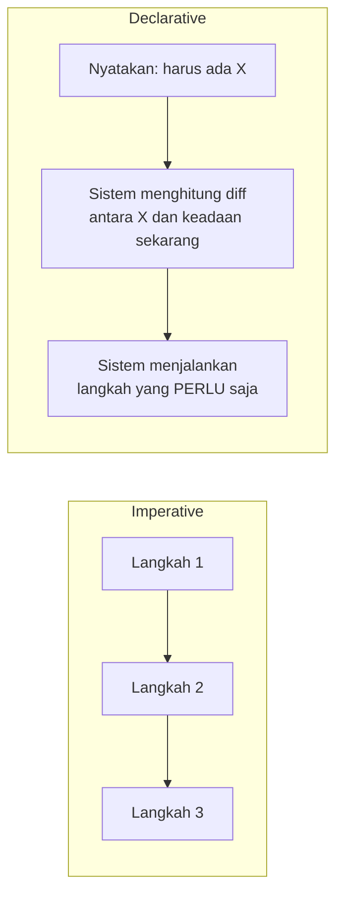

## TL;DR

**Imperative infrastructure** dikelola lewat urutan perintah yang menjelaskan *bagaimana* mencapai suatu keadaan — "buat VM ini, lalu install paket ini, lalu buka port ini." **Declarative infrastructure** dikelola lewat pernyataan tentang keadaan akhir yang diinginkan — "harus ada tiga replika aplikasi ini, dengan port ini terbuka" — tanpa menyebutkan langkah mencapainya sama sekali; sistem di baliknyalah yang menghitung langkah apa yang perlu diambil. Kubernetes, Terraform, dan sebagian besar tooling infrastruktur modern condong ke pendekatan declarative, karena declarative lebih tahan terhadap keadaan dunia nyata yang menyimpang dari ekspektasi.

## The Problem

Sebuah tim punya skrip shell yang menjalankan urutan perintah untuk menyiapkan server baru: install paket, salin file konfigurasi, buka port firewall, start service. Skrip ini bekerja sempurna untuk server yang benar-benar baru dan kosong. Suatu hari, skrip yang sama dijalankan ulang di server yang sudah pernah disiapkan sebelumnya (untuk memastikan konfigurasi terbaru terpasang) — dan skrip itu gagal di tengah jalan, karena salah satu perintahnya (`useradd deploy`) mengasumsikan user itu belum ada, dan berhenti dengan error begitu menemukan user itu sudah ada dari eksekusi sebelumnya.

Masalah ini bukan bug di satu perintah — ini adalah keterbatasan mendasar pendekatan imperative: setiap perintah punya asumsi diam-diam tentang **keadaan awal** sebelum perintah itu dijalankan, dan asumsi itu berhenti berlaku begitu skrip dijalankan lebih dari sekali atau di keadaan yang berbeda dari yang dibayangkan penulisnya. Skrip imperative yang benar untuk keadaan awal A bisa gagal total untuk keadaan awal B, meski tujuan akhir yang diinginkan sama persis.

## Intuition

Cara paling mudah memahaminya: pendekatan imperative seperti **memberi arah jalan langkah demi langkah** ("belok kiri di lampu merah kedua, lurus 500 meter, belok kanan") — instruksi ini hanya benar kalau kamu mulai dari titik yang tepat dan setiap langkah berjalan seperti diharapkan. Pendekatan declarative seperti **memberi alamat tujuan ke aplikasi peta** — kamu menyatakan ke mana harus sampai, dan aplikasi itu menghitung rute dari **posisimu sekarang**, di mana pun itu, bahkan menghitung ulang otomatis kalau kamu salah belok di tengah jalan.

Analogi ini bocor pada satu hal: aplikasi peta punya model jalan yang lengkap dan akurat untuk menghitung ulang rute kapan saja. Sistem declarative infrastruktur hanya sebaik model yang ia punya tentang keadaan sekarang — kalau keadaan nyata menyimpang dari yang tercatat sistem (lihat [[State Files and Drift]]), penghitungan ulang rute itu sendiri bisa salah, persis seperti aplikasi peta yang petanya sudah usang.

## How It Works


Perbedaan intinya ada di siapa yang menghitung langkah: di pendekatan imperative, penulis skrip yang menentukan urutan langkah secara eksplisit. Di pendekatan declarative, penulis hanya menyatakan tujuan akhir, dan sistem yang menghitung — dan yang paling penting, **menghitung ulang** — langkah apa yang dibutuhkan berdasarkan selisih antara keadaan sekarang dan keadaan yang diinginkan.

Sifat inilah yang membuat declarative infrastructure secara alami **idempotent** (lihat [[../30 APIs and Web/Idempotency|Idempotency]]) — menjalankan definisi yang sama berkali-kali menghasilkan keadaan akhir yang sama, karena sistem selalu menghitung ulang dari keadaan sekarang, bukan mengasumsikan keadaan awal tertentu seperti skrip imperative di "The Problem" di atas.

## Under The Hood

Declarative bukan berarti "tanpa langkah" — di baliknya tetap ada urutan operasi konkret yang dijalankan (membuat resource, mengubah konfigurasi, menghapus resource yang tidak lagi didefinisikan). Yang berubah adalah **siapa yang bertanggung jawab menghitung urutan itu**, dan kapan penghitungan ulang terjadi. Sistem declarative yang matang (Kubernetes controller, Terraform) menjalankan proses ini secara **kontinu atau berulang** — bukan sekali di awal lalu selesai — supaya penyimpangan yang terjadi setelahnya (Pod yang mati sendiri, resource yang dihapus manual di luar sistem) otomatis terdeteksi dan diperbaiki di eksekusi berikutnya. Mekanisme perbaikan berulang ini dibahas lebih dalam sebagai konsep tersendiri di [[Desired-State Reconciliation]].

## In Go

```go
package reconcile

// DesiredState dan CurrentState merepresentasikan gagasan inti
// declarative: PERBEDAAN antara keduanya, bukan langkah manual,
// yang menentukan aksi apa yang diambil.
type DesiredState struct {
	Replicas int
}

type CurrentState struct {
	Replicas int
}

type Action struct {
	Kind  string // "scale_up", "scale_down", "none"
	Delta int
}

// Diff menghitung aksi yang DIBUTUHKAN dari selisih keadaan —
// pola inti di balik semua tooling declarative. Perhatikan: fungsi
// ini TIDAK peduli riwayat bagaimana CurrentState bisa sampai ke
// nilai sekarang, hanya peduli selisihnya dengan DesiredState.
func Diff(desired DesiredState, current CurrentState) Action {
	delta := desired.Replicas - current.Replicas
	switch {
	case delta > 0:
		return Action{Kind: "scale_up", Delta: delta}
	case delta < 0:
		return Action{Kind: "scale_down", Delta: -delta}
	default:
		return Action{Kind: "none"}
	}
}
```

## In His Stack

Manifest Kubernetes YAML (Deployment, Service dari [[Kubernetes Core Concepts - Pods, Deployments, Services, Ingress]]) adalah contoh declarative infrastructure yang paling langsung dipakai sehari-hari — `kubectl apply -f deployment.yaml` bisa dijalankan berkali-kali dengan aman, karena Kubernetes selalu menghitung ulang selisih antara isi file dan keadaan cluster sekarang. Bandingkan dengan skrip provisioning server lama (Bash manual, atau Ansible yang dipakai secara semi-imperative) yang masih umum untuk VM legacy di luar Kubernetes — di situ, disiplin menjaga skrip tetap idempotent (bisa dijalankan ulang tanpa efek samping berbeda) adalah tanggung jawab penulis skrip sendiri, bukan otomatis diberikan oleh sistemnya seperti di Kubernetes.

## Trade-offs and When Not To Use It

Pendekatan declarative butuh sistem di baliknya yang cukup canggih untuk menghitung diff dan mengeksekusinya dengan benar — membangun sistem seperti itu dari nol tidak sepadan untuk kebutuhan sekali pakai atau skrip provisioning yang sangat sederhana dan jarang diulang. Untuk operasi yang urutannya benar-benar penting dan tidak bisa direduksi jadi "keadaan akhir" (misalnya urutan migrasi data yang harus persis berurutan karena setiap langkah bergantung hasil langkah sebelumnya), pendekatan imperative kadang lebih jujur dan lebih mudah dipahami — memaksakan segalanya jadi declarative bisa menyembunyikan urutan yang sebenarnya penting di balik abstraksi yang terlihat rapi tapi menyesatkan.

## Common Mistakes

> [!warning] Jebakan
> Menulis skrip yang secara sintaks terlihat "declarative" (misalnya file YAML) tapi isinya sebenarnya daftar langkah imperative yang diberi nama berbeda — declarative sejati butuh sistem yang benar-benar menghitung diff, bukan sekadar format file yang berbeda dari skrip shell.

> [!warning] Jebakan
> Mengasumsikan skrip imperative lama otomatis aman dijalankan berulang (idempotent) tanpa benar-benar memeriksa setiap langkahnya — sebagian besar skrip imperative yang ditulis cepat justru punya asumsi diam-diam tentang keadaan awal yang gagal begitu dijalankan lebih dari sekali.

> [!warning] Jebakan
> Mengubah resource yang dikelola sistem declarative secara manual di luar sistem itu (misalnya `kubectl edit` langsung, atau mengubah resource lewat console cloud tanpa lewat Terraform) — perubahan ini akan tertimpa (atau memicu konflik) di eksekusi berikutnya, karena sistem declarative tidak tahu perubahan manual itu pernah terjadi.

## Exercises

1. Jelaskan perbedaan mendasar pendekatan imperative dan declarative dalam mengelola infrastruktur.
2. Kenapa pendekatan declarative secara alami cenderung idempotent, sementara skrip imperative butuh usaha eksplisit untuk idempotent?
3. Sebutkan satu skenario di mana pendekatan imperative justru lebih tepat dibanding declarative.
4. Desain terbuka: tim kamu punya skrip Bash imperative untuk menyiapkan server baru (install paket, buat user, salin config) yang beberapa kali gagal saat dijalankan ulang di server yang sudah pernah disiapkan. Kamu diminta mengevaluasi apakah harus menulis ulang skrip ini jadi idempotent, atau bermigrasi ke tool declarative (misalnya Terraform/Ansible). Jelaskan pertimbangan yang menentukan pilihanmu.

> [!success]- Kunci jawaban
> **1.** Imperative menjelaskan *bagaimana* mencapai keadaan lewat urutan langkah eksplisit; benar hanya kalau keadaan awal sesuai asumsi penulis. Declarative menjelaskan *apa* keadaan akhir yang diinginkan; sistem di baliknya menghitung langkah yang dibutuhkan berdasarkan selisih dari keadaan sekarang, berapa pun kali dijalankan.
> **4.** Pertimbangan utamanya adalah frekuensi dan skala pemakaian ke depan. Kalau skrip ini hanya dipakai sesekali untuk sedikit server dan timnya kecil, menulis ulang jadi idempotent (menambahkan pengecekan "kalau user sudah ada, lewati" di setiap langkah) adalah perbaikan yang cukup dan tidak butuh investasi tool baru. Kalau skrip ini akan dipakai untuk banyak server, sering berubah, atau perlu direproduksi persis di banyak environment (staging, production, disaster recovery), migrasi ke tool declarative (Terraform untuk provisioning, Ansible untuk konfigurasi) sepadan — investasi awal mempelajari tool baru terbayar lewat idempotency yang didapat gratis dari sistemnya, bukan harus dijaga manual di setiap skrip baru yang ditulis ke depan.

## Self-Check

- Apa perbedaan mendasar imperative dan declarative infrastructure?
- Kenapa declarative secara alami idempotent?
- Sebutkan satu skenario di mana imperative lebih tepat dipakai.
- Apa risiko mengubah resource declarative secara manual di luar sistemnya?

## Connected Notes

- [[Kubernetes Config, Secrets, Probes, and Autoscaling]] — manifest Kubernetes adalah contoh declarative infrastructure paling langsung dipakai sehari-hari.
- [[Desired-State Reconciliation]] — kelanjutan langsung: mekanisme yang membuat sistem declarative terus-menerus menutup selisih antara keadaan diinginkan dan keadaan nyata.
- [[State Files and Drift]] — risiko yang muncul ketika model keadaan yang dipegang sistem declarative menyimpang dari kenyataan.
- [[../90 Architecture and Design/Git Workflow and Code Review|Git Workflow and Code Review]] — definisi declarative yang disimpan sebagai file (Infrastructure as Code) bisa di-review lewat proses yang sama seperti kode aplikasi.
- [[../92 Tools/Terraform|Terraform]] — tool konkret yang mengimplementasikan pendekatan declarative untuk provisioning infrastruktur cloud.

## Further Reading

- Dokumentasi resmi Terraform dan Kubernetes, keduanya menjelaskan filosofi declarative masing-masing secara eksplisit di halaman konsep dasarnya.

## Catatan Saya

*Tulis di sini skrip imperative di pekerjaanmu yang paling sering gagal saat dijalankan ulang, dan apakah migrasi ke declarative sepadan untuknya.*
