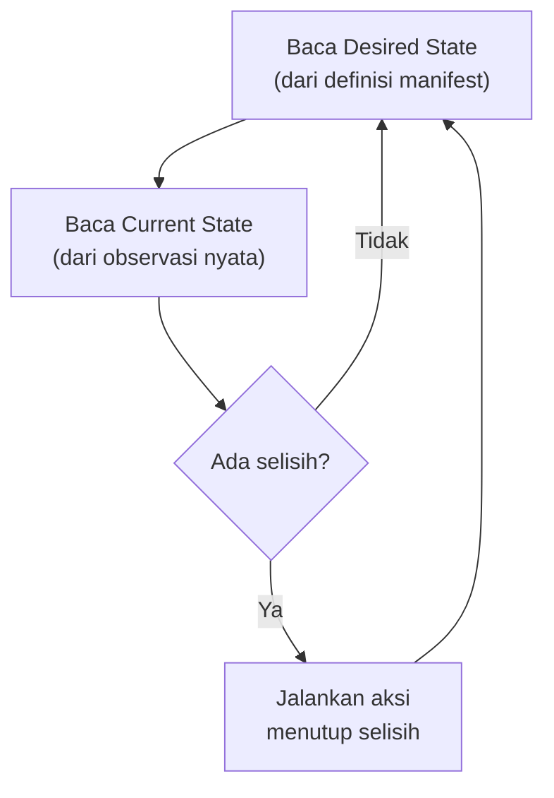

## TL;DR

Reconciliation adalah mekanisme konkret yang menjalankan gagasan declarative dari [[Declarative vs Imperative Infrastructure]]: sebuah loop yang terus-menerus berjalan, membandingkan keadaan yang diinginkan dengan keadaan nyata, dan mengambil aksi untuk menutup selisihnya — lalu mengulang proses itu lagi, selamanya, bukan hanya sekali. Kubernetes controller, Terraform (saat dijalankan berulang), dan sistem orkestrasi modern lain semuanya dibangun di atas pola loop ini. Memahami reconciliation sebagai **loop yang tidak pernah benar-benar "selesai"** — bukan skrip yang dijalankan sekali dan berhenti — adalah kunci memahami kenapa sistem ini bisa pulih sendiri dari gangguan tanpa campur tangan manusia.

## The Problem

Sebuah Pod di cluster Kubernetes mati mendadak karena node tempatnya berjalan kehabisan memori dan kernel mematikan proses itu (OOM kill). Tidak ada manusia yang memberi tahu Kubernetes "Pod ini baru saja mati, tolong buat penggantinya" — tidak ada event eksplisit semacam itu yang perlu dikirim siapa pun. Dalam hitungan detik, Pod pengganti sudah muncul dan mulai berjalan, tanpa satu baris log pun menunjukkan ada "perintah" eksternal yang memicunya.

Bagaimana ini bisa terjadi tanpa ada yang secara eksplisit memberi perintah "buat Pod baru"? Jawabannya bukan event-driven trigger yang menunggu notifikasi "Pod mati" — jawabannya adalah loop yang **sudah berjalan terus-menerus sejak awal**, memeriksa ulang keadaan setiap beberapa saat, dan setiap kali pemeriksaan itu menemukan selisih (jumlah Pod hidup lebih sedikit dari `replicas` yang diminta), loop itu langsung bertindak menutup selisihnya — tanpa peduli **kenapa** selisih itu muncul.

## Intuition

Cara paling mudah memahaminya: reconciliation loop seperti **termostat** di ruangan ber-AC. Termostat tidak menunggu seseorang memberi tahu "suhu ruangan baru saja naik" — ia terus-menerus mengecek suhu sendiri, membandingkannya dengan suhu target, dan menyalakan atau mematikan AC berdasarkan selisih itu, berulang-ulang tanpa henti. Termostat tidak peduli **kenapa** suhu naik (pintu terbuka, banyak orang masuk ruangan) — ia hanya peduli pada selisih antara suhu sekarang dan suhu target, dan bertindak berdasarkan itu saja.

Analogi ini bocor pada soal kecepatan reaksi. Termostat fisik biasanya mengecek suhu dalam hitungan detik secara kontinu. Reconciliation loop software biasanya berjalan dalam siklus (misalnya setiap beberapa detik, atau dipicu event perubahan) — ada jeda antara saat selisih muncul dan saat loop berikutnya menyadarinya, jeda yang menjadi pertimbangan desain penting untuk workload yang butuh reaksi sangat cepat terhadap kegagalan.

## How It Works


Loop ini tidak punya titik "selesai" — bahkan setelah selisih berhasil ditutup, loop langsung kembali membaca ulang kedua keadaan dan memeriksa lagi, tanpa henti. Sifat inilah yang membuat sistem reconciliation bisa menangani gangguan yang **tidak pernah diantisipasi secara eksplisit** — Pod yang mati karena OOM, node yang tiba-tiba hilang dari jaringan, resource yang terhapus manual — karena loop tidak peduli penyebabnya, hanya peduli bahwa ada selisih yang harus ditutup di iterasi berikutnya.

## Under The Hood

Pola ini di Kubernetes diimplementasikan lewat **controller**, masing-masing bertanggung jawab atas satu jenis resource (Deployment controller, ReplicaSet controller, dan seterusnya), dan masing-masing menjalankan loop reconciliation-nya sendiri secara independen. Controller **tidak berbicara langsung satu sama lain** — mereka semua membaca dan menulis lewat satu sumber kebenaran bersama (etcd, lewat API server Kubernetes), dan reconciliation berjalan berdasarkan apa yang tertulis di sana, bukan lewat pesan langsung antar controller. Desain ini membuat sistem tahan terhadap kegagalan sebagian: kalau satu controller sempat berhenti dan hidup lagi, ia langsung melanjutkan reconciliation dari keadaan terkini di sumber kebenaran bersama itu, tanpa kehilangan konteks apa pun — tidak ada state yang hanya tersimpan di memori controller itu sendiri.

Detail yang membedakan reconciliation matang dari loop naif: reconciliation yang baik bersifat **level-triggered**, bukan **edge-triggered** — ia bereaksi terhadap **keadaan sekarang**, bukan terhadap **event perubahan** tertentu. Kalau sebuah event terlewat (controller sempat mati saat event terjadi), sistem level-triggered tetap benar di iterasi berikutnya karena ia membaca ulang keadaan sekarang dari awal — sistem edge-triggered yang murni mengandalkan event bisa kehilangan konteks itu selamanya kalau event yang menyebabkannya terlewat.

## In Go

```go
package controller

import (
	"context"
	"log/slog"
	"time"
)

// Reconciler mengimplementasikan pola inti reconciliation loop —
// versi yang sangat disederhanakan dari yang sesungguhnya dipakai
// controller-runtime di ekosistem Kubernetes.
type Reconciler struct {
	Logger *slog.Logger
}

type DesiredReplicas int
type CurrentReplicas int

// Reconcile SENGAJA level-triggered: setiap panggilan membaca ulang
// keadaan dari awal, tidak mengandalkan riwayat kenapa selisih itu
// muncul. Ini yang membuatnya aman dipanggil berkali-kali, dan aman
// dilewatkan sekali-dua kali kalau ada gangguan sementara.
func (r *Reconciler) Reconcile(ctx context.Context, desired DesiredReplicas, readCurrent func(context.Context) (CurrentReplicas, error), scale func(context.Context, int) error) error {
	current, err := readCurrent(ctx)
	if err != nil {
		return err
	}

	delta := int(desired) - int(current)
	if delta == 0 {
		return nil // sudah sesuai, tidak ada aksi
	}

	r.Logger.Info("menutup selisih replika", "desired", desired, "current", current, "delta", delta)
	return scale(ctx, delta)
}

// Run menjalankan loop TANPA HENTI — inilah yang membedakan
// reconciliation dari skrip sekali jalan.
func (r *Reconciler) Run(ctx context.Context, interval time.Duration, reconcileOnce func(context.Context) error) {
	ticker := time.NewTicker(interval)
	defer ticker.Stop()

	for {
		select {
		case <-ctx.Done():
			return
		case <-ticker.C:
			if err := reconcileOnce(ctx); err != nil {
				r.Logger.Error("reconcile gagal, akan dicoba lagi di iterasi berikutnya", "error", err)
			}
		}
	}
}
```

## In His Stack

Memahami reconciliation loop membantu menjawab pertanyaan operasional yang sering muncul saat mengoperasikan Kubernetes: "kenapa perubahan manual yang saya buat lewat `kubectl edit` hilang begitu saja beberapa detik kemudian?" — jawabannya, reconciliation loop Deployment controller mendeteksi bahwa keadaan nyata (hasil edit manual) menyimpang dari definisi manifest yang tersimpan, dan menimpanya kembali ke keadaan yang didefinisikan manifest di iterasi berikutnya. Ini bukan bug — ini reconciliation bekerja persis seperti yang dirancang, dan justru menunjukkan kenapa perubahan konfigurasi seharusnya selalu lewat file manifest yang di-`apply` ulang, bukan lewat edit manual langsung ke cluster.

## Trade-offs and When Not To Use It

Reconciliation loop menambah jeda antara saat masalah muncul dan saat sistem bereaksi — untuk sebagian besar workload, jeda beberapa detik ini bisa diabaikan, tapi untuk sistem yang butuh reaksi mendekati instan terhadap kegagalan (failover yang harus terjadi dalam milidetik), pola polling berkala reconciliation loop bisa terlalu lambat, dan butuh mekanisme tambahan yang lebih cepat bereaksi. Membangun reconciliation loop dari nol untuk kebutuhan sederhana (skrip yang benar-benar hanya perlu dijalankan sekali, tanpa kebutuhan pemulihan otomatis berkelanjutan) adalah kompleksitas berlebih — reconciliation bernilai jelas justru untuk sistem yang harus terus hidup dan pulih sendiri dari gangguan tak terduga, bukan untuk operasi sekali jalan.

## Common Mistakes

> [!warning] Jebakan
> Membuat reconciliation loop yang edge-triggered murni (hanya bereaksi terhadap event spesifik) tanpa fallback level-triggered — event yang terlewat (karena controller sempat mati, atau race condition) membuat sistem kehilangan konteks itu selamanya, berbeda dari loop level-triggered yang otomatis benar lagi di iterasi berikutnya.

> [!warning] Jebakan
> Mengubah resource yang dikelola reconciliation loop secara manual dan berharap perubahan itu bertahan — loop akan menimpanya kembali ke definisi asli di iterasi berikutnya, karena dari sudut pandang loop, perubahan manual itu adalah "selisih" yang harus ditutup, bukan keadaan baru yang diinginkan.

> [!warning] Jebakan
> Menjalankan reconciliation loop dengan interval yang terlalu pendek untuk resource yang mahal diperiksa (query database besar, panggilan API eksternal yang lambat) — membebani sistem dengan pemeriksaan berulang yang jauh lebih sering dari yang dibutuhkan, tanpa manfaat proporsional.

## Exercises

1. Jelaskan kenapa reconciliation loop tidak pernah "selesai", berbeda dari skrip provisioning imperative yang berhenti setelah langkah terakhir.
2. Apa perbedaan sistem level-triggered dan edge-triggered, dan kenapa level-triggered lebih tahan terhadap event yang terlewat?
3. Kenapa controller Kubernetes tidak berbicara langsung satu sama lain, melainkan lewat sumber kebenaran bersama?
4. Desain terbuka: kamu diminta membangun sistem internal yang memastikan jumlah worker process yang memproses antrian job selalu sesuai target (misalnya berdasarkan panjang antrian), dan pulih sendiri kalau worker mati tak terduga. Rancang reconciliation loop untuk sistem ini, termasuk apa yang jadi "desired state" dan "current state", dan seberapa sering loop ini idealnya berjalan.

> [!success]- Kunci jawaban
> **1.** Skrip imperative dirancang menjalankan urutan langkah sampai selesai, lalu berhenti — ia tidak punya mekanisme untuk mendeteksi dan memperbaiki penyimpangan yang muncul setelah skrip selesai berjalan. Reconciliation loop sengaja dirancang tidak pernah berhenti, terus membandingkan keadaan diinginkan dan keadaan nyata, supaya penyimpangan apa pun yang muncul kapan saja (bahkan lama setelah eksekusi awal) otomatis terdeteksi dan diperbaiki di iterasi berikutnya.
> **4.** Desired state: jumlah worker yang seharusnya berjalan, dihitung dari panjang antrian job dibagi kapasitas per worker (dengan batas minimum dan maksimum). Current state: jumlah worker yang benar-benar hidup sekarang, diperiksa lewat heartbeat atau health check tiap worker. Loop membaca kedua nilai ini secara berkala (misalnya tiap 10-30 detik, tergantung seberapa cepat reaksi yang dibutuhkan dan seberapa mahal memeriksa panjang antrian), menghitung selisihnya, dan menyalakan worker baru atau mematikan worker berlebih untuk menutup selisih itu — persis pola yang sama dengan Horizontal Pod Autoscaler di [[Kubernetes Config, Secrets, Probes, and Autoscaling]], hanya diterapkan di luar Kubernetes.

## Self-Check

- Kenapa reconciliation loop tidak pernah "selesai"?
- Apa perbedaan sistem level-triggered dan edge-triggered?
- Kenapa perubahan manual ke resource yang dikelola reconciliation loop sering "hilang" sendiri?
- Kapan reconciliation loop bukan pilihan yang tepat?

## Connected Notes

- [[Declarative vs Imperative Infrastructure]] — reconciliation adalah mekanisme konkret yang menjalankan gagasan declarative yang dibahas di note sebelumnya.
- [[State Files and Drift]] — kelanjutan langsung: risiko yang muncul ketika keadaan yang dicatat sistem menyimpang dari kenyataan yang diperiksa reconciliation loop.
- [[Kubernetes Config, Secrets, Probes, and Autoscaling]] — Horizontal Pod Autoscaler adalah salah satu contoh reconciliation loop yang paling langsung terlihat dampaknya.
- [[../50 Concurrency and Performance/_Overview|Concurrency and Performance Overview]] — pola polling berkala dengan `time.Ticker` yang dipakai reconciliation loop juga muncul di banyak pola konkurensi Go lain.
- [[../92 Tools/Kubernetes|Kubernetes]] — implementasi paling matang dan paling luas dipakai dari pola reconciliation loop yang dibahas di note ini.

## Further Reading

- Dokumentasi resmi Kubernetes bagian "Controllers" dan proyek `kubernetes-sigs/controller-runtime` — sumber kebenaran untuk detail implementasi reconciliation di ekosistem Kubernetes.

## Catatan Saya

*Tulis di sini pengalamanmu melihat Kubernetes "memperbaiki sendiri" sesuatu tanpa campur tangan manual, dan seberapa cepat reaksinya waktu itu.*
