## TL;DR

Distributed tracing mengikuti perjalanan **satu request** saat ia melintasi banyak service — sebuah request dari klien mungkin menyentuh service API, lalu service pembayaran, lalu database, lalu service notifikasi, dan tracing merekam berapa lama masing-masing lompatan itu memakan waktu, dalam urutan apa, dan di mana persis waktu paling banyak terbuang. Satu **trace** terdiri dari beberapa **span** — satu span per operasi (satu panggilan HTTP, satu query database) — yang terhubung lewat ID yang sama, membentuk gambaran lengkap perjalanan satu request lintas batas service yang tidak mungkin didapat hanya dari log atau metrik masing-masing service secara terpisah.

## The Problem

Sebuah request pengguna di salah satu dari 13 aplikasi terasa lambat — total tiga detik, jauh di atas normal. Request ini melewati empat service berbeda sebelum responsnya kembali ke pengguna. Tanpa tracing, tim harus memeriksa log keempat service itu satu per satu, mencocokkan waktu secara manual (dan berharap jam di setiap server itu tersinkronisasi dengan akurat), untuk menebak-nebak di service mana sebagian besar dari tiga detik itu terbuang — apakah di service API yang lambat memproses, di panggilan ke service pembayaran, di query database, atau di service notifikasi di ujung.

Proses menebak manual ini lambat dan rawan salah, terutama kalau keempat service itu dikelola tim berbeda yang masing-masing hanya punya visibilitas penuh ke service mereka sendiri — tidak ada satu tim pun yang punya gambaran utuh perjalanan request itu tanpa berkoordinasi manual dengan tim lain, mengumpulkan potongan log dari masing-masing pihak dan menyusunnya jadi cerita yang koheren, sesuatu yang bisa memakan waktu berjam-jam untuk satu insiden.

## Intuition

Cara paling mudah memahaminya: distributed tracing seperti **resi pengiriman paket yang bisa dilacak** — setiap titik transit (gudang asal, pusat sortir, kurir lokal, sampai ke penerima) mencatat waktu kedatangan dan keberangkatan paket itu di titik itu, dan seluruh riwayat ini bisa dilihat sebagai satu perjalanan utuh dari satu nomor resi yang sama. Tanpa nomor resi yang menghubungkan semua titik itu, kamu hanya punya catatan terpisah di setiap gudang, tidak tahu paket mana yang mana atau berapa lama ia tertahan di titik mana.

Analogi ini bocor pada soal presisi waktu. Resi pengiriman fisik biasanya cukup akurat sampai hitungan jam. Trace software butuh presisi jauh lebih tinggi (milidetik) dan, yang lebih penting, span di service berbeda yang berjalan di mesin berbeda harus bisa disusun dalam urutan yang benar meski jam masing-masing mesin tidak pernah benar-benar identik — masalah sinkronisasi waktu yang jadi salah satu alasan sistem tracing matang tidak hanya mengandalkan timestamp mentah, tapi juga urutan sebab-akibat eksplisit antar span.

## How It Works

```mermaid
gantt
    dateFormat X
    axisFormat %L ms
    section Trace (total 3000ms)
    Span: API Handler       :0, 3000
    Span: Panggil Pembayaran :300, 2100
    Span: Query Database     :400, 1800
    Span: Panggil Notifikasi :2200, 2700
```


Setiap span punya waktu mulai dan durasi sendiri, dan span bisa bersarang (span "Query Database" terjadi di dalam rentang waktu span "Panggil Pembayaran") atau berurutan — visualisasi seperti ini (disebut flame graph atau waterfall) langsung menunjukkan di mana waktu paling banyak terbuang tanpa perlu menyusun manual dari log terpisah seperti di "The Problem". Di contoh ini, terlihat jelas bahwa Query Database memakan porsi waktu yang besar (1400ms dari total durasinya), langsung mengarahkan investigasi ke situ.

Trace ID yang sama diteruskan (di-propagate) dari satu service ke service berikutnya lewat header request (biasanya `traceparent` sesuai standar W3C Trace Context) — setiap service yang menerima request itu tahu trace ID mana yang harus dipakai untuk span barunya, menyambung rangkaian span jadi satu trace utuh meski setiap service memprosesnya secara independen tanpa saling tahu detail internal satu sama lain.

## Under The Hood

Sampling adalah keputusan desain penting yang sering luput dari pemula: merekam trace untuk **setiap** request di sistem dengan traffic tinggi bisa menghasilkan volume data yang sangat besar dan mahal disimpan — kebanyakan sistem production hanya men-sample sebagian kecil request (misalnya 1-10%) secara acak, atau memakai **tail-based sampling** yang lebih cerdas: memutuskan apakah menyimpan sebuah trace **setelah** melihat hasilnya, sehingga trace yang lambat atau gagal selalu disimpan (karena paling bernilai untuk diagnosis) sementara trace yang cepat dan normal di-sample lebih jarang.

Konteks trace (trace ID, span ID) harus diteruskan secara eksplisit lewat setiap lapisan kode yang menangani request — di Go, ini berarti diteruskan lewat `context.Context`, mengikuti pola yang sama seperti pembatalan request atau deadline. Kegagalan meneruskan konteks ini di satu titik (misalnya memulai goroutine baru tanpa meneruskan context yang membawa trace) memutus rangkaian trace di situ — span setelahnya akan muncul sebagai trace terpisah yang tidak terhubung, kehilangan gambaran perjalanan utuh yang jadi tujuan tracing.

## In Go

```go
package tracing

import (
	"context"
	"time"
)

// Span menyederhanakan gagasan inti tracing — implementasi nyata
// biasanya memakai OpenTelemetry SDK, bukan struct manual seperti ini.
type Span struct {
	Name      string
	TraceID   string
	StartTime time.Time
	EndTime   time.Time
}

type spanKey struct{}

// StartSpan membuat span BARU yang mewarisi TraceID dari context —
// inilah mekanisme yang menyambung span di service ini ke trace yang
// sama dengan span di service pemanggil sebelumnya.
func StartSpan(ctx context.Context, name string) (context.Context, *Span) {
	parentTraceID := TraceIDFromContext(ctx)

	span := &Span{
		Name:      name,
		TraceID:   parentTraceID, // TraceID diwarisi, TIDAK dibuat baru
		StartTime: time.Now(),
	}

	return context.WithValue(ctx, spanKey{}, span), span
}

func (s *Span) End() {
	s.EndTime = time.Now()
	// Di implementasi nyata, span yang selesai dikirim ke collector
	// (misalnya Jaeger) di titik ini.
}

func TraceIDFromContext(ctx context.Context) string {
	if span, ok := ctx.Value(spanKey{}).(*Span); ok {
		return span.TraceID
	}
	return "" // request baru, trace ID akan dibuat di titik masuk
}

// Contoh pemakaian: setiap operasi penting dibungkus span-nya
// sendiri, semuanya mewarisi trace ID yang sama dari context.
func ProcessPayment(ctx context.Context) error {
	ctx, span := StartSpan(ctx, "process_payment")
	defer span.End()

	// pemrosesan pembayaran di sini, meneruskan ctx yang sama
	// ke pemanggilan berikutnya (query database, panggilan API lain)
	return nil
}
```

## In His Stack

Untuk 13 aplikasi yang saling memanggil (integrasi antar sistem internal, bukan hanya dengan partner eksternal), distributed tracing paling bernilai dipasang pertama kali di jalur yang paling sering jadi sumber insiden lintas aplikasi — biasanya jalur yang melibatkan panggilan sinkron antar beberapa dari 13 aplikasi itu sekaligus. Untuk jalur yang hanya melibatkan satu aplikasi (tidak memanggil aplikasi lain), correlation ID sederhana (lihat [[Correlation IDs]]) sering sudah cukup tanpa perlu infrastruktur tracing penuh — tracing bernilai jelas justru saat request benar-benar melintasi batas service, bukan untuk request yang seluruhnya diproses satu aplikasi saja.

## Trade-offs and When Not To Use It

Distributed tracing menambah sedikit overhead di setiap request (membuat span, meneruskan konteks) dan butuh infrastruktur tambahan (collector, storage untuk trace) yang harus dioperasikan dan dipelihara sendiri. Untuk sistem monolit yang tidak memanggil service lain sama sekali, tracing lintas service tidak relevan — correlation ID di dalam log sudah cukup untuk mengikuti satu request di dalam satu aplikasi. Tracing bernilai jelas begitu topologi service bertambah rumit dan request rutin melintasi lebih dari satu-dua service, titik di mana menyusun cerita manual dari log terpisah (seperti di "The Problem") menjadi terlalu lambat untuk insiden yang butuh diagnosis cepat.

## Common Mistakes

> [!warning] Jebakan
> Memulai goroutine atau proses baru tanpa meneruskan `context.Context` yang membawa trace ID — memutus rangkaian trace di titik itu, membuat span setelahnya muncul sebagai trace terpisah yang tidak terhubung ke perjalanan request aslinya.

> [!warning] Jebakan
> Mengaktifkan sampling 100% (merekam setiap request) pada sistem dengan traffic tinggi tanpa mempertimbangkan biaya penyimpanan — bisa membengkakkan biaya infrastruktur observability secara signifikan tanpa manfaat proporsional, terutama untuk request yang normal dan tidak bermasalah.

> [!warning] Jebakan
> Memasang tracing hanya di sebagian service yang terlibat dalam sebuah alur — trace yang terputus di tengah jalan (karena satu service dalam rantai tidak terinstrumentasi) kehilangan sebagian besar nilainya, karena bagian yang hilang justru bisa jadi tempat masalah sebenarnya berada.

## Exercises

1. Jelaskan hubungan antara trace dan span, dan bagaimana keduanya membentuk gambaran perjalanan satu request.
2. Kenapa trace ID harus diteruskan secara eksplisit lewat setiap lapisan kode, dan apa yang terjadi kalau propagasi ini terputus?
3. Apa itu tail-based sampling, dan kenapa ia lebih cerdas dibanding sampling acak sederhana?
4. Desain terbuka: 13 aplikasimu punya alur di mana pengguna mengajukan permohonan lewat Aplikasi A, yang memanggil Aplikasi B untuk validasi, yang memanggil Aplikasi C untuk pencatatan resmi — dan belakangan ini alur ini sering terasa lambat tanpa jelas di aplikasi mana penyebabnya. Rancang rencana memasang distributed tracing untuk alur lintas tiga aplikasi ini, termasuk tantangan koordinasi yang mungkin muncul karena ketiganya dikelola tim berbeda.

> [!success]- Kunci jawaban
> **1.** Trace merepresentasikan perjalanan lengkap satu request, terdiri dari beberapa span — setiap span mewakili satu operasi (satu panggilan HTTP, satu query database) dengan waktu mulai dan durasinya sendiri. Seluruh span dalam satu trace terhubung lewat trace ID yang sama, membentuk gambaran utuh perjalanan request itu lintas semua service yang dilewatinya.
> **4.** (1) Sepakati standar propagasi trace context lintas ketiga tim (biasanya standar W3C Trace Context yang didukung OpenTelemetry, supaya tidak perlu format kustom yang harus disepakati manual tiga kali); (2) instrumentasi dimulai dari Aplikasi A (titik masuk request), memastikan trace ID dibuat di sini dan diteruskan lewat header setiap kali memanggil Aplikasi B; (3) Aplikasi B dan C masing-masing diinstrumentasi untuk menerima trace ID dari header masuk (bukan membuat trace ID baru) dan meneruskannya ke pemanggilan berikutnya; (4) pasang collector tracing terpusat (Jaeger) yang bisa diakses ketiga tim, supaya siapa pun bisa melihat trace lengkap lintas tiga aplikasi tanpa perlu mengumpulkan potongan dari masing-masing tim secara manual; (5) tantangan koordinasi utama: ketiga tim harus sepakat memakai library instrumentasi yang kompatibel dan format propagasi yang sama — kalau salah satu tim memakai standar berbeda, rangkaian trace akan terputus di titik itu, persis seperti masalah di Common Mistakes.

## Self-Check

- Apa hubungan antara trace dan span?
- Kenapa propagasi trace ID lewat context penting, dan apa akibatnya kalau terputus?
- Apa itu tail-based sampling?
- Kapan distributed tracing tidak relevan untuk sebuah sistem?

## Connected Notes

- [[Dashboard Design]] — trace yang lambat sering jadi titik awal investigasi yang dimulai dari dashboard yang menunjukkan latency melonjak.
- [[Correlation IDs]] — kelanjutan langsung: mekanisme lebih sederhana yang berbagi tujuan sama, mengikuti satu request lintas titik yang berbeda.
- [[../30 APIs and Web/_Overview|APIs and Web Overview]] — distributed tracing adalah alat diagnosis utama untuk masalah integrasi lintas aplikasi yang dibahas luas di domain itu.
- [[../50 Concurrency and Performance/_Overview|Concurrency and Performance Overview]] — propagasi context yang membawa trace ID mengikuti pola yang sama dengan propagasi context untuk pembatalan dan deadline di domain itu.
- [[../92 Tools/Jaeger|Jaeger]] — tool konkret yang mengimplementasikan penyimpanan dan visualisasi trace yang dibahas di note ini.

## Further Reading

- Spesifikasi W3C Trace Context — standar propagasi trace ID lintas service yang didukung luas oleh tool tracing modern.
- Dokumentasi resmi OpenTelemetry bagian "Tracing".

## Catatan Saya

*Tulis di sini alur lintas beberapa dari 13 aplikasimu yang paling sulit didiagnosis saat lambat, dan apakah tracing sudah terpasang untuk alur itu.*
