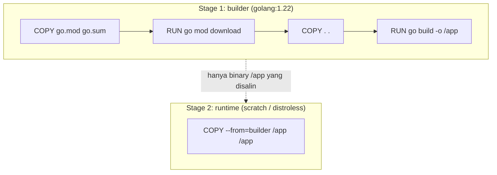

## TL;DR

Sebuah image Docker naif untuk aplikasi Go — `FROM golang:1.22` lalu `COPY . .` dan `go build` — menghasilkan image berukuran ratusan megabyte, penuh dengan compiler Go, source code, dan tool yang tidak pernah dibutuhkan saat runtime, plus setiap perubahan satu baris kode memaksa Docker mengulang seluruh langkah `go mod download` dari awal. Multi-stage build memisahkan tahap **compile** (yang butuh compiler Go lengkap) dari tahap **run** (yang hanya butuh satu binary statis), menghasilkan image akhir yang bisa di bawah 20 MB. Memahami bagaimana Docker menyusun **layer** dan meng-cache masing-masing layer adalah kunci membuat build cepat sekaligus image kecil — dua tujuan yang sering dikira saling bertentangan padahal sebenarnya saling mendukung kalau urutan instruksi di Dockerfile disusun dengan benar.

## The Problem

Sebuah tim menulis Dockerfile untuk service Go barunya dengan cara paling intuitif: `FROM golang:1.22`, `COPY . .`, `RUN go mod download`, `RUN go build -o app`, `CMD ["./app"]`. Image yang dihasilkan berukuran lebih dari 900 MB — sebagian besar adalah Go toolchain, cache module, dan source code yang tidak berguna sama sekali saat runtime, hanya menambah waktu `docker pull` di setiap deployment dan memperbesar attack surface karena banyak tool yang seharusnya tidak perlu ada di production image. Lebih menyakitkan lagi: karena `COPY . .` diletakkan **sebelum** `go mod download`, setiap perubahan satu baris kode aplikasi membuat Docker menganggap layer `go mod download` juga perlu diulang dari awal (karena checksum layer sebelumnya berubah), padahal dependency-nya sama sekali tidak berubah — build yang seharusnya beberapa detik jadi beberapa menit, berulang setiap kali seorang developer melakukan commit kecil.

## Intuition

Bayangkan image Docker sebagai **tumpukan transparency sheet** (lembar transparan) di atas proyektor lama — setiap instruksi di Dockerfile menambah satu lembar baru di atas tumpukan, dan hasil akhirnya adalah gabungan seluruh lembar dilihat dari atas. Docker meng-cache setiap lembar itu berdasarkan isinya: kalau instruksi dan konteksnya (file yang di-`COPY`, misalnya) tidak berubah dari build sebelumnya, Docker memakai ulang lembar yang sudah ada, tidak menggambar ulang. Tapi begitu satu lembar berubah, **seluruh lembar di atasnya** juga harus digambar ulang, meski isinya sebenarnya tidak berkaitan — inilah kenapa urutan instruksi menentukan seberapa banyak yang perlu di-cache ulang.

Analogi ini bocor pada satu hal: lembar transparan di dunia nyata tidak bisa "membuang" isi lembar sebelumnya, hanya menumpuknya. Docker layer sebenarnya serupa — bahkan kalau sebuah stage menghapus file di layer berikutnya, file itu **tidak hilang dari image**, ia hanya disembunyikan dari filesystem akhir sementara tetap menghabiskan ruang di layer sebelumnya. Ini kenapa "hapus file besar setelah dipakai" di satu `RUN` yang sama dengan yang membuatnya jauh lebih efektif daripada menghapusnya di instruksi `RUN` terpisah — dan kenapa multi-stage build (memakai stage sepenuhnya berbeda, bukan sekadar menghapus file) adalah solusi yang benar-benar bersih untuk kasus kompiler Go yang tidak dibutuhkan di runtime.

## How It Works



Diagram ini menunjukkan inti multi-stage build: stage pertama memakai image `golang` lengkap untuk meng-compile, tapi hanya **satu file** (binary hasil compile) yang disalin ke stage kedua — seluruh compiler, module cache, dan source code di stage pertama tidak pernah ikut ke image akhir sama sekali.

Urutan `COPY go.mod go.sum` sebelum `COPY . .` bukan kebetulan: `go.mod`/`go.sum` jauh lebih jarang berubah dibanding source code, sehingga layer `go mod download` bisa tetap ter-cache selama dependency tidak berubah, bahkan ketika source code aplikasi berubah setiap hari.

```dockerfile
# Stage 1: build binary statis
FROM golang:1.22 AS builder
WORKDIR /src

# Salin file dependency dulu — layer ini di-cache selama go.mod/go.sum
# tidak berubah, terlepas dari seberapa sering source code berubah.
COPY go.mod go.sum ./
RUN go mod download

# Baru salin source code setelah dependency di-resolve.
COPY . .

# CGO_ENABLED=0 menghasilkan binary statis tanpa dependency ke libc sistem —
# wajib supaya binary ini bisa jalan di image runtime yang sangat minim
# seperti scratch atau distroless yang tidak punya shared library apa pun.
RUN CGO_ENABLED=0 GOOS=linux go build -ldflags="-s -w" -o /app ./cmd/server

# Stage 2: runtime minimal
FROM gcr.io/distroless/static-debian12
COPY --from=builder /app /app
USER nonroot:nonroot
ENTRYPOINT ["/app"]
```

## In Go

Kode Go itu sendiri tidak berubah untuk mendukung multi-stage build — yang berubah adalah cara ia dikemas. Yang relevan dari sisi Go adalah memastikan binary benar-benar statis dan siap jalan tanpa dependency runtime:

```go
package main

import (
	"context"
	"log/slog"
	"net/http"
	"os"
	"os/signal"
	"syscall"
	"time"
)

func main() {
	logger := slog.New(slog.NewJSONHandler(os.Stdout, nil))

	mux := http.NewServeMux()
	mux.HandleFunc("/healthz", func(w http.ResponseWriter, r *http.Request) {
		w.WriteHeader(http.StatusOK)
	})

	server := &http.Server{
		Addr:         ":8080",
		Handler:      mux,
		ReadTimeout:  5 * time.Second,
		WriteTimeout: 10 * time.Second,
	}

	ctx, stop := signal.NotifyContext(context.Background(), syscall.SIGINT, syscall.SIGTERM)
	defer stop()

	go func() {
		if err := server.ListenAndServe(); err != nil && err != http.ErrServerClosed {
			logger.Error("server berhenti tak terduga", "error", err)
			os.Exit(1)
		}
	}()

	<-ctx.Done()
	logger.Info("menerima sinyal shutdown, menutup server")

	shutdownCtx, cancel := context.WithTimeout(context.Background(), 10*time.Second)
	defer cancel()
	if err := server.Shutdown(shutdownCtx); err != nil {
		logger.Error("graceful shutdown gagal", "error", err)
	}
}
```

Endpoint `/healthz` di sini bukan sekadar formalitas — image `distroless` tidak punya shell sama sekali, sehingga `HEALTHCHECK` berbasis `curl` di Dockerfile tidak akan berfungsi; pemeriksaan kesehatan container harus dipindahkan ke level orchestrator (liveness/readiness probe Kubernetes yang memanggil endpoint HTTP ini langsung), bukan perintah shell di dalam container itu sendiri.

## In His Stack

Ini adalah salah satu kontras paling tajam dibanding pengalaman dengan Yii2/PHP: image Docker untuk aplikasi PHP hampir selalu butuh PHP-FPM atau Apache/Nginx plus seluruh runtime PHP di dalam image final, karena PHP adalah bahasa yang di-interpret — tidak ada "binary hasil compile" yang bisa dipisah dari runtime-nya. Aplikasi Go, sebaliknya, meng-compile jadi satu binary mandiri, membuat pola "compile di satu image besar, jalankan di image nyaris kosong" jadi mungkin dan jadi keunggulan nyata dibanding stack PHP — image Go yang benar bisa 10-20x lebih kecil dari image PHP setara, yang berarti `docker pull` lebih cepat saat deployment dan permukaan serangan (attack surface, lihat [[../80 Security/The OWASP Top 10|The OWASP Top 10]]) yang jauh lebih kecil karena tidak ada shell, package manager, atau tool tak terpakai di image akhir.

## Trade-offs and When Not To Use It

Image `scratch` atau `distroless` yang sepenuhnya minim membuat debugging langsung di dalam container nyaris mustahil — tidak ada shell untuk `kubectl exec -it ... -- sh`, tidak ada `curl` atau `ps` untuk investigasi cepat. Untuk tim yang belum terbiasa dengan observability yang matang (lihat [[The Three Pillars of Observability]]), ini bisa terasa menyulitkan di awal, dan sebagian tim memilih kompromi memakai `distroless:debug` (yang menyertakan shell BusyBox minimal) atau bahkan `alpine` sebagai base image runtime — sedikit lebih besar (beberapa megabyte, bukan puluhan) tapi memudahkan debugging darurat. Untuk service yang jarang butuh investigasi manual di dalam container dan sudah punya logging terstruktur yang baik, `distroless` murni tetap pilihan yang lebih aman; untuk tim yang masih sering butuh masuk ke dalam container untuk debugging langsung, `alpine` adalah kompromi yang wajar.

## Common Mistakes

> [!warning] Jebakan
> Meletakkan `COPY . .` sebelum `go mod download` — membuat setiap perubahan kode, sekecil apa pun, menggugurkan cache layer dependency yang seharusnya jarang berubah, memperlambat setiap build tanpa alasan.

> [!warning] Jebakan
> Lupa `CGO_ENABLED=0` saat target base image runtime adalah `scratch` atau `distroless` — binary yang di-compile dengan CGO aktif (default kalau tidak diset eksplisit dan ada dependency yang memicu cgo) butuh shared library sistem yang tidak ada di image minim itu, menyebabkan container gagal start dengan error yang sering membingungkan seperti "no such file or directory" padahal binary-nya jelas-jelas ada.

> [!warning] Jebakan
> Menyalin seluruh direktori proyek termasuk file yang tidak relevan (`.git`, file test data besar, dokumentasi) ke dalam build context tanpa `.dockerignore` — memperlambat setiap build karena Docker daemon harus mengirim seluruh build context itu, bahkan file yang tidak pernah dipakai satu instruksi pun di Dockerfile.

## Exercises

1. Jelaskan kenapa urutan `COPY go.mod go.sum` sebelum `COPY . .` mempercepat build berulang, bukan sekadar kebiasaan gaya penulisan.
2. Kenapa `CGO_ENABLED=0` menjadi wajib saat base image runtime adalah `scratch`, tapi tidak masalah kalau base image-nya `golang:1.22` penuh?
3. Sebutkan satu risiko konkret memakai `distroless` murni (tanpa shell) untuk service yang observability-nya belum matang.
4. Desain terbuka: timmu punya satu monorepo Go dengan lima service berbeda, masing-masing punya `cmd/<nama-service>/main.go` sendiri tapi berbagi banyak package internal yang sama. Rancang strategi Dockerfile (satu Dockerfile per service, atau satu Dockerfile parametrik untuk semua) yang tetap memanfaatkan cache layer dependency bersama, dan jelaskan trade-off pendekatan yang kamu pilih dibanding alternatifnya.

> [!success]- Kunci jawaban
> **1.** Docker meng-cache setiap layer berdasarkan hash instruksi dan file yang disalinnya. Kalau `go.mod`/`go.sum` disalin dan di-download **lebih dulu**, layer itu hanya berubah (dan perlu di-download ulang) ketika dependency-nya sendiri berubah — bukan setiap kali source code aplikasi berubah. Kalau urutannya dibalik (`COPY . .` duluan), perubahan source code apa pun mengubah hash layer itu, dan `go mod download` di layer berikutnya kehilangan validitas cache-nya meski dependency-nya sama sekali tidak berubah.
> **4.** Pendekatan yang memanfaatkan cache bersama paling baik: satu Dockerfile parametrik dengan build argument untuk path `cmd/<service>` (`ARG SERVICE_PATH` lalu `go build -o /app ./${SERVICE_PATH}`), dijalankan dengan `--build-arg` berbeda per service dalam pipeline CI. Stage builder tetap satu — `go mod download` dijalankan sekali dan di-cache lintas build kelima service (karena `go.mod`/`go.sum` sama untuk seluruh monorepo), sementara stage runtime tetap tipis dan spesifik per binary. Trade-off-nya: satu Dockerfile untuk lima service berarti perubahan pada Dockerfile itu sendiri memengaruhi build kelima service sekaligus (butuh testing lebih hati-hati saat mengubahnya), dibanding lima Dockerfile terpisah yang lebih terisolasi tapi kehilangan sebagian keuntungan cache bersama kalau CI runner tidak mempertahankan cache Docker antar build service yang berbeda.

## Self-Check

- Kenapa urutan `COPY` di Dockerfile memengaruhi kecepatan build berulang?
- Apa fungsi `CGO_ENABLED=0` dan kapan ia wajib diset?
- Kenapa image `distroless` tidak bisa didiagnosis dengan `kubectl exec -it ... -- sh`?
- Apa perbedaan mendasar antara mengemas aplikasi Go vs aplikasi PHP ke dalam image Docker?

## Connected Notes

- [[Linux for Backend Engineers]] — binary Go tetap berjalan sebagai proses Linux biasa di dalam container, tunduk pada batas memori dan file descriptor yang sama.
- [[../20 Go Language/Packages and Modules|Packages and Modules]] — `go.mod`/`go.sum` yang menjadi kunci cache layer di note ini adalah mekanisme dependency management yang dijelaskan penuh di sana.
- [[Docker Compose for Local Development]] — image yang dibangun di sini dipakai sebagai salah satu service dalam setup Compose untuk local development.
- [[../80 Security/The OWASP Top 10|The OWASP Top 10]] — image runtime yang minim (distroless/scratch) secara langsung mengecilkan attack surface yang relevan dengan daftar kerentanan ini.
- [[../90 Architecture and Design/Semantic Versioning|Semantic Versioning]] — image Docker yang dipublikasi biasanya di-tag mengikuti versi semantik yang sama dengan release aplikasinya.

## Further Reading

- Dokumentasi resmi Docker mengenai multi-stage builds dan `.dockerignore`.
- Dokumentasi image `gcr.io/distroless` di GitHub `GoogleContainerTools/distroless`.

## Catatan Saya

*Tulis di sini ukuran image sebelum/sesudah kamu menerapkan multi-stage build di service kerjaanmu, kalau sudah pernah dicoba.*
