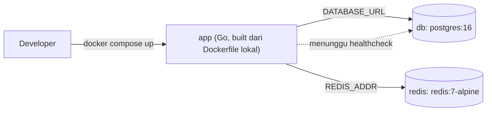

## TL;DR

Sebuah service Go jarang berdiri sendiri — ia butuh database, mungkin Redis, mungkin Kafka, semuanya berjalan bersamaan supaya bisa dites secara realistis di mesin developer. Docker Compose mendeskripsikan seluruh topologi dependency ini dalam satu file YAML dan menjalankannya dengan satu perintah (`docker compose up`), menggantikan ritual manual "install PostgreSQL versi sekian, install Redis versi sekian, pastikan port tidak bentrok" yang berbeda-beda di tiap laptop developer. Tujuannya bukan menjalankan production di laptop — tujuannya adalah membuat "berhasil di mesinku" berhenti jadi alasan, karena seluruh tim menjalankan dependency yang identik.

## The Problem

Seorang developer baru bergabung ke tim dan menghabiskan setengah hari pertamanya hanya untuk membuat lingkungan lokal menyala: meng-install MariaDB versi tertentu, membuat database dan user manual, meng-install Redis, mengonfigurasi masing-masing supaya port-nya tidak bentrok dengan aplikasi lain yang mungkin sudah berjalan di laptopnya. Developer lain di tim yang sama, di laptop dengan OS berbeda, mengikuti langkah yang sedikit berbeda dan berakhir dengan versi MariaDB yang berbeda pula — beberapa minggu kemudian, seorang developer melaporkan bug yang ternyata hanya muncul di versi MariaDB miliknya, dan tidak seorang pun bisa mereproduksinya karena tidak ada yang benar-benar tahu dependency versi berapa yang dipakai orang lain.

## Intuition

Docker Compose seperti **resep masakan untuk satu meja penuh hidangan**, bukan satu piring saja — alih-alih menuliskan instruksi terpisah untuk memasak nasi, lauk, dan sup secara manual satu per satu (dan berharap semua orang memasaknya dengan cara yang sama), satu file resep mendeskripsikan seluruh hidangan sekaligus: bahan apa (image mana), berapa porsi (berapa banyak instance), dan bagaimana masing-masing hidangan saling melengkapi (jaringan antar container, urutan startup).

Analogi ini bocor pada satu hal penting: resep masakan biasanya menghasilkan hidangan yang identik siapa pun juru masaknya, sementara container yang dijalankan Compose **tidak otomatis identik dengan production** — Compose adalah alat untuk kenyamanan development lokal, bukan cermin sempurna dari infrastruktur production yang sesungguhnya (yang biasanya berjalan di Kubernetes dengan konfigurasi replikasi, resource limit, dan jaringan yang jauh lebih kompleks). Menganggap "kalau jalan di Compose, pasti jalan di production" adalah kesalahan yang bisa membuat kejutan tak terduga saat deployment sungguhan.

## How It Works

```yaml
# docker-compose.yml
services:
  app:
    build:
      context: .
      dockerfile: Dockerfile
    ports:
      - "8080:8080"
    environment:
      - DATABASE_URL=postgres://app:app@db:5432/app?sslmode=disable
      - REDIS_ADDR=redis:6379
    depends_on:
      db:
        condition: service_healthy
      redis:
        condition: service_started

  db:
    image: postgres:16
    environment:
      - POSTGRES_USER=app
      - POSTGRES_PASSWORD=app
      - POSTGRES_DB=app
    ports:
      - "5432:5432"
    volumes:
      - db-data:/var/lib/postgresql/data
    healthcheck:
      test: ["CMD-SHELL", "pg_isready -U app"]
      interval: 5s
      timeout: 3s
      retries: 5

  redis:
    image: redis:7-alpine
    ports:
      - "6379:6379"

volumes:
  db-data:
```



Diagram ini menunjukkan mengapa `depends_on` dengan `condition: service_healthy` penting: tanpa itu, Compose hanya menjamin urutan **container dimulai**, bukan urutan **service di dalamnya sudah siap menerima koneksi** — PostgreSQL butuh beberapa detik untuk benar-benar siap setelah container-nya "berjalan", dan aplikasi Go yang mencoba connect terlalu cepat akan gagal di percobaan pertama kalau tidak ada mekanisme retry atau healthcheck seperti ini.

`db-data` sebagai **named volume** memastikan data PostgreSQL bertahan meski container `db` dihentikan dan dijalankan ulang (`docker compose down` tanpa flag `-v`) — tanpa volume ini, setiap `docker compose down` menghapus seluruh data karena filesystem container bersifat ephemeral secara default.

## In Go

Aplikasi Go tidak butuh kode khusus untuk "mendukung" Docker Compose — yang penting adalah aplikasi membaca konfigurasi koneksi dari environment variable (lihat [[Configuration via Environment (12-Factor App)]]), bukan hardcode alamat, dan menangani kondisi database yang belum siap dengan retry singkat saat startup:

```go
package main

import (
	"context"
	"database/sql"
	"fmt"
	"os"
	"time"

	_ "github.com/jackc/pgx/v5/stdlib"
)

// SambungkanDenganRetry mencoba konek ke database beberapa kali dengan jeda,
// karena di Docker Compose, container app kadang mulai lebih cepat dari
// container database meski healthcheck sudah dikonfigurasi — retry di sisi
// aplikasi adalah lapisan pertahanan kedua yang murah untuk ditulis.
func SambungkanDenganRetry(ctx context.Context, dsn string, percobaanMaks int) (*sql.DB, error) {
	var db *sql.DB
	var err error

	for percobaan := 1; percobaan <= percobaanMaks; percobaan++ {
		db, err = sql.Open("pgx", dsn)
		if err == nil {
			pingCtx, cancel := context.WithTimeout(ctx, 3*time.Second)
			pingErr := db.PingContext(pingCtx)
			cancel()
			if pingErr == nil {
				return db, nil
			}
			err = pingErr
		}

		fmt.Fprintf(os.Stderr, "percobaan %d/%d gagal konek database: %v\n", percobaan, percobaanMaks, err)
		time.Sleep(time.Duration(percobaan) * time.Second)
	}

	return nil, fmt.Errorf("gagal konek database setelah %d percobaan: %w", percobaanMaks, err)
}
```

## In His Stack

Setup lokal untuk Yii2 biasanya bertumpu pada XAMPP/Laragon atau environment PHP yang di-install langsung di OS, sering dengan MariaDB yang juga ter-install langsung (bukan di container) — pendekatan yang berfungsi tapi rentan pada masalah "versi MariaDB di laptopku beda dengan production" yang sering menjadi sumber bug sulit dilacak. Kafka dan Elasticsearch, dua dependency lain di ekosistem tim, hampir selalu lebih mudah dijalankan lewat Compose untuk local development dibanding install manual, karena keduanya butuh konfigurasi cluster (meski hanya single-node) yang jauh lebih rumit dari sekadar meng-install binary.

## Trade-offs and When Not To Use It

Docker Compose bukan pengganti Kubernetes dan tidak dimaksudkan untuk production — ia tidak punya konsep replikasi otomatis, rolling update, atau self-healing yang sesungguhnya (lihat [[Kubernetes Core Concepts - Pods, Deployments, Services, Ingress]], level intermediate). Untuk tim yang sudah punya banyak service saling terhubung (lebih dari, katakanlah, delapan sampai sepuluh container), `docker compose up` bisa jadi lambat untuk dijalankan penuh di laptop developer, dan sebagian tim beralih ke pendekatan hybrid: menjalankan service yang sedang dikembangkan secara native (`go run`) sambil dependency-nya (database, cache, message broker) tetap lewat Compose — startup lebih cepat dan iterasi kode lebih responsif tanpa perlu rebuild image setiap kali ada perubahan kecil.

## Common Mistakes

> [!warning] Jebakan
> Memakai `depends_on` tanpa `condition: service_healthy` dan mengasumsikan database sudah siap begitu container-nya berjalan — container "berjalan" tidak sama dengan service di dalamnya "siap menerima koneksi", terutama untuk database yang butuh waktu inisialisasi.

> [!warning] Jebakan
> Tidak mendefinisikan named volume untuk database, lalu kaget data hilang setiap kali menjalankan `docker compose down` — filesystem container bersifat sementara secara default, dan volume adalah satu-satunya cara data bertahan lintas siklus container.

> [!warning] Jebakan
> Menyalin `docker-compose.yml` yang dipakai untuk local development langsung sebagai basis manifest production — Compose tidak punya resource limit, replikasi, atau strategi rolling update yang setara dengan orchestrator production sungguhan, dan mengasumsikan keduanya setara adalah cara membawa kejutan operasional ke production.

## Exercises

1. Jelaskan kenapa `depends_on` tanpa `condition: service_healthy` tidak cukup untuk menjamin database benar-benar siap menerima koneksi.
2. Kenapa named volume diperlukan untuk container database di Compose, dan apa yang terjadi tanpa itu?
3. Sebutkan satu alasan kenapa `docker-compose.yml` untuk local development tidak boleh dianggap representasi setara dari deployment production.
4. Desain terbuka: timmu punya service Go, PostgreSQL, Redis, dan Kafka (single-node untuk lokal) yang semuanya perlu berjalan bersamaan untuk pengujian integrasi lokal. Rancang urutan startup dan mekanisme "tunggu sampai siap" (healthcheck, retry, atau kombinasi) untuk keempatnya, dan jelaskan kenapa Kafka butuh perlakuan berbeda dibanding PostgreSQL dari sisi kesiapan startup.

> [!success]- Kunci jawaban
> **1.** `depends_on` secara default (tanpa `condition`) hanya menjamin **urutan container dimulai** — Docker memulai container `db` sebelum `app`, tapi tidak menunggu proses di dalam `db` benar-benar siap menerima koneksi (PostgreSQL butuh waktu inisialisasi setelah proses container-nya mulai). `condition: service_healthy` mengikatnya pada hasil `healthcheck` yang didefinisikan eksplisit, sehingga `app` benar-benar menunggu sampai `pg_isready` (atau perintah healthcheck lain) melaporkan sukses.
> **4.** Urutan yang masuk akal: PostgreSQL dan Redis relatif cepat siap dan healthcheck sederhana (`pg_isready`, `redis-cli ping`) sudah cukup. Kafka, sebaliknya, butuh waktu lebih lama untuk inisialisasi internal (termasuk koordinasi dengan Zookeeper atau mode KRaft) dan healthcheck yang andal biasanya perlu memverifikasi bisa membuat/list topic, bukan sekadar port terbuka — port Kafka bisa saja sudah menerima koneksi TCP sebelum broker benar-benar siap melayani request produce/consume. Karena itu, aplikasi yang mengonsumsi Kafka sebaiknya tetap punya retry logic di sisi aplikasi (mirip pola `SambungkanDenganRetry` di atas) sebagai lapisan kedua, bukan bergantung sepenuhnya pada healthcheck Compose untuk Kafka.

## Self-Check

- Apa perbedaan "container berjalan" dan "service di dalamnya siap menerima koneksi"?
- Kenapa named volume penting untuk container database di Compose?
- Kenapa Docker Compose tidak boleh disamakan dengan orchestrator production seperti Kubernetes?
- Pola apa yang bisa dipakai di sisi aplikasi Go untuk menoleransi database yang belum sepenuhnya siap saat startup?

## Connected Notes

- [[Docker - Images, Layers, and Multi-Stage Builds for Go]] — image yang dibangun dari Dockerfile di note itu adalah salah satu service yang didefinisikan di `docker-compose.yml`.
- [[Configuration via Environment (12-Factor App)]] — environment variable yang dikirim lewat `environment:` di Compose adalah wujud konkret dari prinsip konfigurasi yang dijelaskan di note itu.
- [[../40 Databases/Connection Pooling|Connection Pooling]] — `SambungkanDenganRetry` di note ini adalah lapisan tambahan sebelum connection pool dikonfigurasi sepenuhnya.
- [[Kubernetes Core Concepts - Pods, Deployments, Services, Ingress]] — konsep healthcheck dan dependency antar service di Compose adalah pengantar sederhana untuk probe dan service discovery yang jauh lebih matang di Kubernetes.
- [[../90 Architecture and Design/Git Workflow and Code Review|Git Workflow and Code Review]] — `docker-compose.yml` biasanya di-commit ke repository yang sama dan mengikuti alur review yang sama seperti kode aplikasi.

## Further Reading

- Dokumentasi resmi Docker Compose, khususnya spesifikasi `healthcheck` dan `depends_on`.

## Catatan Saya

*Tulis di sini setup docker-compose.yml yang dipakai timmu (kalau ada), dan bagian mana yang paling sering menyebabkan masalah saat onboarding developer baru.*
