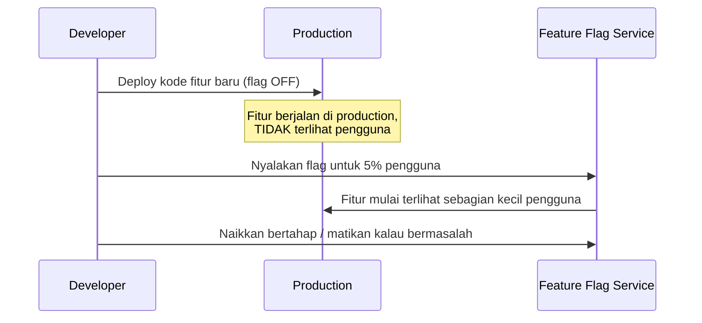

## TL;DR

Feature flag adalah kondisi di kode yang menyalakan atau mematikan sebuah fitur tanpa perlu deploy ulang — ia memisahkan dua hal yang biasanya dianggap satu peristiwa yang sama: **deploy** (kode baru sampai ke production dan berjalan) dan **release** (fitur baru itu benar-benar terlihat dan dipakai pengguna). Kode fitur baru bisa sudah berjalan di production, di belakang flag yang masih dimatikan, tanpa memengaruhi pengguna sama sekali — release berarti menyalakan flag itu, keputusan yang bisa diambil kapan saja setelah deploy, tanpa deploy ulang, dan bisa dibatalkan (dimatikan lagi) secepat dinyalakan.

## The Problem

Sebuah tim mengerjakan fitur besar (alur persetujuan dokumen baru) selama beberapa minggu di satu branch panjang, terpisah dari `main`. Selama itu, `main` terus berubah lewat kerja tim lain, dan branch fitur besar itu makin jauh menyimpang — begitu akhirnya di-merge, konfliknya banyak dan butuh waktu lama menyelesaikannya, dan risiko sesuatu rusak saat merge besar-besaran itu jauh lebih tinggi dibanding kalau perubahan digabungkan bertahap sejak awal.

Masalah kedua muncul setelah fitur ini akhirnya rilis: ternyata ada bug yang hanya muncul untuk kombinasi kasus tertentu, dan tim ingin mematikan fitur ini sementara sambil memperbaikinya — tapi karena fitur ini di-deploy sebagai bagian dari rilis besar yang sudah tercampur dengan banyak perubahan lain, mematikannya berarti rollback seluruh deploy, termasuk perubahan lain yang sebenarnya tidak bermasalah dan sudah dipakai baik-baik oleh pengguna lain.

## Intuition

Cara paling mudah memahaminya: feature flag seperti **sakelar lampu yang dipasang sebelum instalasi listrik selesai diperiksa**. Kabel dan lampunya sudah terpasang penuh (kode sudah di-deploy), tapi sakelarnya sengaja dibiarkan mati sampai petugas yakin instalasinya aman untuk dinyalakan. Kalau ternyata ada masalah setelah dinyalakan, mematikannya lagi hanya butuh membalik sakelar — tidak perlu membongkar seluruh instalasi kabel yang sudah terpasang.

Analogi ini bocor pada soal berapa lama sakelar itu boleh dibiarkan dalam satu posisi. Sakelar lampu fisik dirancang untuk dipakai selamanya. Feature flag yang **dibiarkan ada terlalu lama** (fitur sudah lama stabil dan dipakai semua orang, tapi flag-nya tidak pernah dihapus) menjadi utang teknis tersendiri — kode jadi penuh percabangan kondisi yang tidak lagi relevan, dan flag lama yang menumpuk justru menambah kompleksitas alih-alih menguranginya.

## How It Works


Titik pentingnya: "Deploy kode fitur baru" dan "Nyalakan flag" adalah dua peristiwa yang **terpisah dan independen** — bisa terjadi berjam-jam atau berhari-hari terpisah, dan yang kedua bisa dibatalkan tanpa mengulang yang pertama. Ini yang memungkinkan tim menggabungkan kode fitur besar ke `main` secara bertahap dan sering (menghindari masalah merge besar di "The Problem"), sambil tetap mengontrol kapan pengguna benar-benar melihatnya.

## Under The Hood

Feature flag paling sederhana hanyalah variabel boolean di konfigurasi. Feature flag yang matang, dipakai untuk kontrol rilis bertahap (mirip canary di [[Blue-Green and Canary Releases]]), butuh **targeting rules** — menyalakan fitur untuk sebagian pengguna berdasarkan kriteria (persentase acak, ID pengguna tertentu untuk internal testing, region tertentu) — dan idealnya bisa diubah **tanpa deploy ulang aplikasi**, biasanya lewat service terpisah yang di-query aplikasi saat runtime atau di-push ke aplikasi lewat mekanisme berlangganan perubahan.

Perbedaan penting dari canary release: canary mengontrol **versi kode** mana yang menangani sebuah request (dua deployment berjalan paralel). Feature flag mengontrol **jalur eksekusi di dalam satu versi kode yang sama** — hanya ada satu deployment, dan flag menentukan cabang mana yang dijalankan. Keduanya bisa dipakai bersamaan (canary release untuk perubahan infrastruktur berisiko, feature flag untuk kontrol granular perilaku aplikasi), dan sering saling melengkapi, bukan saling menggantikan.

## In Go

```go
package featureflag

import "context"

// Flags adalah interface yang disengaja SEDERHANA — implementasi
// nyata bisa berupa in-memory map untuk testing, atau client yang
// query service flag eksternal untuk production.
type Flags interface {
	IsEnabled(ctx context.Context, flagName string, userID string) bool
}

// StaticFlags adalah implementasi PALING sederhana — cukup untuk
// flag yang tidak butuh targeting granular, hanya on/off global.
type StaticFlags struct {
	enabled map[string]bool
}

func (f StaticFlags) IsEnabled(ctx context.Context, flagName string, userID string) bool {
	return f.enabled[flagName]
}

// Contoh pemakaian di kode aplikasi — perhatikan: TIDAK ada
// percabangan berdasarkan versi deploy, hanya berdasarkan flag.
func HandleApproval(ctx context.Context, flags Flags, userID string) string {
	if flags.IsEnabled(ctx, "new_approval_flow", userID) {
		return newApprovalFlow(ctx, userID)
	}
	return legacyApprovalFlow(ctx, userID)
}

func newApprovalFlow(ctx context.Context, userID string) string { return "alur baru" }
func legacyApprovalFlow(ctx context.Context, userID string) string { return "alur lama" }
```

## In His Stack

Untuk fitur besar seperti alur persetujuan dokumen baru di salah satu dari 13 aplikasi, feature flag memungkinkan tim menggabungkan kode ke `main` secara bertahap selama berminggu-minggu pengembangan, dengan flag dimatikan sampai fitur benar-benar siap — jauh lebih aman dibanding branch panjang yang di-merge sekaligus di akhir. Feature flag juga berguna sebagai alat komunikasi lintas 13 aplikasi: fitur yang berisiko bisa dinyalakan dulu untuk satu-dua instansi yang jadi early adopter, memberi waktu mengumpulkan feedback nyata sebelum dinyalakan penuh ke semua instansi lain.

## Trade-offs and When Not To Use It

Feature flag yang menumpuk dan tidak pernah dibersihkan adalah utang teknis nyata — setiap flag yang masih ada di kode berarti percabangan logika yang harus dipahami dan diuji, dan flag yang sudah lama stabil (fitur sudah dipakai semua orang, tidak ada rencana mematikannya) seharusnya dihapus bersama percabangan kode yang menyertainya, bukan dibiarkan selamanya "untuk jaga-jaga". Untuk perubahan kecil yang risikonya rendah dan tidak butuh kontrol rilis granular (perbaikan bug kecil, perubahan yang seluruhnya internal), menambahkan feature flag hanya menambah kompleksitas tanpa manfaat proporsional — feature flag paling bernilai untuk perubahan besar atau berisiko yang benar-benar butuh kemampuan mematikan cepat tanpa rollback penuh.

## Common Mistakes

> [!warning] Jebakan
> Membiarkan feature flag lama menumpuk di kode setelah fitur itu stabil dan dipakai semua orang — setiap flag yang tidak dibersihkan menambah percabangan logika permanen yang harus terus dipelihara dan diuji, padahal keputusan rilisnya sudah final.

> [!warning] Jebakan
> Memakai feature flag sebagai pengganti test yang layak — "toh kalau bermasalah tinggal dimatikan flag-nya" bukan alasan melewatkan pengujian sebelum deploy; flag mengurangi **dampak** kalau ada masalah, bukan menghilangkan kebutuhan mencegah masalah sejak awal.

> [!warning] Jebakan
> Menyimpan nilai flag di kode yang butuh deploy ulang untuk diubah (`const` atau `.env` yang dibaca sekali saat startup) — ini meniadakan manfaat utama feature flag, yaitu kemampuan menyalakan/mematikan tanpa deploy ulang.

## Exercises

1. Jelaskan perbedaan antara "deploy" dan "release", dan bagaimana feature flag memisahkan keduanya.
2. Kenapa feature flag yang menumpuk dan tidak dibersihkan menjadi utang teknis?
3. Jelaskan perbedaan feature flag dan canary release — apa yang dikontrol masing-masing?
4. Desain terbuka: tim kamu sedang mengerjakan fitur besar (alur persetujuan dokumen baru) yang akan memakan waktu enam minggu pengembangan, dan ingin menghindari branch panjang yang di-merge sekaligus di akhir. Rancang strategi memakai feature flag untuk menggabungkan kode ke `main` secara bertahap selama enam minggu itu, termasuk kapan flag akhirnya dihapus.

> [!success]- Kunci jawaban
> **1.** Deploy berarti kode baru sampai dan berjalan di production. Release berarti fitur itu benar-benar terlihat dan dipakai pengguna. Tanpa feature flag, keduanya biasanya terjadi bersamaan — kode yang di-deploy langsung terlihat pengguna. Feature flag memisahkan keduanya: kode bisa di-deploy dengan flag mati (tidak terlihat), dan release terjadi belakangan kapan saja dengan menyalakan flag, tanpa deploy ulang.
> **4.** (1) Buat flag `new_approval_flow` sejak commit pertama fitur ini, default mati; (2) kembangkan fitur secara bertahap langsung di `main` (bukan branch terpisah), dengan kode baru selalu di belakang pengecekan flag — setiap potongan kecil yang selesai langsung di-merge, menghindari konflik besar di akhir; (3) selama enam minggu itu, `main` selalu dalam keadaan bisa di-deploy kapan saja, karena flag yang mati membuat kode yang belum selesai tidak pernah terlihat pengguna; (4) setelah fitur selesai, nyalakan flag bertahap (internal dulu, lalu sebagian kecil pengguna nyata, lalu penuh) mengikuti pola canary; (5) setelah flag menyala penuh dan stabil selama periode yang disepakati (misalnya beberapa minggu tanpa masalah), hapus flag dan percabangan kode `legacyApprovalFlow` yang menyertainya — jangan biarkan flag itu hidup selamanya "untuk jaga-jaga".

## Self-Check

- Apa perbedaan "deploy" dan "release", dan bagaimana feature flag memisahkan keduanya?
- Kenapa feature flag lama yang tidak dibersihkan jadi utang teknis?
- Apa perbedaan feature flag dan canary release?
- Kapan feature flag adalah overhead yang tidak sepadan?

## Connected Notes

- [[Blue-Green and Canary Releases]] — feature flag dan canary release saling melengkapi, mengontrol risiko rilis di lapisan yang berbeda (kode vs infrastruktur).
- [[../90 Architecture and Design/Git Workflow and Code Review|Git Workflow and Code Review]] — feature flag memungkinkan strategi trunk-based development, menghindari branch panjang yang sulit di-merge.
- [[Zero-Downtime Database Migrations]] — kelanjutan langsung: pola serupa (memisahkan perubahan jadi tahap kecil yang aman) juga jadi inti strategi migrasi database tanpa downtime.
- [[../90 Architecture and Design/Managing Technical Debt Explicitly|Managing Technical Debt Explicitly]] — feature flag lama yang tidak dibersihkan adalah contoh konkret utang teknis yang butuh dikelola secara sadar.
- [[../92 Tools/_Overview|Tools Overview]] — beberapa vendor menyediakan tool khusus feature flag sebagai layanan terkelola, meski konsepnya sendiri sederhana untuk diimplementasikan sendiri.

## Further Reading

- Materi umum industri mengenai trunk-based development dan feature flag, dipopulerkan luas lewat praktik continuous delivery.

## Catatan Saya

*Tulis di sini fitur besar di pekerjaanmu yang pernah (atau seharusnya) memakai feature flag, dan apa yang menghalangi pemakaiannya sekarang.*
