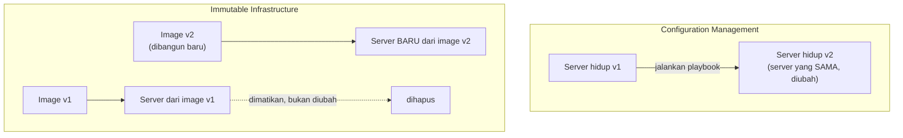

## TL;DR

**Configuration management** (Ansible, Chef, Puppet) mengelola server yang sudah hidup dengan menjalankan skrip yang mengubahnya menjadi keadaan yang diinginkan — server yang sama terus dipakai dan diubah berulang kali sepanjang hidupnya. **Immutable infrastructure** menolak gagasan "mengubah server yang hidup" sama sekali — begitu ada perubahan, server (atau container) lama tidak pernah diubah, melainkan **diganti sepenuhnya** dengan instance baru yang dibangun dari image yang sudah menyertakan perubahan itu sejak awal. Container dan image Docker (lihat [[Docker - Images, Layers, and Multi-Stage Builds for Go|Docker - Images, Layers, and Multi-Stage Builds for Go]]) adalah wujud paling umum dari immutable infrastructure di dunia modern, dan menjadi alasan kenapa drift (lihat [[State Files and Drift]]) jauh lebih jarang terjadi pada workload container dibanding pada VM yang dikelola configuration management.

## The Problem

Sebuah tim mengelola armada VM lewat Ansible — setiap kali ada perubahan (paket baru, konfigurasi baru), playbook Ansible dijalankan ke seluruh VM untuk membawanya ke keadaan terbaru. Setelah bertahun-tahun, beberapa VM mulai berperilaku sedikit berbeda satu sama lain, meski playbook yang sama sudah dijalankan ke semuanya — satu VM pernah gagal menjalankan satu langkah playbook di masa lalu (koneksi jaringan putus di tengah eksekusi) dan tidak pernah benar-benar pulih sepenuhnya ke keadaan yang seharusnya, tapi juga tidak terlihat rusak secara jelas sampai bertahun-tahun kemudian saat perbedaan itu akhirnya menyebabkan bug yang aneh dan sulit dilacak.

Ini disebut **configuration drift** dalam bentuk lain — bukan drift antara kode dan state file seperti di [[State Files and Drift]], tapi drift antara VM yang seharusnya identik satu sama lain, terakumulasi dari riwayat panjang eksekusi playbook yang tidak selalu berjalan sempurna di setiap VM. Setiap VM punya "riwayat hidup" masing-masing yang berbeda, dan riwayat itulah yang membuat VM yang secara teori identik ternyata punya perilaku yang sedikit berbeda.

## Intuition

Cara paling mudah memahaminya: configuration management seperti **merenovasi rumah yang sedang dihuni** — setiap kali ada perubahan, tukang datang dan mengubah bagian tertentu dari rumah yang sama, sementara penghuni tetap tinggal di dalamnya. Immutable infrastructure seperti **membangun rumah baru dari cetak biru yang sudah diperbarui**, memindahkan penghuni ke rumah baru itu, lalu merobohkan rumah lama sepenuhnya. Rumah baru dijamin sesuai cetak biru terbaru persis, karena ia memang dibangun dari nol berdasarkan cetak biru itu — tidak ada riwayat renovasi bertahun-tahun yang bisa meninggalkan bekas tak terduga.

Analogi ini bocor pada soal biaya. Membangun rumah baru jauh lebih mahal dan lambat dibanding merenovasi sebagian. Membangun ulang image container, sebaliknya, adalah operasi yang murah dan cepat (hitungan menit, bukan hitungan bulan) — inilah yang membuat immutable infrastructure jadi masuk akal secara ekonomi untuk software dengan cara yang tidak masuk akal untuk rumah fisik.

## How It Works


Perbedaan kuncinya ada di apakah identitas server bertahan lintas perubahan. Di configuration management, server yang sama menjalani riwayat perubahan panjang. Di immutable infrastructure, setiap perubahan berarti server baru sepenuhnya — server lama tidak pernah "menjadi" versi baru, ia hanya digantikan.

## Under The Hood

Immutable infrastructure menghapus satu kelas bug secara struktural: bug yang disebabkan riwayat eksekusi yang berbeda-beda antar server (langkah yang gagal sebagian, urutan eksekusi yang kebetulan berbeda) tidak mungkin terjadi kalau setiap server memang dibangun ulang dari nol dari image yang sama persis setiap kali — tidak ada "riwayat" yang bisa menyimpang, karena tidak ada riwayat perubahan bertahap sama sekali. Trade-off-nya: immutable infrastructure butuh siklus build-and-replace yang cepat dan murah supaya praktis dipakai sehari-hari — inilah kenapa pola ini baru benar-benar populer setelah container membuat siklus itu berlangsung dalam hitungan menit, bukan seperti provisioning VM penuh yang bisa memakan waktu jauh lebih lama.

Configuration management tetap relevan untuk domain yang belum (atau tidak bisa) sepenuhnya containerized — provisioning awal VM sebelum container runtime terpasang, atau mengelola fleet VM legacy yang menjalankan sistem yang tidak realistis dikemas ulang jadi container dalam waktu dekat. Di titik ini, kedua pendekatan sering hidup berdampingan: configuration management menyiapkan fondasi VM, immutable infrastructure (container) berjalan di atasnya.

## In Go

```go
package deploy

import "fmt"

// Server merepresentasikan gagasan inti: server immutable TIDAK
// pernah punya method "Update" — hanya bisa dibuat baru atau
// dimatikan sepenuhnya.
type Server struct {
	ID      string
	ImageID string
}

// Replace TIDAK mengubah server yang ada — ia membuat server BARU
// dari image baru, lalu menandai server lama untuk dimatikan. Tidak
// ada jalur kode yang "mengedit" ImageID server yang sudah berjalan.
func Replace(old Server, newImageID string) (newServer Server, oldToTerminate Server) {
	newServer = Server{
		ID:      fmt.Sprintf("%s-v2", old.ID),
		ImageID: newImageID,
	}
	return newServer, old
}
```

## In His Stack

Migrasi 13 aplikasi dari deploy manual di VM ke Docker/Kubernetes adalah, pada intinya, migrasi dari configuration management (atau lebih buruk, tidak ada manajemen konfigurasi formal sama sekali) menuju immutable infrastructure. Manfaat paling langsung terasa untuk koordinator teknis: debugging masalah "kenapa aplikasi ini berperilaku beda di server A dan server B" nyaris hilang sepenuhnya begitu semua server menjalankan image container yang identik dari registry yang sama, dibanding VM yang riwayat konfigurasinya bisa diam-diam berbeda meski playbook yang sama pernah dijalankan ke semuanya.

## Trade-offs and When Not To Use It

Immutable infrastructure butuh disiplin memisahkan **data** dari **infrastruktur yang menjalankannya** — data yang tersimpan lokal di server lama (file upload, cache di disk) hilang begitu server itu diganti, kecuali data itu sengaja disimpan di tempat yang bertahan lintas siklus hidup server (storage eksternal, volume terpisah). Untuk workload yang secara inheren stateful dan sulit dipisahkan dari server yang menjalankannya (beberapa sistem legacy yang menyimpan state lokal secara mendalam), migrasi paksa ke immutable infrastructure tanpa mendesain ulang penyimpanan datanya lebih dulu justru berisiko kehilangan data, bukan menyelesaikan masalah drift.

## Common Mistakes

> [!warning] Jebakan
> Menyimpan data penting (file upload, state aplikasi) di disk lokal container atau VM yang immutable, tanpa penyimpanan eksternal — data itu hilang begitu server diganti, karena "diganti" memang berarti server lama dihapus sepenuhnya, bukan dipertahankan.

> [!warning] Jebakan
> Memakai container image tapi tetap login manual ke dalam container yang berjalan untuk "memperbaiki cepat" sesuatu — ini meniadakan seluruh manfaat immutability, karena container itu sekarang punya riwayat perubahan yang tidak tercatat di image, persis masalah configuration drift yang seharusnya dihindari.

> [!warning] Jebakan
> Membangun ulang image untuk setiap perubahan kecil tanpa strategi caching layer yang baik (lihat [[Docker - Images, Layers, and Multi-Stage Builds for Go|Docker - Images, Layers, and Multi-Stage Builds for Go]]) — membuat siklus build-and-replace jadi lambat dan mahal, mengurangi manfaat kecepatan yang jadi alasan utama immutable infrastructure masuk akal secara ekonomi.

## Exercises

1. Jelaskan perbedaan mendasar configuration management dan immutable infrastructure dalam menangani perubahan server.
2. Kenapa "riwayat eksekusi yang berbeda-beda antar server" adalah kelas bug yang secara struktural tidak mungkin terjadi pada immutable infrastructure?
3. Kenapa immutable infrastructure baru praktis dipakai luas setelah container membuat siklus build-and-replace jadi cepat dan murah?
4. Desain terbuka: salah satu dari 13 aplikasimu masih menyimpan file upload pengguna langsung di disk lokal VM tempat aplikasi berjalan, dan kamu ingin memigrasikannya ke container immutable di Kubernetes. Jelaskan apa yang harus berubah di arsitektur penyimpanan filenya sebelum migrasi ini aman dilakukan.

> [!success]- Kunci jawaban
> **1.** Configuration management mengubah server yang sama secara bertahap sepanjang hidupnya lewat skrip yang dijalankan berulang. Immutable infrastructure tidak pernah mengubah server yang hidup — setiap perubahan berarti membangun server/image baru dan mengganti yang lama sepenuhnya, bukan mengeditnya di tempat.
> **4.** File upload harus dipindahkan dari disk lokal ke object storage eksternal (S3-compatible atau sejenisnya) yang hidupnya independen dari siklus hidup Pod yang menjalankan aplikasi — lihat pola serupa di [[../30 APIs and Web/Pre-signed URLs|Pre-signed URLs]] untuk cara aplikasi berinteraksi dengan storage eksternal ini tanpa harus memproses file itu sendiri secara penuh. Setelah perubahan ini, Pod aplikasi bisa diganti kapan saja (deploy baru, restart, scale down) tanpa risiko kehilangan file yang sudah diunggah pengguna, karena file itu tidak lagi bergantung pada disk lokal Pod mana pun yang kebetulan sedang berjalan.

## Self-Check

- Apa perbedaan mendasar configuration management dan immutable infrastructure?
- Kenapa configuration drift antar server sulit terjadi pada immutable infrastructure?
- Kenapa container membuat immutable infrastructure jadi praktis secara ekonomi?
- Apa risiko utama migrasi ke immutable infrastructure tanpa memisahkan data terlebih dulu?

## Connected Notes

- [[State Files and Drift]] — configuration drift antar server yang dibahas di note ini adalah bentuk lain dari masalah drift yang dibahas di note sebelumnya.
- [[Docker - Images, Layers, and Multi-Stage Builds for Go|Docker - Images, Layers, and Multi-Stage Builds for Go]] — image Docker adalah wujud paling umum immutable infrastructure yang dipakai sehari-hari.
- [[Declarative vs Imperative Infrastructure]] — immutable infrastructure dan pendekatan declarative sering berjalan berdampingan, meski keduanya menjawab masalah yang sedikit berbeda.
- [[../30 APIs and Web/Pre-signed URLs|Pre-signed URLs]] — pola penyimpanan file eksternal yang jadi prasyarat migrasi aman ke immutable infrastructure.
- [[../92 Tools/Ansible|Ansible]] — tool configuration management yang jadi kontras langsung dengan pendekatan immutable infrastructure di note ini.

## Further Reading

- Materi umum industri mengenai "immutable infrastructure" sebagai istilah, dipopulerkan luas seiring adopsi container — bukan rujukan satu sumber tunggal.

## Catatan Saya

*Tulis di sini apakah ada VM di pekerjaanmu yang "berbeda sendiri" dari VM lain yang seharusnya identik, dan riwayat apa yang mungkin menyebabkannya.*
