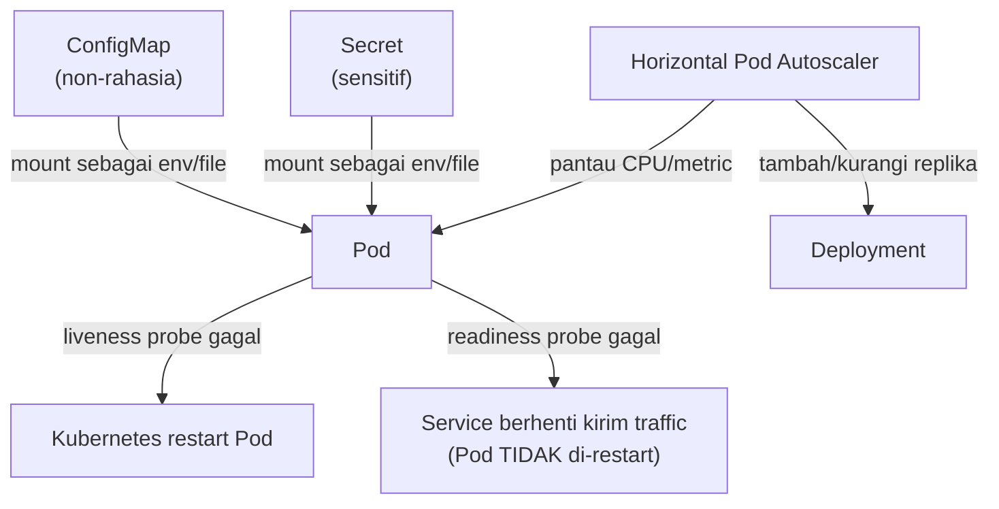

## TL;DR

Menjalankan Pod saja tidak membuat sebuah workload siap production. Empat mekanisme melengkapinya: **ConfigMap** menyuntikkan konfigurasi non-rahasia ke Pod tanpa membakarnya ke dalam image (lihat [[Configuration via Environment (12-Factor App)|Configuration via Environment (12-Factor App)]]), **Secret** melakukan hal serupa untuk data sensitif (meski, seperti dibahas di bawah, "rahasia" di sini butuh kualifikasi penting), **probe** (liveness, readiness, startup) memberi tahu Kubernetes cara mendeteksi Pod yang sehat versus yang macet, dan **autoscaling** menyesuaikan jumlah Pod atau kapasitas node mengikuti beban nyata alih-alih kapasitas tetap yang ditentukan manual di awal.

## The Problem

Sebuah tim baru memindahkan aplikasi ke Kubernetes dan menyalin praktik lama: connection string database, API key partner eksternal, dan seluruhnya di-hardcode ke dalam image Docker lewat `ENV` di Dockerfile — persis kebiasaan yang seharusnya sudah ditinggalkan sejak [[Configuration via Environment (12-Factor App)|Configuration via Environment (12-Factor App)]] di level junior. Konsekuensinya sekarang lebih besar: setiap perubahan API key butuh membangun ulang image dan rolling update seluruh Deployment, dan siapa pun yang punya akses ke registry image otomatis punya akses ke seluruh kredensial yang ter-bake di dalamnya.

Masalah kedua muncul beberapa minggu kemudian: Pod aplikasi ini sesekali macet (deadlock internal, koneksi database yang menggantung) tapi proses utamanya tetap berjalan — dari sudut pandang Kubernetes, Pod itu terlihat "hidup" karena tidak crash, padahal sudah tidak bisa memproses request sama sekali. Tanpa probe yang dikonfigurasi, Kubernetes tidak punya cara mengetahui perbedaan antara "Pod hidup dan sehat" dan "Pod hidup tapi macet total" — Service terus mengarahkan traffic ke Pod yang sudah tidak berguna itu.

## Intuition

Cara paling mudah memahaminya: probe adalah **perawat yang mengecek denyut nadi pasien secara berkala**, bukan hanya memastikan pasien belum meninggal. Liveness probe menjawab "apakah pasien ini masih hidup sama sekali" (kalau tidak, Kubernetes me-restart Pod). Readiness probe menjawab pertanyaan yang lebih halus: "apakah pasien ini sedang dalam kondisi bisa menerima pengunjung sekarang" (kalau tidak, Service berhenti mengirim traffic ke Pod itu, tapi Pod tidak di-restart — mungkin ia hanya sedang memuat ulang cache).

Analogi ini bocor pada satu hal: perawat manusia bisa menilai kondisi pasien secara menyeluruh dan kontekstual. Probe Kubernetes hanya sesederhana pemeriksaan yang kamu definisikan sendiri (biasanya satu endpoint HTTP) — probe yang dirancang buruk (misalnya endpoint yang selalu mengembalikan 200 tanpa benar-benar memeriksa dependency kritis) memberi rasa aman palsu, karena Kubernetes hanya sepintar pemeriksaan yang diberikan kepadanya, tidak lebih.

## How It Works


Perbedaan paling penting di diagram ini ada di dua cabang probe: liveness yang gagal berarti "matikan dan hidupkan ulang", readiness yang gagal berarti "biarkan hidup, tapi jangan kirim traffic dulu" — mencampur keduanya (memakai satu endpoint yang sama untuk kedua probe tanpa berpikir) sering jadi sumber Pod yang di-restart berulang-ulang padahal yang sebenarnya terjadi hanya butuh waktu lebih lama untuk siap.

**Horizontal Pod Autoscaler (HPA)** memantau metrik (paling umum CPU, bisa juga metrik custom) dan menyesuaikan jumlah replika Deployment secara otomatis di antara batas minimum dan maksimum yang ditentukan. Ini menggantikan kapasitas tetap ("selalu jalankan 5 replika") dengan kapasitas yang mengikuti beban nyata — menghemat resource saat sepi, menambah kapasitas otomatis saat lonjakan traffic tanpa menunggu manusia menyadari dan bereaksi manual.

## Under The Hood

Poin yang sering disalahpahami soal Secret: nama "Secret" **tidak otomatis berarti terenkripsi**. Secara default, isi Secret di etcd (database internal Kubernetes yang menyimpan seluruh state cluster) tersimpan dalam bentuk **base64-encoded**, bukan dienkripsi — base64 adalah encoding, bukan enkripsi, dan siapa pun dengan akses baca ke etcd bisa mendekodenya dengan trivial. Enkripsi Secret yang sesungguhnya butuh fitur tambahan diaktifkan eksplisit di level cluster (encryption at rest untuk etcd, lihat [[../80 Security/Encryption at Rest vs In Transit|Encryption at Rest vs In Transit]]), dan untuk kebutuhan yang lebih serius, integrasi dengan secret manager eksternal seperti [[../92 Tools/Vault|Vault]] adalah praktik yang lebih matang dibanding mengandalkan Secret bawaan Kubernetes begitu saja.

> [!question] Perlu diverifikasi
> Klaim: perilaku default penyimpanan Secret di etcd (base64 tanpa enkripsi) dan opsi encryption-at-rest yang tersedia.
> Kenapa ragu: perilaku ini bisa berbeda tergantung distribusi Kubernetes (managed service dari vendor cloud sering mengaktifkan encryption at rest secara default, instalasi self-managed sering tidak).
> Cara verifikasi: dokumentasi resmi Kubernetes bagian "Encrypting Confidential Data at Rest", dan dokumentasi spesifik distribusi/vendor yang benar-benar dipakai.

Startup probe (tambahan di luar liveness/readiness) menjawab masalah spesifik: aplikasi dengan waktu inisialisasi lama (memuat cache besar, migrasi data saat startup) bisa salah di-restart oleh liveness probe yang menganggapnya macet, padahal ia hanya butuh waktu lebih lama untuk siap — startup probe memberi jendela waktu toleransi khusus di fase awal sebelum liveness probe mulai dievaluasi.

## In Go

```go
package health

import (
	"context"
	"database/sql"
	"fmt"
	"net/http"
)

type Checker struct {
	DB *sql.DB
}

// Liveness HANYA menjawab "apakah proses ini masih bisa merespons
// sama sekali" — jangan periksa dependency eksternal di sini, karena
// database yang lambat merespons akan membuat Kubernetes salah
// mengira Pod ini macet lalu me-restart-nya berulang, padahal
// masalahnya ada di database, bukan di Pod.
func (c *Checker) Liveness(w http.ResponseWriter, r *http.Request) {
	w.WriteHeader(http.StatusOK)
}

// Readiness memeriksa dependency KRITIS — kalau database tidak bisa
// dihubungi, Pod ini memang belum/tidak siap menerima traffic, tapi
// TIDAK perlu di-restart karena prosesnya sendiri baik-baik saja.
func (c *Checker) Readiness(w http.ResponseWriter, r *http.Request) {
	ctx, cancel := context.WithTimeout(r.Context(), 2_000_000_000) // 2 detik
	defer cancel()

	if err := c.DB.PingContext(ctx); err != nil {
		http.Error(w, fmt.Sprintf("database tidak siap: %v", err), http.StatusServiceUnavailable)
		return
	}
	w.WriteHeader(http.StatusOK)
}
```

## In His Stack

Praktik minimal yang realistis untuk 13 aplikasi yang bermigrasi ke Kubernetes: pisahkan sejak awal mana konfigurasi yang benar-benar rahasia (connection string database, API key partner) lewat Secret terintegrasi [[../92 Tools/Vault|Vault]], dan mana yang cukup ConfigMap (nama environment, feature flag, URL endpoint publik) — mencampur keduanya jadi satu ConfigMap besar sering terjadi karena terburu-buru migrasi, dan sulit diurai belakangan setelah banyak aplikasi bergantung padanya. Untuk readiness probe, endpoint yang memeriksa koneksi database sudah cukup untuk mayoritas dari 13 aplikasi ini — kompleksitas tambahan (memeriksa Kafka, Elasticsearch) hanya perlu ditambahkan kalau aplikasi memang benar-benar tidak bisa berfungsi tanpa dependency itu.

## Trade-offs and When Not To Use It

Autoscaling menambah kompleksitas nyata: kapasitas yang berubah-ubah butuh aplikasi yang benar-benar stateless (state tidak boleh disimpan lokal di memori Pod, karena Pod bisa hilang kapan saja saat scale down), dan node underlying cluster juga harus punya kapasitas untuk menampung Pod tambahan saat scale up — autoscaling Pod tanpa cluster autoscaling di baliknya hanya memindahkan masalah kapasitas, bukan menyelesaikannya. Untuk workload dengan pola traffic yang stabil dan dapat diprediksi (beban kerja batch internal, bukan API publik dengan lonjakan tak terduga), kapasitas tetap yang disesuaikan manual sesekali sering lebih sederhana dan lebih mudah dipahami dibanding mengelola aturan autoscaling yang correctness-nya butuh pengujian sendiri.

## Common Mistakes

> [!warning] Jebakan
> Menyimpan kredensial sensitif di Secret Kubernetes tanpa encryption at rest diaktifkan di level cluster, dengan asumsi nama "Secret" berarti otomatis terenkripsi — secara default isinya hanya di-encode base64, dibaca trivial oleh siapa pun dengan akses etcd.

> [!warning] Jebakan
> Memakai endpoint yang sama untuk liveness dan readiness probe — liveness probe yang memeriksa dependency eksternal (database, cache) menyebabkan Pod di-restart berulang saat dependency itu lambat, padahal proses aplikasinya sendiri sehat dan restart tidak menyelesaikan apa pun.

> [!warning] Jebakan
> Mengaktifkan Horizontal Pod Autoscaler tanpa memastikan aplikasi benar-benar stateless — Pod baru yang dibuat autoscaling tidak mewarisi state di memori Pod lama, dan Pod yang dimatikan saat scale down kehilangan state itu sepenuhnya tanpa peringatan.

## Exercises

1. Jelaskan perbedaan tujuan liveness probe dan readiness probe.
2. Kenapa nama "Secret" di Kubernetes tidak otomatis berarti data tersebut terenkripsi?
3. Jelaskan kenapa autoscaling Pod butuh aplikasi yang stateless untuk berfungsi aman.
4. Desain terbuka: salah satu dari 13 aplikasimu punya waktu startup sekitar 90 detik (memuat cache besar dari database saat boot), dan sejak dipindah ke Kubernetes, Pod-nya berulang kali di-restart oleh liveness probe sebelum sempat selesai booting. Diagnosis penyebabnya, dan rancang perbaikan probe yang tepat.

> [!success]- Kunci jawaban
> **1.** Liveness probe menjawab "apakah proses ini masih hidup dan bisa merespons sama sekali" — kalau gagal, Kubernetes me-restart Pod. Readiness probe menjawab "apakah Pod ini sedang siap menerima traffic sekarang" — kalau gagal, Service berhenti mengirim traffic ke Pod itu tanpa me-restart-nya, karena masalahnya mungkin sementara (dependency belum siap, sedang memuat cache).
> **4.** Penyebabnya: liveness probe kemungkinan besar dikonfigurasi dengan `initialDelaySeconds` yang lebih pendek dari 90 detik waktu startup aktual, sehingga Kubernetes mulai memeriksa liveness sebelum aplikasi selesai boot, probe gagal (karena endpoint belum merespons atau masih memuat cache), dan Kubernetes me-restart Pod — yang lalu mengulang siklus startup 90 detik yang sama, tidak pernah sempat selesai. Perbaikan: tambahkan **startup probe** dengan `failureThreshold` dan `periodSeconds` yang totalnya mencakup waktu startup terpanjang yang realistis (misalnya toleransi sampai 120 detik untuk margin aman) — selama startup probe belum berhasil, liveness dan readiness probe tidak dievaluasi sama sekali, memberi Pod waktu penuh untuk selesai boot tanpa risiko di-restart di tengah jalan.

## Self-Check

- Apa perbedaan liveness dan readiness probe?
- Kenapa Secret Kubernetes butuh konfigurasi tambahan untuk benar-benar terenkripsi?
- Apa fungsi startup probe, dan kapan ia dibutuhkan?
- Kenapa autoscaling Pod butuh aplikasi stateless?

## Connected Notes

- [[Kubernetes Core Concepts - Pods, Deployments, Services, Ingress]] — probe dan autoscaling di note ini beroperasi di atas objek Pod dan Deployment yang dibahas di note sebelumnya.
- [[Configuration via Environment (12-Factor App)|Configuration via Environment (12-Factor App)]] — ConfigMap dan Secret adalah implementasi konkret prinsip 12-factor app di lingkungan Kubernetes.
- [[../80 Security/Secret Management|Secret Management]] — batasan Secret Kubernetes yang dibahas di note ini adalah kelanjutan langsung dari prinsip pengelolaan kredensial di note itu.
- [[../92 Tools/Vault|Vault]] — solusi lebih matang untuk mengelola secret dibanding mengandalkan Secret bawaan Kubernetes.
- [[Declarative vs Imperative Infrastructure]] — kelanjutan langsung: filosofi mendefinisikan Deployment, Service, ConfigMap sebagai state yang diinginkan, bukan langkah manual.

## Further Reading

- Dokumentasi resmi Kubernetes bagian "Configure Liveness, Readiness and Startup Probes" dan "Encrypting Confidential Data at Rest".

## Catatan Saya

*Tulis di sini apakah salah satu dari 13 aplikasimu di Kubernetes pernah di-restart berulang karena probe yang salah konfigurasi, dan bagaimana kamu mendiagnosisnya.*
