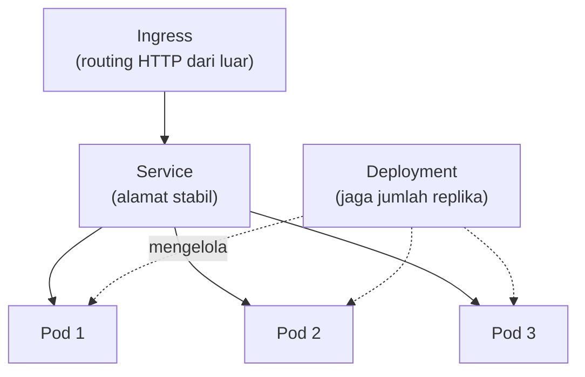

## TL;DR

Kubernetes mengelola container lewat empat objek inti yang saling menumpuk. **Pod** adalah unit terkecil yang dijalankan — satu atau beberapa container yang selalu dijadwalkan bersama di mesin yang sama. **Deployment** mengelola sekumpulan Pod identik, menjaga jumlah replika tetap sesuai yang diinginkan dan mengatur rolling update saat versi baru dirilis. **Service** memberi alamat jaringan stabil ke sekumpulan Pod yang terus berganti-ganti (Pod mati dan lahir kembali dengan IP baru setiap kali). **Ingress** mengatur bagaimana traffic HTTP dari luar cluster diarahkan ke Service yang tepat berdasarkan hostname atau path. Memahami keempatnya sebagai lapisan yang saling menumpuk — bukan empat hal terpisah — adalah kunci membaca manifest Kubernetes tanpa tersesat.

## The Problem

Sebuah tim menjalankan service Go langsung sebagai container Docker di satu VM, dikelola lewat `docker run` dan skrip restart manual. Suatu malam, VM itu kehabisan memori dan proses container mati. Tidak ada yang menyalakannya kembali secara otomatis — deteksi baru terjadi lewat laporan pengguna, dan pemulihan butuh seseorang login manual ke server dan menjalankan ulang perintah `docker run` yang benar (yang, tentu saja, hanya diingat sebagian orang di tim dengan detail yang persis benar).

Masalah yang sama berulang saat tim ingin menambah kapasitas menjelang lonjakan traffic tahunan — menjalankan instance kedua container berarti mencari VM baru, memasang Docker, mengonfigurasi jaringan, dan mengarahkan traffic secara manual ke keduanya. Setiap langkah ini adalah pekerjaan manual yang bisa (dan akan) dilakukan salah di bawah tekanan waktu — persis pola yang sama seperti [[CI-CD Pipelines]], tapi sekarang untuk *menjalankan* container, bukan *membangunnya*.

## Intuition

Cara paling mudah memahaminya: Kubernetes adalah **manajer panggung pertunjukan** yang terus-menerus memastikan jumlah pemain yang tampil di panggung sesuai naskah — kalau satu pemain (Pod) sakit dan mundur, manajer segera mendorong pemain pengganti naik, tanpa menunggu sutradara (manusia) memerintahkannya satu per satu. Deployment adalah naskah yang menyatakan "harus selalu ada tiga pemain jenis ini di panggung." Service adalah nomor kursi penonton yang tetap sama meski pemain yang tampil di panggung terus berganti orang. Ingress adalah petugas pintu masuk gedung yang mengarahkan penonton ke aula yang benar berdasarkan tiket yang mereka pegang.

Analogi ini bocor pada soal identitas. Pemain manusia yang mundur dan digantikan tetaplah dua orang berbeda dengan riwayat masing-masing. Pod yang mati dan digantikan Pod baru oleh Deployment secara sengaja **dianggap identik** — Pod tidak punya identitas yang dipertahankan lintas siklus hidupnya (kecuali didesain eksplisit sebagai stateful), justru karena disposability inilah yang membuat Kubernetes bisa mengganti Pod yang gagal tanpa perlu tahu "riwayat" Pod itu sama sekali.

## How It Works


Traffic mengalir dari atas (Ingress) ke bawah (Pod), sementara Deployment bekerja di jalur terpisah menjaga Pod-Pod di bawah Service itu selalu sejumlah yang didefinisikan — kalau P2 mati, Deployment segera membuat Pod pengganti, dan Service otomatis mengarahkan traffic ke Pod baru itu tanpa Ingress atau klien di luar perlu tahu apa pun berubah.

Detail penting yang sering membingungkan pemula: Pod **bukan** container itu sendiri, melainkan pembungkus di sekelilingnya — satu Pod bisa berisi lebih dari satu container yang berbagi jaringan dan storage yang sama (pola sidecar, misalnya container aplikasi ditemani container proxy untuk mTLS seperti dibahas di [[../80 Security/mTLS|mTLS]]). Dan Service bukan proses yang berjalan di suatu tempat — ia adalah aturan routing virtual yang diterjemahkan komponen internal Kubernetes (`kube-proxy`) jadi aturan jaringan nyata di setiap node.

## Under The Hood

Deployment tidak langsung mengelola Pod — ia mengelola objek perantara bernama **ReplicaSet**, yang tugasnya persis menjaga jumlah Pod identik sesuai `replicas` yang diminta. Alasan ada lapisan perantara ini: saat Deployment melakukan rolling update (mengganti versi image lama ke baru), ia membuat ReplicaSet **baru** untuk versi baru, lalu perlahan menaikkan jumlah Pod di ReplicaSet baru sambil menurunkan jumlah Pod di ReplicaSet lama — proses ini yang membuat rolling update bisa berjalan bertahap tanpa downtime, dan bisa dibatalkan (rollback) dengan mengembalikan ReplicaSet lama, karena ReplicaSet lama tidak langsung dihapus.

Service menemukan Pod mana yang harus dituju lewat **label selector** — Pod diberi label (pasangan key-value bebas, misalnya `app: payment-service`), dan Service mendefinisikan selector yang mencocokkan label itu. Ini yang membuat Pod baru hasil rolling update otomatis "masuk" ke Service yang sama tanpa konfigurasi Service itu sendiri diubah — Service hanya peduli pada kecocokan label, bukan identitas Pod tertentu.

## In Go

```go
package readiness

import (
	"context"
	"net/http"
	"sync/atomic"
)

// ready adalah flag yang menentukan apakah Pod ini SIAP menerima
// traffic dari Service — bukan hanya "proses sudah berjalan", tapi
// "sudah selesai inisialisasi" (koneksi database terbuka, cache
// pemanasan awal selesai).
var ready atomic.Bool

// MarkReady dipanggil setelah semua dependency aplikasi berhasil
// diinisialisasi saat startup.
func MarkReady() {
	ready.Store(true)
}

// ReadinessHandler dipanggil Kubernetes secara periodik (lihat
// [[Kubernetes Config, Secrets, Probes, and Autoscaling]] untuk detail
// readiness probe) — SELAMA handler ini mengembalikan non-200,
// Service TIDAK akan mengarahkan traffic ke Pod ini, meski proses
// aplikasinya sendiri sudah berjalan.
func ReadinessHandler(w http.ResponseWriter, r *http.Request) {
	if !ready.Load() {
		http.Error(w, "belum siap", http.StatusServiceUnavailable)
		return
	}
	w.WriteHeader(http.StatusOK)
}

func warmUp(ctx context.Context) error {
	// Inisialisasi koneksi database, cache warm-up, dst.
	return nil
}
```

## In His Stack

Untuk 13 aplikasi yang berjalan di Kubernetes, langkah paling praktis memindahkan aplikasi dari "dijalankan manual di VM" ke Kubernetes adalah mendefinisikan Deployment dan Service untuk satu aplikasi kecil dulu (bukan langsung migrasi semuanya) — memahami siklus rolling update dan bagaimana Service menemukan Pod lewat label jauh lebih mudah dipelajari lewat satu aplikasi nyata dibanding membaca dokumentasi saja. Ingress biasanya jadi titik masuk tunggal untuk banyak aplikasi sekaligus di satu cluster, diarahkan berdasarkan hostname (`app1.instansi.go.id`, `app2.instansi.go.id`) — memahami aturan routing Ingress dengan benar penting supaya perubahan konfigurasi satu aplikasi tidak sengaja memengaruhi routing aplikasi lain yang berbagi Ingress yang sama.

## Trade-offs and When Not To Use It

Untuk aplikasi kecil dengan traffic rendah dan tim yang belum punya kapasitas mengoperasikan cluster Kubernetes (yang punya kurva belajar dan beban operasional sendiri — upgrade cluster, monitoring node, mengelola resource quota), menjalankan container langsung lewat platform yang lebih sederhana (single VM dengan Docker Compose, atau platform PaaS terkelola) sering jadi pilihan lebih realistis. Kubernetes bernilai jelas begitu jumlah service dan kebutuhan skalabilitas/self-healing bertambah sampai titik di mana pengelolaan manual sudah tidak masuk akal — sinyal konkretnya mirip alasan memilih microservices (lihat [[../90 Architecture and Design/Modular Monolith vs Microservices|Modular Monolith vs Microservices]]): kompleksitas operasional yang didapat harus sepadan dengan masalah nyata yang diselesaikan.

## Common Mistakes

> [!warning] Jebakan
> Menjalankan Pod langsung tanpa Deployment di atasnya — Pod yang tidak dikelola Deployment tidak akan dibuat ulang otomatis kalau mati, meniadakan seluruh manfaat self-healing yang jadi alasan utama memakai Kubernetes.

> [!warning] Jebakan
> Menganggap Service otomatis menyeimbangkan beban secara sempurna ke semua Pod — distribusi traffic Service bergantung implementasi `kube-proxy` dan bisa tidak merata sempurna, terutama untuk koneksi yang berumur panjang (WebSocket, HTTP keep-alive) yang cenderung "menempel" ke satu Pod.

> [!warning] Jebakan
> Mengubah label Pod secara manual tanpa memahami bahwa Service memilih target lewat label selector — Pod yang labelnya tidak lagi cocok dengan selector Service akan berhenti menerima traffic tanpa error yang jelas, seolah-olah Pod itu "menghilang" dari Service.

## Exercises

1. Jelaskan hubungan berjenjang antara Ingress, Service, Deployment, dan Pod.
2. Kenapa Service menemukan Pod lewat label selector, bukan lewat referensi langsung ke Pod tertentu?
3. Jelaskan peran ReplicaSet dalam membuat rolling update Deployment bisa dibatalkan (rollback).
4. Desain terbuka: salah satu dari 13 aplikasimu saat ini berjalan di satu VM lewat `docker run` manual, dan pernah mengalami downtime semalaman karena proses mati tanpa ada yang menyalakan ulang. Rancang langkah migrasi bertahap aplikasi ini ke Kubernetes, termasuk objek apa yang kamu definisikan lebih dulu dan bagaimana kamu memverifikasi migrasi berhasil sebelum mematikan VM lama.

> [!success]- Kunci jawaban
> **1.** Ingress menerima traffic HTTP dari luar cluster dan mengarahkannya ke Service berdasarkan hostname/path. Service memberi alamat jaringan stabil ke sekumpulan Pod yang dipilih lewat label selector. Deployment menjaga jumlah Pod yang cocok dengan label itu tetap sesuai `replicas` yang diinginkan, dan mengatur rolling update. Pod adalah unit eksekusi terkecil yang benar-benar menjalankan container aplikasi.
> **4.** (1) Bangun image Docker aplikasi lewat pipeline CI/CD yang sudah ada (lihat [[CI-CD Pipelines]]), pastikan image ini identik dengan yang berjalan di VM lama secara fungsional; (2) definisikan Deployment dengan `replicas: 1` dulu (menyamai kapasitas VM lama) dan Service yang menunjuk ke Pod itu, deploy ke cluster tapi **belum** diarahkan traffic produksi; (3) verifikasi lewat smoke test internal (panggil Service dari dalam cluster) bahwa aplikasi berjalan identik dengan versi VM lama; (4) arahkan Ingress secara bertahap — mulai dari sebagian kecil traffic atau lewat hostname staging dulu, baru penuh ke production setelah yakin stabil; (5) setelah traffic production sepenuhnya dialihkan dan dipantau stabil beberapa hari, baru matikan VM lama — jangan matikan sebelum ada periode observasi, supaya masih ada jalur mundur kalau ditemukan masalah tak terduga di Kubernetes.

## Self-Check

- Jelaskan hubungan Ingress, Service, Deployment, dan Pod.
- Bagaimana Service menemukan Pod yang harus dituju?
- Apa peran ReplicaSet dalam rolling update?
- Kapan Kubernetes bukan pilihan yang tepat untuk sebuah aplikasi?

## Connected Notes

- [[CI-CD Pipelines]] — image Docker yang dibangun pipeline adalah bahan baku yang dijalankan Deployment sebagai Pod.
- [[Kubernetes Config, Secrets, Probes, and Autoscaling]] — kelanjutan langsung: mengoperasikan workload di atas objek inti yang dibahas di note ini.
- [[../90 Architecture and Design/Modular Monolith vs Microservices|Modular Monolith vs Microservices]] — pertimbangan kompleksitas operasional yang sama relevan untuk memutuskan kapan Kubernetes sepadan dipakai.
- [[../80 Security/mTLS|mTLS]] — pola sidecar container dalam satu Pod adalah cara umum mengimplementasikan mTLS antar service tanpa mengubah kode aplikasi.
- [[../92 Tools/Kubernetes|Kubernetes]] — tool konkret yang mengimplementasikan seluruh objek yang dibahas di note ini.

## Further Reading

- Dokumentasi resmi Kubernetes, bagian "Concepts" — sumber kebenaran untuk perilaku detail tiap objek, yang berubah antar versi.

## Catatan Saya

*Tulis di sini aplikasi mana di pekerjaanmu yang masih berjalan di luar Kubernetes, dan kendala nyata yang menghalangi migrasinya.*
