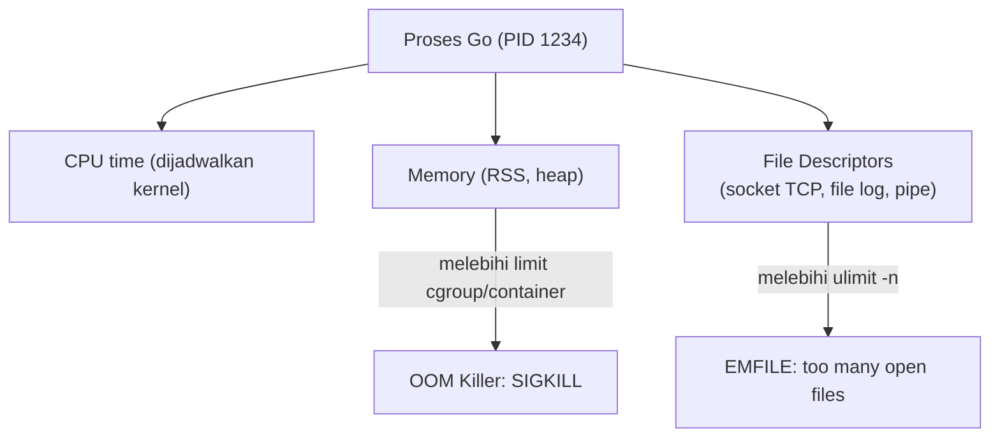

## TL;DR

Sebuah service Go yang berjalan sempurna di local development bisa mati misterius di production, dan jawabannya hampir selalu ada di Linux, bukan di kode Go itu sendiri: proses yang di-kill diam-diam oleh OOM killer, file descriptor yang habis, disk yang penuh, atau permission yang salah. Menguasai segelintir perintah Linux — `ps`, `top`/`htop`, `lsof`, `df`, `journalctl`, `strace`, `ulimit` — adalah perbedaan antara mendiagnosis insiden dalam lima menit dan menebak-nebak selama satu jam sambil restart pod berulang kali. Ini bukan tentang menjadi sysadmin; ini tentang tidak buta ketika container yang membungkus binary Go-mu berperilaku aneh.

## The Problem

Sebuah service pemrosesan dokumen di-deploy, dan setelah beberapa jam berjalan lancar, container-nya restart tanpa pesan error yang jelas di log aplikasi — hanya log Go yang terpotong di tengah kalimat. Tim mengira ini bug di kode, menghabiskan berjam-jam membaca ulang goroutine yang menangani upload file, padahal jawabannya ada satu perintah jauh: `dmesg` atau `journalctl` di node Kubernetes menunjukkan baris `Out of memory: Killed process`. Proses itu bukan crash karena bug logika — ia dibunuh paksa oleh kernel Linux karena node kehabisan memori, dan aplikasi Go tidak pernah sempat menjalankan `defer` atau menulis log terakhirnya karena `SIGKILL` tidak bisa ditangkap atau ditangani sama sekali.

Skenario lain yang sama umum: sebuah service tiba-tiba mulai menolak koneksi baru dengan error `too many open files`, padahal [[../40 Databases/Connection Pooling|connection pool]] database sudah dibatasi dengan benar. Penyebabnya adalah file descriptor yang dipakai untuk koneksi TCP ke service lain (bukan database) tidak pernah ditutup di satu code path, dan `ulimit` default untuk jumlah file descriptor per proses di banyak image container ternyata jauh lebih rendah dari yang diasumsikan siapa pun yang menulis kodenya.

## Intuition

Anggap Linux sebagai **wasit sekaligus penjaga gudang** untuk semua proses yang berjalan di satu mesin: ia memutuskan proses mana dapat waktu CPU berapa lama (scheduler), berapa banyak memori yang boleh dipakai sebelum ditegur atau bahkan dibunuh (OOM killer), dan berapa banyak "tiket" (file descriptor) yang boleh dipegang satu proses untuk membuka file atau koneksi jaringan sekaligus. Aplikasi Go-mu tidak berjalan di ruang hampa — ia selalu tunduk pada aturan wasit ini, dan sebagian besar insiden produksi yang "aneh" sebenarnya adalah wasit menegakkan aturan yang sudah ada sejak awal, hanya saja tidak pernah diperiksa siapa pun sebelumnya.

Analogi ini bocor pada satu hal: wasit olahraga biasanya memperingatkan sebelum mengeluarkan kartu merah. OOM killer di Linux **tidak** memperingatkan — ia memilih dan membunuh proses secara instan begitu memori sistem kritis, berdasarkan skor heuristik (`oom_score`), tanpa memberi proses kesempatan membersihkan diri. Ini kenapa aplikasi yang di-OOM-kill tidak pernah sempat mencatat log "saya akan mati sekarang".

## How It Works

Linux mengelola setiap program yang berjalan sebagai **proses**, masing-masing dengan PID, penggunaan memori dan CPU yang bisa diamati, serta sekumpulan file descriptor yang menunjuk ke file, socket, atau pipe yang sedang dibuka proses itu. Untuk backend engineer, sebagian besar debugging production berkutat di seputar tiga sumber daya ini: CPU, memori, dan file descriptor — plus disk untuk log dan data.



Diagram ini menunjukkan dua jalur kegagalan paling umum: memori yang melebihi batas memicu OOM killer secara instan, sementara file descriptor yang melebihi `ulimit -n` membuat syscall seperti `open()` atau `accept()` gagal dengan error `EMFILE`, yang di Go biasanya muncul sebagai error dari `net.Dial` atau `os.Open`.

**Perintah yang dipakai setiap hari:**

- `ps aux | grep <nama-proses>` — melihat proses yang berjalan, PID-nya, dan penggunaan CPU/memori sekilas.
- `top` atau `htop` — pandangan real-time penggunaan CPU dan memori per proses, berguna untuk melihat proses mana yang tiba-tiba melonjak.
- `lsof -p <PID>` — daftar seluruh file descriptor yang sedang dipegang satu proses; alat utama untuk mendiagnosis kebocoran file descriptor atau koneksi yang tidak pernah ditutup.
- `df -h` — sisa ruang disk per partisi; disk penuh sering jadi penyebab tersembunyi service yang gagal menulis log atau file sementara.
- `du -sh <folder>` — mencari folder mana yang menghabiskan ruang disk, biasanya log yang tidak pernah dirotasi.
- `journalctl -u <nama-service> --since "10 minutes ago"` — melihat log systemd untuk service tertentu, termasuk pesan kernel seperti OOM kill.
- `dmesg | grep -i kill` — melihat pesan kernel langsung, termasuk baris `Out of memory: Killed process` yang tidak akan pernah muncul di log aplikasi.
- `strace -p <PID>` — melihat syscall apa yang sedang dipanggil proses secara real-time; alat terakhir saat semua yang lain buntu, karena overhead-nya besar.
- `ulimit -n` — melihat (atau, dengan `-n <angka>`, mengatur) batas jumlah file descriptor yang boleh dipegang satu proses.

## In Go

```go
package main

import (
	"context"
	"fmt"
	"net"
	"os"
	"syscall"
	"time"
)

// LaporkanBatasFileDescriptor membaca ulimit file descriptor proses saat ini
// lewat syscall.Getrlimit, supaya aplikasi bisa mencatat batas ini di log
// startup — memudahkan diagnosis kalau nanti muncul error EMFILE di production,
// karena tim tidak perlu login ke container hanya untuk menjalankan `ulimit -n`.
func LaporkanBatasFileDescriptor() error {
	var rLimit syscall.Rlimit
	if err := syscall.Getrlimit(syscall.RLIMIT_NOFILE, &rLimit); err != nil {
		return fmt.Errorf("baca rlimit file descriptor: %w", err)
	}
	fmt.Fprintf(os.Stdout, "batas file descriptor: soft=%d hard=%d\n", rLimit.Cur, rLimit.Max)
	return nil
}

// BukaKoneksiDenganKesadaranFD mendemonstrasikan pola yang benar: setiap
// net.Conn yang dibuka HARUS ditutup lewat defer, persis di titik ia dibuka,
// supaya tidak ada jalur kode yang lupa menutupnya saat terjadi error di
// tengah jalan.
func BukaKoneksiDenganKesadaranFD(ctx context.Context, alamat string) error {
	dialer := net.Dialer{Timeout: 5 * time.Second}
	conn, err := dialer.DialContext(ctx, "tcp", alamat)
	if err != nil {
		return fmt.Errorf("dial ke %s: %w", alamat, err)
	}
	defer conn.Close()

	// ... pakai conn di sini ...
	return nil
}
```

Melaporkan batas file descriptor saat startup terdengar remeh, tapi dalam praktiknya inilah yang membuat insiden `EMFILE` tiga bulan kemudian bisa langsung dikonfirmasi lewat log historis, alih-alih menebak-nebak apakah batasnya sudah pernah diubah sejak deploy pertama.

## In His Stack

Di Kubernetes, banyak dari perintah ini masih relevan tapi dijalankan lewat `kubectl exec -it <pod> -- sh` untuk masuk ke dalam container, atau `kubectl top pod` untuk melihat penggunaan CPU/memori tanpa masuk ke container sama sekali. `ulimit` di dalam container sebenarnya dibatasi dua lapis: batas yang diset di dalam container **dan** batas resource (`resources.limits.memory`) yang diset di manifest Kubernetes — container bisa saja mati kena OOM killer versi Kubernetes (`cgroup` limit) jauh sebelum `ulimit` internalnya sendiri tercapai, sehingga memeriksa `kubectl describe pod` (lihat field `Last State: OOMKilled`) sering lebih cepat memberi jawaban daripada masuk ke dalam container itu sendiri. Jenkins sebagai CI juga menjalankan setiap build sebagai proses Linux biasa di worker node — build yang gagal aneh tanpa pesan jelas kadang adalah proses build yang di-OOM-kill oleh worker yang kehabisan memori karena banyak job berjalan paralel di node yang sama.

## Trade-offs and When Not To Use It

Ini bukan area yang punya "trade-off" dalam arti memilih pendekatan A vs B — tapi ada trade-off waktu: menguasai `strace` dan debugging level syscall sangat berharga saat insiden sulit, tapi untuk kerja sehari-hari, terlalu banyak waktu dihabiskan di level ini adalah tanda arsitektur observability (metrics, structured logging, lihat [[The Three Pillars of Observability]]) belum cukup baik — idealnya, sebagian besar insiden terjawab dari dashboard dan log terstruktur, dan `strace`/`lsof` manual hanya dipakai untuk kasus langka yang benar-benar tidak terlihat dari situ.

## Common Mistakes

> [!warning] Jebakan
> Mengira aplikasi "crash karena bug" padahal sebenarnya di-OOM-kill oleh kernel — keduanya terlihat mirip dari luar (proses berhenti mendadak) tapi punya penyebab dan perbaikan yang sama sekali berbeda. Selalu cek `dmesg`/`journalctl` atau `kubectl describe pod` sebelum menyalahkan kode.

> [!warning] Jebakan
> Menaikkan `ulimit -n` sebagai solusi instan tanpa mencari kebocoran file descriptor yang sebenarnya (koneksi atau file yang lupa ditutup) — ini menunda gejala, bukan memperbaiki akar masalah, dan angka yang lebih tinggi hanya berarti butuh waktu lebih lama sebelum masalah yang sama muncul lagi di volume traffic yang lebih besar.

> [!warning] Jebakan
> Menjalankan `strace` di proses production bervolume tinggi tanpa menyadari overhead-nya — `strace` mencegat setiap syscall, dan bisa memperlambat proses target secara signifikan, dalam kasus terburuk cukup untuk memicu timeout di request yang sedang berjalan.

## Exercises

1. Jelaskan kenapa aplikasi Go yang di-OOM-kill tidak pernah sempat menjalankan `defer` atau menulis log "graceful shutdown".
2. Perintah apa yang kamu jalankan untuk membedakan "disk penuh" dari "file descriptor habis" sebagai penyebab sebuah service gagal menulis file?
3. Kenapa menaikkan `ulimit -n` tanpa investigasi lebih lanjut dianggap jebakan, bukan solusi?
4. Desain terbuka: sebuah service Go di Kubernetes di-restart oleh kubelet kira-kira setiap 6 jam, tanpa pesan error di log aplikasi sama sekali. Rancang urutan langkah investigasi dari awal (perintah apa yang kamu jalankan lebih dulu, informasi apa yang kamu cari di masing-masing) untuk sampai ke akar masalah, dengan asumsi kamu punya akses `kubectl` dan akses SSH ke node.

> [!success]- Kunci jawaban
> **1.** `SIGKILL` (sinyal yang dikirim OOM killer) tidak bisa ditangkap, ditunda, atau diabaikan oleh proses target sama sekali — ini berbeda dari `SIGTERM` yang memberi aplikasi kesempatan menjalankan graceful shutdown. Kernel langsung menghentikan proses di level itu juga, sehingga tidak ada baris kode Go apa pun, termasuk `defer` dan `recover`, yang sempat dieksekusi.
> **4.** Urutan yang masuk akal: (1) `kubectl describe pod <nama>` untuk melihat field `Last State` — kalau `OOMKilled`, langsung fokus ke memory usage, bukan file descriptor atau disk; (2) `kubectl top pod` dibandingkan dengan `resources.limits.memory` di manifest, untuk melihat apakah usage mendekati limit sebelum restart; (3) kalau bukan OOM, cek `kubectl logs <pod> --previous` untuk log terakhir sebelum mati; (4) SSH ke node yang menjalankan pod itu, jalankan `dmesg | grep -i kill` dan `journalctl` untuk mencari sinyal dari sisi kernel node, bukan hanya dari sisi Kubernetes; (5) kalau semua itu masih tidak menjelaskan, baru pertimbangkan menambahkan `pprof` (lihat domain concurrency, level intermediate) untuk mengukur pertumbuhan memori aplikasi dari waktu ke waktu, memastikan apakah ini kebocoran memori bertahap atau lonjakan tiba-tiba.

## Self-Check

- Kenapa `SIGKILL` dari OOM killer tidak pernah muncul sebagai log aplikasi yang rapi?
- Perintah apa yang kamu pakai untuk melihat seluruh file descriptor yang dipegang satu proses?
- Apa risiko menjalankan `strace` di proses production dengan traffic tinggi?
- Dua lapis batas memori apa yang berlaku untuk container di Kubernetes?

## Connected Notes

- [[../10 Foundations/Syscalls and File Descriptors|Syscalls and File Descriptors]] — file descriptor yang dibahas di note itu adalah sumber daya konkret yang habis di skenario `EMFILE` di sini.
- [[../10 Foundations/Processes vs Threads|Processes vs Threads]] — proses Linux yang dikelola scheduler dan OOM killer adalah unit yang sama yang dibahas di note fondasi itu.
- [[Docker - Images, Layers, and Multi-Stage Builds for Go]] — container yang membungkus binary Go tetap menjalankannya sebagai proses Linux biasa, tunduk pada semua batas yang dibahas di sini.
- [[The Three Pillars of Observability]] — tujuan akhir menguasai perintah Linux ini adalah supaya sebagian besar insiden terjawab dari observability yang baik, bukan debugging manual di terminal.
- [[../90 Architecture and Design/Managing Technical Debt Explicitly|Managing Technical Debt Explicitly]] — kebocoran file descriptor yang "dibiarkan" dengan menaikkan ulimit adalah bentuk konkret technical debt yang tidak dicatat.

## Further Reading

- Dokumentasi manual Linux (`man 2 getrlimit`, `man 1 lsof`, `man 1 strace`) sebagai sumber kebenaran untuk perilaku setiap syscall dan tool.

## Catatan Saya

*Tulis di sini insiden production di kantor yang ternyata penyebabnya ada di level Linux/OS, bukan di kode aplikasi.*
