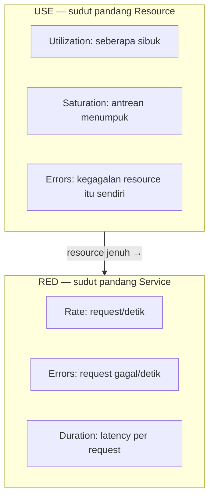

## TL;DR

Sebuah sistem bisa menghasilkan ribuan metrik berbeda, tapi tanpa kerangka memilih yang mana yang benar-benar penting, dashboard hasilnya jadi tumpukan angka yang tidak jelas mana yang harus dilihat lebih dulu saat insiden. **RED method** (Rate, Errors, Duration) dirancang untuk service yang menangani request — berapa banyak request per detik, berapa yang gagal, dan berapa lama masing-masing butuh waktu. **USE method** (Utilization, Saturation, Errors) dirancang untuk resource (CPU, memori, disk, koneksi) — seberapa sibuk resource itu, seberapa banyak antrean yang menumpuk menunggunya, dan berapa banyak error yang terjadi. Keduanya saling melengkapi: RED menjawab "apakah **service** ini sehat", USE menjawab "apakah **resource** di baliknya sehat" — service bisa terlihat sehat dari RED sesaat sebelum resource-nya kehabisan kapasitas dan mulai gagal.

## The Problem

Sebuah tim memasang dashboard dengan puluhan panel metrik untuk salah satu dari 13 aplikasi — jumlah goroutine, ukuran heap, jumlah koneksi database, waktu garbage collection, dan lusinan metrik teknis lain yang tersedia dari instrumentasi bawaan. Suatu malam terjadi insiden: aplikasi mulai merespons lambat. Tim membuka dashboard dan dihadapkan puluhan grafik, tidak tahu mana yang harus dilihat lebih dulu — beberapa metrik naik sedikit, beberapa turun sedikit, tidak ada yang jelas-jelas menunjukkan "ini penyebabnya", dan waktu berharga terbuang memeriksa grafik satu per satu tanpa urutan prioritas yang jelas.

Masalahnya bukan kurangnya data — justru sebaliknya, terlalu banyak metrik tanpa hierarki mana yang harus diperiksa lebih dulu. Dashboard yang baik untuk insiden butuh titik masuk yang jelas: metrik tingkat tinggi yang langsung menjawab "apakah pengguna terdampak" (RED), baru diikuti metrik tingkat resource yang menjawab "kenapa" kalau RED menunjukkan ada masalah (USE) — bukan puluhan grafik setara yang semuanya diperiksa serentak tanpa urutan.

## Intuition

Cara paling mudah memahaminya: RED adalah **pemeriksaan dari sudut pandang pelanggan restoran** — berapa banyak pelanggan yang datang (Rate), berapa yang pesanannya salah atau tidak terlayani (Errors), berapa lama mereka menunggu (Duration). USE adalah **pemeriksaan dari sudut pandang dapur** — seberapa sibuk kompor dipakai (Utilization), seberapa banyak pesanan yang menumpuk menunggu diproses (Saturation), berapa banyak masakan yang gagal atau rusak (Errors). Pelanggan yang menunggu lama (RED menunjukkan masalah) bisa disebabkan kompor yang penuh terpakai dan antrean pesanan menumpuk di dapur (USE menjelaskan kenapa) — dua sudut pandang yang saling melengkapi, bukan bersaing.

Analogi ini bocor pada soal siapa yang lebih dulu terasa dampaknya. Di restoran, pelanggan langsung merasakan waktu tunggu lama. Di sistem software, resource yang mulai jenuh (USE memburuk) sering **mendahului** dampak yang terlihat pengguna (RED memburuk) — CPU yang mulai mendekati kapasitas penuh, misalnya, belum tentu langsung membuat request gagal, tapi menjadi sinyal peringatan dini sebelum RED benar-benar memburuk.

## How It Works


RED biasanya jadi lapisan pertama yang diperiksa saat insiden (langsung terkait dampak pengguna), dan kalau RED menunjukkan masalah, USE pada resource yang relevan (database, CPU, koneksi eksternal) jadi lapisan berikutnya untuk mencari penyebabnya — urutan yang persis menjawab masalah dashboard tanpa hierarki di "The Problem".

Ketiga huruf RED masing-masing menjawab pertanyaan spesifik: **Rate** menunjukkan beban (apakah lonjakan traffic yang jadi penyebab). **Errors** menunjukkan kegagalan langsung (proporsi request yang gagal, bukan hanya lambat). **Duration** — biasanya dilihat lewat persentil, bukan rata-rata (lihat [[../50 Concurrency and Performance/Latency Percentiles (p50, p95, p99)|Latency Percentiles (p50, p95, p99)]]) — menunjukkan pengalaman nyata pengguna, karena rata-rata gampang menyembunyikan sebagian kecil pengguna yang mengalami latency sangat buruk.

## Under The Hood

USE method dirancang khusus untuk resource yang **bisa jenuh** — CPU, memori, koneksi, disk I/O — dan tidak semua metrik cocok dipetakan ke ketiga kategori ini secara alami. **Utilization** untuk CPU jelas (persentase waktu sibuk), tapi untuk sesuatu seperti connection pool, utilization berarti persentase koneksi yang sedang dipakai dari total kapasitas. **Saturation** untuk CPU adalah panjang run queue (proses yang menunggu giliran CPU); untuk connection pool, saturation adalah jumlah request yang menunggu koneksi tersedia. Memetakan resource baru ke ketiga kategori ini butuh sedikit pemikiran setiap kali, bukan rumus mekanis yang sama persis untuk semua jenis resource.

Titik penting yang sering luput: **Saturation yang mulai naik adalah sinyal peringatan dini**, sering muncul sebelum Errors benar-benar terjadi. Connection pool yang utilization-nya sudah 95% dengan antrean request yang menunggu koneksi (saturation naik) adalah peringatan bahwa sistem hampir kehabisan kapasitas — menunggu sampai Errors benar-benar muncul (koneksi habis total, request mulai ditolak) berarti bereaksi setelah pengguna sudah terdampak, bukan sebelum.

## In Go

```go
package metrics

import (
	"context"
	"sync/atomic"
	"time"
)

// REDMetrics merepresentasikan tiga sinyal inti RED untuk satu
// endpoint atau service.
type REDMetrics struct {
	requestCount atomic.Int64
	errorCount   atomic.Int64
}

func (m *REDMetrics) RecordRequest(ctx context.Context, duration time.Duration, err error) {
	m.requestCount.Add(1)
	if err != nil {
		m.errorCount.Add(1)
	}
	// Duration idealnya dikirim ke histogram (lihat tool metric
	// seperti Prometheus), bukan disimpan sebagai counter sederhana
	// seperti di sini — histogram memungkinkan perhitungan persentil.
}

func (m *REDMetrics) ErrorRate() float64 {
	total := m.requestCount.Load()
	if total == 0 {
		return 0
	}
	return float64(m.errorCount.Load()) / float64(total)
}

// USEMetrics merepresentasikan tiga sinyal inti USE untuk satu
// resource, misalnya connection pool.
type USEMetrics struct {
	InUse    int // Utilization: koneksi sedang dipakai
	Capacity int
	Waiting  int // Saturation: request menunggu koneksi tersedia
}

func (m USEMetrics) UtilizationPercent() float64 {
	if m.Capacity == 0 {
		return 0
	}
	return float64(m.InUse) / float64(m.Capacity) * 100
}
```

## In His Stack

Untuk 13 aplikasi, RED adalah lapisan metrik paling murah dan paling langsung bernilai untuk dipasang lebih dulu — request rate, error rate, dan latency per endpoint sudah menjawab sebagian besar pertanyaan "apakah sistem sehat" tanpa instrumentasi rumit. USE lebih relevan dipasang untuk resource yang sering jadi bottleneck nyata di sistem legal-services: connection pool ke MariaDB (lihat [[../40 Databases/Connection Pooling|Connection Pooling]]), dan kapasitas panggilan ke API partner eksternal yang sering dibatasi rate limit ketat.

## Trade-offs and When Not To Use It

Memasang instrumentasi RED dan USE penuh untuk setiap endpoint dan setiap resource kecil adalah overhead yang tidak sepadan untuk sistem internal kecil dengan traffic sangat rendah — metrik dasar (apakah service hidup, berapa lama respons rata-rata) sering sudah cukup. RED dan USE bernilai jelas untuk service dengan traffic signifikan dan konsekuensi downtime yang nyata, di mana diagnosis cepat saat insiden benar-benar penting, dan puluhan metrik tanpa hierarki (seperti di "The Problem") justru memperlambat diagnosis alih-alih membantunya.

## Common Mistakes

> [!warning] Jebakan
> Memasang puluhan metrik teknis tanpa hierarki prioritas yang jelas — dashboard yang penuh grafik setara tanpa urutan "periksa ini dulu" memperlambat diagnosis saat insiden, persis masalah di "The Problem".

> [!warning] Jebakan
> Melihat Duration sebagai rata-rata, bukan persentil — rata-rata gampang menyembunyikan sebagian kecil pengguna yang mengalami latency sangat buruk, tenggelam di tengah mayoritas request yang cepat.

> [!warning] Jebakan
> Hanya memantau Errors pada USE tanpa memantau Saturation — menunggu error benar-benar muncul (resource sudah habis total) berarti bereaksi setelah pengguna terdampak, padahal saturation yang naik biasanya memberi peringatan dini sebelum itu terjadi.

## Exercises

1. Jelaskan tiga sinyal RED dan tiga sinyal USE, dan sudut pandang berbeda yang diwakili masing-masing.
2. Kenapa Saturation adalah sinyal peringatan dini yang sering mendahului Errors?
3. Kenapa Duration sebaiknya dilihat lewat persentil, bukan rata-rata?
4. Desain terbuka: salah satu dari 13 aplikasimu memanggil API partner eksternal yang dibatasi rate limit ketat, dan sering mengalami kegagalan mendadak saat traffic tinggi. Rancang metrik RED dan USE apa saja yang perlu dipasang untuk mendiagnosis dan mencegah masalah ini lebih dini di masa depan.

> [!success]- Kunci jawaban
> **1.** RED (sudut pandang service/pengguna): Rate (request per detik), Errors (proporsi request gagal), Duration (latency per request, idealnya persentil). USE (sudut pandang resource): Utilization (seberapa sibuk resource dipakai), Saturation (seberapa banyak yang menunggu resource itu tersedia), Errors (kegagalan resource itu sendiri, bukan kegagalan request).
> **4.** RED untuk endpoint yang memanggil partner: Rate panggilan ke partner per detik, Errors (proporsi panggilan yang gagal termasuk karena rate limit ditolak), Duration waktu tunggu tiap panggilan. USE untuk "resource" rate limit itu sendiri: Utilization sebagai persentase kuota rate limit yang sudah dipakai dalam jendela waktu berjalan, Saturation sebagai jumlah request internal yang menunggu giliran memanggil partner (kalau ada antrean/throttling di sisi aplikasi), Errors sebagai jumlah penolakan eksplisit dari partner karena rate limit terlampaui. Dengan metrik Utilization terpasang, tim bisa melihat kuota mendekati penuh **sebelum** partner mulai menolak request, memberi waktu memperlambat laju panggilan secara proaktif alih-alih menunggu kegagalan terjadi dulu.

## Self-Check

- Sebutkan tiga sinyal RED dan tiga sinyal USE.
- Kenapa Saturation sering mendahului Errors sebagai sinyal masalah?
- Kenapa Duration sebaiknya dilihat lewat persentil?
- Kapan instrumentasi RED/USE penuh tidak sepadan?

## Connected Notes

- [[Structured Logging and Log Levels]] — metrik dan log saling melengkapi sebagai dua dari tiga pilar observability yang dibahas di [[The Three Pillars of Observability]].
- [[../50 Concurrency and Performance/Latency Percentiles (p50, p95, p99)|Latency Percentiles (p50, p95, p99)]] — pendalaman kenapa Duration harus dilihat sebagai persentil, bukan rata-rata.
- [[../40 Databases/Connection Pooling|Connection Pooling]] — connection pool adalah contoh konkret resource yang metrik USE-nya (utilization, saturation) paling sering jadi sumber insiden.
- [[Pull vs Push Metrics Collection]] — kelanjutan langsung: bagaimana metrik RED dan USE ini benar-benar dikumpulkan dari aplikasi ke sistem monitoring.
- [[Dashboard Design]] — RED dan USE adalah kerangka memilih metrik apa yang ditaruh di posisi paling terlihat pada dashboard insiden.

## Further Reading

- Materi umum industri mengenai RED method (dipopulerkan Weaveworks) dan USE method (dipopulerkan Brendan Gregg) — keduanya rujukan luas di komunitas observability, bukan satu sumber tunggal.

## Catatan Saya

*Tulis di sini apakah dashboard salah satu dari 13 aplikasimu punya hierarki RED/USE yang jelas, atau masih berupa tumpukan grafik tanpa urutan prioritas.*
