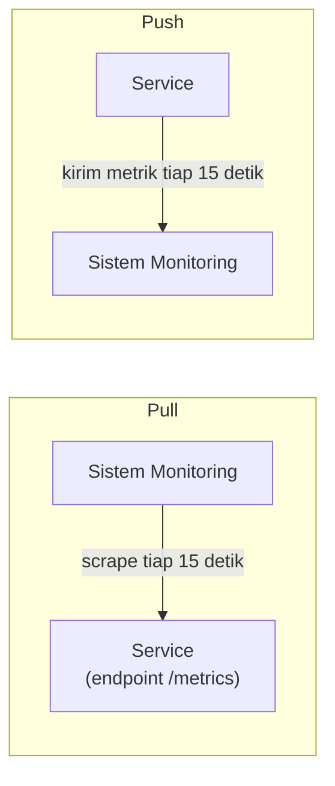

## TL;DR

Ada dua model dasar mengumpulkan metrik dari banyak service ke sistem monitoring pusat. **Pull**: sistem monitoring secara aktif mendatangi setiap service secara berkala dan mengambil (scrape) nilai metrik terkininya — service hanya perlu menyediakan endpoint yang menampilkan metriknya, tanpa tahu siapa yang membaca atau kapan. **Push**: service secara aktif mengirim metriknya ke sistem monitoring, biasanya lewat panggilan API atau agen lokal. Prometheus adalah contoh dominan model pull; StatsD dan banyak sistem cloud-native lama memakai model push. Pilihan ini bukan sekadar detail teknis — ia berdampak langsung pada bagaimana sistem monitoring tahu (atau tidak tahu) bahwa sebuah service sudah mati.

## The Problem

Sebuah tim memakai sistem monitoring berbasis push — setiap service secara aktif mengirim metriknya setiap 15 detik ke server monitoring pusat. Suatu malam, sebuah service mengalami crash total (proses mati sepenuhnya, bukan sekadar lambat). Karena service itu sudah mati, ia tentu saja berhenti mengirim metrik — dan dari sudut pandang sistem monitoring, "tidak ada data masuk" bisa berarti dua hal yang sangat berbeda: service itu benar-benar mati, **atau** jaringan sedang bermasalah sehingga data yang dikirim tidak sampai, **atau** metrik itu memang kebetulan bernilai nol dan tidak dikirim (tergantung implementasi). Sistem monitoring tidak punya cara pasti membedakan ketiganya hanya dari ketiadaan data — ia hanya tahu "tidak menerima apa-apa", bukan "tahu pasti service ini mati".

Model pull menjawab masalah ini secara struktural: sistem monitoring yang secara aktif mendatangi service dan **gagal** mendapat respons (bukan sekadar "tidak menerima apa-apa" secara pasif) langsung tahu dengan pasti bahwa scrape itu gagal — dan itu sendiri adalah sinyal yang jelas dan bisa langsung memicu alert "service tidak bisa dijangkau", tanpa ambiguitas antara "mati" dan "sedang tidak mengirim data karena alasan lain".

## Intuition

Cara paling mudah memahaminya: model push seperti **karyawan yang wajib lapor ke atasan setiap jam** — atasan tahu karyawan itu sehat kalau laporan datang tepat waktu, tapi kalau laporan tidak datang, atasan tidak langsung tahu apakah karyawan itu sakit, ponselnya mati, atau jaringan telepon sedang gangguan. Model pull seperti **atasan yang menelepon karyawan setiap jam** — kalau teleponnya tidak terangkat, atasan langsung tahu dengan pasti ada yang tidak beres (entah karyawan itu tidak bisa dihubungi karena alasan apa pun), sinyal yang jauh lebih jelas dibanding "laporan yang tidak kunjung datang".

Analogi ini bocor pada soal siapa yang harus tahu alamat siapa. Atasan yang menelepon harus tahu nomor telepon setiap karyawan terlebih dulu. Model pull di software juga butuh sistem monitoring tahu **alamat setiap service** yang harus di-scrape — kebutuhan yang bersinggungan langsung dengan [[Service Discovery]], karena alamat service di lingkungan container yang dinamis terus berubah.

## How It Works


Arah panah adalah perbedaan intinya — siapa yang memulai komunikasi. Di pull, monitoring yang berinisiatif, dan service pasif menyediakan data saat diminta. Di push, service yang berinisiatif, dan monitoring pasif menerima apa yang dikirim kepadanya.

Model pull secara alami memberi sinyal "service tidak terjangkau" (up=0) yang jelas begitu scrape gagal berturut-turut. Model push butuh mekanisme tambahan untuk mendeteksi hal yang sama — biasanya lewat **dead man's switch**: sistem monitoring mengharapkan data masuk secara berkala, dan kalau tidak ada data masuk sama sekali dalam jendela waktu tertentu, itu sendiri memicu alert, meniru sinyal yang didapat pull secara alami.

## Under The Hood

Model push punya keunggulan yang tidak dimiliki pull untuk kasus tertentu: **job berumur pendek** (batch job yang selesai dalam hitungan detik, cron job) tidak hidup cukup lama untuk di-scrape secara berkala — job semacam ini lebih cocok mendorong hasil akhirnya sekali ke sistem monitoring (lewat push gateway) sebelum proses itu berakhir, karena tidak ada jendela waktu untuk monitoring "mendatanginya" berulang kali selagi ia masih hidup.

Model pull, sebaliknya, lebih mudah diskalakan dari sisi konfigurasi terpusat — menambah target scrape baru berarti mengubah konfigurasi sistem monitoring saja, tidak perlu mengubah kode setiap service untuk tahu ke mana harus mengirim data (yang jadi masalah nyata kalau alamat sistem monitoring pusat itu sendiri berubah, di model push setiap service yang mengirim harus tahu dan memperbarui alamat itu).

## In Go

```go
package metrics

import (
	"net/http"

	"github.com/prometheus/client_golang/prometheus"
	"github.com/prometheus/client_golang/prometheus/promhttp"
)

// Pola PULL: aplikasi hanya menyediakan endpoint /metrics, TIDAK
// pernah tahu siapa yang men-scrape atau kapan — sistem monitoring
// eksternal yang berinisiatif mendatangi endpoint ini secara berkala.
func RegisterMetricsEndpoint(mux *http.ServeMux) {
	mux.Handle("/metrics", promhttp.Handler())
}

var requestCounter = prometheus.NewCounterVec(
	prometheus.CounterOpts{
		Name: "http_requests_total",
		Help: "Total request HTTP yang diterima",
	},
	[]string{"path", "status"},
)

func init() {
	prometheus.MustRegister(requestCounter)
}

func RecordRequest(path string, status int) {
	requestCounter.WithLabelValues(path, http.StatusText(status)).Inc()
}
```

## In His Stack

Prometheus (lihat [[../92 Tools/Prometheus|Prometheus]]) adalah pilihan dominan model pull di ekosistem Kubernetes, dan cocok untuk sebagian besar dari 13 aplikasi yang berjalan sebagai service berumur panjang. Untuk job batch yang jadi bagian alur kerja sistem legal-services (pemrosesan laporan terjadwal, sinkronisasi data malam hari), push gateway jadi pelengkap yang dibutuhkan — job ini selesai dan mati sebelum sempat di-scrape secara normal, jadi hasil akhirnya perlu didorong sekali sebelum proses berakhir.

## Trade-offs and When Not To Use It

Model pull butuh sistem monitoring tahu alamat setiap target yang harus di-scrape, yang di lingkungan sangat dinamis (banyak instance yang muncul-hilang cepat) butuh integrasi dengan service discovery agar konfigurasi target tetap akurat — tanpa itu, target baru tidak otomatis ter-scrape. Model push lebih sederhana untuk topologi sangat dinamis atau job berumur pendek, tapi kehilangan sinyal "service tidak terjangkau" yang jelas tanpa mekanisme tambahan (dead man's switch). Untuk kebanyakan service berumur panjang di lingkungan yang relatif stabil (Kubernetes dengan service discovery terintegrasi), pull adalah pilihan default yang lebih matang dan lebih banyak didukung tooling observability modern.

## Common Mistakes

> [!warning] Jebakan
> Memakai model push untuk service berumur panjang tanpa dead man's switch — kehilangan sinyal jelas "service ini mati", karena ketiadaan data yang diterima bisa berarti banyak hal berbeda, bukan cuma "service mati".

> [!warning] Jebakan
> Memakai model pull untuk job berumur sangat pendek tanpa push gateway — job yang sudah selesai dan mati sebelum sempat di-scrape kehilangan datanya sepenuhnya, seolah-olah job itu tidak pernah menghasilkan metrik apa pun.

> [!warning] Jebakan
> Mengonfigurasi interval scrape/push yang terlalu jarang untuk metrik yang butuh reaksi cepat (misalnya error rate saat insiden) — jeda antara kejadian nyata dan terlihat di dashboard jadi terlalu lama untuk berguna saat insiden sedang berlangsung.

## Exercises

1. Jelaskan perbedaan mendasar model pull dan push dalam mengumpulkan metrik.
2. Kenapa model pull secara alami memberi sinyal "service tidak terjangkau" yang lebih jelas dibanding push?
3. Kenapa job berumur sangat pendek lebih cocok memakai push (lewat push gateway) dibanding pull?
4. Desain terbuka: salah satu dari 13 aplikasimu menjalankan job batch malam hari yang memproses laporan dan selesai dalam waktu kurang dari satu menit, sementara service API utamanya berjalan terus-menerus 24 jam. Rancang strategi pengumpulan metrik yang tepat untuk kedua jenis workload ini dalam satu sistem monitoring yang sama.

> [!success]- Kunci jawaban
> **1.** Pull: sistem monitoring aktif mendatangi service secara berkala untuk mengambil metrik. Push: service aktif mengirim metriknya ke sistem monitoring. Perbedaannya ada di siapa yang memulai komunikasi dan, karena itu, siapa yang punya sinyal jelas soal ketersediaan pihak lain.
> **4.** Untuk service API yang berjalan terus-menerus: pakai model pull (Prometheus scrape endpoint `/metrics`), memberi sinyal "up/down" yang jelas dan cocok untuk workload berumur panjang. Untuk job batch malam hari: pakai push gateway — job ini mendorong hasil akhirnya (durasi eksekusi, jumlah baris diproses, status sukses/gagal) ke push gateway tepat sebelum proses berakhir, dan Prometheus kemudian men-scrape push gateway itu seperti target biasa. Kedua jalur data ini masuk ke sistem monitoring yang sama dan bisa ditampilkan di dashboard yang sama, meski cara pengumpulannya berbeda karena karakteristik umur kedua workload itu berbeda.

## Self-Check

- Apa perbedaan mendasar model pull dan push?
- Kenapa pull memberi sinyal "service mati" yang lebih jelas?
- Kenapa job berumur pendek lebih cocok memakai push gateway?
- Apa itu dead man's switch, dan kapan ia dibutuhkan?

## Connected Notes

- [[Metrics - The RED and USE Methods]] — note ini menjawab bagaimana metrik RED dan USE yang dibahas sebelumnya benar-benar dikumpulkan dari aplikasi.
- [[Service Discovery]] — model pull di lingkungan dinamis butuh integrasi dengan service discovery supaya target scrape tetap akurat.
- [[Query Languages for Metrics]] — kelanjutan langsung: bagaimana metrik yang sudah terkumpul (lewat pull atau push) diquery untuk menjawab pertanyaan operasional.
- [[../92 Tools/Prometheus|Prometheus]] — tool dominan yang mengimplementasikan model pull, dibahas lebih dalam sebagai tool note.
- [[Alerts That Do Not Cause Fatigue]] — sinyal "service tidak terjangkau" yang jelas dari model pull adalah dasar penting untuk alert yang andal.

## Further Reading

- Dokumentasi resmi Prometheus bagian "Pushgateway" — menjelaskan kapan push gateway tepat dipakai sebagai pelengkap model pull, bukan pengganti penuh.

## Catatan Saya

*Tulis di sini model pengumpulan metrik apa yang dipakai di salah satu dari 13 aplikasimu, dan apakah job batch-nya sudah tercakup dengan benar.*
