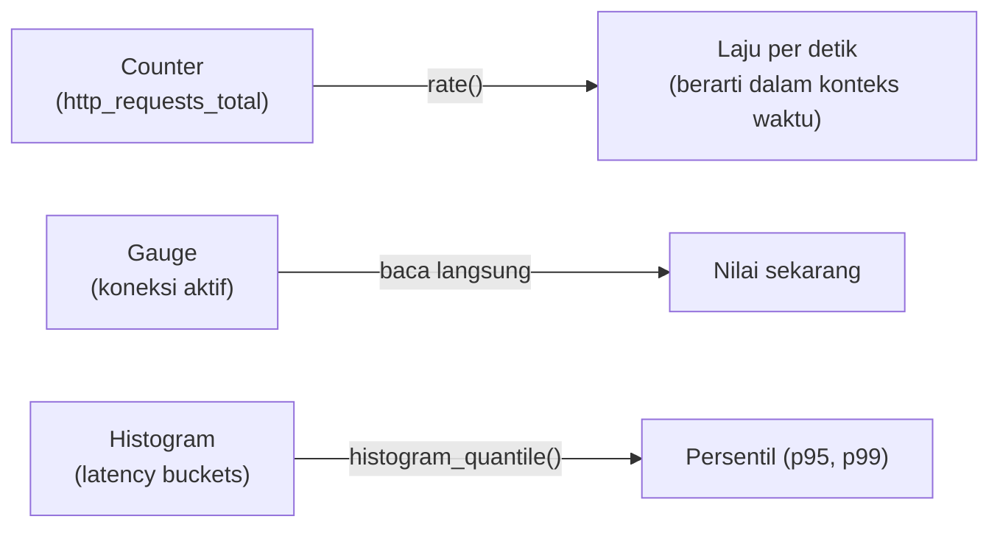

## TL;DR

Metrik yang tersimpan sebagai deret waktu (time series) butuh bahasa query khusus untuk dijawab menjadi informasi yang berguna — PromQL (Prometheus) adalah contoh paling luas dipakai di ekosistem cloud-native. Bukan sekadar "ambil nilai metrik ini", query metrik yang berguna hampir selalu melibatkan **agregasi** (jumlahkan semua instance), **rate** (laju perubahan dari counter yang terus naik), dan **filter berdasarkan label** (hanya untuk endpoint tertentu, hanya untuk environment production). Memahami perbedaan antara jenis metrik dasar (counter, gauge, histogram) adalah prasyarat menulis query yang benar — query yang salah menerapkan `rate()` pada gauge, misalnya, menghasilkan angka yang terlihat masuk akal tapi sebenarnya tidak berarti apa-apa.

## The Problem

Seorang engineer ingin tahu error rate salah satu endpoint dalam lima menit terakhir. Ia menulis query yang mengambil nilai `http_requests_total{status="500"}` langsung — dan mendapat angka seperti `15234`. Angka ini **tidak menjawab pertanyaannya** sama sekali: `http_requests_total` adalah counter yang terus bertambah sejak aplikasi pertama kali menyala, jadi 15234 hanya berarti "total 15234 error sejak kapan pun aplikasi ini terakhir di-restart" — bisa jadi terjadi selama sebulan terakhir, bukan lima menit terakhir, dan angka mentah ini tidak memberi tahu apakah error itu baru saja melonjak atau sudah stabil sejak lama.

Pertanyaan yang sebenarnya ingin dijawab — "berapa laju error per detik dalam lima menit terakhir" — butuh fungsi `rate()` yang menghitung **selisih** counter itu dari waktu ke waktu dan membaginya dengan durasi, mengubah angka kumulatif yang tidak berarti tanpa konteks waktu jadi laju yang benar-benar menjawab pertanyaan operasional yang diajukan.

## Intuition

Cara paling mudah memahaminya: counter mentah seperti **odometer mobil** — angka total kilometer yang pernah ditempuh sejak mobil itu baru. Angka odometer sendirian tidak menjawab "seberapa cepat mobil ini melaju sekarang" — kamu butuh **selisih** odometer antara dua titik waktu, dibagi waktu yang berlalu, untuk mendapat kecepatan. `rate()` pada metrik counter melakukan persis perhitungan yang sama: mengubah angka kumulatif jadi laju yang berarti dalam konteks waktu.

Analogi ini bocor pada soal reset. Odometer mobil (hampir) tidak pernah kembali ke nol selama mobil itu dipakai. Counter metrik **bisa** kembali ke nol — setiap kali proses aplikasi di-restart, counter-nya mulai dari nol lagi. Fungsi `rate()` yang matang menangani reset ini secara otomatis (mendeteksi penurunan tak terduga sebagai tanda restart, bukan sebagai "kecepatan negatif" yang tidak masuk akal) — detail yang membuat penghitungan rate lebih rumit dari sekadar pengurangan sederhana.

## How It Works

Tiga jenis metrik dasar, masing-masing butuh cara query berbeda:

- **Counter**: angka yang hanya naik (atau reset ke nol saat restart) — total request, total error. Selalu dipakai bersama `rate()` atau `increase()`, tidak pernah dibaca nilai mentahnya langsung.
- **Gauge**: angka yang bisa naik-turun bebas — jumlah koneksi aktif sekarang, penggunaan memori sekarang. Dibaca langsung nilainya, **tidak** memakai `rate()` (menerapkan `rate()` pada gauge menghasilkan angka yang secara matematis valid tapi tidak berarti apa-apa secara operasional).
- **Histogram**: distribusi nilai dalam bucket (rentang) — dipakai menghitung persentil latency (lihat [[../50 Concurrency and Performance/Latency Percentiles (p50, p95, p99)|Latency Percentiles (p50, p95, p99)]]). Butuh fungsi khusus (`histogram_quantile()` di PromQL) untuk mengekstrak persentil dari data bucket.


Setiap jenis metrik butuh operasi yang berbeda untuk menghasilkan angka yang benar-benar menjawab pertanyaan operasional — mencampur ketiganya (menerapkan operasi yang salah pada jenis metrik yang salah) menghasilkan angka yang terlihat valid tapi menyesatkan.

## Under The Hood

Agregasi lintas label adalah operasi yang sering dibutuhkan tapi mudah salah diterapkan. Metrik `http_requests_total` biasanya punya label seperti `instance` (Pod mana), `path` (endpoint mana), `status` (kode status apa) — menjumlahkan semua instance untuk mendapat total per endpoint (`sum by (path) (rate(http_requests_total[5m]))`) adalah operasi umum, tapi lupa menyertakan `by (path)` yang benar bisa menjumlahkan lintas endpoint yang seharusnya dipisah, menghasilkan angka gabungan yang menyembunyikan endpoint mana yang sebenarnya bermasalah.

Jendela waktu (`[5m]` di contoh atas) juga bukan pilihan sembarangan — jendela terlalu pendek membuat hasil `rate()` berisik (noise dari fluktuasi kecil terlihat seperti perubahan signifikan), jendela terlalu panjang membuat lonjakan singkat yang justru penting (mungkin sedang terjadi sekarang) tersembunyi di rata-rata jangka panjang. Aturan praktis yang umum dipakai: jendela minimal empat kali interval scrape, supaya cukup titik data untuk perhitungan rate yang stabil secara statistik.

## In Go

```go
package metrics

import "github.com/prometheus/client_golang/prometheus"

// Contoh mendefinisikan Histogram — jenis metrik yang dibaca lewat
// histogram_quantile() di query, BUKAN dibaca nilai mentahnya
// langsung seperti gauge.
var requestDuration = prometheus.NewHistogramVec(
	prometheus.HistogramOpts{
		Name: "http_request_duration_seconds",
		Help: "Distribusi durasi request HTTP",
		// Buckets menentukan batas rentang yang dilacak — pilih
		// berdasarkan latency yang REALISTIS untuk service ini,
		// bukan nilai default yang mungkin tidak relevan.
		Buckets: []float64{0.01, 0.05, 0.1, 0.5, 1, 2, 5},
	},
	[]string{"path"},
)

func ObserveRequestDuration(path string, seconds float64) {
	requestDuration.WithLabelValues(path).Observe(seconds)
}

// Contoh query PromQL yang setara (dijalankan di sistem monitoring,
// bukan di kode Go):
//   histogram_quantile(0.95,
//     sum by (le, path) (rate(http_request_duration_seconds_bucket[5m]))
//   )
// Menghasilkan p95 latency per path dalam 5 menit terakhir.
```

## In His Stack

Memahami perbedaan counter, gauge, dan histogram penting sebelum tim mulai menulis dashboard atau alert untuk 13 aplikasi — kesalahan menerapkan `rate()` pada gauge, atau membaca counter mentah tanpa `rate()`, adalah kesalahan yang sangat umum bagi tim yang baru mulai memakai Prometheus, dan menghasilkan dashboard yang terlihat berfungsi tapi menampilkan angka yang secara operasional tidak berarti. Investasi waktu memahami jenis metrik dan fungsi query yang tepat, sekali di awal, mencegah dashboard yang menyesatkan dipakai berbulan-bulan tanpa disadari.

## Trade-offs and When Not To Use It

Bahasa query metrik seperti PromQL punya kurva belajar sendiri — sintaksnya cukup berbeda dari SQL yang lebih familiar bagi kebanyakan backend engineer, dan butuh waktu terbiasa dengan konsep counter/gauge/histogram serta fungsi agregasinya. Untuk kebutuhan monitoring yang sangat sederhana (satu-dua metrik dasar, tanpa agregasi lintas label yang rumit), investasi mendalami seluruh kemampuan bahasa query ini mungkin berlebihan — tapi begitu jumlah service dan kebutuhan dashboard bertambah, kemampuan menulis query yang benar jadi keterampilan yang bernilai tinggi dan sulit dihindari.

## Common Mistakes

> [!warning] Jebakan
> Menerapkan `rate()` pada metrik jenis gauge — secara matematis menghasilkan angka, tapi angka itu tidak berarti apa-apa secara operasional, karena gauge memang dirancang dibaca nilainya langsung, bukan sebagai laju perubahan.

> [!warning] Jebakan
> Membaca nilai mentah counter tanpa `rate()` atau `increase()` — angka kumulatif sejak restart terakhir tidak menjawab pertanyaan "berapa laju/jumlah dalam periode tertentu" yang biasanya sebenarnya ingin dijawab.

> [!warning] Jebakan
> Lupa menyertakan `by (label_yang_relevan)` saat melakukan agregasi lintas label — menjumlahkan lintas dimensi yang seharusnya dipisah (misalnya lintas endpoint) menghasilkan angka gabungan yang menyembunyikan endpoint mana yang sebenarnya bermasalah.

## Exercises

1. Jelaskan perbedaan counter, gauge, dan histogram, dan fungsi query yang tepat untuk masing-masing.
2. Kenapa membaca nilai mentah counter tanpa `rate()` biasanya tidak menjawab pertanyaan operasional yang sebenarnya diajukan?
3. Kenapa jendela waktu (`[5m]`) pada fungsi rate perlu dipilih hati-hati, tidak sembarangan?
4. Desain terbuka: kamu ingin membuat query yang menunjukkan error rate (persentase request berstatus 5xx dari total request) per endpoint dalam 5 menit terakhir, untuk 13 aplikasi yang masing-masing punya banyak instance Pod. Jelaskan langkah menyusun query ini, termasuk fungsi dan agregasi apa yang dibutuhkan.

> [!success]- Kunci jawaban
> **1.** Counter hanya naik (atau reset saat restart), selalu dipakai bersama `rate()`/`increase()` untuk menghasilkan laju yang berarti. Gauge naik-turun bebas, dibaca langsung nilainya tanpa `rate()`. Histogram menyimpan distribusi nilai dalam bucket, dibaca lewat `histogram_quantile()` untuk mengekstrak persentil.
> **4.** (1) Hitung laju error per detik: `rate(http_requests_total{status=~"5.."}[5m])`, dijumlahkan lintas instance per endpoint: `sum by (path) (rate(http_requests_total{status=~"5.."}[5m]))`; (2) hitung laju total request dengan cara sama: `sum by (path) (rate(http_requests_total[5m]))`; (3) bagi keduanya untuk mendapat error rate sebagai persentase: `sum by (path) (rate(http_requests_total{status=~"5.."}[5m])) / sum by (path) (rate(http_requests_total[5m]))`. Hasilnya adalah proporsi error per endpoint, teragregasi lintas seluruh instance Pod yang menjalankan endpoint itu, dihitung dari laju dalam 5 menit terakhir — bukan angka kumulatif sejak aplikasi menyala.

## Self-Check

- Sebutkan tiga jenis metrik dasar dan fungsi query yang tepat untuk masing-masing.
- Kenapa membaca counter mentah tanpa rate() biasanya salah?
- Kenapa `rate()` tidak boleh diterapkan pada gauge?
- Kenapa jendela waktu pada rate perlu dipilih hati-hati?

## Connected Notes

- [[Pull vs Push Metrics Collection]] — note ini menjawab bagaimana metrik yang sudah terkumpul lewat mekanisme di note sebelumnya benar-benar diquery menjadi informasi berguna.
- [[Metrics - The RED and USE Methods]] — RED dan USE method memberi kerangka memilih metrik apa yang perlu diquery; note ini memberi cara menulis query-nya.
- [[../50 Concurrency and Performance/Latency Percentiles (p50, p95, p99)|Latency Percentiles (p50, p95, p99)]] — histogram dan `histogram_quantile()` adalah mekanisme konkret menghitung persentil yang dibahas di note itu.
- [[Dashboard Design]] — kelanjutan langsung: query yang benar adalah bahan baku dashboard yang benar-benar berguna saat insiden.
- [[../92 Tools/Prometheus|Prometheus]] — tool konkret yang mengimplementasikan PromQL, bahasa query yang jadi contoh utama di note ini.

## Further Reading

- Dokumentasi resmi Prometheus bagian "Querying basics" dan "Metric types" — sumber kebenaran untuk detail sintaks dan semantik PromQL.

## Catatan Saya

*Tulis di sini query metrik yang paling sering kamu pakai (atau ingin bisa tulis) untuk salah satu dari 13 aplikasimu.*
